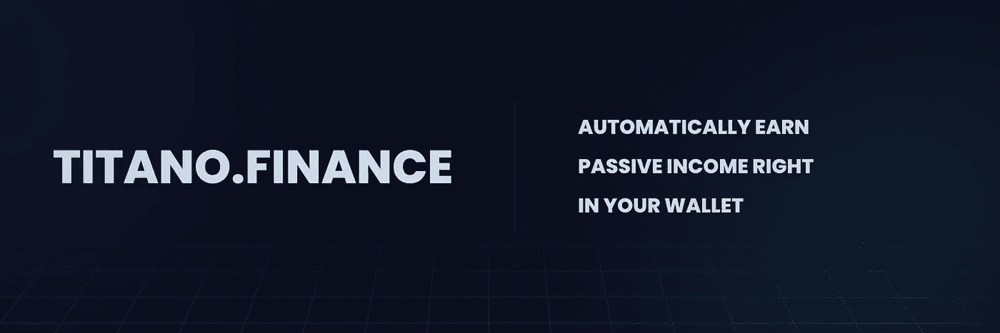
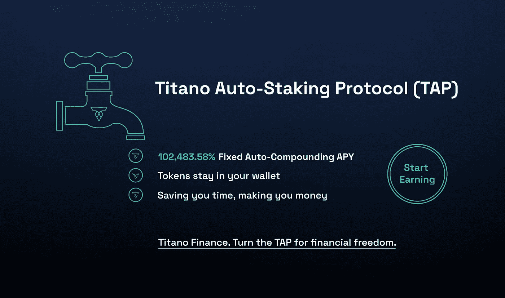
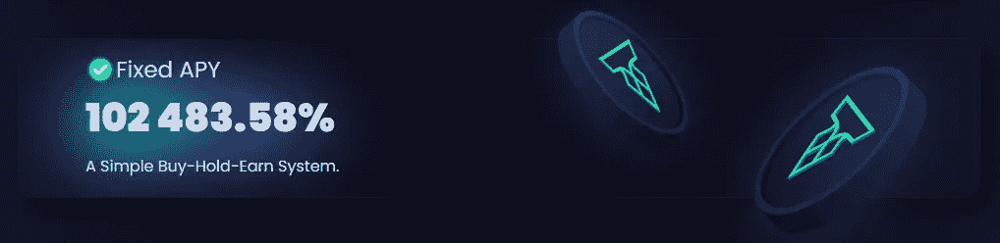
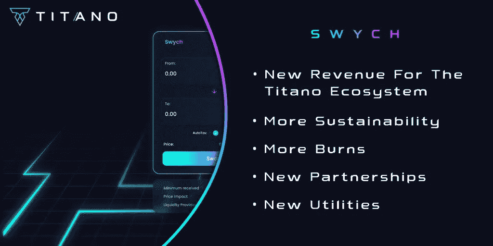
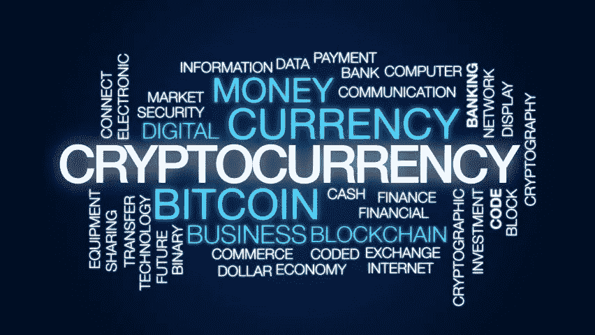

# Titano 加密货币投资终极指南——你需要知道的

> 原文：<https://medium.com/coinmonks/the-ultimate-guide-to-titano-cryptocurrency-investments-what-you-need-to-know-cf178f1a62a4?source=collection_archive---------8----------------------->

Titano Finance 是一种加密货币，可以自行为其所有者创造收入。

许多人会好奇加密货币是如何生成其货币的。都在自动赌注软件里。

Titano 是一个基于加密货币的在线投资平台，于 2021 年 11 月首次亮相，在币安智能链上运行。在撰写本文时，它拥有 80，000 多名持有人和 7，000 万美元的市场估值，在短短五个多月的时间里，它已成为 Defi 行业中最受炒作的企业之一。

Titano 声称，由于一个定期与投资者公开直接沟通的团队，最近几个月在安全和信任方面建立了良好的声誉。充满活力的 Discord 和 Telegram 社区频道体现了这家公司的宗旨:为普通投资者提供 24/7 的帮助和支持。

**Titano Finance 的汽车赌注**

Titano 自动堆栈协议(T.A.P .)是该平台的核心，为$TITANO 令牌提供了一个重要的内置实用程序。T.A.P .只需在钱包里放上$TITANO 代币，就能提供一些最可靠的加密回报。该令牌通过一种智能、无缝的重定基数方法创建自动下注和自动复利回报。

**Titano 的自动赌注是如何运作的？**您只需购买$TITANO 并将其放入您的钱包中，即可将 rebase 奖励直接存入您的钱包。投资者的代币价值将每 30 分钟增长一次，而无需与网站进行任何互动。

Titano 投资起来也很简单安全，因为一切都是自动化的。要下注您的代币，无需遵循复杂的程序，也无需学习或担心加密钱包交互。

**APY 的长期生存能力如何？**

T.A.P .有一个固定的 APY，所以你总是知道你会得到什么，并且可以预测你一周、一个月甚至一年的回报。另一方面，波动的 APYs 意味着你永远不知道你会得到多少代币。其他 Defi 方法提供高 APY，摆动幅度高达 90%。T.A.P .声称向 TITANO 持有人支付 1.8999%的日固定利率，年复合利率为 102，483.58%。

TAP 的价格和 rebase 奖励由一组复杂的参数支持。买卖税是一个重要的组成部分。当用户购买 Titano 时，他们 13%的钱用于协议，当他们出售时，另外 18%用于协议。然而，这些税收只是难题的一部分。Titano 还利用博弈论和人类行为模拟来预测购买代币的人最可能的行为。所有这些元素都由开发团队组织起来，以便它们在幕后完美地协同工作。因此，$TITANO 持有者将从简单而优雅的赌注和奖励机制中受益。

Titano Finance 是一家安全的公司吗？

Solidity Finance 已经完成了对该项目的详细审计，该项目从一开始就一直在有效和快速地运行。此外，在过去的几个月里，Titano 一直在与 Certik 合作，以提高平台的安全性，这些变化将很快实施。

Titano 在 Certik 有 90 的安全分数，他们正在用天网 24/7 监控协议！

**Titano Finance 的未来如何？据开发团队称，随着时间的推移，Titano 生态系统将通过增加额外的功能和合作伙伴关系来扩展。泰坦诺戏是另一个显著的特色。Titano PLAY 允许玩家输入代币，有机会赢得巨额累积奖金，而无需承担任何风险。Titano NFTs、移动应用程序、跨链、商品和许多其他功能将很快推出。据该公司称，它将需要大量的公用事业来实现其目标，因此它不会试图在内部创造一切，而是寻求合作伙伴。**

**投资 Titano 金融最好的方法是什么？**

*点击下图开始*

> $TITANO 令牌之前在 PancakeSwap 上可用，但他们已经转移到他们自己的交易所。

## 点击此处赚取您的第一笔 90 美元加密货币

**CLICK THE IMAGE FOR A MUST READ**

我希望这篇文章对你有所帮助。如果你喜欢这个故事，请给它竖起大拇指，并在下面留下评论！

如果您想了解更多关于**加密货币、投资、联盟营销和在线赚钱的信息，请关注我的 [**Medium**](/@carolinecarr56) 。**

你觉得这篇文章有趣吗？
给它鼓掌(最多 50 次！)👏。它有助于其他人发现这篇文章，并让作者被认可她做得很好！

所以…让我们看看有多少掌声！👏

> 加入 Coinmonks [电报频道](https://t.me/coincodecap)和 [Youtube 频道](https://www.youtube.com/c/coinmonks/videos)了解加密交易和投资

# 另外，阅读

*   [最佳期货交易信号](https://coincodecap.com/futures-trading-signals) | [流动性交易回顾](https://coincodecap.com/liquid-exchange-review)
*   【Huobi 的加密交易信号 | [Swapzone 审查](/coinmonks/swapzone-review-crypto-exchange-data-aggregator-e0ad78e55ed7)
*   最佳[密码交易机器人](https://coincodecap.com/best-crypto-trading-bots) | [购买索拉纳](https://coincodecap.com/buy-solana) | [矩阵导出评论](https://coincodecap.com/matrixport-review)
*   [Coldcard 评论](https://coincodecap.com/coldcard-review) | [BOXtradEX 评论](https://coincodecap.com/boxtradex-review)|[uni swap 指南](https://coincodecap.com/uniswap)
*   [比特币基地评论](/coinmonks/coinbase-review-6ef4e0f56064) | [德里比特评论](/coinmonks/deribit-review-options-fees-apis-and-testnet-2ca16c4bbdb2) | [FTX 评论](/coinmonks/ftx-crypto-exchange-review-53664ac1198f)