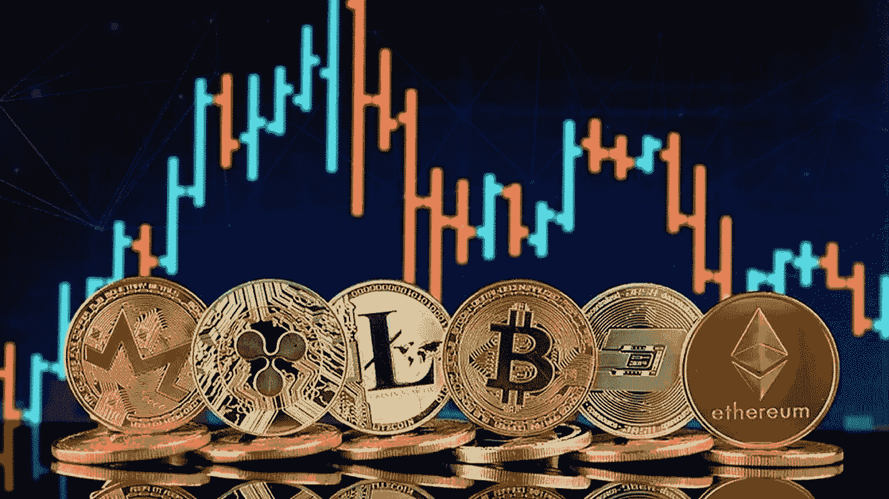
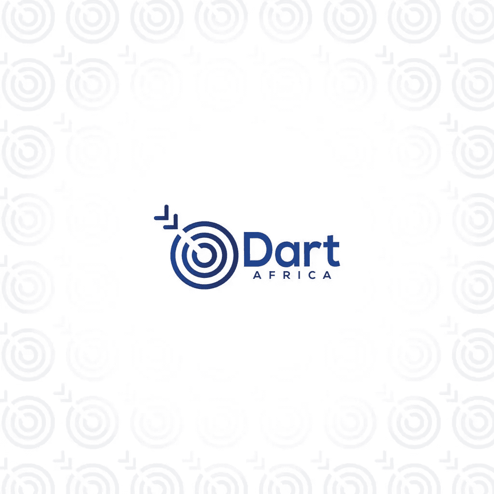

# 加密货币交易终极指南

> 原文：<https://medium.com/coinmonks/the-ultimate-guide-to-trading-cryptocurrency-6ee4d3833bd0?source=collection_archive---------67----------------------->

交易加密货币:加密货币是一种由加密技术支持的虚拟交易媒介。大多数加密货币都有基于区块链技术的分散式数字网络。区块链技术包括一个由网络中计算机数据库组成的账本。

Trading Crypto Currency

简单来说，加密货币是一种由密码学支持的数字货币，不受任何央行监管。它们是一种在线支付媒介。比特币于 2009 年投入使用，是世界上第一种投入使用的加密货币。比特币发布后，其他被称为“altcoins”的加密货币也应运而生。

# 关于加密货币的常见事实

–术语“加密货币”源自术语“密码术”;它描述了用于保护网络安全的加密系统。

–比特币是世界上最大的加密货币。市值约 6000 亿美元，被视为世界数字黄金。

–比特币和其他加密货币的供应有限。货币数字化的事实并不意味着供应永无止境。对于比特币，大约有 2200 万个 BTC 在流通。如果对货币的供应没有限制，货币就会因为通货膨胀而变得一文不值。

–除了比特币，还有超过 5000 种不同的加密货币。在 2013 年的第一次比特币热潮之后，出现了一场加密货币狂潮，导致了 altcoins 的产生。

这些货币中的一些，如以太币、金币和币安币已经升值。其他货币的价值很低；有些被贴上狗屎硬币的标签。

–比特币的创造者至今仍是匿名的。比特币的白皮书将其出现归功于中本聪；然而，这个人格的身份仍然笼罩在神秘之中。

## **如何交易加密货币**

在交易加密货币时，需要采取以下步骤。

**第一步**:选择经纪人

没有经纪人就不可能进行密码交易。如果你在过去交易，你不需要重新向经纪人注册。对于第一次进行加密交易的人来说，你需要在经纪人那里注册。就像你交易股票一样，你需要创建一个加密经纪账户。

全球有数千家加密货币经纪商。然而，在选择合适的经纪人之前，你需要遵循一些指导原则。

首先，你应该和一个对客户友好的经纪人交易。Reddit 是一种媒介，通过它你可以知道哪个经纪人对客户友好。您将使用的代理应该有一个 FAQ 页面和一个论坛。

交易费是你选择经纪人之前要考虑的另一个因素。每个经纪人收取佣金；佣金的大小因经纪人而异。任何不公开交易佣金的经纪人都是不值得信任的。

你应该考虑的另一个因素是平台的安全性。黑客试图攻击加密代理并不罕见。如果平台不提供双因素身份认证(2F-A)，那么交易就不太安全。

这些是你决定选择经纪人之前要考虑的一些因素。在您通过经纪人设置帐户之前，您需要提供姓名、出生日期、电子邮件地址和有效身份证明等信息。您可能需要提供详细信息，如您的税务信息(取决于您的国家)。

**第二步**:选择一种加密货币进行交易。当你在经纪人那里注册时，下一步就是选择你要投资的货币。由于其可预测性的水平，大多数交易者喜欢投资比特币和以太坊。然而，有各种替代硬币可以为投资者带来丰厚的回报。

在投资加密货币之前，请注意以下几点。

–比特币是产生最多投资的加密货币，因为它更可预测。

–在市值排名前 50 的类别中，市值较小的硬币比加密硬币的交易风险更大。

–在选择加密货币之前，你应该通过阅读白皮书来了解这种货币。投资开发商有血统的钱币是明智的。Defi 加密货币是建立在以太坊区块链的硬币；这些硬币是最受欢迎的另类硬币。

第三步:最后一步是向你的经纪人账户注入资金。有不同的方式为您的帐户提供资金；这取决于你选择的经纪人。在尼日利亚这样的国家，用银行账户交易加密货币是非法的，投资者不得不求助于其他

## 如何将你的加密货币兑换成现金

[Dart Africa](https://dartafrica.io/) 专注于便捷、超快的支付时间、惊人的交易率、客户安全性和可靠性，从外汇市场的大多数加密货币买家中脱颖而出。它对伟大的不断追求是这个平台的显著特征之一。

Dart Africa 以惊人的价格向客户出售硬币，Dart Africa 因其惊人的交易价格而广受欢迎。客户被承诺在与 Dart Africa 交易时获得最高的回报。你可以随时使用 [Dart Africa 的比率计算器来检查你的硬币将会得到什么。](https://dartafrica.io/coincalculator)

交易也在几分钟内处理完毕，一旦你将你的比特币发送到网站上提供的地址，在确认比特币交易后，相应的价值将在几分钟内立即发送到你的账户。Dart Africa 快速可靠。

# 如何在 Dart Africa 上销售比特币

*   [使用您的凭证登录](https://dartafrica.io/login)您的帐户。如果您没有帐户，请创建一个帐户。
*   单击工具栏图标(左上角的三条垂直直线)。您将在您的帐户面板上看到此信息。
*   点击出售硬币。
*   在硬币栏中选择您喜欢的硬币选项。
*   输入您要出售的硬币数量，相应的美元和奈拉金额将显示在列中。注意:你可以出售的 BTC 或任何加密货币的最低美元价格是 20 美元。
*   点击立即出售硬币。
*   将提供一个钱包地址和一个 QR 码。您可以通过手动输入地址或扫描二维码来发送您在上述步骤中选择的硬币金额。付款被确认后，你将立即被记入贷方

> 加入 Coinmonks [电报频道](https://t.me/coincodecap)和 [Youtube 频道](https://www.youtube.com/c/coinmonks/videos)了解加密交易和投资

# 另外，阅读

*   [德国最佳加密交易所](https://coincodecap.com/crypto-exchanges-in-germany) | [Arbitrum:第二层解决方案](https://coincodecap.com/arbitrum)
*   [币安交易机器人](/coinmonks/binance-trading-bots-d0d57bb62c4c) | [OKEx 评论](/coinmonks/okex-review-6b369304110f) | [Atani 评论](https://coincodecap.com/atani-review)
*   [最佳加密交易信号电报](/coinmonks/best-crypto-signals-telegram-5785cdbc4b2b) | [MoonXBT 评论](/coinmonks/moonxbt-review-6e4ab26d037)
*   如何在 Bitbns 上购买柴犬(SHIB)币？ | [买弗洛基](https://coincodecap.com/buy-floki-inu-token)
*   [CoinFLEX 评论](https://coincodecap.com/coinflex-review) | [AEX 交易所评论](https://coincodecap.com/aex-exchange-review) | [UPbit 评论](https://coincodecap.com/upbit-review)
*   [十大最佳加密货币博客](https://coincodecap.com/best-cryptocurrency-blogs) | [YouHodler 评论](https://coincodecap.com/youhodler-review)
*   [AscendEx 保证金交易](https://coincodecap.com/ascendex-margin-trading) | [Bitfinex 赌注](https://coincodecap.com/bitfinex-staking)