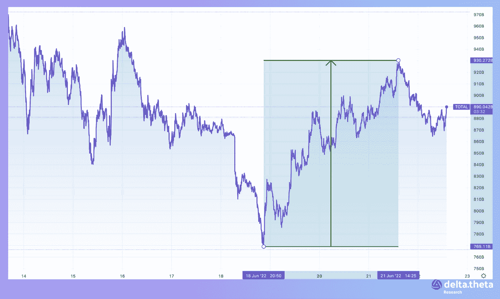
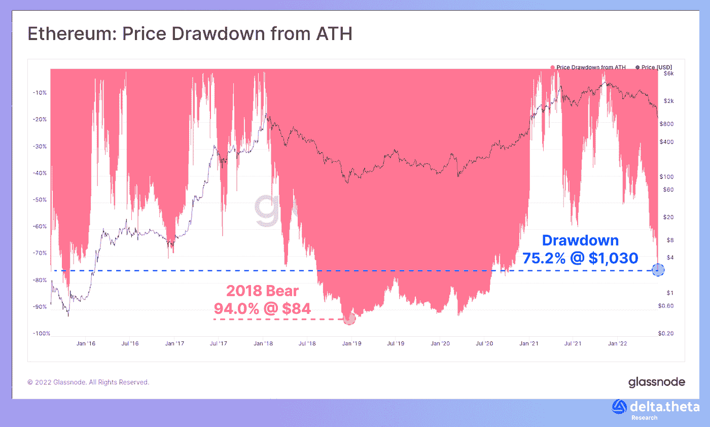
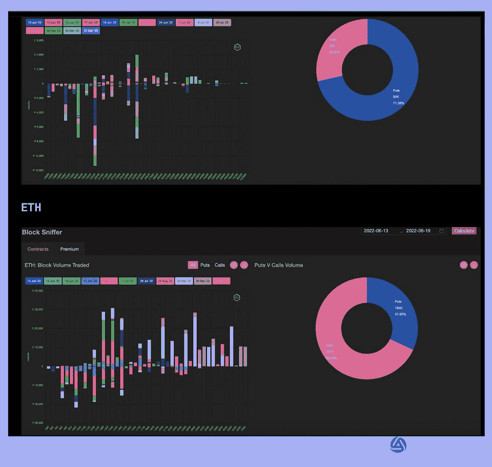
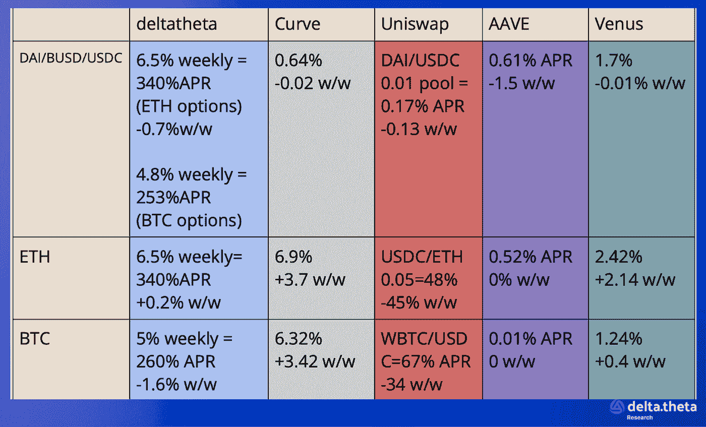

# 不相关的 ETH/BTC

> 原文：<https://medium.com/coinmonks/the-uncorrelation-eth-btc-55852154adb4?source=collection_archive---------27----------------------->

自我们上次于 6 月 17 日进行审查以来，时间并不长，但即使在这么短的时间内，也发生了很多事情。当然，主要事件是许多人一直在等待和准备的“二次探底”。在这一时期开始时(6 月 17 日)，加密市场资本总额指数为 8818 亿美元。然后，在中期，它下降到创纪录的 7750.25 亿美元。之后，我们看到了反弹和复苏。期末(6 月 21 日)，该指数为 9094.5 亿美元，上涨 3.13%。

过去一段时间，比特币的价格走势与整体市场相关，但在接近尾声时出现了一些分歧(在“反弹”后，替代比特币的市值略有上升)。在此期间开始时，价格为 20 947 英镑。后来，上述底部到达 17 670 点(最后一次出现在 2020 年 11 月)。此后，又恢复到 21 192 人。该期间的最终增长率为 1.17%。

期内以太坊价格走势从 1091 水平开始。之后，我们可以看到 888 的低点，随后恢复到 1158。期内最终增长率达 6.14%(是比特币的 5 倍多)。

# 新闻

位于索拉纳区块链的最大 NFT 市场 Magic Eden 在 B 轮融资中筹集了 1.3 亿美元，目前估值为 16 亿美元。Electric Capital 和 Greylock Partners 领投，Lightspeed Venture Partners 和之前的投资者 Paradigm 和红杉资本也参与了该轮投资。Magic Eden 的 B 轮融资是在宣布由 Paradigm 领投的 2700 万美元 A 轮融资三个月后进行的。该公司当时没有披露其估值，但据 Dealroom 称，其估值约为 1.62 亿美元。这意味着魔术伊甸园的估值在短短三个月内增长了几乎 9 倍。

BlockFi [从交易所巨头 FTX 获得了 2.5 亿美元的贷款](https://www.theblock.co/post/153244/blockfi-secures-250-million-credit-facility-from-ftx)，这是对美国加密货币贷方的一次救援。加密货币为加密投资者提供高收益账户，本月再次受到审查，因为 Celsius 于 6 月 12 日暂停了其客户的提款。第二天，BlockFi 宣布将裁员 20%左右，试图削减成本。据英国《金融时报》报道，BlockFi 是清算新加坡加密对冲基金 Three Arrows Capital 贷款抵押品的公司之一。该公司从 BlockFi 借入了比特币，但未能满足对该贷款额外抵押品的要求。

Immutable [已经启动了第一个 5 亿美元的开发商和风险投资基金](https://techcrunch.com/2022/06/17/immutable-launches-500m-fund-to-boost-web3-gaming-adoption/)。这笔资金将用于资助在不可变 X L2 区块链创建 web3 游戏和 NFT 公司的项目。据管理层称，Immutable 的主要目标是大规模打造新一代 web3 游戏。游戏开发商和知识产权所有者已经在这个平台上工作，包括 GameStop、抖音、OpenSea 和 Illuvium。

# 市场形势

比特币价格的下跌也导致了其主要竞争对手以太坊的价格下跌。根据 Glassnode analytical service 的数据，价格已经从历史高点下跌了 75%以上。在上一次熊市繁荣期间，跌幅高达 94%，迫使人们更加谨慎地预测市场跌势的结束。

然而，在衍生品市场，尤其是期权市场，BTC 和瑞士联邦理工学院的交易动态明显不同。

例如，上周比特币交易的主要趋势是购买看跌期权，以对冲市场的进一步下跌——期权的执行期最长为一个月，主要执行价格为 2 万英镑和 1.8 万英镑。

与此同时，以太坊的期权交易与此完全相反。大宗交易中的看涨期权交易量增加了 3 倍，主要执行日期分别为 3 500、4 000 和 5 000，执行日期分别为今年 9 月底和 12 月。

市场上的主要加密货币 BTC 和 ETH 之间的主要区别是，ETH 有自己的技术增长动力。市场目前正在评估向 PoS 的转移，认为这是赋予资产自身动力并扩大与传统市场差距的一种可能方式。

在这方面，比特币最终将成为科技行业的贝塔资产，如果在当地转售，就战略性进入(或增加头寸)股票市场而言，这将变得很有吸引力。

# **货币市场——为有经验的加密用户提供的附加服务**

这些信息使我们能够比较不同方式产生“有机”回报的稳定债券收益，这些方式包括向分散的交易所、分散的存款提供流动性，或通过出售期权(一周期限、中央罢工、稳定债券的看跌期权、瑞士联邦理工学院/BTC 的看涨期权)进行流动性配置。

> 加入 Coinmonks [电报频道](https://t.me/coincodecap)和 [Youtube 频道](https://www.youtube.com/c/coinmonks/videos)了解加密交易和投资

# 另外，阅读

*   [WazirX vs coin dcx vs bit bns](/coinmonks/wazirx-vs-coindcx-vs-bitbns-149f4f19a2f1)|[block fi vs coin loan vs Nexo](/coinmonks/blockfi-vs-coinloan-vs-nexo-cb624635230d)
*   [本地比特币审核](/coinmonks/localbitcoins-review-6cc001c6ed56) | [加密货币储蓄账户](https://coincodecap.com/cryptocurrency-savings-accounts)
*   [什么是融资融券交易](https://coincodecap.com/margin-trading) | [成本平均法](https://coincodecap.com/dca)
*   [支持卡审核](https://coincodecap.com/uphold-card-review) | [信任钱包 vs 元掩码](https://coincodecap.com/trust-wallet-vs-metamask)
*   [Exness 回顾](https://coincodecap.com/exness-review)|[moon xbt Vs bit get Vs Bingbon](https://coincodecap.com/bingbon-vs-bitget-vs-moonxbt)
*   [如何开始用加密贷款赚取被动收入](https://coincodecap.com/passive-income-crypto-lending)