# 崭露头角的亚洲 NFT 市场

> 原文：<https://medium.com/coinmonks/the-up-and-coming-nft-marketplace-in-asia-be0aec073554?source=collection_archive---------39----------------------->

但当然不仅限于亚洲。

如果你熟悉 Opensea、Foundation、Rarible 等等，那么我将要分享的这个 NFT 市场将会让你着迷！

另一个让你上瘾的好处是，费用非常便宜，你根本不会觉得有费用。

> 介绍 **Pentas.io** ，一个日复一日爬楼梯的 NFT 市场。

## 1.介绍

[Pentas.io](https://www.pentas.io/) 是一个由一群马来西亚人创建的 NFT 市场，它运行在币安智能合约上。“Pentas”是一个马来语单词，翻译过来就是“舞台”,它的使命是通过区块链技术赋予世界遗产、文化和传统价值以力量。所以你可以在这个舞台上铸造你的 NFT，让它永远留在区块链！

Pentas 于 2021 年 8 月 21 日上线，如这里的[所述](https://blog.pentas.io/pentas-minting-party-main-net-staging-marketplace-go-live-e7cc6f1a33a)，它只从那里开始成长。如果您已经有一个 Metamask 钱包，您可以轻松地在 Pentas 上创建一个帐户。

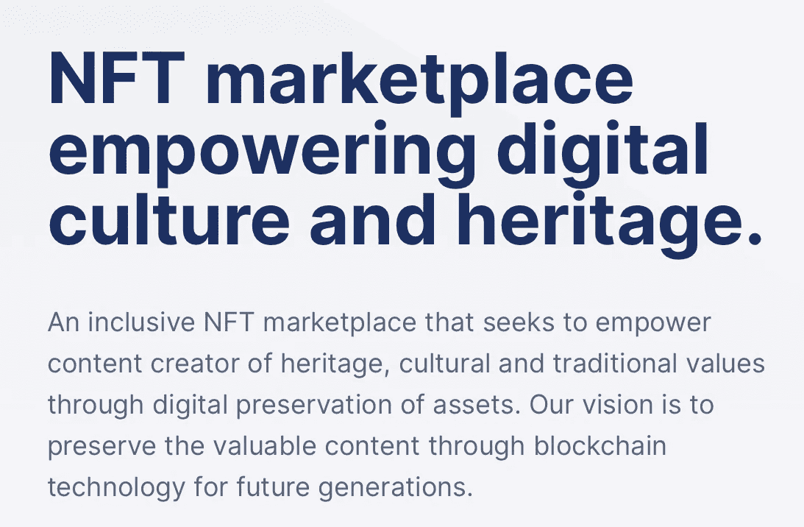

A screen shot on the main page of [Pentas.io](https://www.pentas.io/)

老实说，这是一个迷人的市场，因为它突出了各种文化遗产，尽管在这一点上，大多数是亚洲文化遗产。这并不意味着你不会看到其他非文化的东西(如动物 pfp 或抽象画)。

看到这里的人才，你会惊讶的。准备滚动提要。

截至本文撰写之时， **Pentas 在 DappRadar 的** [**顶级币安智能连锁市场**](https://dappradar.com/rankings/protocol/binance-smart-chain/category/marketplaces) **榜单中排名第 6。**

> 由于它运行在 BSC 网络上，费用非常便宜！你永远不需要担心高昂的费用。

## 2.创始人背景

就像任何其他项目一样，最好知道团队背后是谁。

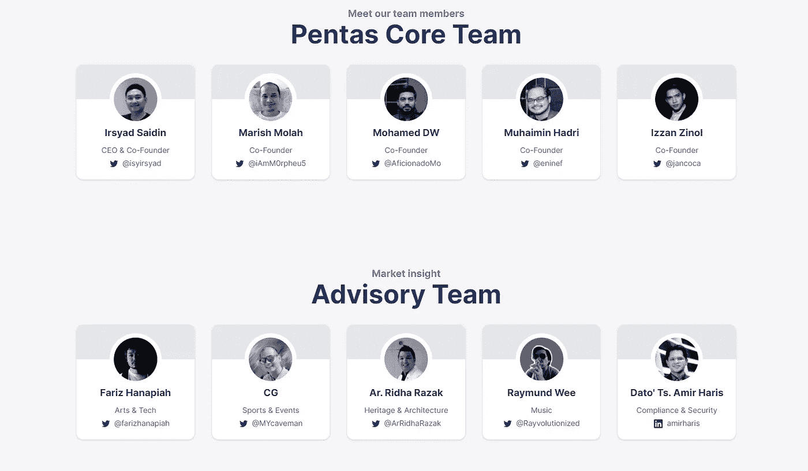

The team behind Pentas. Info from Pentas [page](https://www.pentas.io/about_us) itself.

您可以在 twitter 上轻松地与团队联系和交流。我确实关注他们中的一些人，他们在社区中很活跃。联合创始人一直在寻找机会通过所有可能的平台传播 Pentas.io。如果联合创始人自己在努力工作，这对市场来说是一个好兆头。

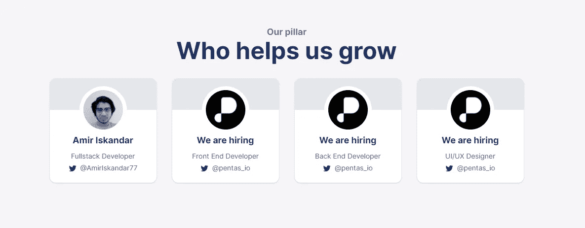

If you are looking for a job, you may apply [here](https://www.pentas.io/career)

当我浏览网站时，我发现他们正在招聘。老实说，我希望团队中至少有一名女性成员。如果你们中有人在找工作，可以在这里申请。如果你不在马来西亚，你可以远程工作。

关注 Pentas Twitter 页面[此处](https://twitter.com/pentas_io)获取最新信息。

## 3.Pentas 路线图

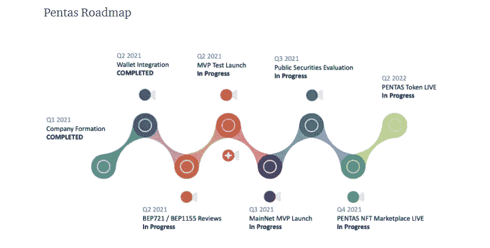

Photo from Pentas [blog](https://blog.pentas.io/introducing-pentas-a-multi-chain-nft-marketplace-with-a-twist-9963b0f035cc)

点击阅读关于 Pentas 路线图[的所有信息。我不确定是否有更新的，但这是我找到的。我认为 Pentas 的下一个目标是 Pentas Token。该网站不断升级，以媲美 NFT 市场的大牌。Pentas 上线还不到一年，它已经登上了 BSC 网络的顶级市场。在我看来，这是一种乐观的情绪。](https://blog.pentas.io/introducing-pentas-a-multi-chain-nft-marketplace-with-a-twist-9963b0f035cc)

## 4.Pentas.io 网站陷入低谷

让我们看看这个网站，并准备好习惯它。

**首页*首页***

*你会在右边看到一个特色 NFT，它经常变化。这是 Pentas 团队的一个新的更新，我喜欢它如何吸引用户每次登陆主页时看到不同的艺术家。对买卖双方来说都是双赢。*

*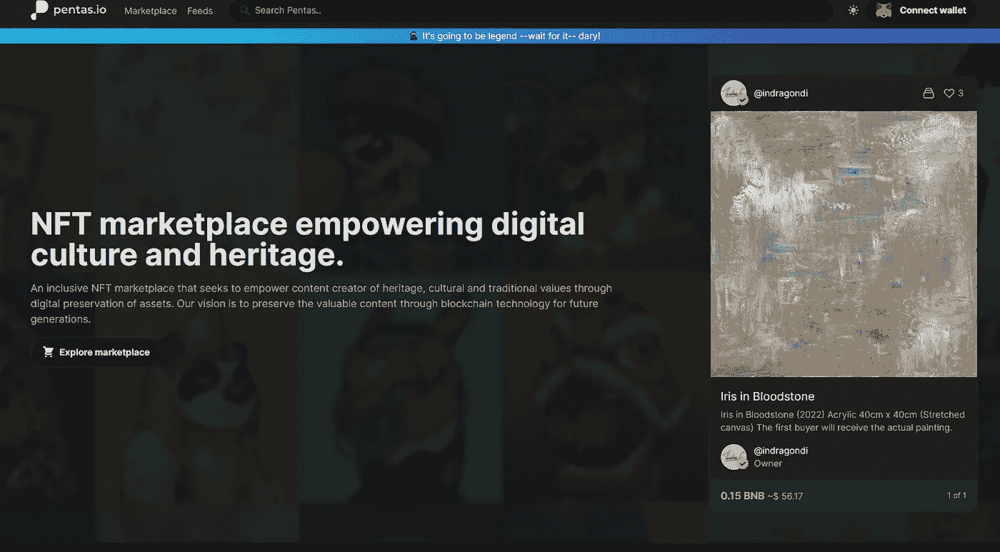*

*The top of Pentas.io [homepage](https://app.pentas.io/)*

*接下来，你会看到这个月的“聚焦艺术家”。它每个月都会改变，所以你每个月都会认识不同的艺术家。我希望你能看到之前的“聚光灯下的艺术家”名单，这样你就不会错过你应该关注的大牌明星。也许他们将来会添加它。*

*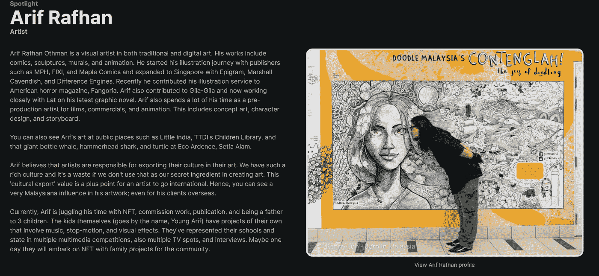*

*Current Artist in Spotlight on [Pentas](https://app.pentas.io/)*

*向下滚动你会看到一个特色创作者，特别网页，和特色艺术品的列表。*

*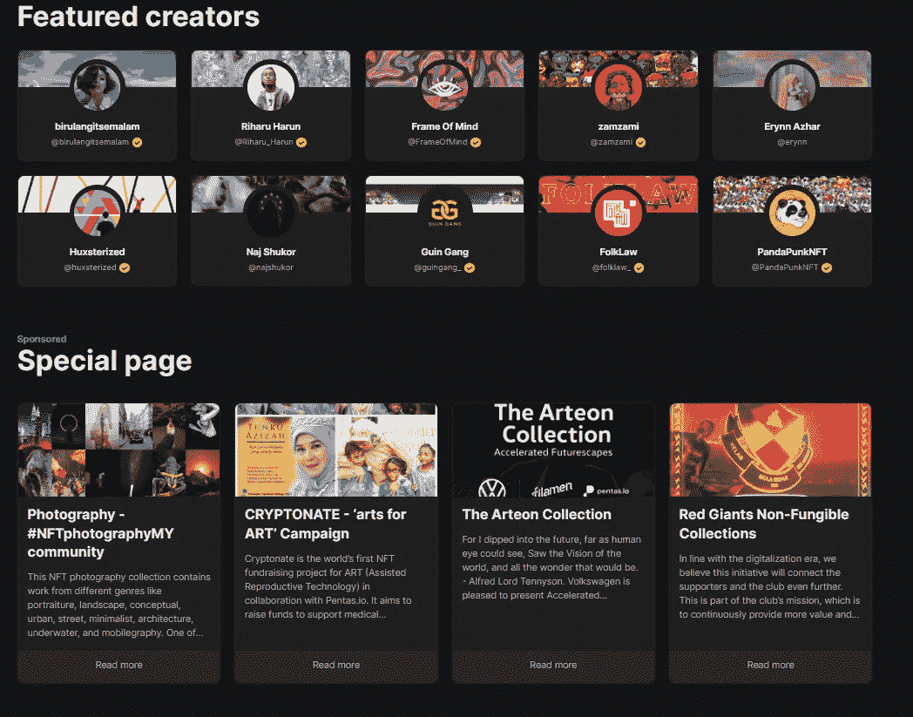*

*Featured creators and Special Page on [Pentas.io](https://app.pentas.io/)*

*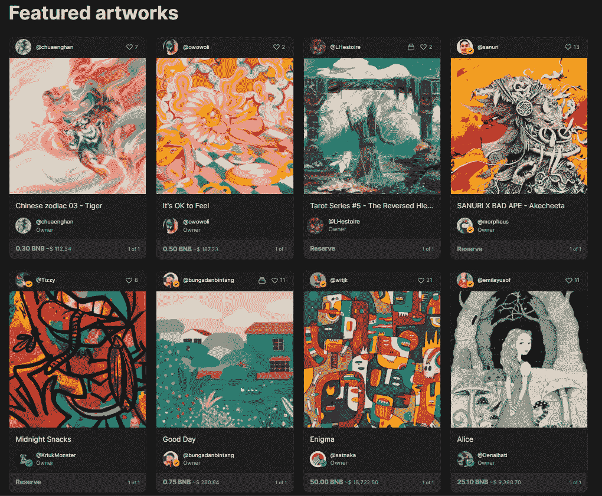*

*Featured artwork on [Pentas.io](https://app.pentas.io/)*

*主页到此为止。*

****商场****

*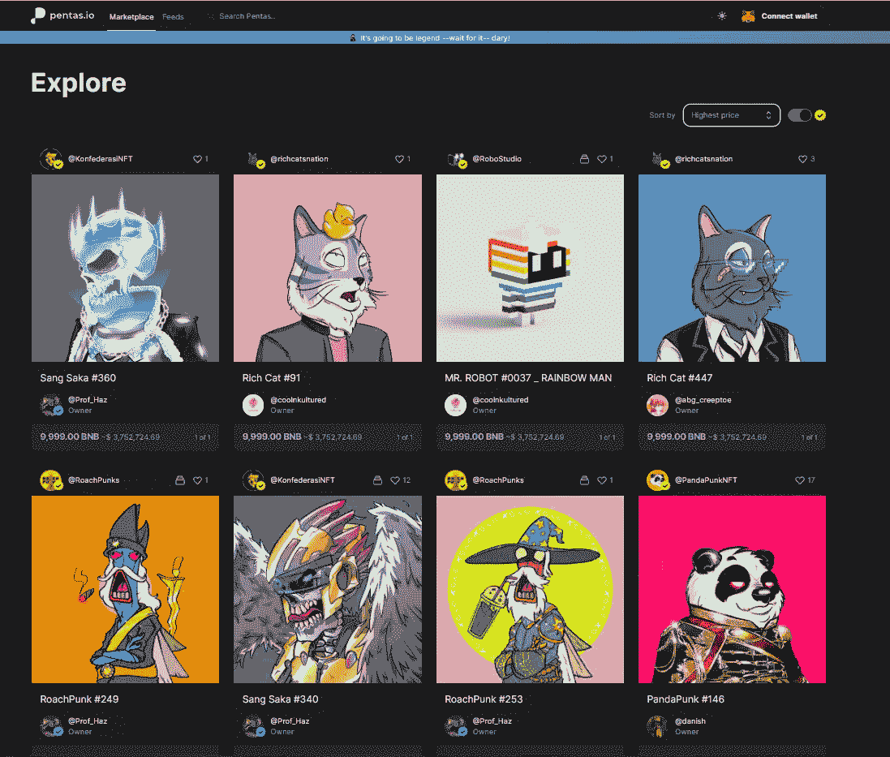*

*Pentas [marketplace](https://app.pentas.io/marketplace)*

*根据您的喜好滚动市场。您可能会注意到在一些个人资料上有验证徽章。*

****黄色的 tick 徽章给任何验证过的艺人，蓝色的 tick 徽章给验证过的买家。****

*获得验证的标准已经升级，您可以在此阅读相关内容[。](https://blog.pentas.io/pentas-spotlight-verified-badge-d220017b3b42)*

*更新:Pentas twitter 已经[宣布](https://twitter.com/pentas_io/status/1496466372054097924?s=20&t=XHlH1e3MwaL9Ri_inLkb6g)将从 2022 年 3 月开始对验证徽章有新的要求。*

****饲料****

*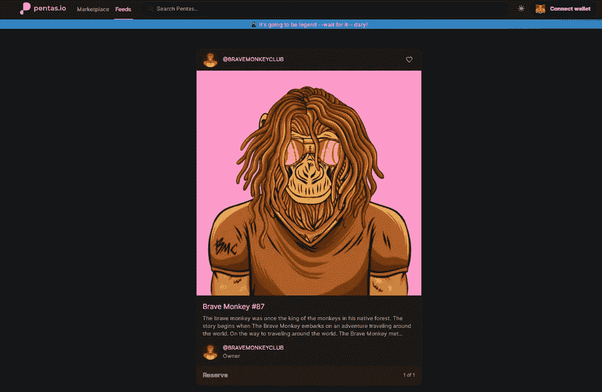*

*The feed page [here](https://app.pentas.io/feeds)*

*你可以在页面上看到新鲜出炉的 NFT。*

## *5.社区——Pentasian*

*Pentas 社区被称为 Pentasian，它是一个非常支持的社区。让别人了解你的艺术的最好方式之一就是参与社区活动。Pentasian 将帮助您找到您的买家！*

*相信我，只要活跃在 Twitter/Telegram/Discord 上的 Pentas 社区，你就会很快卖出你的作品！它曾经是一个小社区，但随着艺术家数量的增长，它变得越来越大，我自己无法跟上社区中最新的艺术家。我很高兴看到这种成长！*

*我可以说，对于一个新的艺术家来说，如果他们把所有的精力都投入到这个项目中，接管那些早期加入的艺术家并不是不可能的。*

*这是十大艺术家和收藏品的最新排名。*

*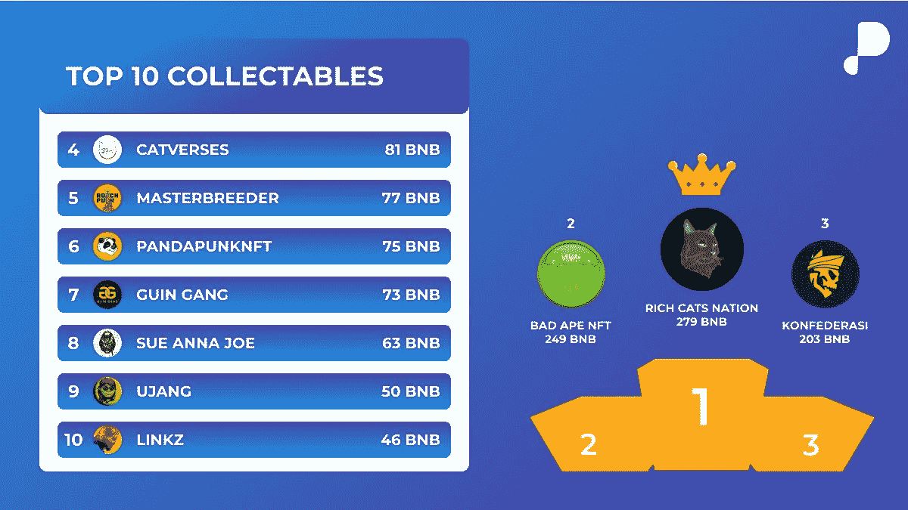*

*Top 10 Collectables ranking from Pentas [twitter](https://twitter.com/pentas_io/status/1496091182430097416?s=20&t=FLMOx3MUTXiq2ZxIRQ0gXg)*

*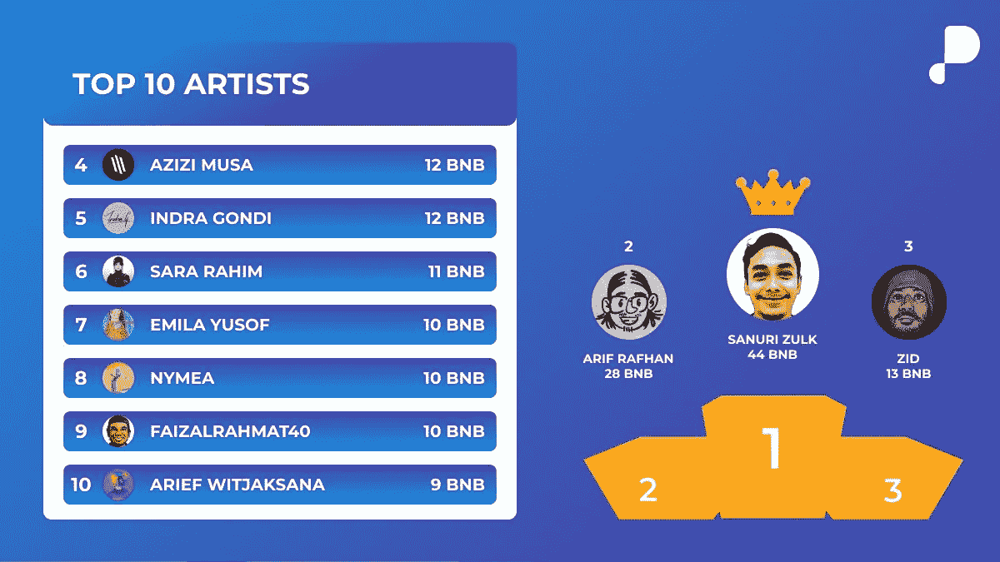*

*Top 10 Artist ranking from Pentas [twitter](https://twitter.com/pentas_io/status/1496091182430097416?s=20&t=FLMOx3MUTXiq2ZxIRQ0gXg)*

*因为它是由马来西亚人创立的，所以大部分艺术家都来自马来西亚。但是，Pentas 吸引了印度尼西亚和菲律宾等邻国的艺术家。*

## **6。成就**

*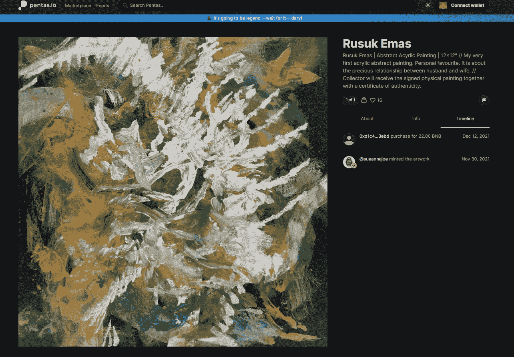*

*[Rusuk Emas by Sue Anna Joe](https://app.pentas.io/nft/149476?tab=timeline)*

*特别提及 Pentas 上出售的最昂贵的艺术品。苏·安娜·乔的 Rusuk Emas 售价 22 BNB。*

*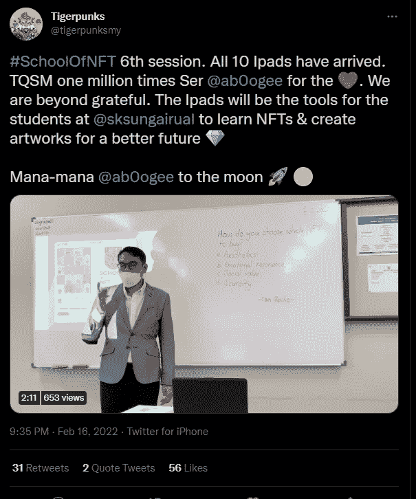*

*Support School of NFT by [Tigerpunks](https://app.pentas.io/user/0x27FDD618eA47A54941e17dCe948D7C1651fd0C02)*

*另一个特别值得一提的是这个名为“NFT 学校”的社区项目。NFT 社区可以通过在 twitter 上关注 Tigerpunks 的更新来支持这个项目。Tigerpunks 是一所乡村学校的老师，如果我没弄错的话，Tigerpunks 发起这个项目的初衷是教年轻人创造有价值的艺术。*

*社区捐赠了大量的 iPads，分享艺术知识，并为孩子们提供美味的食物。这是一个伟大的项目，因为现在是教育年轻人非传统赚钱方式的最佳时机！*

*让他们从小发现和打磨自己的才华。如你所知，一些亚洲人，尤其是他们的父母，倾向于认为在某个行业找到一份工作是成功的。但是成功来自很多方面..*

*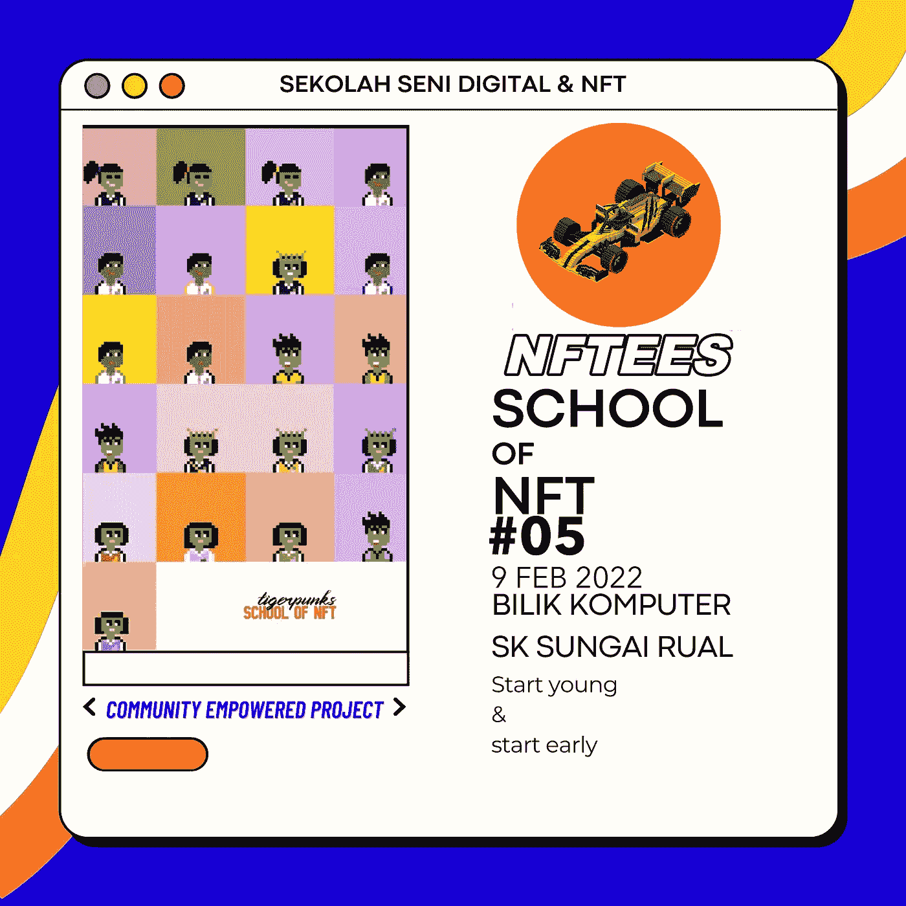*

*你可以点击这里关注 NFT 学校的最新消息[。](https://twitter.com/hashtag/SchoolOfNFT?src=hashtag_click&f=live)*

## *7.结论*

*我对 Pentas 的希望是做大，获得更多的国际用户。Pentas 上的人才是如此巨大！我认为发展中国家的艺术家通常工资低且被忽视。但是 Pentas 改变了他们中一些人的生活！艺术家得到了报酬和赞赏。*

*去支持他们，或者如果你是一个艺术家，甚至加入作为一个艺术家！不要错过下一件大事。*

*另一方面，我也很高兴看到 NFT 摄影在 Pentas 上得到认可。老实说，我对 pfp 感到厌倦了。然而，Pentas 上有一些很好的路线图。*

*你买 NFT 是看它的实用性还是仅仅看它的艺术？*

> *加入 Coinmonks [电报频道](https://t.me/coincodecap)和 [Youtube 频道](https://www.youtube.com/c/coinmonks/videos)了解加密交易和投资*

# *另外，阅读*

*   *[加密套利](/coinmonks/crypto-arbitrage-guide-how-to-make-money-as-a-beginner-62bfe5c868f6)指南| [如何做空比特币](/coinmonks/how-to-short-bitcoin-568a2d0b4ae5)*
*   *[币安期货交易](https://coincodecap.com/binance-futures-trading)|[3 commas vs Mudrex vs eToro](https://coincodecap.com/mudrex-3commas-etoro)*
*   *[如何购买 Monero](https://coincodecap.com/buy-monero) | [IDEX 评论](https://coincodecap.com/idex-review) | [BitKan 交易机器人](https://coincodecap.com/bitkan-trading-bot)*
*   *[尤霍德勒 vs 科恩洛 vs 霍德诺特](/coinmonks/youhodler-vs-coinloan-vs-hodlnaut-b1050acde55a) | [Cryptohopper vs 哈斯博特](https://coincodecap.com/cryptohopper-vs-haasbot)*
*   *[顶级付费加密货币和区块链课程](https://coincodecap.com/blockchain-courses)*
*   *[MXC 交易所评论](/coinmonks/mxc-exchange-review-3af0ec1cba8c) | [Pionex vs 币安](https://coincodecap.com/pionex-vs-binance) | [Pionex 套利机器人](https://coincodecap.com/pionex-arbitrage-bot)*
*   *[如何在印度购买比特币？](/coinmonks/buy-bitcoin-in-india-feb50ddfef94) | [瓦济克斯审查](/coinmonks/wazirx-review-5c811b074f5b)*
*   *[印度的加密交易所](/coinmonks/bitcoin-exchange-in-india-7f1fe79715c9) | [比特币储蓄账户](/coinmonks/bitcoin-savings-account-e65b13f92451)*
*   *[Cloudbet 赌场评论](https://coincodecap.com/cloudbet-casino-review) | [点火赌场评论](https://coincodecap.com/ignition-casino-review)*