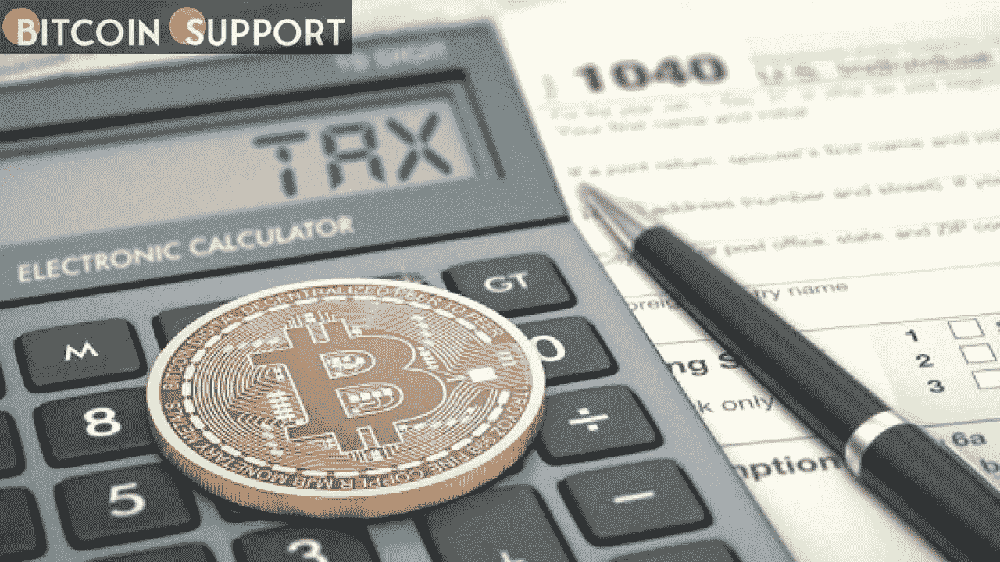

# 根据白宫的说法，由于加密税的限制，美国的预算赤字将在十年内减少 110 亿美元

> 原文：<https://medium.com/coinmonks/the-us-budget-deficit-would-be-reduced-by-11-billion-over-ten-years-as-a-result-of-crypto-tax-e990f0b622f7?source=collection_archive---------102----------------------->

**Visit our website:-** [**https://bitcoinsupports.com/**](https://bitcoinsupports.com/)

根据拜登政府的预算，更新税收规则以涵盖数字资产将在 2023 年为政府带来 49 亿美元的收入。

美国政府 2023 财年的预算预计，未来十年，围绕数字资产的规则改革将带来约 110 亿美元的收入。

根据美国总统乔·拜登周一公布的 2023 财年预算，修改数字资产税收法规将从 2023 年到 2032 年削减 109 亿美元的赤字。白宫宣布，它将“更新标准”，以包括某些报告外国账户数字资产持有情况的纳税人，改变市值计价规则以纳入数字资产，并要求金融机构和加密经纪人记录新数据。它还建议“对证券贷款进行免税处理，以涵盖其他资产类型并解决收入包容性问题。”根据拜登政府的说法，更新税收规则以涵盖数字资产将在 2023 年为政府带来 49 亿美元的收入。此外，预算拨款 5200 万美元加强司法部处理美国网络风险的能力，以防止“比特币的滥用”。这笔资金将用于向政府机构提供“额外的代理人，更大的反应能力，以及加强的情报收集和分析能力”。拜登总统表示，他的政府将如期在 2022 年前削减美国 1.3 万亿美元的债务。根据白宫的说法，总统增加政府收入的建议之一是对收入超过 1 亿美元的美国家庭征收 20%的所得税，约占家庭的 0.01%。

[https://twitter.com/WhiteHouse/status/1508472674099552256](https://twitter.com/WhiteHouse/status/1508472674099552256)

拜登于 3 月 9 日签署了一项行政命令，为美国的数字资产建立了一个监管框架，这导致了拟议中的预算。该命令指示政府机构调查实施数字货币的可能性，以及协调和巩固关于加密的联邦框架的政策。

美国现政府已将加密货币纳入其预算估算和监管框架。然而，这个世界上最大的民主国家最近通过立法，通过税收政策为数字资产创建了一个框架。印度议会周五通过了一项金融法案，其中包括对数字资产和不可兑现的代币交易征收 30%的税。此外，在计算收入时，该框架不允许扣除交易损失。

**访问我们的网站:-**[**https://bitcoinsupports.com/**](https://bitcoinsupports.com/)

**免责声明:以上为作者观点，不应视为投资建议。读者应该自己做研究。**

> 加入 Coinmonks [电报频道](https://t.me/coincodecap)和 [Youtube 频道](https://www.youtube.com/c/coinmonks/videos)了解加密交易和投资

# 另外，阅读

*   [顶级付费加密货币和区块链课程](https://coincodecap.com/blockchain-courses)
*   [CBET 回顾](https://coincodecap.com/cbet-casino-review) | [库币 vs 比特币基地](https://coincodecap.com/kucoin-vs-coinbase) | [拜比特 vs 比特币基地](https://coincodecap.com/bybit-vs-coinbase)
*   [如何在加拿大购买加密货币？](https://coincodecap.com/how-to-buy-cryptocurrency-in-canada)
*   [百无聊赖的猿游艇俱乐部(BAYC)评论](https://coincodecap.com/bored-ape-yacht-club-bayc-review)
*   [5 款最佳加密交易终端](https://coincodecap.com/crypto-trading-terminals) | [最佳 DeFi 应用](https://coincodecap.com/best-defi-apps)