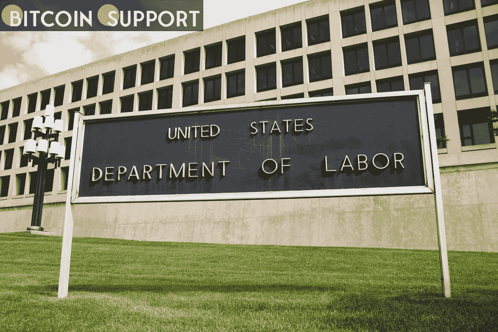

# 美国劳工部就退休计划中加密货币的危险发出警告

> 原文：<https://medium.com/coinmonks/the-us-labor-department-has-issued-a-warning-about-the-dangers-of-cryptocurrency-in-retirement-28420bf37491?source=collection_archive---------72----------------------->

**Visit our website:-** [**https://bitcoinsupports.com/**](https://bitcoinsupports.com/)

“重大危险”——加密货币激起了美国立法者的兴趣，他们希望限制 401(k)退休账户中数字资产的使用。美国劳工部建议 401(k)参与者在处理加密货币和其他数字资产时要“极度谨慎”，注意欺诈、盗窃和财务损失等“重大危险”。

美国劳工部(Department of Labor)在周四发布的一份合规报告中，向寻求提高加密货币 401(k)敞口的公司发出了严厉警告，表明公司赞助的退休基金中的任何大型加密投资都可能引起法律关注。

大多数美国工作场所都提供 401(k)退休储蓄计划，为参与者提供税收优惠和长期财务保障。管理 401(k)投资的 1974 年雇员退休收入保障法案(ERISA)并未规定哪些资产类别必须包含在 401(k)计划中。然而，在作出投资决定时，它指示受托人“展现谨慎的人会表现出的谨慎、技能、判断力和勤奋”，以便“最大限度地降低重大损失的风险”。ERISA 还要求受托人定期监控所有投资，以进一步限制潜在损失。因此，加密货币等高波动性资产在 401(k)投资方面可能变得越来越不明朗。

目前 DOL 的公告正值越来越多的金融机构，如去年 6 月与比特币基地建立战略关系的 ForUsAll Inc .继续为 401(k)固定退休账户提供加密作为投资选择。雇员福利安全管理局(EBSA)助理部长阿里·卡瓦在 DOL 的一篇博客文章中警告受托人说:“美国工人及其家庭的退休储蓄代表了多年的辛勤工作和牺牲……必须小心保护。”

Khawar 接着指出，劳工部担心任何类型的数字资产的长期投资:

**“然而，在加密货币发展的早期阶段，对于计划决定让成员直接投资于加密货币或相关产品，如 NFT、硬币和加密资产，有很大保留。**

尽管美国总统乔·拜登(Joe Biden)最近发布的关于加密货币的行政命令强调了与数字资产投资相关的风险，但加密货币和其他数字资产的实际监管清晰度尚未建立，这加剧了投资者对他们可以和不可以用数字资产做什么的困惑。

**访问我们的网站:-**[**https://bitcoinsupports.com/**](https://bitcoinsupports.com/)

**免责声明:以上为作者观点，不应视为投资建议。读者应该自己做研究。**