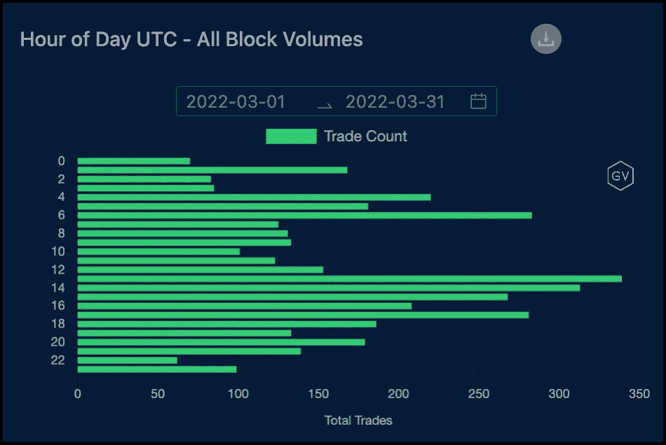

# 美国股市与密码的联系

> 原文：<https://medium.com/coinmonks/the-us-stock-market-link-to-crypto-ad9867b2c58?source=collection_archive---------58----------------------->

如果你想知道美国股票和密码之间的联系，他们仍然是舞伴。一天中加密衍生产品交易量最繁忙的时间是在美国股市开盘时。

这似乎很奇怪，因为在美国，密码衍生产品被如此严重地规避。许多主要的密码衍生品交易所禁止美国境内的交易员交易。据说，密码行业的许多主要参与者也不在美国境内，那么会发生什么呢？当美国股市开盘时，为什么加密块活动会激增？

我们可以说密码从不睡觉，风险也不会。股票开盘本身就是一个风险事件。华尔街是所有风险的国王，所有风险从业者都参与其中。有可能。我不知道。

你的理论是什么？

> 加入 Coinmonks [电报频道](https://t.me/coincodecap)和 [Youtube 频道](https://www.youtube.com/c/coinmonks/videos)了解密码交易和投资

# 此外，请阅读

*   [bits cap 审核](/coinmonks/bitsgap-review-a-crypto-trading-bot-that-makes-easy-money-a5d88a336df2) | [四倍审核](/coinmonks/quadency-review-a-crypto-trading-automation-platform-3068eaa374e1) | [Bitbns 审核](/coinmonks/bitbns-review-38256a07e161)
*   [密码复制交易平台](/coinmonks/top-10-crypto-copy-trading-platforms-for-beginners-d0c37c7d698c) | [货币评论](/coinmonks/coinmama-review-ace5641bde6e)
*   [印度密码交易所](/coinmonks/bitcoin-exchange-in-india-7f1fe79715c9) | [比特币储蓄账户](/coinmonks/bitcoin-savings-account-e65b13f92451)
*   [OKEx vs KuCoin](https://coincodecap.com/okex-kucoin) | [摄氏度替代品](https://coincodecap.com/celsius-alternatives) | [如何购买 VeChain](https://coincodecap.com/buy-vechain)
*   [币安期货交易](https://coincodecap.com/binance-futures-trading)|[3 commas vs mud rex vs eToro](https://coincodecap.com/mudrex-3commas-etoro)