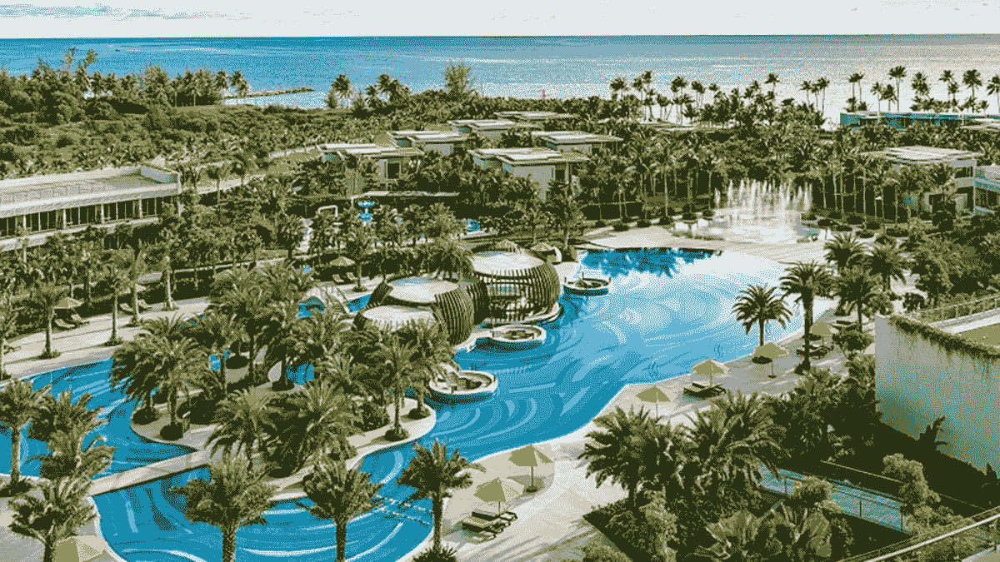

# 酒店预订开始使用 NFTs。

> 原文：<https://medium.com/coinmonks/the-use-of-nfts-for-hotel-reservations-kicks-off-6305b08d8d7?source=collection_archive---------11----------------------->

Image from NFTbestsites

非功能性测试在打破传统流程方面的重要性正在增加。我们听说过 NFT 用于艺术、音乐、体育门票和收据。如果我们可以将这项技术用于酒店客房预订，会怎么样？

Pinktada 是一家初创公司，专注于将房间权利转化为酒店客人可以出售的 NFT，而不是直接要求退款。通过这种方式，酒店和度假村的所有者可以避免在最后一刻取消预订。

# 酒店已经加入了 NFT 的潮流。

Pinktada 正在与多米尼加共和国的 Casa de Campo 和美国的 Noble House Hotels & Resorts 等度假酒店合作，以不可兑换的代币形式销售房间预订。这确保了双赢的局面；酒店不必担心退款，如果游客无法满足住宿条件，他们还有机会出售代币。

对于 Casa de Campo，它将很快在墨西哥、夏威夷州、美国和加勒比海地区的酒店中实施 NFT 酒店。通过这个系统，客人每次预订都可以享受折扣。

此外，如果客人改变住宿计划，他们可以在 Pinktada 网络内出售代币。如果没有人买票怎么办？平克塔达将是购买它们的最后手段。

除了 Pinktada，另一家利用 NFTs 构建生态系统的初创公司是 Stay Open。在春天之前，Stay Open 专注于将办公空间改造成酒店住宿，今年春天，它提出了以每间 0.1 ETH 的价格出售 10，000 间 NFT 的想法。这笔钱将用于为增加新的位置筹集资金。

国家森林旅游券的持有者有权在 Stay Open 即将推出或现有的任何一家旅馆免费住宿一晚。

# 使用 NFT 预订酒店的主要问题是

对非金融交易的兴趣急剧下降，导致许多人认为该系统正在经历崩溃。虽然当前的宏观经济部门允许类似这样的谣言蔓延，但 NFT 正在将自己定位为我们日常生活中不可或缺的一部分。艺术、音乐、体育以及现在的酒店预订都是 NFT 充斥的领域。

尽管有传言称，NFts 是董事会会议的一个常规组成部分，但酒店业突出的一个问题是核实客人的身份。这种关注将安全性放在首位，但是正如 Pinktada 所解释的，确保安全性的最佳方法是构建一个社区，在这个社区之外，令牌是无效的。酒店有客人的资料，也会有实物验证。

> 加入 Coinmonks [电报频道](https://t.me/coincodecap)和 [Youtube 频道](https://www.youtube.com/c/coinmonks/videos)了解加密交易和投资

# 另外，阅读

*   如何在 Uniswap 上交换加密？ | [A-Ads 审查](https://coincodecap.com/a-ads-review)
*   [WazirX vs coin dcx vs bit bns](/coinmonks/wazirx-vs-coindcx-vs-bitbns-149f4f19a2f1)|[block fi vs coin loan vs Nexo](/coinmonks/blockfi-vs-coinloan-vs-nexo-cb624635230d)
*   [本地比特币评论](/coinmonks/localbitcoins-review-6cc001c6ed56) | [加密货币储蓄账户](https://coincodecap.com/cryptocurrency-savings-accounts)
*   [什么是融资融券交易](https://coincodecap.com/margin-trading) | [成本平均法](https://coincodecap.com/dca)
*   [支持卡审核](https://coincodecap.com/uphold-card-review) | [信任钱包 vs 元掩码](https://coincodecap.com/trust-wallet-vs-metamask)
*   [Exness 点评](https://coincodecap.com/exness-review)|[moon xbt Vs bit get Vs Bingbon](https://coincodecap.com/bingbon-vs-bitget-vs-moonxbt)