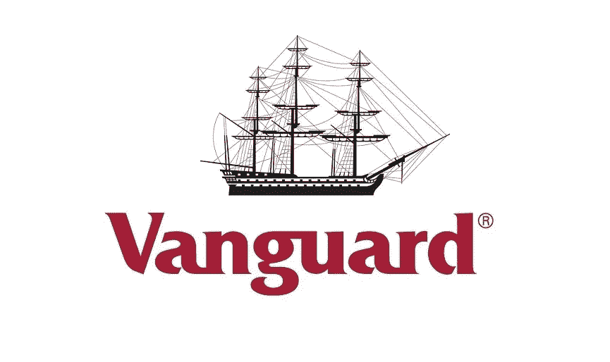

# 先锋集团公司。

> 原文：<https://medium.com/coinmonks/the-vanguard-group-inc-2da301f99c58?source=collection_archive---------2----------------------->

## 您听说过先锋集团吗？

如果没有，你要做的就是继续读这篇文章。Vanguard Group，Inc .是一家美国注册投资顾问公司，总部位于宾夕法尼亚州的马尔文，截至 2021 年 1 月 13 日，管理着约 7 万亿美元的全球资产。

它是共同基金的最大提供商，也是仅次于贝莱德(black rock)iShares 的全球第二大交易所交易基金(ETF)提供商。除了共同基金和 ETF，Vanguard 还提供经纪服务、可变和固定年金、教育账户服务、财务规划、资产管理和信托服务。按管理资产计算，Vanguard 管理的几只共同基金在美国共同基金中名列前茅。与贝莱德(BlackRock)和道富银行(State Street)一样，Vanguard 被认为是主导美国企业的三大指数基金管理公司之一。

在先锋集团，他们相信为客户提供投资成功的最佳机会。先锋公司的人认为，他们可以通过低成本、简单明了的产品以及与客户目标保持一致来实现这一目标。

他们是一种不同的投资公司，相信为投资者赚钱，而不是从他们身上赚钱。由于在美国的共同所有权，他们能够在不影响质量的情况下保持低成本。我们的投资者保留了更多的回报，随着时间的推移，他们可能会赚得更多。

先锋公司生产简单明了的产品，以通俗易懂的方式展示。这些基金提供了投资多样化资产的便捷途径。他们提供的资金，他们提供的服务，他们做出的每一个决定，都是为了让你这个客户受益。先锋集团成立于 1975 年，现在是世界上最大的资产管理公司之一。他们相信，他们过去 40 年的增长来自于代表所有投资者的立场，并公平对待他们。先锋致力于为他们的英国和欧洲客户带来同样的利益，这些利益推动了我们的全球增长。

 [## 最佳加密税务软件——评论和比较

### 不管你是刚接触加密还是已经在这个领域呆了一段时间，你都需要交税。

medium.com](/coinmonks/best-crypto-tax-tool-for-my-money-72d4b430816b) 

**是什么让先锋与众不同？**

低成本、简单的投资。投资者不能控制市场，但他们可以控制投资成本。每支付一英镑或一欧元费用，潜在回报就会减少一英镑或一欧元。

先锋的规模和所有权结构有助于我们保持低成本。由于没有股东需要取悦，他们可以通过降低成本将我们的利润返还给投资者。随着他们获得更多的投资者，他们管理的资产增长，他们可以为我们的投资者进一步降低费用率。

活跃的指数专家先锋集团在 1976 年为个人投资者建立了世界上第一个指数共同基金。Vanguard 首先提供跟踪债券或国际指数的基金，此后一直是低成本指数投资的领导者。在过去十年中，Vanguard 将其指数管理专业知识扩展到交易所交易基金，现在他们是世界上最大的提供商之一。

但 Vanguard 不仅仅是指数基金的专家。Vanguard 拥有悠久的主动管理历史，自 1975 年开始管理主动基金。他们拥有超过 1.6 万亿美元的活跃资产(截至 2020 年 12 月 31 日)，是全球最大的活跃资产管理公司之一。

**值**

Vanguard 希望提供投资基金，帮助投资者实现他们的目标，并让他们尽可能多地保留他们的回报。在他们看来，这使他们的目的与他们的投资成功一致。

**先锋故事**

几十年来，Vanguard 已经发展成为世界上最大的投资管理公司之一，业务遍及澳大利亚、欧洲、亚洲和美洲。如今，全球超过 3000 万投资者信任 Vanguard，管理着超过 7.1 万亿美元的资产。

Vanguard 在阿姆斯特丹、都柏林、法兰克福、伦敦、巴黎和苏黎世都设有办事处，利用其成熟的全球业务的规模、经验和资源为整个欧洲的投资者服务。

**维护投资者利益**

他们的使命始于代表所有投资者的立场，这是他们认真对待的声明。

他们对治理有明确的看法，并公开交流。先锋集团与政治家、监管者和专业协会合作，为投资者的利益制定一个健全的监管框架。

先锋对“先锋效应”感到自豪，即当先锋进入一个市场时，其他人可能会效仿他们的做法，特别是通过降低成本。

从严格的风险管理到透明的定价，再到坦率的沟通，他们把客户的利益放在第一位。

先锋所做的一切都是为了给客户提供投资成功的最佳机会。

**投资成功的原则**

在 Vanguard，四个简单的原则贯穿于他们所做的一切。自公司成立以来，它们就已经成为公司的固有属性，并深深植根于公司文化之中。对先锋而言，它们代表着过去和未来，是指导我们投资决策的永恒原则。

**目标**

建立明确、适当的投资目标投资过程始于设定可衡量且可实现的投资目标，并制定实现这些目标的计划。

**天平**

利用广泛分散的资金进行适当的资产配置。成功的投资策略始于适合其目标的资产配置。你应该利用对风险和潜在回报的合理预期来建立资产配置。分散投资有助于减少不必要的风险。

**成本**

最小化成本你不能控制市场，但你可以控制投资的成本。你支付的每一英镑或每一欧元的成本和费用都直接来自于你的潜在回报。事实上，研究表明低成本投资往往比高成本投资表现更好。

**纪律**

保持远见和长期纪律投资会激发情绪，这种情绪甚至会扰乱最老练的投资者的计划。但是你可以用纪律和长远的眼光来对抗情绪。这可以帮助你坚持你的计划。

另外，我想告诉你一些关于我喜欢的一只 ETF 的事情。这是先锋富时环球 UCITS ETF。

我个人喜欢发行版的。分配意味着你将获得每股 Vanguard FTSE All-World 股票的股息。

当然可以选择累加版。

基金中的红利自动进行再投资。这确保了复合效果。您可以使用 ISIN 代码:IE00B3RBWM25 找到它。

该基金通过实际购买证券，采用被动管理或指数化投资方法，并寻求跟踪富时环球指数的表现。

该指数由发达市场和新兴市场的大中型公司股票组成。

**本基金试图:** 1 .通过投资指数成份股的代表性样本来跟踪指数的表现。2.保持充分投资，除非在特殊的市场、政治或类似条件下。

**以下是一些特点:**

该 ETF 包含的股票数量约为 3700 只。市值中位数为 860 亿美元。股票收益率或股息为 1.9%。

**排名前 10 的公司是:**

苹果，微软，Alphabet，亚马逊，特斯拉等等。

市场份额以美国为主，占 59.2%，其次是日本、英国、中国、法国等。富时环球 ETF 的总费用率(TER)为每年 0.22%..相比之下，大多数积极管理的基金每年的费用要高得多。

**另一个有趣的方面是加权风险敞口**

行业类别基于行业分类基准系统(“ICB”)。我们可以看到科技、金融、非必需消费品、工业、医疗保健等等。所有这些都使得先锋富时环球 ETF 成为长期投资的绝佳工具。

感谢您的阅读，下次见，请保管好您的钱！

> *加入 Coinmonks* [*电报频道*](https://t.me/coincodecap) *和* [*Youtube 频道*](https://www.youtube.com/c/coinmonks/videos) *了解加密交易和投资*

# 另外，阅读

*   [Bookmap 评论](https://coincodecap.com/bookmap-review-2021-best-trading-software) | [美国 5 大最佳加密交易所](https://coincodecap.com/crypto-exchange-usa)
*   最佳加密[硬件钱包](/coinmonks/hardware-wallets-dfa1211730c6) | [Bitbns 评论](/coinmonks/bitbns-review-38256a07e161)
*   [新加坡十大最佳加密交易所](https://coincodecap.com/crypto-exchange-in-singapore) | [购买 AXS](https://coincodecap.com/buy-axs-token)
*   [红狗赌场评论](https://coincodecap.com/red-dog-casino-review) | [Swyftx 评论](https://coincodecap.com/swyftx-review) | [CoinGate 评论](https://coincodecap.com/coingate-review)
*   [投资印度的最佳密码](https://coincodecap.com/best-crypto-to-invest-in-india-in-2021)|[WazirX P2P](https://coincodecap.com/wazirx-p2p)|[Hi Dollar Review](https://coincodecap.com/hi-dollar-review)