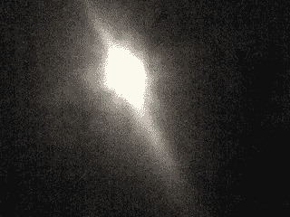

# 元宇宙的崩溃

> 原文：<https://medium.com/coinmonks/the-virtual-world-inside-a-metaverse-is-a-vulnerable-thing-210858866204?source=collection_archive---------12----------------------->

没有什么是永恒的

元宇宙内部的虚拟世界是一个脆弱的东西。它依赖于对由系统管理员创建和维护的网络空间的兴趣的延续。最近，脸书公司采取行动推进元宇宙的开发，在这种系统中，数十亿用户可以作为虚拟角色在虚拟世界中漫游，而生物体之间没有身体接触。

One Metaverse