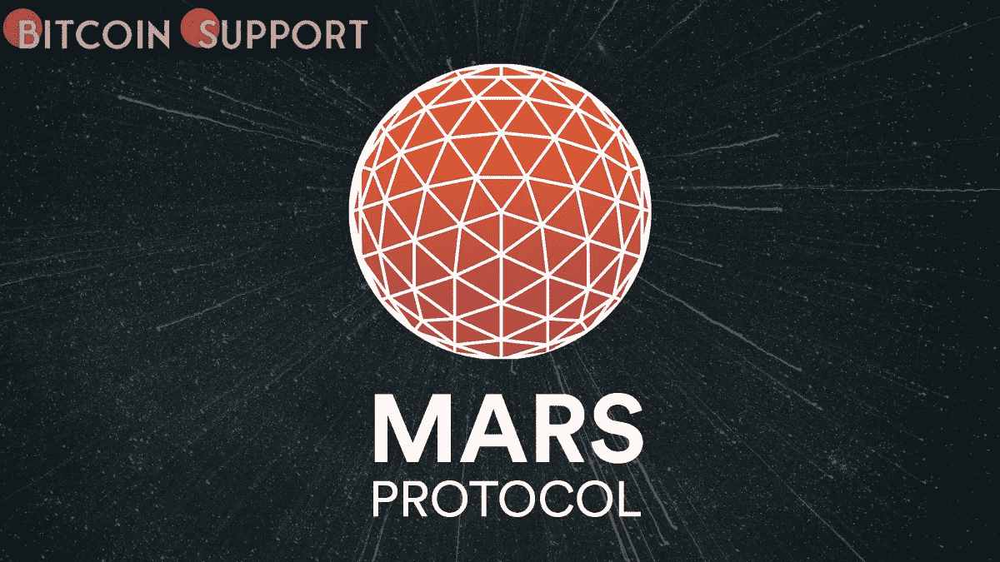
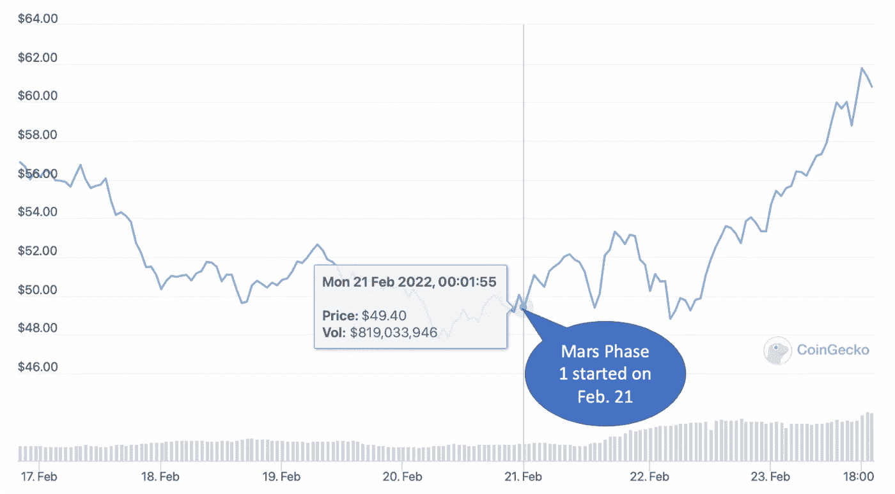
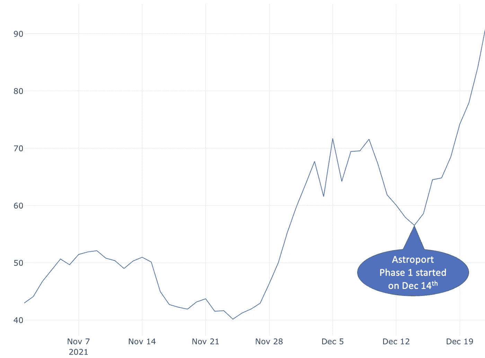
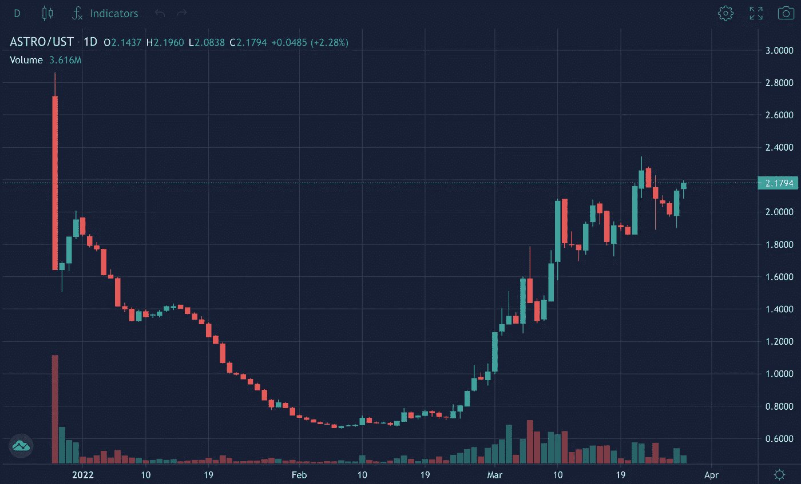
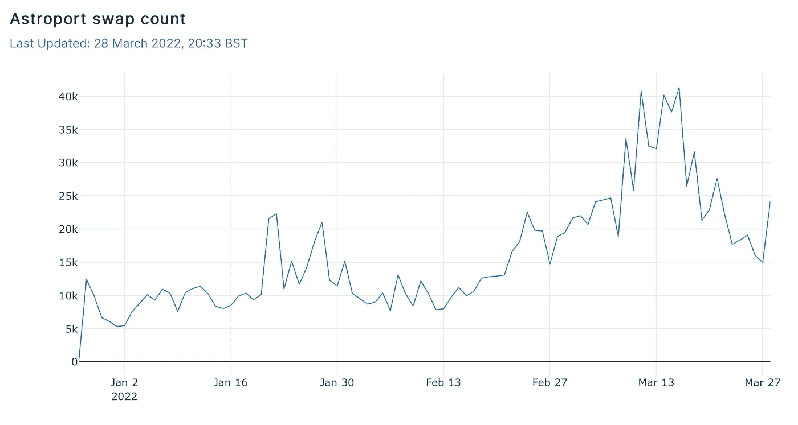
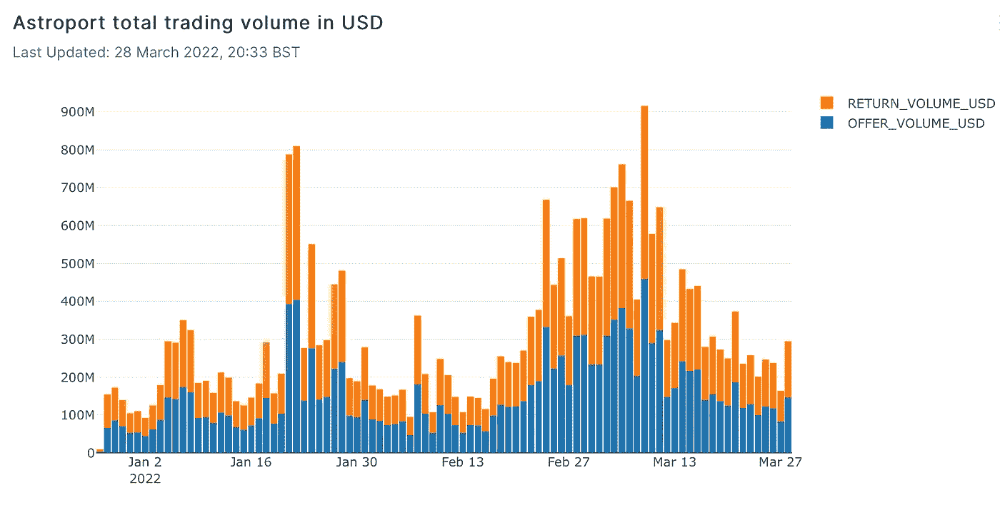
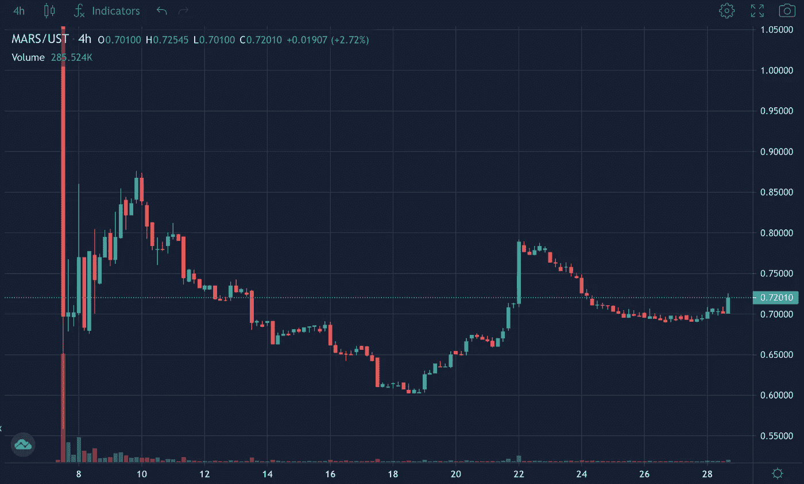
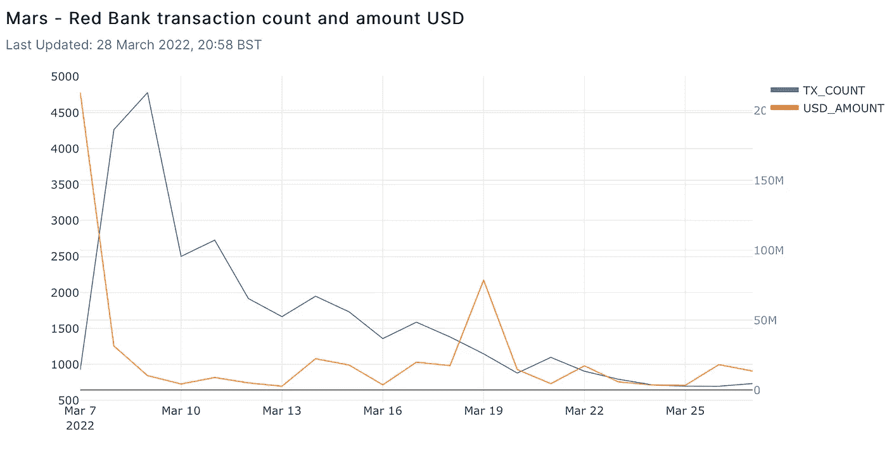
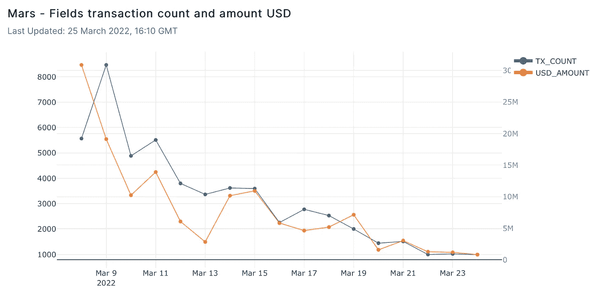

# 火星协议的古怪发布表明，生态系统的扩张可能不会给网络带来价值

> 原文：<https://medium.com/coinmonks/the-wacky-launch-of-the-mars-protocol-demonstrates-that-ecosystem-expansion-may-not-bring-value-to-502bc8dba786?source=collection_archive---------54----------------------->

**Visit our website:-** [**https://bitcoinsupports.com/**](https://bitcoinsupports.com/)

Terra 的“流动性自举池”本应在启动时停止 DeFi 协议令牌泵和转储，但这一概念并没有发挥应有的作用。

每天都有新的协议在各种密码网络上推出，预计这种趋势会持续一整年。根据 DeFiLlama 的数据，以太坊(ETH)、特拉(LUNA)、币安智能链(BSC)、雪崩(AVAX)和索拉纳(SOL)是总价值锁定(TVL)的前五大网络。以太坊有 579 个协议(包括 L1 和 L2)，Terra 有 25 个，BSC 有 348 个，Avalanche 有 187 个，Solana 有 64 个。Terra 以其有限的协议数量和高 TVL 成为这里的异类。

Terra 的 TVL 在 2021 年 12 月达到 200 亿美元的峰值，之后在 2022 年 1 月的危机期间暴跌至 130 亿美元。迄今为止，该生态系统已经能够恢复 260 亿美元的流动性。尽管在这个链上只有 25 个协议，Terra 已经吸引了足够多的 TVL 成为仅次于以太坊的第二大网络。火星协议的首次亮相以及最近宣布以 10 亿美元的比特币(BTC)储备支持 UST (Terra 的 stablecoin)的消息，与 LUNA 在 2022 年 2 月底的定价意外飙升完全吻合。

链中治理令牌的增长通常被视为对网络和协议信任的标志，但新协议的推出是否总能为网络带来价值并推动用户活动和参与？

让我们看看随着新协议在 Terra 上推出，LUNA 的价格如何变化，然后看看最近推出的 Mars 和 Astroport 协议如何影响本机令牌定价、用户参与度和 LUNA 的价格。

**LUNA 是保持 UST 与美元挂钩的工具**

在研究 LUNA 定价和新协议推出之间的相关性之前，理解 LUNA-UST 机制至关重要，该机制确保了 UST 与美元的稳定挂钩。

LUNA 被用作 UST 的对应货币，以保持 USD 美元的挂钩价格。当 UST 的价值超过 1 美元时，这表明在 Terra 生态系统中对 UST 的需求大于供给。因此，该协议鼓励参与者焚烧月神和薄荷 UST，以满足不断增长的 UST 需求，直到 1 UST 等于 1 美元。当 UST 的价格低于 1 美元时，UST 的供应超过了需求，因此 UST 将被烧毁，卢娜将被铸造，直到 UST 的价格再次达到 1 美元。

Terra 可以通过管理生态系统中 LUNA 的供应，有效地让 UST 与美元捆绑在一起。随着对 UST 需求的增长，这种机制导致 LUNA 的价格上涨。

**LUNA 的价格与新协议的出现密切相关**

在新协议开发的早期阶段，对 UST 的需求经常激增。这是由于参与者希望从新协议中获得空投激励令牌，他们经常被要求锁定 UST，以确保系统启动时有足够的流动性。

在新协议的预发布阶段，参与者对 UST 的需求增加，导致更多的 UST 被铸造，更多的露娜被焚烧，导致露娜价格大幅上涨。这里有一个最近推出的火星协议的例子，在新协议的预发布阶段开始两天后，LUNA 的价格从 50 美元左右上涨到 60 美元以上。

**Visit our website:-** [**https://bitcoinsupports.com/**](https://bitcoinsupports.com/)

另一个例子是，在 Astroport 的预发布阶段开始后不久，LUNA 的价格如何在 2021 年 12 月从大约 60 美元上涨到 90 美元以上。

**Visit our website:-** [**https://bitcoinsupports.com/**](https://bitcoinsupports.com/)

最近两个案例中新协议的开发推高了 LUNA 的价格，这可以认为是对 Terra 网络的良好影响。然而，为了确定它们是否对 Terra 生态系统有价值，我们必须检查协议的令牌价格和启动后的用户参与情况。

**在首次亮相后，ASTRO**

的价格和成交量在 lockdrop 中筹集了 9000 万美元，但由于 2022 年初不利的市场形势，ASTRO 的令牌价格自协议推出以来一直下跌。自 3 月初以来，价格已经上涨，现在以其首次亮相的价格交易。

**Visit our website:-** [**https://bitcoinsupports.com/**](https://bitcoinsupports.com/)

自空投以来，Astroport 上的每日交换数量在大约三个月的时间里一直在稳步增长，显示出该网站上用户的积极参与。

**Visit our website:-** [**https://bitcoinsupports.com/**](https://bitcoinsupports.com/)

自推出以来，Astroport 上的总交易量一直在稳步增长，并在 3 月中旬达到峰值。

**Visit our website:-** [**https://bitcoinsupports.com/**](https://bitcoinsupports.com/)

Astroport 的首次亮相是成功的，发布后的统计数据表明该网站保持了用户的活跃性和参与度。另一方面,《火星议定书》的故事则完全不同。

**火星的价格和成交量**

火星令牌价格在 2022 年 3 月 7 日火星发射后不到一小时内从 1.65 UST 降到 0.7 UST。这与 Astroport 刚出道时的价格反应形成了鲜明的对比。那么火星发生了什么？

该协议原计划于格林威治时间 2022 年 3 月 7 日上午 11 点上线，但无法在网络浏览器中成功加载。试图通过该协议的网站申领空投令牌的用户无法这样做，被迫等待网站运行。

然而，知道如何与 Terra 链交互的高级用户直接调用 Terra 站的认领奖励方法，并能够在不太懂技术的用户之前认领火星。他们迅速在市场上抛售代币，导致价格暴跌。

**Visit our website:-** [**https://bitcoinsupports.com/**](https://bitcoinsupports.com/)

要更详细地解释如何通过与 Terra chain 的交互来认领火星，投资者首先要知道火星协议的空投合同地址，这个地址在 etfinder 上是公开的；然后，这是棘手的部分，他们必须知道代码中的哪个方法调用 Terra 站来要求奖励。

由于协议是新的，代码在公共领域经常不可用，使得个人很难识别声明方法。然而，大多数精通技术的投资者认为火星协议是 Astroport 的一个分支。因此，索赔程序几乎肯定与 Astroport 的相同。事实证明这是正确的，这些投资者能够通过利用该链的“索赔奖励和解锁”功能来索赔 MARS airdrop。

火星协议网站在规定的发射时间三个小时后仍然瘫痪，空投火星无法通过网站认领。MARS 的价格已经在三个小时内暴跌了 60%，从 1.65 美元跌至 0.64 美元，如果投资者不知道如何与 Terra network 合作，那就没什么可做的了。

[https://twitter.com/elenahoolu/status/1500825945552437249](https://twitter.com/elenahoolu/status/1500825945552437249)

让我们来看看发射后不久发布的火星协议上的两大产品。空投之后，储蓄和贷款平台 Red Bank 一直在努力维持用户参与度。交易数量在首次亮相后的第三天达到峰值，每天约 5000 笔，此后一直稳步下降。从第一天开始，截至 3 月 27 日，每天的美元交易量从 2.12 亿美元减少到 1300 万美元。

**Visit our website:-** [**https://bitcoinsupports.com/**](https://bitcoinsupports.com/)

用户可以通过 Fields 向 ANC-UST、LUNA-UST 和 MIR-UST 提供流动性，Fields 是火星协议中产量农业计划的一个空间。首次亮相后，油田的交易和交易量历史反映了类似的情况。该产品正在努力保持与发布日相同的活跃水平，交易数量下降到峰值的 1/8，美元交易量下降到发布日的不到 1/30。

**Visit our website:-** [**https://bitcoinsupports.com/**](https://bitcoinsupports.com/)

虽然不可能说发射问题是否损害了用户的参与和对火星协议的信心，但数据表明，该协议在推出后一直难以吸引数量和活动。Astroport 和 Mars 的发射前计划非常相似，但发射后的结果却非常不同，对比这两者可以看出，新协议的发射并不总是能为网络增加价值。

上线当天发生的事故带来的风险不仅仅是协议，还有用户对生态系统的信任。绝大多数潜在投资者会对空投事件失去兴趣，因为空投事件只允许最懂技术的投资者优先索赔。未来在 Terra 链上出现的新协议应该做出更大的努力来防止这种情况，否则投资者的长期利益和信任可能会比预期的更快地被浪费掉。
**访问我们的网站:-**[**https://bitcoinsupports.com/**](https://bitcoinsupports.com/)

**免责声明:以上为作者观点，不应视为投资建议。读者应该自己做研究。**

> 加入 Coinmonks [电报频道](https://t.me/coincodecap)和 [Youtube 频道](https://www.youtube.com/c/coinmonks/videos)了解加密交易和投资

# 另外，阅读

*   [火币的加密交易信号](https://coincodecap.com/huobi-crypto-trading-signals) | [HitBTC 审查](/coinmonks/hitbtc-review-c5143c5d53c2)
*   [如何在 FTX 交易所交易期货](https://coincodecap.com/ftx-futures-trading) | [OKEx vs 币安](https://coincodecap.com/okex-vs-binance)
*   [OKEx vs KuCoin](https://coincodecap.com/okex-kucoin) | [摄氏替代品](https://coincodecap.com/celsius-alternatives) | [如何购买 VeChain](https://coincodecap.com/buy-vechain)
*   [ProfitFarmers 回顾](https://coincodecap.com/profitfarmers-review) | [如何使用 Cornix Trading Bot](https://coincodecap.com/cornix-trading-bot)
*   [如何匿名购买比特币](https://coincodecap.com/buy-bitcoin-anonymously) | [比特币现金钱包](https://coincodecap.com/bitcoin-cash-wallets)