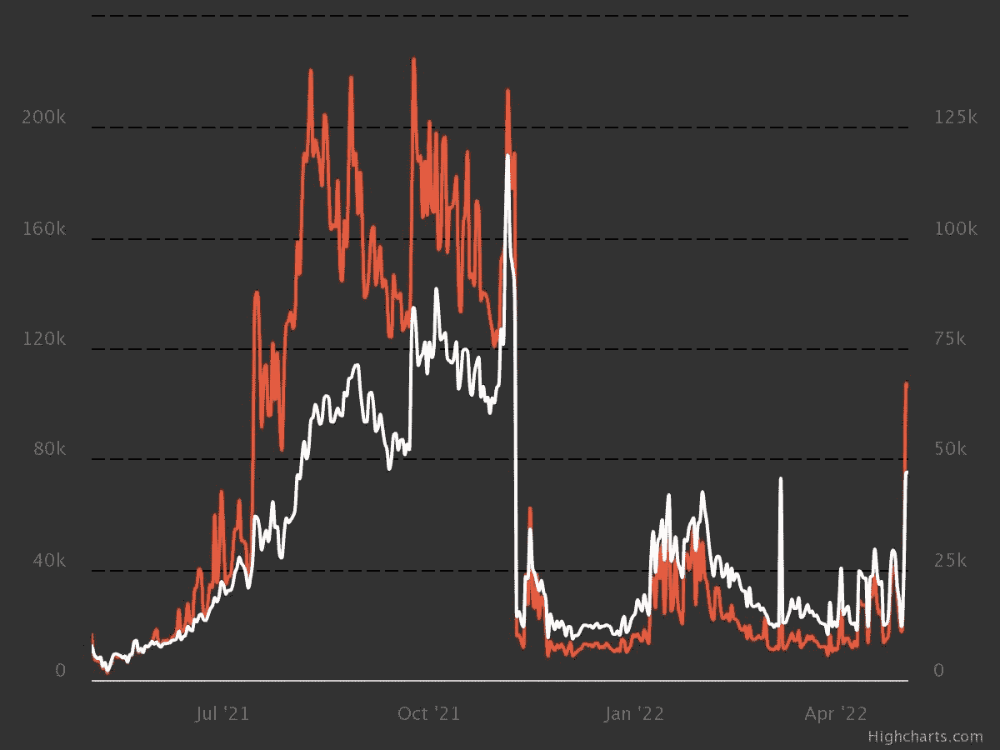
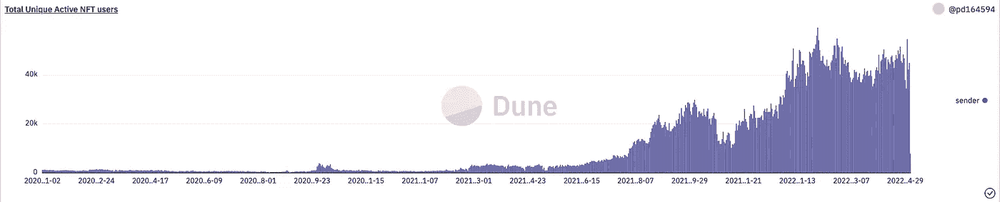
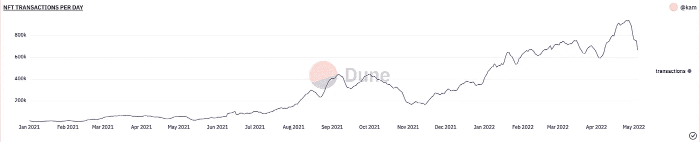
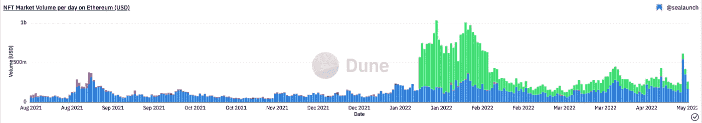

# 据《华尔街日报》报道，“NFT 市场正在崩溃。”然而，数据显示情况并非如此

> 原文：<https://medium.com/coinmonks/the-wall-street-journal-claims-that-the-nft-market-is-imploding-however-the-data-contradicts-7d0f9f22998b?source=collection_archive---------14----------------------->

**For full blog visit:-**[**https://bitcoinsupports.com/the-wall-street-journal-claims-that-the-nft-market-is-imploding-however-the-data-contradicts-this/**](https://bitcoinsupports.com/the-wall-street-journal-claims-that-the-nft-market-is-imploding-however-the-data-contradicts-this/)

《华尔街日报》的文章声称，不可替代的代币(NFT)市场正在“崩溃”,但这并没有说明全部情况，因为相反的数据显示，市场正在整合。就在同一周，仅排名前五位的藏品在一级和二级市场的销售额就超过 10 亿美元，《华尔街日报》的一篇报道称，不可替代代币(NFT)的销售额“持平”

根据 NFT 市场分析平台 Nonfungible 的数据，自 2021 年 9 月创下历史新高以来，NFT 的销售数量暴跌了 92%。自 2021 年 11 月的高点以来，以太坊(ETH) NFT 市场的钱包据称下降了 88%。该出版物总结道，“NFT 市场正在崩溃。”

**For full blog visit:-**[**https://bitcoinsupports.com/the-wall-street-journal-claims-that-the-nft-market-is-imploding-however-the-data-contradicts-this/**](https://bitcoinsupports.com/the-wall-street-journal-claims-that-the-nft-market-is-imploding-however-the-data-contradicts-this/)

另一方面，来自 Dune Analytics 仪表板的 Onchain 数据表明，NFT 市场仍然繁荣，统计数据表明，NFT 用户和交易量大大高于不可兑现的索赔。

**For full blog visit:-**[**https://bitcoinsupports.com/the-wall-street-journal-claims-that-the-nft-market-is-imploding-however-the-data-contradicts-this/**](https://bitcoinsupports.com/the-wall-street-journal-claims-that-the-nft-market-is-imploding-however-the-data-contradicts-this/)

NFT 活跃用户总数

**For full blog visit:-**[**https://bitcoinsupports.com/the-wall-street-journal-claims-that-the-nft-market-is-imploding-however-the-data-contradicts-this/**](https://bitcoinsupports.com/the-wall-street-journal-claims-that-the-nft-market-is-imploding-however-the-data-contradicts-this/)

Dune Analytics NFT 每日交易量
根据分析数据，以太坊 NFTs 上的美元日交易量是自 2 月份以来记录的最大交易量之一，仅 5 月 1 日一天，热门市场 OpenSea 就见证了约 5.5 亿美元的交易量。

**For full blog visit:-**[**https://bitcoinsupports.com/the-wall-street-journal-claims-that-the-nft-market-is-imploding-however-the-data-contradicts-this/**](https://bitcoinsupports.com/the-wall-street-journal-claims-that-the-nft-market-is-imploding-however-the-data-contradicts-this/)

风险投资公司蜻蜓资本的合伙人 Tom Schmidt 在研究 OpenSea 交易和美元交易量时，发现了类似的情况。

[https://twitter.com/tomhschmidt/status/1521506876260814849](https://twitter.com/tomhschmidt/status/1521506876260814849)

在 NFT 市场，子行业正在形成，尽管过饱和市场的某些部分正在经历衰退，但其他部分正在见证重大进步。南森的分析引擎按类别监测 NFT 收藏品，显示“蓝筹”NFT——知名且备受尊敬的品牌，如 Bored and Mutant Ape Yacht Club 和志那都红豆代币——远远超过艺术和游戏代币。追踪 NFT 十大项目的南森蓝筹 10 指数今年迄今上涨了 81%，而追踪顶级艺术和博彩 NFT 藏品的指数分别下跌了 39%和 49%。NFTstatistics.eth 在一份分析中强调了 NFT 市场资金集中于顶级藏品的模式，该网站在 4 月下旬发布了一份图表，展示了前五大藏品如何推动 NFT 以太坊市场。

【https://twitter.com/punk9059/status/1519019473121931264】一家化名的 NFT 市场分析机构 NFTstatistics.eth 告诉记者:“现在，有一个明显的模式，五六个最成功的项目表现强劲，而其余的项目则持平或下降。
不清楚为什么《华尔街日报》使用的不可伪造的数据与 Dune 的不同，尽管这可能是因为不可伪造的数据包含了 P2E gameAxie Infinity 的销售数据。

根据 CryptoSlam 的数据，2021 年 11 月 4 日，这种流行的即玩即赚游戏的交易量创下了超过 4000 万美元的历史新高，后来逐渐下降到今天的 50 万美元以下。然而，统计数据显示，P2E 游戏的受欢迎程度有所下降。“这是一个与‘非正规金融机构正在崩溃’截然不同的信息，”eth 解释道。

[https://twitter.com/punk9059/status/1521612825323458560](https://twitter.com/punk9059/status/1521612825323458560)

虽然目前的争论集中在以太坊非功能性金融资产上，但索拉纳正迅速成为这类资产的热门区块链，它是 NFT 销量仅次于以太坊的第二大区块链。索拉纳 NFT 项目 Okay Bears 上周首次超过 OpenSea 的 24 小时销售跟踪，目前在 CryptoSlam 上的 7 天销售额排名第四，仅次于突变体 Ape 游艇俱乐部，交易价值超过 4700 万美元。

**完整博客访问:-**[**https://bitcoinsupports . com/the-wall-street-journal-claims-that-the-the-NFT-market-is-implosing-but-the-data-understands-this/**](https://bitcoinsupports.com/the-wall-street-journal-claims-that-the-nft-market-is-imploding-however-the-data-contradicts-this/)

**免责声明:以上为作者观点，不应视为投资建议。读者应该自己做研究。**

> 加入 Coinmonks [电报频道](https://t.me/coincodecap)和 [Youtube 频道](https://www.youtube.com/c/coinmonks/videos)了解加密交易和投资

# 另外，阅读

*   [OKEx vs KuCoin](https://coincodecap.com/okex-kucoin) | [摄氏替代品](https://coincodecap.com/celsius-alternatives) | [如何购买 VeChain](https://coincodecap.com/buy-vechain)
*   [币安期货交易](https://coincodecap.com/binance-futures-trading)|[3 comas vs Mudrex vs eToro](https://coincodecap.com/mudrex-3commas-etoro)
*   [如何购买 Monero](https://coincodecap.com/buy-monero) | [IDEX 评论](https://coincodecap.com/idex-review) | [BitKan 交易机器人](https://coincodecap.com/bitkan-trading-bot)
*   [CoinDCX 评论](/coinmonks/coindcx-review-8444db3621a2) | [加密保证金交易交易所](https://coincodecap.com/crypto-margin-trading-exchanges)
*   [红狗赌场评论](https://coincodecap.com/red-dog-casino-review) | [Swyftx 评论](https://coincodecap.com/swyftx-review) | [CoinGate 评论](https://coincodecap.com/coingate-review)