# 美元的“武器化”

> 原文：<https://medium.com/coinmonks/the-weaponization-of-the-dollar-7adf9348e237?source=collection_archive---------20----------------------->

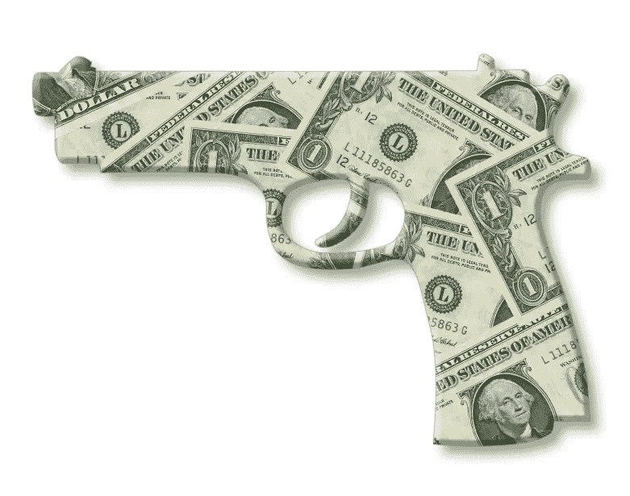

在一个由最新消息主导的世界叙事中，战争的阴影笼罩着欧洲这个古老的主权大陆。俄罗斯每天都有冲突和人口流离失所的报道，西方阵线也采取强硬立场，通过经济制裁惩罚俄罗斯，但制裁进展缓慢，而且稳步削弱了俄罗斯经济

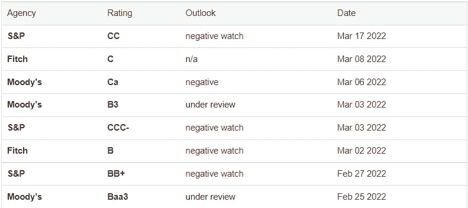

**杰出的金融分析师 T4·林恩·奥尔登(Lyn Alden)**在最新的时事通讯中写道:

> “面对与全球大流行相关的疫情对高度杠杆化的全球经济的冲击，我们采取了大规模的全球财政应对措施，但不幸的是，我们现在可以同时挑起动态战争，然后在此背景下爆发第二场金融/地缘政治战争，出现主权储备冻结、全球制裁、地缘政治联盟更迭等情况。**世界在许多方面正变得分叉或多极化。**

更严峻的现实是，货币政策的措辞已经从“军国主义”变成了“美元武器化”，在全球舞台上引发了巨大争议。

# 过热的市场

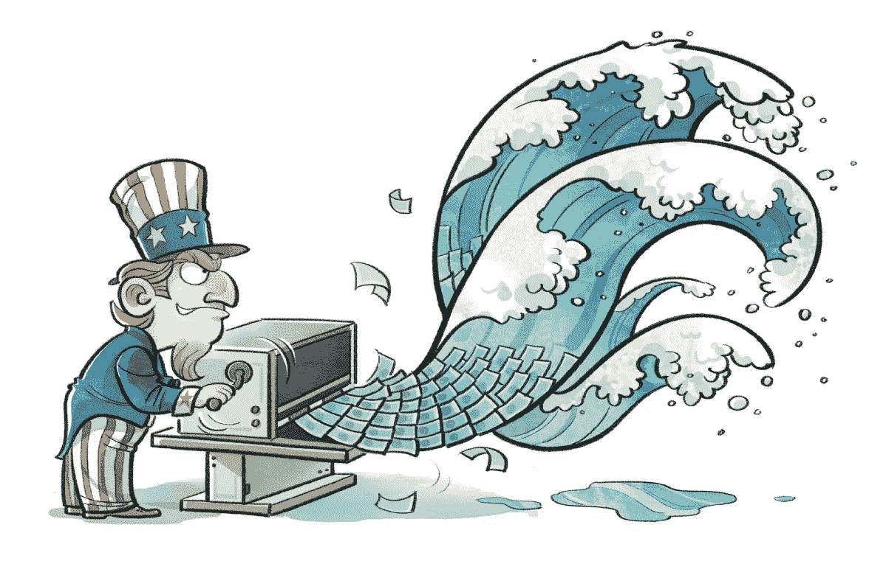

让几家俄罗斯银行退出 SWIFT 金融信息系统并对俄罗斯央行实施制裁的决定在公众中很受欢迎，但在华尔街引发了担忧。

 [## 这是被 SWIFT 禁止的 7 家俄罗斯银行——其中两家获得了豁免

### 随着乌克兰战争的激烈，欧盟已经正式公布了将被驱逐的俄罗斯银行名单……

www.euronews.com](https://www.euronews.com/my-europe/2022/03/02/these-are-the-7-russian-banks-banned-from-swift-and-the-two-exempted) 

对俄罗斯商品出口的进一步制裁可能扰乱全球市场，进一步加剧通胀。近几个月，俄罗斯的食品和能源价格飙升，原因就在这里——我们看到，油价、小麦和矿产(最著名的是镍)的价格已经开始飙升。
这项决定对新兴和发展中国家潜在的不稳定影响无法排除。

在这种情况下，美元的核心地位将在多条战线上受到攻击:上述投资者和市场的担忧(在 ***中定价的*不稳定**** 和*以及* ***的冲突一方面进一步升级****，而另一方面仍面临着似乎已经重新浮出水面的疫情造成的供应链冲击*

** [## 随着病毒在上海和十几个省份肆虐，封锁在中国蔓延。

### 北京-上海市中心的电影院、剧院和博物馆已经关闭，门票已经退款。浩瀚的…

www.nytimes.com](https://www.nytimes.com/2022/03/11/world/asia/china-covid-shanghai.html) 

疫情危机带来的痛苦，引发了人们对以美元为中心的全球货币秩序的担忧。

美联储资产负债表的急剧扩张和公共债务水平的爆炸性增长，导致一些人担心未来几年货币政策可能会在财政上占据主导地位。

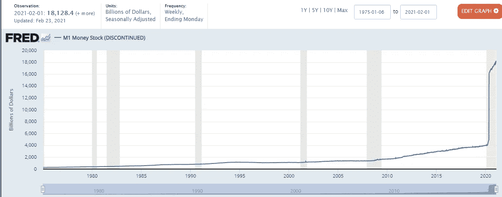

The dramatic increase in “M1 money” (money printed by the U.S. Federal Reserve ) — following both 2008 Financial Crisis and 2020 Covid-19 Pandemic response.

## 问题是，当政府印更多的钱时，它降低了我们美元的价值，因为现在有更多的美元在流通——T2 通货膨胀 101。

此外，随着刺激推动的支出模式从服务转向商品，美国在过去几年中对中国出现了相当大的贸易逆差。

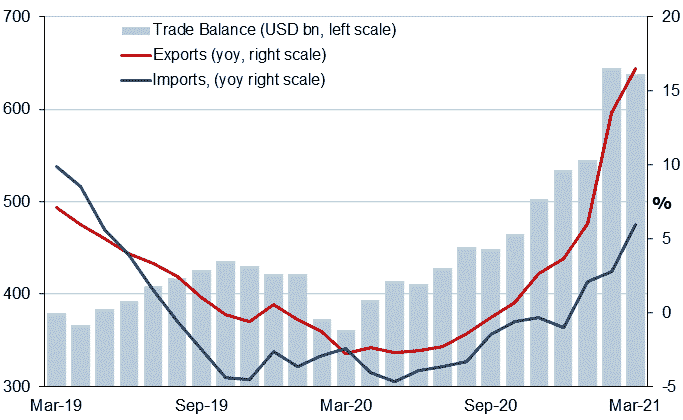

**Source:** General Administration of Customs of the People’s Republic of China and Focus Economics calculations

现在，美国面临着中俄建立经济和战略伙伴关系的具体可能性，可能会进入一个新的阶段，涉及在多个领域争夺全球影响力的地缘政治竞赛。中国一直公开表示，它长期以来一直希望取代二战后以美元为中心的全球货币秩序。鉴于最近的地缘政治发展，人民币国际化日程可能会重新获得动力。** 

# **用石油元体系取代石油美元？**

**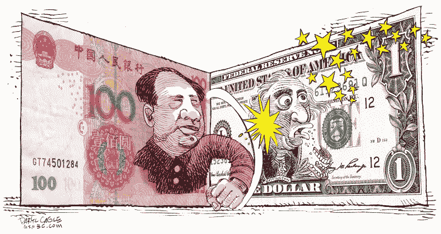**

**中国一直在积极推动建立数字人民币和创建替代支付系统，这是推翻美元霸权计划的一部分。
随着大规模的“一带一路”倡议(BRI)，中国正在加速扩大人民币的国际接受度和使用。
早在 2020 年，鉴于地缘政治紧张局势已经加剧，中国和俄罗斯同意放弃美元用于双边贸易结算。**

**[https://Asia . Nikkei . com/Politics/International-relations/China-and-Russia-diuge-dollar in-move-to-financial-alliance](https://asia.nikkei.com/Politics/International-relations/China-and-Russia-ditch-dollar-in-move-toward-financial-alliance)**

**但是真正改变游戏规则的事情发生在几周前。**

**据全球媒体报道，中国正积极与沙特阿拉伯就用人民币结算部分石油销售价格进行谈判。**

**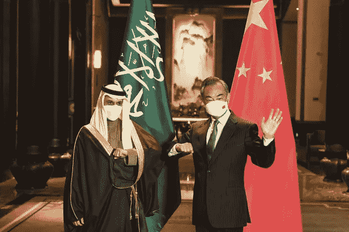**

**Saudi Foreign Minister Faisal bin Farhan & Chinese Foreign Minister Wang Yi**

**这一行动自 2016 年**以来一直在双方之间无休止的断断续续的一系列会谈中进行，似乎已经具体化(或至少加速)，因为沙特人对华盛顿政治和数十年来保卫王国的承诺感到不满，特别是指责美国在也门地区缺乏支持，以及穆罕默德·本·萨勒曼(Mohammed bin Salman)对去年美国军队意外从阿富汗迅速撤出感到震惊。****

** [## 乌克兰危机期间，沙特和阿联酋领导人拒绝与拜登通话

### 白宫试图安排拜登总统和沙特阿拉伯实际领导人之间的通话，但没有成功…

www.wsj.com](https://www.wsj.com/articles/saudi-emirati-leaders-decline-calls-with-biden-during-ukraine-crisis-11646779430?mod=article_inline)** 

# **龙的巨大市场**

**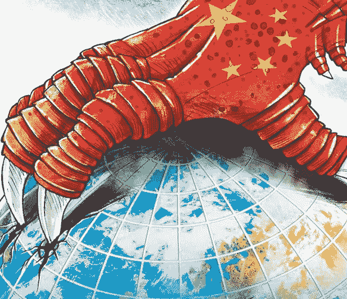**

**不可否认，中国是一个巨大的市场，占沙特阿拉伯石油出口的 25%以上。**

**如果以人民币计价，这些销售额将提升人民币的地位。**

**沙特还在考虑将人民币计价的期货合约，即所谓的“ **petroyuan** ，纳入沙特阿拉伯石油公司(Aramco)的定价模式。**

** [## 沙特阿拉伯考虑接受中国石油销售用人民币代替美元

### 知情人士称，沙特阿拉伯正与北京方面积极谈判，以人民币结算对华石油销售

www.wsj.com](https://www.wsj.com/articles/saudi-arabia-considers-accepting-yuan-instead-of-dollars-for-chinese-oil-sales-11647351541) 

对沙特阿拉伯来说，用美元以外的任何货币来为其每天大约 620 万桶的原油出口定价将是一个深刻的转变。全球石油销售的大部分——大约 80%**——是以**美元**完成的，而沙特自 1974 年**起就完全以美元进行石油交易**，这是与尼克松政府达成的一项协议，其中包括对沙特王国的安全保证。**

** [## 美元的故事:从开始到统治，以及他的潜在下降

### 第 1 部分-从布雷顿森林到尼克松冲击:货币霸权现在面临最终压力测试。

medium.com](/the-capital/the-u-s-dollar-tale-from-inception-to-domination-and-his-potential-fall-2d5548757260) 

一个值得注意的方面是，这条龙从未停止移动:
尽管盘旋在离地球更近的地方，但它能够不受干扰地追求他对国家进行完全经济控制的目标，因为**一带&道路倡议(BRI)** -一个巨大的全球基础设施建设网络，具有深刻的地缘政治观点，旨在恢复古代丝绸之路的荣耀 **:**

 [## 报告称，中国欠下 3850 亿美元——包括来自贫穷国家的“隐性债务”

### 研究人员已经确定了 165 个国家欠中国的至少 3850 亿美元(2860 亿英镑)债务，用于“一带一路…

www.theguardian.com](https://www.theguardian.com/world/2021/sep/30/42-nations-owe-china-hidden-debts-exceeding-10-of-gdp-says-report) 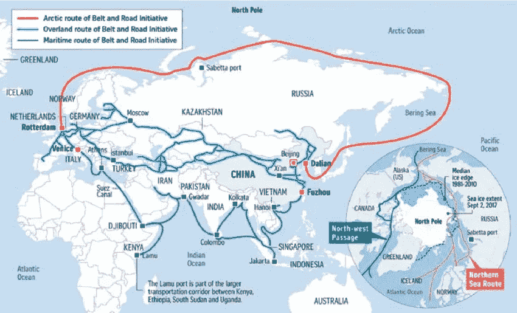

沙特也未能幸免于龙的靶心:在过去的几年里，中国帮助沙特建造了自己的 T21 弹道导弹

 [## 沙特在中国的帮助下开始制造弹道导弹

### The effort is the latest in a series of moves by U.S. allies in the Middle East to increase military cooperation with…

www.wsj.com](https://www.wsj.com/articles/saudis-begin-making-ballistic-missiles-with-chinese-help-11640294886?mod=article_inline) 

***and*** investing heavily in *Mohammed bin Salman*’s projects, such as “[**NEOM**](https://www.neom.com/en-us)” — a futuristic city worth more than **$500 billion** to build an **high-tech city** from scratch in the middle of the desert.

 [## Car-free and zero emissions - welcome to Saudi Arabia's new sustainable city

### A gathering of stars, businesspeople and dignitaries from Baroness Helena Morrissey to adventurer Bear Grylls…

www.standard.co.uk](https://www.standard.co.uk/insider/neom-saudi-arabia-new-city-sustainable-zero-emissions-b969617.html) 

The move to a potential “**petroyuan**” comes in contrast to the diminishing U.S. reliance on Saudi *black gold*: **the U.S. is now among the top oil producers in the world.** It once imported *2 million barrels* of Saudi crude a day in the early *1990s* but those numbers have fallen to less than *500,000 barrels* a day in December *2021*, according to the U.S. Energy Information Administration.

 [## U.S. Energy Information Administration (EIA)

### In 2021, the United States imported about 8.47 million barrels per day (b/d) of petroleum from 73 countries. includes…

www.eia.gov](https://www.eia.gov/tools/faqs/faq.php?id=727&t=6) 

As the U.S. & Saudis financial relationship change, China might take the chance to establish itself as the bin Salman’s major trading partner, while Chairman Xi internal reforms and establishment of the digital yuan might open the Chinese market to foreign investors, still put off by the dual-circulation economy system of the country.

 [## China's "dual-circulation" strategy means relying less on foreigners

### A T THE HEADQUARTERS of Deli, one of China's biggest makers of glassware, display shelves hold hundreds of drinking…

www.economist.com](https://www.economist.com/china/2020/11/05/chinas-dual-circulation-strategy-means-relying-less-on-foreigners) 

From an American perspective, there is still the hope that Chinese leader **Xi Jinping**’s increasingly inward-looking policies may limit the attractiveness of Chinese currency and assets, and slowdown the pace of renminbi internationalization. Any genuine moves to increase the global acceptance of the renminbi/digital yuan will require China to fully open its capital markets to foreigners.

*But such a step may not be in accordance with Xi’s* ***dual-circulation economic strategy****.*

 [## What is China's dual circulation economic strategy and why is it important?

### China's traditional emphasis on growth through exports is being bolstered by a renewed focus on spurring domestic…

www.scmp.com](https://www.scmp.com/economy/china-economy/article/3110184/what-chinas-dual-circulation-economic-strategy-and-why-it) 

# HOLDING FIRMLY THE FIRST PLACE… STILL

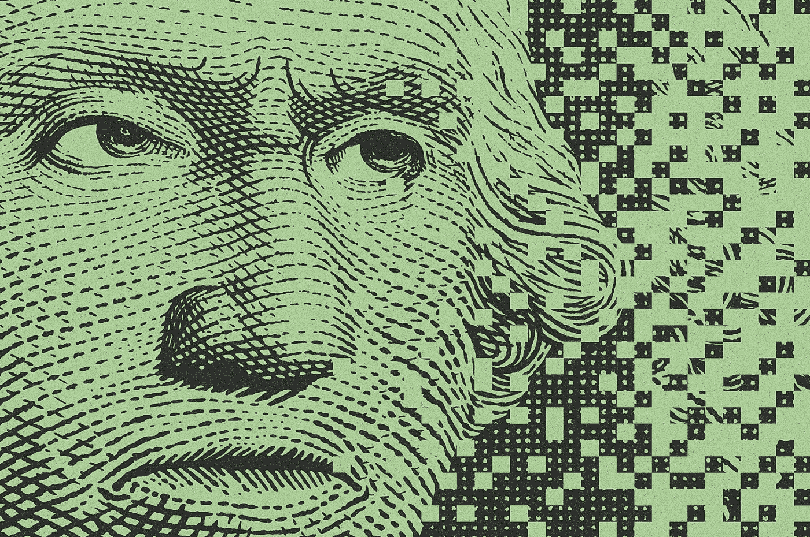

底线是美元仍然遥遥领先，接下来是欧元、日元和英镑。目前，T2 47%的全球支付以美元结算，而 T4 31%的支付以欧元结算。此外， **88%的外汇交易涉及美元，**几乎是**欧元份额(32%)** 的三倍。各国央行持有 62%的美元储备，相比之下只有 20%的欧元储备。

在贸易和金融中，美元在其他货币使用指标上也占据主导地位。

对于中国来说，人民币在外汇市场的成交额仍然排在第八位。但是在 8 月，它在 SWIFT 支付中上升到第五位，并且在中央银行外汇储备中超越加拿大元和澳大利亚元，排名第五。

尽管美元在外汇储备和交易中的份额已经减少，但这一趋势是缓慢而渐进的——但它仍然是全球最适合储备货币的选择，特别是在新兴市场。

 [## 美元仍然是不可战胜的储备之王

### 路透纽约---官方对美元的稳定需求可能会消除美元在 2007 年的一个悲哀来源，并…

www.reuters.com](https://www.reuters.com/article/us-usa-forex-reserves-idUSN1019148720070111) 

# 未来与领导:新世界秩序的开始？

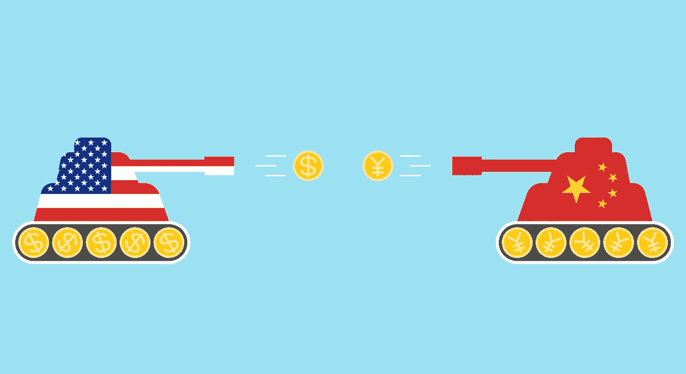

鉴于中俄联盟的出现，考虑到中国作为一个经济和军事大国的持续崛起，我们不能低估美元全球地位的未来风险。随着我们进入一个地缘政治竞争的新时代，加强美国与新兴大国(如印度和巴西)的联盟，并与非洲大陆建立更密切的关系，对西方来说至关重要。

## 但是说起来容易做起来难…尤其是涉及到国家和政治家合作的时候…

我们正在目睹的是对美元作为国际贸易共同标准的信任的侵蚀。
这种工具的武器化导致许多国家，其中许多是华盛顿的历史盟友*，**质疑美元及其作为美国追求其政治目标的胁迫手段和杠杆工具的作用。***

> *当你公开表示，你的美元将被没收，或者你无法转移美元时，你告诉世界其他国家的基本意思是，在他们的投资组合中拥抱其他货币，大幅降低美元作为世界货币的价值。*

# *基于商品的世界秩序？*

*国家、中央银行和私人想要保护他们的购买力。*

*如果某种特定类型的外汇储备(*元*)可以瞬间冻结，央行就不会持有。句号。如果围绕一种特定货币展开的经济制裁造成严重后果，人民和国家将竭尽全力避免接触这种货币。*

*然而，他们不需要寻找太多可靠的财富来源*

## *回顾过去会给我们答案:一种商品支持的货币。*

*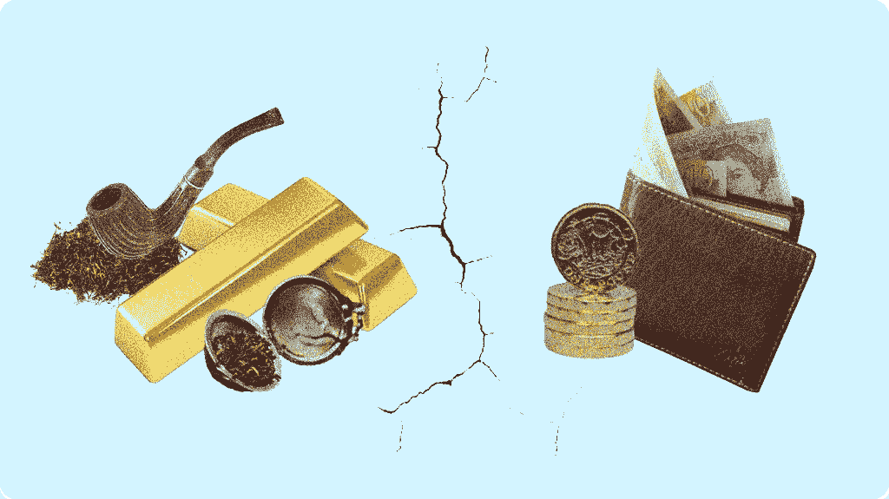*

*可以冻结的法定货币中的不信任将把我们带到一条新的商品世界秩序的道路上，这在许多方面将像我们只能在历史书上读到的古代时代一样——那个时代拥有实物资产是积累财富的唯一途径。*

*这使得全球金融体系进入了未知的领域，因此我们看到了市场的巨大波动，因为在这个过渡时期，没有人知道这个体系将走向何方。*

*尽管我不认为银行已经准备好抛弃美元，这整个不确定性已经并将很可能不仅伤害美国人，而且以一种深刻的、不可逆转的方式伤害整个国家。*

*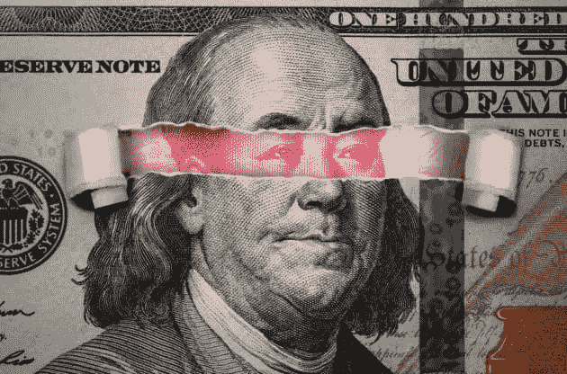*

**更新&最新消息和分析—关注我的* ***推特*** *@FilandroMi**

> *额外资源:*

*   *一带一路与太平洋国家面临的巨大金融压力:
    [https://www . lowyinstitute . org/publications/ocean-debt-belt-and-Road-and-debt-diplomacy-Pacific](https://www.lowyinstitute.org/publications/ocean-debt-belt-and-road-and-debt-diplomacy-pacific)*
*   *参与“一带一路”倡议的国家名单(BRI):
    [https://en . Wikipedia . org/wiki/List _ of _ projects _ of _ the _ Belt _ and _ Road _ Initiative](https://en.wikipedia.org/wiki/List_of_projects_of_the_Belt_and_Road_Initiative)*
*   *深度 BRI:
    [https://www . lowyinstitute . org/publications/understanding-belt-and-road-initiative](https://www.lowyinstitute.org/publications/understanding-belt-and-road-initiative)*
*   *全球化结束了吗？
    [https://medium . com/coin monks/the-turning-tide-for-globalization-4 da 1 fc 591 ea 9](/coinmonks/the-turning-tide-for-globalization-4da1fc591ea9)*
*   *石油美元体系:对过去 50 年金融体系的简要分析:
    [https://medium . com/the-capital/the-rise-and-fall-of-the-the-petro dollar-is-the-international-financial-system-dummy-493 a4 FB 8 c 726](/the-capital/the-rise-and-fall-of-the-petrodollar-is-the-international-financial-system-doomed-493a4fb8c726)*
*   *通货膨胀和印钞:法定货币体系的黑暗面:
    [https://medium . com/the-capital/the-spectre-of-inflation-770 F9 ef 8369d](/the-capital/the-spectre-of-inflation-770f9ef8369d)*
*   *利恩奥尔登网站&访问简讯:
    [https://www.lynalden.com/](https://www.lynalden.com/)*
*   *通货膨胀:财富的头号敌人:
    [https://medium . com/the-capital/the-spectre-of-inflation-770 F9 ef 8369d](/the-capital/the-spectre-of-inflation-770f9ef8369d)*

> *加入 Coinmonks [电报频道](https://t.me/coincodecap)和 [Youtube 频道](https://www.youtube.com/c/coinmonks/videos)了解加密交易和投资*

# *另外，阅读*

*   *[3 商业评论](/coinmonks/3commas-review-an-excellent-crypto-trading-bot-2020-1313a58bec92) | [Pionex 评论](https://coincodecap.com/pionex-review-exchange-with-crypto-trading-bot) | [Coinrule 评论](/coinmonks/coinrule-review-2021-a-beginner-friendly-crypto-trading-bot-daf0504848ba)*
*   *[莱杰 vs n rave](/coinmonks/ledger-vs-ngrave-zero-7e40f0c1d694)|[莱杰 nano s vs x](/coinmonks/ledger-nano-s-vs-x-battery-hardware-price-storage-59a6663fe3b0) | [币安评论](/coinmonks/binance-review-ee10d3bf3b6e)*
*   *[Bybit Exchange 审查](/coinmonks/bybit-exchange-review-dbd570019b71) | [Bityard 审查](https://coincodecap.com/bityard-reivew) | [Jet-Bot 审查](https://coincodecap.com/jet-bot-review)*
*   *[3 commas vs crypto hopper](/coinmonks/3commas-vs-pionex-vs-cryptohopper-best-crypto-bot-6a98d2baa203)|[赚取加密利息](/coinmonks/earn-crypto-interest-b10b810fdda3)*
*   *最好的比特币[硬件钱包](/coinmonks/hardware-wallets-dfa1211730c6) | [BitBox02 回顾](/coinmonks/bitbox02-review-your-swiss-bitcoin-hardware-wallet-c36c88fff29)*****