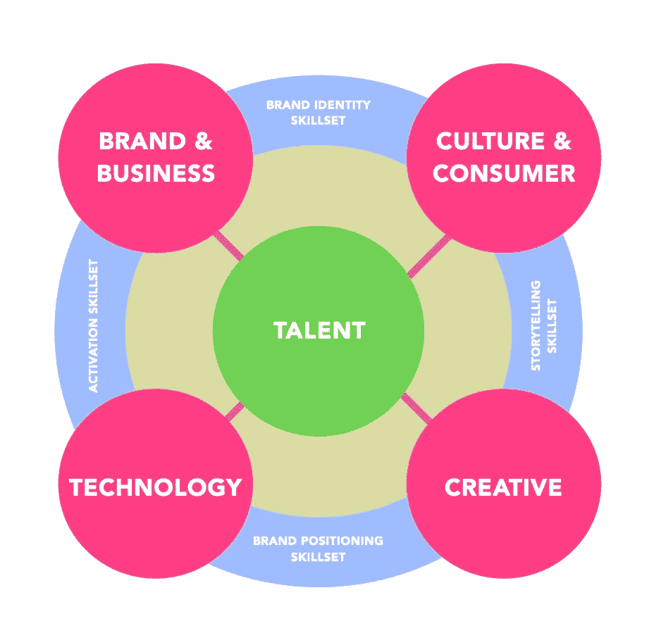

# web3 人才缺口

> 原文：<https://medium.com/coinmonks/the-web3-talent-gap-dac3392eadc9?source=collection_archive---------11----------------------->

NMGI 如果找不到合适的人

寻找合适的 Web3 人才——并知道“合适”意味着什么以及如何操作它——是一项战略性和创造性的工作。最近，围绕时尚行业的人才问题，出现了一些全球性的对话(见[这里](https://www.businessoffashion.com/opinions/sustainability/op-ed-li-edelkoorts-antidote-to-fashions-speed-and-greed/)和[这里](https://www.businessoffashion.com/articles/workplace-talent/the-state-of-fashion-2022-bof-mckinsey-talent-strategy-recruitment-retention-employee-culture/)和[这里](https://www.youtube.com/watch?v=5y4WBl49sg0&list=LLz-F96DS7h6EDjG8yvdYnZQ&index=1&t=187s))。

这些对话被时尚领域的明显转变所摒弃，在这个领域，竞争优势是…