# 整体大于部分之和——近协议基础分析

> 原文：<https://medium.com/coinmonks/the-whole-is-greater-than-the-sum-of-its-shards-near-protocol-fundamental-analysis-700d15bbda8b?source=collection_archive---------8----------------------->

这份基本面分析是 Crypto Consulting Institute 的付费时事通讯的一部分，提供市场洞察、可行的交易信号和基本面分析。更多信息请访问:【https://www.cryptoconsultinginstitute.com/newsletter 

如果你曾经在乡村生活过，你会同意没有汽车出行的想法是不可行的。不仅仅是因为在一个乡村小镇通勤的固有的长距离，而是缺乏公共交通基础设施。然而，农村地区的人均燃料消耗量可能更高。

很多公交车都是经过偏僻的地方，但是它们的频率往往不方便。当你乘坐这些公共汽车时，你可以清楚地看到为什么调度不频繁，因为公共汽车的载客量通常只有一半得到利用。

出租车是一种昂贵的出行方式，因为到达目的地的距离很远。

所有这些通勤选择的问题是旅行所需的燃料消耗。就消耗大量燃料的公共汽车而言，通勤者的数量往往不足以支付长途旅行所需的燃料费用。

然而，当我们发现自己处于城市环境中时，情况正好相反。

拥有一辆汽车是不可行的。不仅仅是因为交通堵塞，还因为这不是最划算的出行方式。在城市环境中，超市、娱乐场所或工作场所等基本资源可能就在附近，甚至是合理的步行距离。几乎不需要一辆车来进行你的日常活动。

由于需求，一些路线将每 15 分钟就有一辆公交车通过，而不是等待几个小时才能下一辆公交车。即使是这样的频率，这些公交车也经常超载。长期以来，火车一直是一种可行的旅行选择，但它似乎经常处于饱和或超负荷状态。考虑到通勤者的数量，频繁运行的公共汽车和火车的资源消耗是适当的。

大多数继续与区块链三难困境斗争的第一层区块链(被多个 fa 覆盖)类似于一个乡村小镇。这个类比听起来特别真实，取决于你的利益相关者阶层。以太坊需要耗费大量资源，花费的时间也比其他网络要长。矿商(或接受政府补贴的公交公司)是这种安排的主要受益者。

在以太坊上，你可以自己开车(简单交易)、打车(复杂智能合约)或者等车(批量交易；L2 乐观上篮，见[梅蒂斯 FA](/coinmonks/metis-the-future-of-decentralized-human-organizations-199a32d97ab9) 。

在偏僻的地方等车可能会花你更长的时间，但比打车划算。在一个繁忙的城市，公共交通选择的供应可以满足需求，以保持价格合理。

然而，当需求超过基础设施的容量时，不管是城市还是以太坊，就会出现系统阻塞。

就像如果系统认识到需求，它可能会增加可用总线的数量，分片涉及一个能够并行处理、存储和状态转换的分片系统。该网络可以合并或创建新的片段，以满足不断增长的需求。

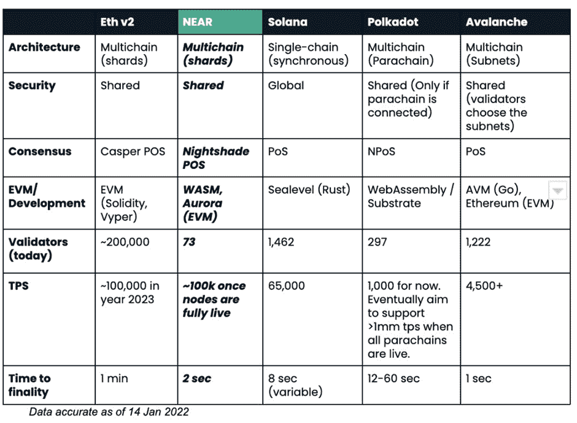

Near Protocol 致力于成为第 1 层区块链，能够通过动态分片扩展其底层基础设施。一个可以复合基础设施层的城市可能需要升级到双层巴士，安装高架铁路，或多个地下通勤层(Elon 的想法)，这可以扩展底层基础设施以满足需求。分片是解决区块链困境的可行方案。已经有了实现它的尝试，其中一些正在 ETH 2.0 的开发中。

但是，即使是一个城市也有其道路上可以容纳多少辆公交车的限制。然而，在区块链技术的非物理领域，存储和吞吐量是相关的空间维度。如果接近实现他们设定的目标，他们可能会实现无限的可伸缩性。

在这个基础分析中，我们将讨论分片以及它如何解决可伸缩性问题，Near 是什么，他们面临的挑战，并讨论项目的含义和可能的未来。

# 关键摘要—您在 TLDR 的收获

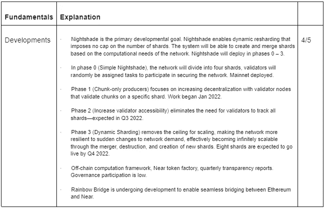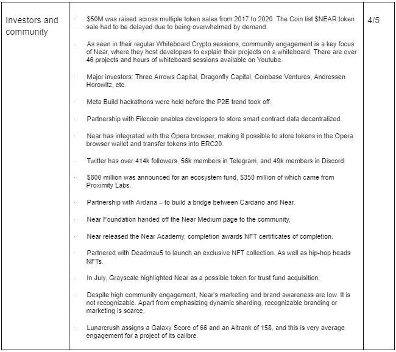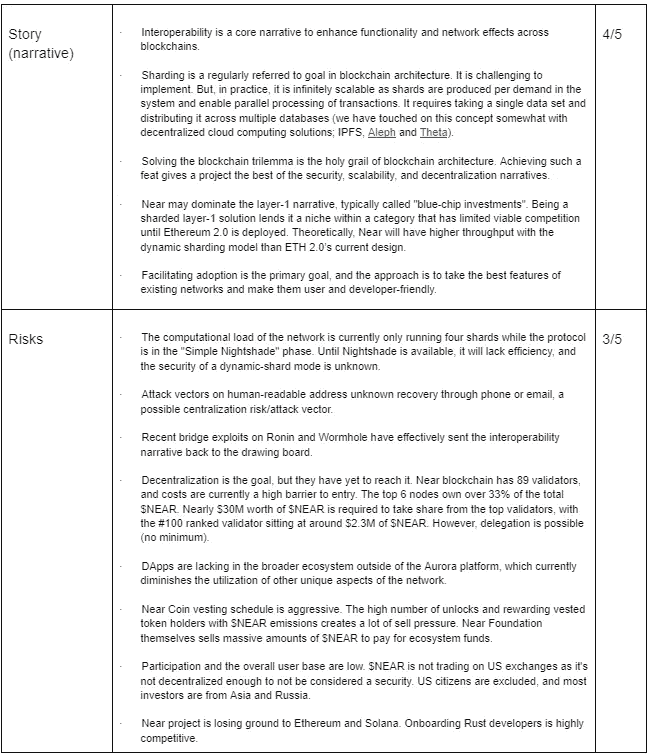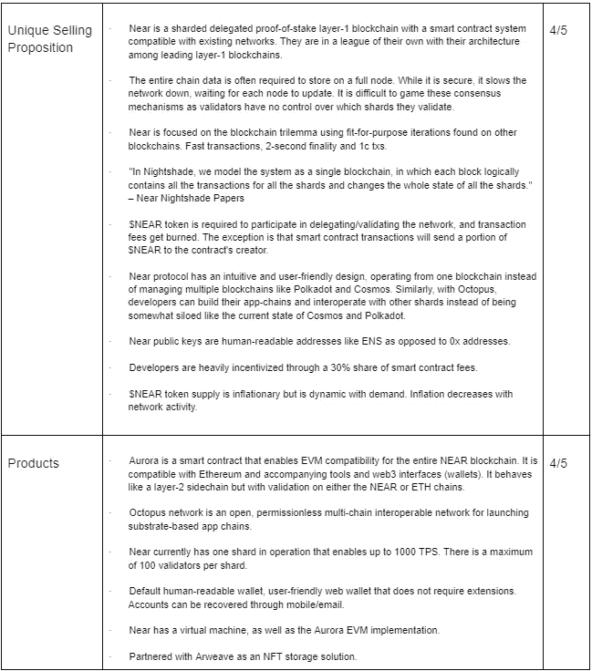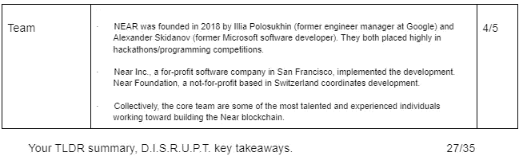

# 从不$近或远

就复杂性而言，Near 协议无疑在技术难度等级上排名很高。他们的白皮书和文档有数百页详细解释他们产品的信息。正在发生的大量发展足以令人震惊。2022 年对 Near 来说将是重要的一年。但是在最高级别，Near 将其价值主张分为四个关键领域，技术、治理、经济和原语。

Near 技术的四个关键要素是分片、共识、赌注选择和博弈论以及随机性。

一辆公共汽车不可能同时服务于城市中的所有地区，如果他们随意开车，就会造成混乱。他们遵循指定的路线，将资源集中在高需求领域，这涉及某种程度的需求监测和相应的资源分配。

当完全实现时，Nightshade(另一个白皮书)将使 shards 能够处理大量的事务，并随机分配验证器节点的任务。为了运行一个可扩展的公共汽车网络，我们有公共汽车司机、机械师、后勤人员和经理。Near 上的 shard 可以执行验证区块链上的块的所有角色，但是会被随机分配执行计算、存储、验证、渔夫或隐藏的验证器角色。

动态再分片包括创建、合并或删除分片，以满足网络需求。与受物理尺寸限制的城市不同，碎片的利用是抽象的。网络可以通过在验证过程中将它的努力指向一个特定的任务来有效地重新分配计算需求。没有一个碎片应该处理一个事务的所有元素。

这种随机化是至关重要的，因为它使得坏人几乎不可能破坏系统。如果他们不知道自己将扮演什么角色，他们就不太可能协调攻击系统中的漏洞来利用网络。渔夫和隐藏验证器节点使得腐蚀附近的区块链对恶意行为者来说更具挑战性。

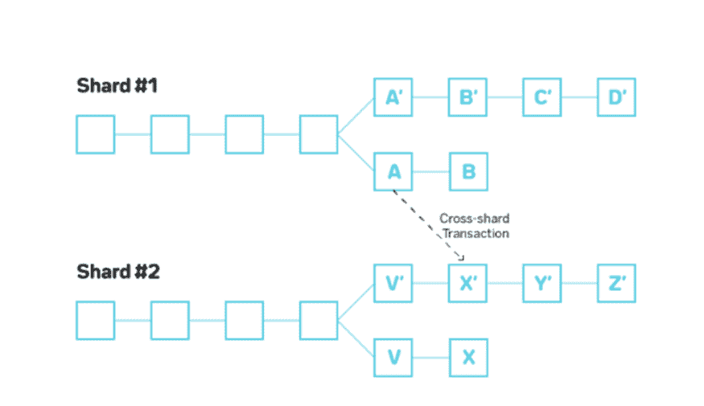

分片对于实现互操作性也有一个有趣的效果。在这一点上，值得一提的是[宇宙](/coinmonks/out-of-this-world-cosmos-atom-fundamental-analysis-b7aeb65583f)和[波尔卡多特](/coinmonks/connecting-the-dots-polkadot-fundamental-analysis-3de57af8164c)，我们在之前的 FAs 中已经探索过了。

Near 的动态重散列模型有效地支持每个碎片作为特定于应用程序的区块链运行。与区域和副链不同，它们是各自生态系统中的独立实体，每个碎片都以并行处理的方式运行，像 Aurora 这样的智能合约部署打开了 EVM 兼容性的大门。从技术角度来看，在非 EVM 第 1 层上通过智能合约部署实现 EVM 兼容性令人印象深刻。

因为 Near 是用 Rust 和 Web Assembly 编码的，所以在像 [Solana](/@justmy2satoshis/fundamentals-of-solana-summer-crypto-consulting-institute-in-depth-fa-2e2637ba5685) 和 [Terra](/@justmy2satoshis/goodbye-moonman-hello-luna-an-in-depth-fundamental-analysis-on-terra-883eb3c1111b) 这样的非 EVM 环境中有互操作性的空间。Near 架构使其成为一项重要的可互操作技术，再加上用户友好的界面，如集成到 Opera 浏览器中的钱包。如果新参与者能够创造钱包，他们的进入门槛就很低。

不得不在浏览器上修改元掩码或钱包扩展可能会变得棘手，尤其是当您必须使用多组私钥时。Near 使用户能够确定可读地址(ENS ),并可以通过手机或电子邮件恢复帐户。

这种恢复方法可能会带来集中化风险，并且需要更加明确如何保存用户数据。如果以分散的方式存储，这对于参与者来说是理想的，但是如果存储在集中的服务器中，确实存在可能导致用户数据丢失的集中风险。

围绕集中化风险的问题不仅限于公共地址，还涉及验证者级别的问题。尽管验证器任务是随机的，但要成为顶级验证器节点，大约需要 3000 万美元。随着越来越多的碎片在网络中并发运行，这可能是一个无声的考虑，因为随着需求和碎片创建，验证网络的机会越来越多。

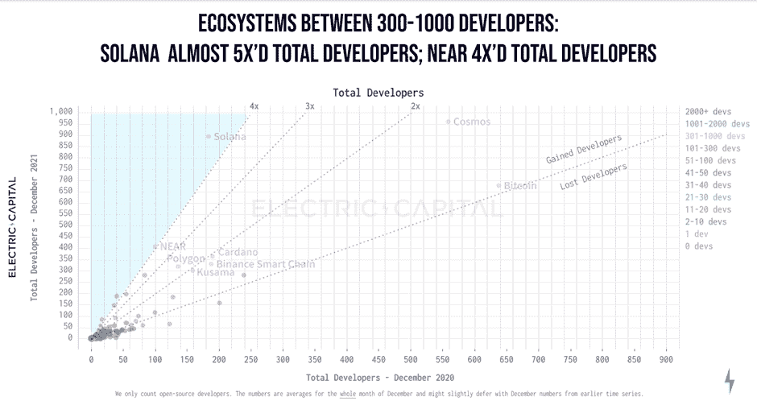

然而，Near 也面临 Rust 开发者的激烈竞争。尽管 Near 的开发人员数量增长了 4 倍，但他们在 Rust 开发人员方面仍被 Solana 和 Polkadot 超越，尽管他们仍保持着很强的竞争力。Near 上的开发者不仅拥有 8 亿美元的生态系统基金，还能从智能合约互动产生的所有交易费用中分得一杯羹。

区块链一些最优秀的人才正努力在基础设施附近建造复杂的建筑，因为它目前处于简单的龙葵项目的第 0 阶段。

此外，根据 Awesomenear 的说法，目前有 518 个策划项目正在基于 near 协议进行建设。Aurora 是最重要的部署，它支持在 Near 上部署的智能合约，支持 EVM 兼容性。有几个 dapp 需要关注，比如 Octopus Network(App-chain deployment)、Meta Pool (liquid staking)、Aurigami 和 Burrow (borrow and lend)。但是，也许最重要的即将到来的 DApp 部署是近美元的算法稳定币或美元。

$USN 寻求与 Terra Luna 的$UST stablecoin 竞争。几乎没有迹象表明铸币税/通胀的确切机制。普遍的假设是，这将非常类似于$UST，因为他们声称 20%的 APY 是可行的。但这一消息引发了近美元和远美元的价格波动，高收益稳定债券是一种理想的投资组合，尤其是在下跌趋势的市场中。

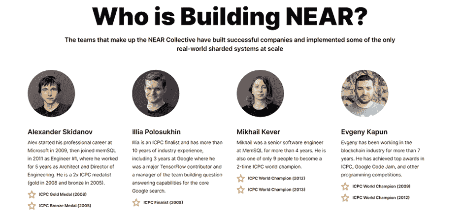

Near 的一个显著优势是他们在白板加密系列中与创始人的高度互动，他们邀请关键人物在白板上解释他们的产品。该系列对于喜欢复杂技术的人来说极具吸引力。尽管如此，它也为 Near 在其构建上的发现过程提供了一个功能，因为他们已经公开声明，他们寻求将项目的最佳部分模仿到他们的区块链上。

# 接近网络效应:令牌组学

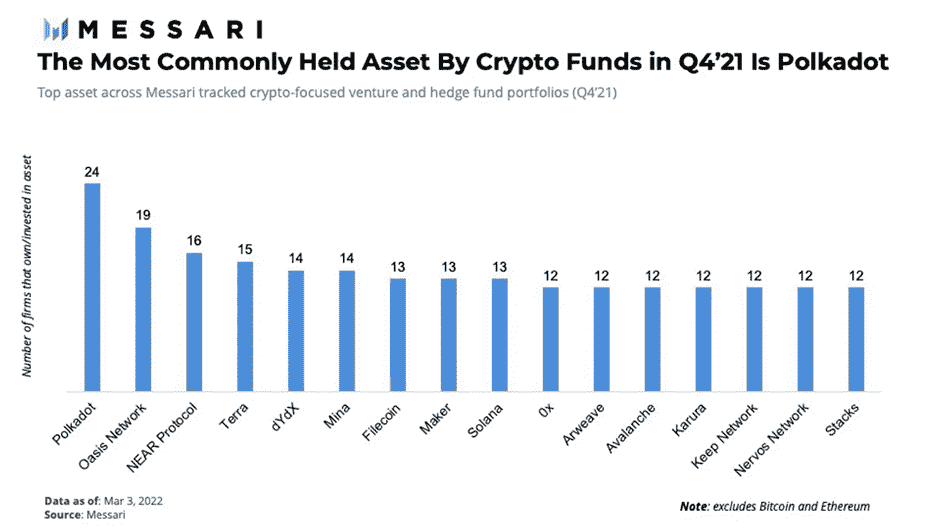

$近似使用案例:

验证者/委托者锁定

交易费用

数据存储费

记算单位

$接近令牌组学和分配(截至 2012 年 4 月 25 日)

最大供应量(在 Genesis，无上限):10 亿

流通供应量:679412414

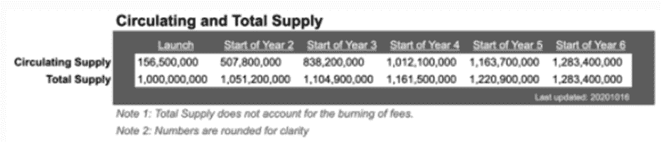

市值:9782459919 美元

价格:14.40 美元

最大值 TPS: 100，000(预计)

交易成本:

阻塞时间:1 秒

终结:< 10 秒

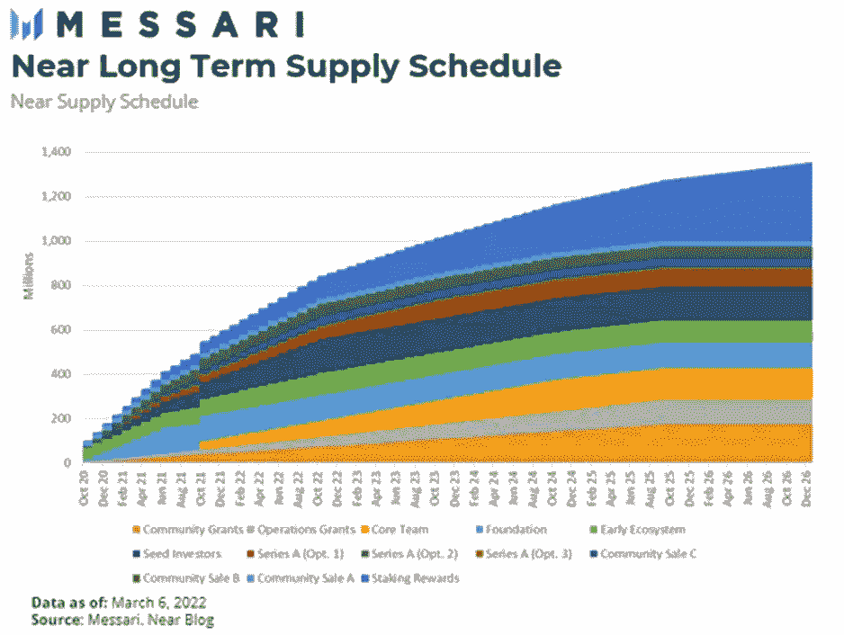

$NEAR 的授权时间表在短期内是逐步的，但随着时间的推移，剩余排放量会逐渐减少。既得代币将一直发行到 2027 年。对于早期投资者来说，这些排放是一个合理的担忧，但要记住，既得令牌释放并不等同于市场范围内的抛售。如果赌注激励和$NEAR token utility 继续增长，可能会抵消延长的归属期内的卖出压力。

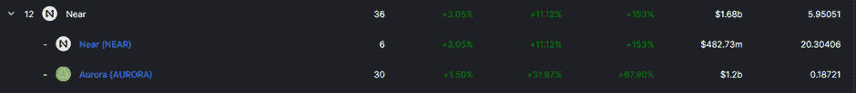

锁定在 Near 协议上的总价值已经看到大量新的资金流入生态系统。正如我们所见，为了与 EVM 兼容，TVL 的大部分都被极光吸引了。这种趋势是 EVM 以外的区块链所面临的问题的象征，那里的开发者和用户都被 EVM 所忽视。2021 年初，以太坊拥有整个 TVL 97%的份额，此后这一份额下降到了整个区块链 TVL 的 54.8%。如果这些 TVL 的数据是准确的，那么 NEAR 的价值是其网络托管价值的 5.95 倍，这为 TVL 在生态系统中的增长留下了充足的空间。

# 当你飞得离太阳太近时，你的翅膀可能会灼伤。

CCI 时事通讯中所有页面的总和不足以在揭示该项目的技术深度方面做到接近协议的公正。

在审查了几个不同的协议后，Near 在分片竞争中优于 ETH 2.0，并可能凭借其动态重新分片功能和对计算需求的频繁重新优化保持竞争力。

对于 ETH2.0，有必要考虑一下，一旦你打破了鸡蛋，就很难把蛋黄放回蛋壳里。Near 的优势在于，在他们建造的基础上认真破土动工之前，花了必要的时间进行探索。

技术复杂性是一致的，很容易陷入虚拟机实现中的粒度细节。尽管如此，在实践中，Near 生态系统是一个多功能的环境，其中部署了智能合约来实现 EVM 兼容性和应用链部署。实现这一点并不容易，这些特性通常存在于硬编码到区块链中的基础设施层。Near 的分片实现了一个运行时环境，其中部署的契约将功能组合到生态系统中。他们的基础设施使他们能够响应网络上智能合约的新兴需求、交易量和规模功能。

可伸缩性是经常被提起的话题之一，因为它对采用至关重要。通常，需求会增加网络运营的成本，创建新碎片或合并现有碎片可以让网络自主扩展资源。

我们已经谈到 Rust 作为一种计算机语言是多么具有竞争力，而且它并不特别常见。然而，能够进行 Web 组装的 Web 2 开发人员有一个可行的途径，通过 Rust 编程语言过渡到 Web 3。语言和所需的技能在某种程度上可以转移给 Rust。Near、Solana、Polkadot 和 Cosmos 上开发人员的指数级增长很大程度上是由于开发人员从 Web 2 过渡到 Web 3 的漏斗。如果这是一种持续的趋势，我们可以可靠地预测 Rust 将成为一种主要的编程语言，并挑战或可能取代以太坊，因为它拥有最多的开发人员活动，其中大多数人使用 Solidity。这是一种非常不同的编码语言，不具有过度的可移植性。当然不是说 Near 会把以太坊变成僵尸链。Aurora 已经认识到了 EVM 兼容性的重要性，开发者活动的数量表明开发对于可靠或不可靠的开发者来说并不容易。

这些考虑将我们带到了项目的整体复杂性。首先，如果你不能可视化这个过程，分片就不是一个简单的概念。验证器并行处理碎片，同时在区块链上随机交替存储数据、验证状态转换和记录事务。很难想象如何创建额外的碎片来满足需求，以及它们如何相互协作来实现整体用户体验。

虽然用户界面是直观的，导致一个非常优越的 UX，但对 Near 底层复杂性的“过度分析造成的瘫痪”使最终用户很难区分在 Solana、Cosmos、Polygon 等上的操作。如果最终用户没有意识到 Near 相对于该领域其他公司的技术优势，他们就不太可能从其他区块链公司撤资。卸载其他链上的资产需要一个令人信服的理由，因为对于最终用户来说，跨链桥接资产可能是一项乏味的任务。如果你是区块链之类的新用户，理解 Aurora 提供智能合同 EVM 兼容层的重要性可能会更加繁琐。

这可能听起来肤浅和俗气，但品牌并不性感。它很难脱颖而出，听起来可能很奇怪，但这对吸引新投资者很重要。在他们秘密旅程的开始，他们被铃铛、哨子和闪亮的东西吸引。通常需要赔钱才能促使参与者改变行为或探索该领域的其他机会。Near 的品牌认知度将随着知名度的提高而提高，因为它已进入市值前 20 名。尽管如此，投资者难以理解为什么分片很重要，这是进入的一个障碍。Near 并非没有意识到这一点，他们竭尽全力提供冗长的文档和模块来吸引学习者。

Near protocol 的白板系列非常出色，Illia Polosukhin 和 Alexander Skidanov 负责其他项目的会议。如果你曾经看过这些教程，它们对构建者或者对技术感兴趣的人来说很有吸引力，但是对于初学者来说，它们可能会像游戏玩家所说的那样倾向于“愤怒-退出”，因为它太难了。

采取兼收并蓄的方法是明智的。原创不是自发的。这很有启发性，花时间在探索中通过他们的白板系列参与其他项目是加密货币项目创始人很少见到的事情。虽然分割的 L1 是 Near 坚持的利基市场，但融入其中的所有不同项目往往会给人一种身份危机的印象，就像 Matic 对 Polygon 的更名一样。

此外，伊利亚和亚历山大是加密领域最聪明的两个人。看了几个小时的项目讨论，你就了解了 Near 背后的头脑，他们不缺人才。他们不需要提示或提词器；他们自然会讲智能合约和区块链架构的深奥抽象知识。你会觉得他们对技术充满热情。

Andre Cronje 最近的一篇文章:

“我长期以来一直直言不讳地表达我对秘密文化的蔑视，以及我对秘密风气的热爱。阅读这听起来可能很奇怪，但加密精神是像自我主权，自我监管，自我授权的概念。秘密文化是像财富、权利、富裕和自我这样的概念。”

这个领域正在快速发展。使用 DApps 的密码爱好者已经失去了对高风险游戏的兴趣。1B %+APY·德根戏剧的诱惑力现在总是首先提出这样一个问题，“这种情况多久会发生在我身上，我会得到报应？”。随着流动性蝗虫从一个链条蔓延到另一个链条，现有的 TVL 变得越来越谨慎，留下的只有震惊的受害者。最近对 Ronin 和 Wormhole bridges 的攻击造成了 8 . 6 亿美元的惊人损失，进一步加剧了人们对具有挑战性的宏观经济的担忧。可以说，在新散户投资者的水龙头似乎干涸的时候，人们对发现几乎没有兴趣，那些已经在使用 DApps 的人正在寻求更安全的选择和去风险。

但这并不都是厄运和黑暗，这些条件可能是一个福音。

最近推出的$USN stablecoin 促使$NEAR 在一片红蜡烛的海洋中脱颖而出，但它也引发了围绕算法挂钩的精确机制以及$USN 是否能应对“银行挤兑”的辩论。那些熟悉 Anchor Protocol 机制的人可能会认识到分散风险的机会，并在他们的 stablecoins 上保持高达 20%的 APY 回报。

人们对既得令牌时间表存在担忧。然而，对于既得代币持有者来说，在 Ref Finance 中以美元作为抵押品是有吸引力的。尤其是当再分配年利率超过 APY 借款利率时。在这种情况下，用户可以从 USN 贷款中获得奖励，并重新投入到抵押品池中。

随着 Near 今年继续推出剩余阶段的茄属植物，我们可以预计 Near 将继续吸引其他生态系统的 TVL，特别是以太坊。许多社区都会生锈，以太坊也不例外。尽管如此，随着近距离部署进一步增加了网络的分散性，那些投资原则倾向于分散协议的人可能会开始徘徊。

问题是，多远才算近？

以 123 亿美元的历史最高市值，可以有把握地说,$NEAR 迄今表现良好。客观来看，它的市值已经超过了$ATOM，但仍是 Polkadot 和 Solana 的 4.5 倍(770 亿美元)。

Near 会达到这些更高的基准吗？

这很难说，但它很可能会成为区块链现有的最实用、最友好、最容易接近的生态系统之一。Near 在它的能力上比 Terra 有优势，尽管 Terra 到目前为止已经得到了更多的关注。Polkadot 是众所周知的，通过大众贷款从本质上提升安全性来将用户纳入生态系统的激励机制很难遵循。Polkadot 的创始人 Gavin Wood 在这个领域是一个知名度很高的人物。

如果我们在这些方面比较这两者，除非 Near 能够巩固一个同样有吸引力的价值主张，否则在下一次宏观上升趋势中，达到 550 亿美元的市值并非不可能。

除了成功的最终部署，Nightshade 需要做的是继续发挥他们的优势，挑选最好的产品整合到他们的网络中，同时将他们的品牌导向新的利基市场。分割不足以吸引普通投资者的兴趣。没有人想成为第一名，也没有人想成为最后一名。

# 参考

Andre Cronje Medium，“秘密文化的兴衰”，4 月 18 日，[https://andrecronje . Medium . com/The-Rise-and-Fall-of-Crypto-Culture-3d 0 e 6 FD 3 E0 e 9](https://andrecronje.medium.com/the-rise-and-fall-of-crypto-culture-3d0e6fd3e0e9)

Awesomenear，所有建立在 near 和 Aurora 生态系统上的项目的策划列表。，【https://awesomenear.com/ 

Coindesk，' NEAR Token 在 4 周内涨了近一倍；以下是原因，2022 年 4 月 8 日，[https://www . coin desk . com/markets/2022/04/08/near-token-在 4 周内翻了一番-以下是原因/](https://www.coindesk.com/markets/2022/04/08/near-token-has-doubled-in-4-weeks-heres-why/)

加密经济，“NEAR Protocol 在 Mainnet 上推出茄片分割”，2021 年 11 月 16 日，[https://crypto-Economy . com/NEAR-Protocol-Launches-night shade-sharing-on-Mainnet-what-is-it/](https://crypto-economy.com/near-protocol-launches-nightshade-sharding-on-mainnet-what-is-it/)

电力资本，开发者报告(2021)，[https://medium . com/electric-Capital/electric-Capital-Developer-Report-2021-f 37874 efea 6d](/electric-capital/electric-capital-developer-report-2021-f37874efea6d)

Exodus，' Near Blockchain 推出 USN Stablecoin '，2022 年 4 月 24 日，[https://www . exodus . com/news/Near-区块链-launchs-USN-stable coin/](https://www.exodus.com/news/near-blockchain-launches-usn-stablecoin/)

Fullycrypto，“5.4 亿美元的浪人黑客暴露了 defi 桥的集中化”，2022 年 3 月 26 日，[https://fullycrypto . com/5.4 亿浪人黑客暴露了 DeFi 桥的集中化](https://fullycrypto.com/540-million-ronin-hack-exposes-centralization-of-defi-bridges)

近协议白皮书，[https://near.org/papers/the-official-near-white-paper/](https://near.org/papers/the-official-near-white-paper/)

近茄论文，[https://near.org/papers/nightshade/](https://near.org/papers/nightshade/)

近 Messari 笔记，[https://docs . Google . com/document/d/1 luthnhcffgsz 4 wrd 0 opx u0 B4 cyz 3 yta 2a _ xor 705 WP 8/edit](https://docs.google.com/document/d/1lUTHnhCFfgsZ4wRd0OpXu0b4cYZ3YTA2a_XoR705Wp8/edit)

近令牌经济学，“近令牌供应和分配”，[https://near.org/blog/near-token-supply-and-distribution/](https://near.org/blog/near-token-supply-and-distribution/)

观念资源数据库，[https://jbln-crypto . idea . site/Near-Protocol-58368 a945f 684786 b 3801 ef 950 e 6914d](https://jbln-crypto.notion.site/Near-Protocol-58368a945f684786b3801ef950e6914d)

赚钱，‘近协议(NEAR):是什么？这是一项好的投资吗？，2022 年 4 月 20 日，[https://www.makemoney.ng/near-protocol/](https://www.makemoney.ng/near-protocol/)

中，“NEAR 协议:Near 将何去何从？|深潜！”，2021 年 12 月 24 日，[https://medium . com/general _ knowledge/near-protocol-where-near-going-deep-dive-7796334 e6f1e](/general_knowledge/near-protocol-where-is-near-going-deep-dive-7796334e6f1e)

Youtube，Coinbureau，“NEAR 协议:Near 要去哪里？？深潜！！2021 年 12 月 12 日，[https://www.youtube.com/watch?v=r61UszUFwNY&t](https://www.youtube.com/watch?v=r61UszUFwNY&t)

Youtube，Coingecko，“NEAR 协议——理解 NEAR 的初学者指南”，2022 年 2 月 24 日，[https://www.youtube.com/watch?v=OEhL2B_qjCg](https://www.youtube.com/watch?v=OEhL2B_qjCg)

> 加入 Coinmonks [电报频道](https://t.me/coincodecap)和 [Youtube 频道](https://www.youtube.com/c/coinmonks/videos)了解加密交易和投资

# 另外，阅读

*   [如何匿名购买比特币](https://coincodecap.com/buy-bitcoin-anonymously) | [比特币现金钱包](https://coincodecap.com/bitcoin-cash-wallets)
*   [币安 vs FTX](https://coincodecap.com/binance-vs-ftx) | [最佳(SOL)索拉纳钱包](https://coincodecap.com/solana-wallets)
*   [比诺莫评论](https://coincodecap.com/binomo-review) | [斯多葛派 vs 3Commas vs TradeSanta](https://coincodecap.com/stoic-vs-3commas-vs-tradesanta)
*   [Capital.com 评论](https://coincodecap.com/capital-com-review) | [香港的加密借贷平台](https://coincodecap.com/crypto-lending-hong-kong)
*   [如何在 Uniswap 上交换加密？](https://coincodecap.com/swap-crypto-on-uniswap) | [A-Ads 评论](https://coincodecap.com/a-ads-review)