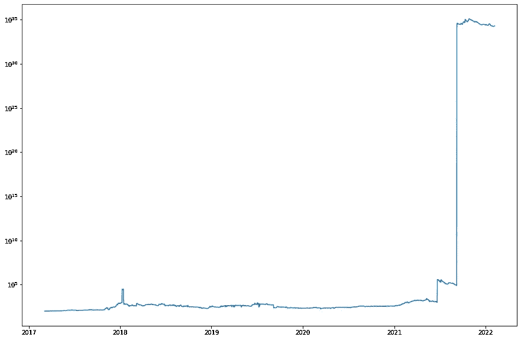
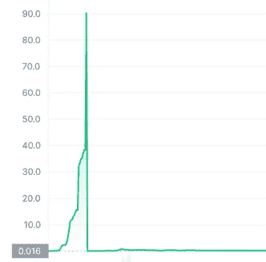

# Crypto 的西部荒野

> 原文：<https://medium.com/coinmonks/the-wild-west-of-crypto-9cf4e90b5d81?source=collection_archive---------23----------------------->

## 你的硬币写的是可以兑现的支票吗？

Photo by [Pepi Stojanovski](https://unsplash.com/@timbatec?utm_source=medium&utm_medium=referral) on [Unsplash](https://unsplash.com?utm_source=medium&utm_medium=referral)

时不时会有轻松赚钱的承诺悬在空中。我们生活在又一次淘金热的时代；只有今天的探矿者开采互联网的比特币，而不是加州的黄金。这让我们很兴奋！但是，我们没有和热情的人群一起去抢鹤嘴锄，而是选择了一条人迹罕至的道路，处理了一些数据。

成为加密货币百万富翁有多难？这…令人惊讶地难以分辨。我是说，我们花了几个小时计算这些数字，但它们就是加不起来。

# 淘金

我们建立了一个所有现存硬币的假设投资组合，并绘制了它们在过去 6 年中的价值。我们预料到许多事情，但没有想到这个:

它长大了。很多。我立刻觉得我错过了有史以来最好的机会。但是现在我也可以登上这艘船了！嘿，勘探者在去加州的路上是不是也有这种感觉？当成千上万的想法在我脑海中闪过时，迈克说，*嘿，这些数字是错的*。

# 它没有成功

根据这张图表，在 2017 年投资 100 澳元会让我们成为当今最富有的人。我们可以多次购买世界上所有的股票、债券和房地产。如果我们需要一块手表，我们可以雇佣杰夫·贝索斯本人跟着我们，每分钟报时。这无疑是他一生中最赚钱的冒险。但是上次我们检查的时候，杰夫不是一个钟，所以很明显有问题。

在网上搜索，我们意识到并不是每个硬币都是公平的游戏。这是自由银行时代的重现。你看，在 19 世纪美国的淘金热时期，几乎任何人都可以发行纸币。淘金者将他们的发现存入当地银行，以换取他们的钞票。无论多么方便，这些银行中的许多都消失了，使得它们的货币一文不值。

同样，我们的许多硬币看起来像财富，但没有办法兑现。今天的*加密银行家*每周都在发行一种新货币，只是这一次都是高科技，很少有人知道它是如何工作的。就拿术语*硬币*来说吧——听起来很有形，但它实际上是一个计算机程序。我们看到的价格大幅上涨呢？结果发现它可能是伪造的，而这正是一些恶意的硬币发行者所做的。

# 闪光的未必都是金子

并非所有的加密银行家都是公平的。一些人将保留他们硬币的管理员权限。他们可以凭空创造新的钱，从你的账户里偷钱，甚至控制谁被允许出售。

还有的会征收交易费，可以随时调整。就在你点击*购买*之前，他们可以将其更改为 99%。即使你的硬币增值了，当你试图兑现时，你会变得一文不名。

还有史高治·麦克老鸭持有者的情况。他们拥有一枚硬币的很大一部分，等到它升值，然后在几分之一秒内全部卖出。瞬间，市场被淹没，你的硬币变得一文不值。

你如何能轻易地区分合法硬币和作弊硬币？好问题！如果你发现了，请告诉我们。

我是程序员，Mike 从事咨询工作，我们即使看了历史数据也还是没有好主意。真的很困扰我们！如果不阅读代码，就无法判断是否有隐藏的管理员用户。不同的网站对价格、交易量和不同硬币的合法性等基本数据意见不一。奇怪的是，建立在完全透明前提下的系统是如此不透明。

# 这是抢劫，不要动！

即使是由一家有着良好意图的可靠公司发行的合法硬币也不是没有风险的。从交易所到加密货币本身都是软件做的，软件是可以被黑的。去年，仅仅是放错钥匙就让 Levyathan coin 的所有者损失了 150 万美元。

但真正的黑帮行动是袭击交易场所。Crypto.com 上个月损失了 3000 万美元 [2](#fn2) ，KuCoin 大约一年前损失了 2 . 81 亿美元 [3](#fn3) ，BitFinex 在 2016 年损失了 36 亿美元 [4](#fn4) 。我就是这么想的！令人疯狂的是，这些激励是如此完美地排列在一起:硬币是有价值的，易于清算，而且是匿名的。

# 蛇油！新鲜的蛇油！

现在这些都是与技术相关的，但是仍然有很多传统恶意的空间。就拿现代科技来说吧。七个人出售了价值 6 . 6 亿美元的加密令牌，以换取巨额回报的承诺。他们甚至慷慨地向早期投资者支付了一些现金，然后随着大部分程序消失了。

这段历史重复了很多次。在“乌贼游戏”代币的案例中，骗子们谎称与网飞有合作关系，从而骗取钱财。炒作变得真实，许多人买了，但真的没有什么。价格上涨的速度越快，价格就越低:

# 那么是黄金，还是傻子的黄金呢？

在淘金热期间，一些勘探者发了财，但许多人留下了一文不值的钞票。秘密财富同样转瞬即逝——仅去年就有价值 140 亿美元的硬币被盗。在你尝试套现之前，你无法确定你有多少钱。也许你的钱包真的有几百万，或者里面什么都没有。这是一个复杂而令人困惑的市场，我们仍在学习中。

然而，这并不完全是悲观的，我们最终对所有的数据都有了一些理解。那么，你赚钱的可能性有多大？敬请期待下一篇文章！

这个故事最初由 Adam Zielinski 和 Michael Reichardt 发表在 adamadam.blog 上。

# 脚注

1.  [https://the hacker news . com/2022/01/hackers-creating-fraud-crypto . html](https://thehackernews.com/2022/01/hackers-creating-fraudulent-crypto.html)
2.  [https://www . wired . com/story/crypto-hack-NSO-group-security-news/](https://www.wired.com/story/crypto-hack-nso-group-security-news/)
3.  [https://www . coin desk . com/markets/2020/11/22/hacked-crypto-exchange-ku coin-resumes-deposit-extraction-services-for-all-tokens/](https://www.coindesk.com/markets/2020/11/22/hacked-crypto-exchange-kucoin-resumes-deposit-withdrawal-services-for-all-tokens/)
4.  [https://www . Reuters . com/article/us-bitfinex-hacked-hong kong-iduscn10e KP](https://www.reuters.com/article/us-bitfinex-hacked-hongkong-idUSKCN10E0KP )
5.  [https://www . cryptanary . com/smart-contracts-come-under-English-and-Welsh-laws-uk-law-commission/](https://www.cryptonary.com/smart-contracts-come-under-english-and-welsh-laws-uk-law-commission/)

> 加入 Coinmonks [电报频道](https://t.me/coincodecap)和 [Youtube 频道](https://www.youtube.com/c/coinmonks/videos)了解加密交易和投资

## 另外，阅读

*   最佳[加密制图工具](/coinmonks/what-are-the-best-charting-platforms-for-cryptocurrency-trading-85aade584d80) | [最佳加密交易所](/coinmonks/crypto-exchange-dd2f9d6f3769)
*   [比斯勒评论](https://coincodecap.com/bitsler-review)|[WazirX vs coin switch vs coin dcx](https://coincodecap.com/wazirx-vs-coinswitch-vs-coindcx)
*   [7 大副本交易平台](https://coincodecap.com/copy-trading-platforms) | [BuyCoins 点评](https://coincodecap.com/buycoins-review)
*   [my constant Review](https://coincodecap.com/myconstant-review)|[8 款最佳摇摆交易机器人](https://coincodecap.com/best-swing-trading-bots)
*   [Godex.io 审核](/coinmonks/godex-io-review-7366086519fb) | [邀请审核](/coinmonks/invity-review-70f3030c0502) | [BitForex 审核](https://coincodecap.com/bitforex-review)
*   [10 本关于加密的最佳书籍](https://coincodecap.com/best-crypto-books) | [英国 5 个最佳加密机器人](https://coincodecap.com/uk-trading-bots)
*   [ko only Review](https://coincodecap.com/koinly-review)|[Binaryx Review](https://coincodecap.com/binaryx-review)|[Hodlnaut vs CakeDefi](https://coincodecap.com/hodlnaut-vs-cakedefi-vs-celsius)
*   [MoonXBT vs Bybit vs 币安](https://coincodecap.com/bybit-binance-moonxbt) | [硬件钱包](/coinmonks/hardware-wallets-dfa1211730c6)
*   [火币交易机器人](https://coincodecap.com/huobi-trading-bot) | [如何收购 ADA](https://coincodecap.com/buy-ada-cardano) | [Geco。一次审查](https://coincodecap.com/geco-one-review)
*   [币安 vs 比特邮票](https://coincodecap.com/binance-vs-bitstamp) | [比特熊猫 vs 比特币基地 vs Coinsbit](https://coincodecap.com/bitpanda-coinbase-coinsbit)
*   [如何购买 Ripple (XRP)](https://coincodecap.com/buy-ripple-india) | [非洲最好的加密交易所](https://coincodecap.com/crypto-exchange-africa)