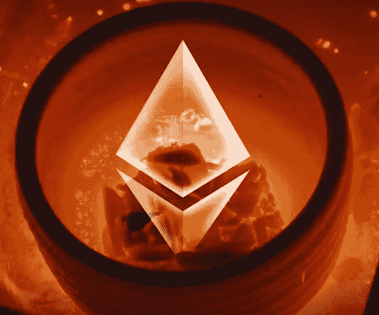
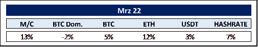
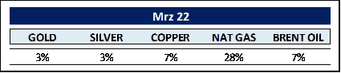
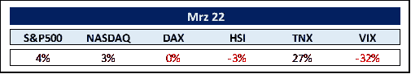
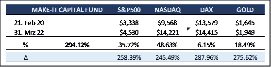
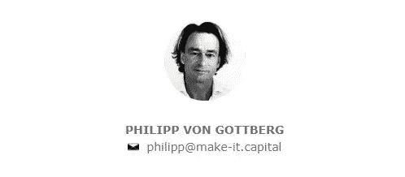

# 我们在 2022 年 3 月看到的世界

> 原文：<https://medium.com/coinmonks/the-world-as-we-saw-it-in-march-2022-15598c3dd41c?source=collection_archive---------55----------------------->

Make-It 资本版 21

[https://blog.ethereum.org/2022/03/14/kiln-merge-testnet/](https://blog.ethereum.org/2022/03/14/kiln-merge-testnet/)

**加密货币的世界**

以太坊( *ETH* )在三月份已经从比特币( *BTC* )手中夺回了一些市场份额。而这主要是由于最后一次 testnet ( *称为* ***窑*** )的发布，才引入了被一致戏称为**合并**的股权证明，并设想为今年的六七月(*时间线根据* ***乔鲁宾*** *，ETH 的联合创始人*)。

现在，与普遍的看法相反，合并不会减少 ETH 的巨额交易费用，因为它只涉及 ETH 的共识层，而不涉及其执行层(*这将在引入分片时解决，首先是共识层，然后是执行层*)。总而言之，合并仍然为崭露头角的第 1 层解决方案( *Solana、Avalanche、币安智能链、Cardano 等)留下了很大的空间。*)以及第二层项目(*多边形、Arbitrum、乐观等)。*)。尽管如此，它也为 ETH 作为一个独立的资产类别开创了一个新时代。

因此，转向股权证明使其完全可用于指数增长的生态、社会治理( ***、ESG*** )基金。此外，合并后，新铸造的 eth 将从每年约 540 万降至 50 万，从而有效地将其通胀率从 4.3%降至 0.43% ( *BTC 目前为 1.73%* )。再加上 1559 年 EIP 法案引入的烧钱机制，ETH 基本上变成了通货紧缩。因此，总的来看，加上**网络效应**和**梅特卡夫定律**的原理，未来的 ETH 价格发展可能会出乎意料地上涨。ETH 会废黜 BTC 吗？我们绝对不声称知道，但是，该基金正在赌这两匹马。

另外， **Meta** ( *前身为脸书*)注册了 8 个新商标，大多与内部加密项目有关，以支持他们每年 100 亿美元的投资计划，打造领先的元宇宙。与此同时，花旗银行预计，到 2030 年，元宇宙经济规模将达到 13 万亿美元，拥有 50 亿用户，同时将元宇宙称为下一代互联网。Raoul Pal 进一步比较了加密和互联网，计算出加密的年增长率为 137%,而互联网为 76%,两者都是从 500 万用户开始计算的。因此，区块链的采用速度几乎是互联网的两倍。最棒的是，人们可以投资基本的区块链层，这是投资者在互联网早期无法追求的。

**商品世界**

在普京总统要求未来的交付以卢布支付后，天然气价格再次上涨。据说，欧洲国家进口了有史以来最多的天然气，努力尽可能多地储存，直到卢布付款的先决条件生效。到目前为止，俄罗斯天然气巨头 **Gazprom** 显然已经停止了通过亚马尔-欧洲管道向欧洲的所有输送，亚马尔-欧洲管道是欧洲能源供应的重要动脉。天然气价格今年上涨了 51%。

布伦特原油上涨 7%，至 108 美元，但在美国打开储备龙头后略有回落。2022 年布伦特原油价格上涨 36%，摩根大通(JPMorgan Chase)预计油价将达到 185 美元，以刺激需求下降。

黄金和白银分别上涨 7%和 8%，为近两年来最强劲的季度，黄金/白银比率为 78，略低于 82 的 200 天移动平均线。价格发展将由全球风险评估和美联储的强硬程度决定。

食品价格正在强劲上涨，小麦价格今年上涨了 31%。随着黑海港口的关闭，他们的库存无法从欧洲的粮仓乌克兰运出。农民也没有大量种植新作物。正如联合国粮农组织前农业市场主管 Abdolreza Abbassian 所说:“30 年来，我从未见过这样的事情；我担心 2022-23 赛季的价格会高得多。”

然而，与西方不同的是，中国一直在默默地为即将到来的供应危机做准备，储备商品的数量已经达到了现在拥有世界 84%的铜储备，70%的玉米和 51%的小麦。

**其余的……**

俄罗斯从乌克兰中部撤退，将战争力量集中在确保乌克兰东部欧洲第二大天然气田的安全上，这在一定程度上平复了投资者的紧张情绪，提振了美国股市，并将波动性降低了 32%。

令人欣慰的是，对中国可能会抓住机会入侵台湾的担忧没有成为现实。除了不可避免的人道主义灾难，台湾的任何麻烦都会产生巨大的连锁反应。并不广为人知的是，尽管美国在设计和知识产权方面处于领先地位，但它仅占世界半导体制造业的 12%。根据各自芯片的复杂程度，台湾以世界产量的 60-92%控制着这个市场。一个国家基本上掌握着全球制造业的关键，这是史无前例的。

如果苹果公司、英伟达公司、先进微设备公司、高通公司和其他公司不能从台湾获得芯片，台湾市场将会崩溃。没有半导体，我们又回到了石器时代。

我们认为，中国将在未来某个时候采取行动，可能不是军事行动，而是效仿香港的整合。给予台湾一些特殊的权利，同时一步一步地侵占它。

另一方面，10 年期美国国债仅在 3 月份就飙升 27%，这甚至不足以跟上 2 年期债券的上涨步伐，导致收益率差为负。根据旧金山联邦储备银行的数据，自 1955 年以来，收益率曲线在每次衰退前都会反转，在反转后的 6 至 24 个月内经济会受到打击。火上浇油的是，油价飙升至接近令人震惊的水平，这通常预示着一场迫在眉睫的衰退。这就是为什么我们没有看到美联储跟进其鹰派基调；我们怀疑今年会有 7 次加息。美联储显然发现自己处于进退两难的境地。然而，事情变得更加复杂:

债券市场的扭曲源于美联储在疫情期间人为压低利率，而现在打算通过推高短期利率来应对严重的通胀。正如我们在上面看到的，长期收益率也在上升，但是速度不同，因为它们没有受到美联储的直接影响。

因此，臭名昭著的问题“这次不同吗？”突然出现。我们的水晶球仍然清晰，然而，我们可能会面临一个更良性的结果，通常被称为软着陆。

在任何情况下，衡量对股市的潜在影响，尤其是科技股，人们必须记住，它们已经受到了严重打击，50%的纳斯达克股票下跌了 50%或更多。这在生物技术市场变得尤为明显，25%的上市公司现在的交易价格低于其现金水平。这是前所未闻的，也没有留下太多进一步下跌的空间。

我们都在见证一个非常扭曲的时间表，没有人能预测它将走向何方。我们只能说，无论接下来发生什么，我们都感觉准备得更充分了，在安全冰冷的钱包中拥有正确的加密货币。

**MAKE-IT 资本基金(本基金)**

该基金由 Make-It Singapore 运营，由 Make-It New Zealand 管理。作为区块链/加密货币综合投资组合的独特对冲基金，该基金让投资者只需一项投资即可参与区块链世界的完整生态圈。该基金始终以精确的资产净值交易，并对机构投资者和合格投资者开放。

该基金的主要目标是通过降低风险和波动性来实现资本保全。这是通过采用我们专有的 5 支柱战略实现的。

该基金继续按照预期表现。将强劲的表现与更好的风险和波动性组合在一起，例如较低的最大提款。资产净值目前为 3.94，有很大的上升空间。

不断让我们吃惊的是，风险资本( *VC* )涌入市场的惊人水平。(**bain Capital**(5.6 亿美元)**Griffin Gaming**(7.5 亿美元)**Andre esen Horowitz**(45 亿美元)**红杉资本**(6 亿美元)**范式资本**(25 亿美元)等等)。总而言之，320 亿美元正流入区块链/加密风险投资，用于非常早期的项目。

作为其五支柱模型的一部分，该基金可能会将其 AUM 的 15%分配给风险投资，其余 85%分配给风险投资。然而，他们专注于参与蓬勃发展且流动性高的操作加密货币市场。同样，我们惊讶地听到，仅有 70 亿美元被分配给 Make-It Capital Fund 等加密对冲基金，而仅风投投资就超过 320 亿美元。

总而言之，进入我们市场的新参与者的数量将及时渗透到更高的价格，形成良性循环，加强更多的投资基金进入加密市场。

最后，我不能比 Sequoia partners**Michelle bail he**(*这仍然是 crypto* 的第一天)和 **Shaun Maguire** 将 crypto 称为未来 20 到 30 年最大的趋势。

感谢您的时间和关注。

真诚地

菲利普·冯·戈特伯格

> 加入 Coinmonks [电报频道](https://t.me/coincodecap)和 [Youtube 频道](https://www.youtube.com/c/coinmonks/videos)了解加密交易和投资

# 另外，阅读

*   [隐翅虫替代品](/coinmonks/cryptohopper-alternatives-d67287b16d27) | [HitBTC 审查](/coinmonks/hitbtc-review-c5143c5d53c2)
*   [CBET 回顾](https://coincodecap.com/cbet-casino-review) | [库科恩 vs 比特币基地](https://coincodecap.com/kucoin-vs-coinbase)
*   [折叠 App 审核](https://coincodecap.com/fold-app-review) | [Kucoin 交易机器人](/coinmonks/kucoin-trading-bot-automate-your-trades-8cf0ca2138e0) | [Probit 审核](https://coincodecap.com/probit-review)
*   [如何匿名购买比特币](https://coincodecap.com/buy-bitcoin-anonymously) | [比特币现金钱包](https://coincodecap.com/bitcoin-cash-wallets)
*   [币安 vs FTX](https://coincodecap.com/binance-vs-ftx) | [最佳(SOL)索拉纳钱包](https://coincodecap.com/solana-wallets)
*   [比诺莫评论](https://coincodecap.com/binomo-review) | [斯多葛派 vs 3Commas vs TradeSanta](https://coincodecap.com/stoic-vs-3commas-vs-tradesanta)