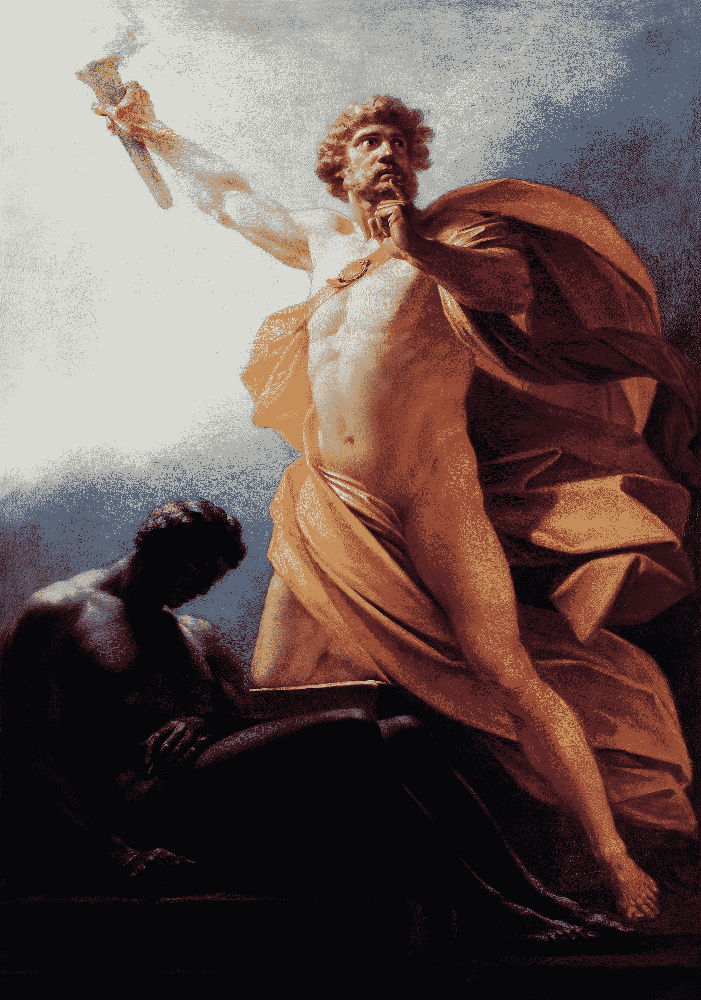

# 世界末日到了

> 原文：<https://medium.com/coinmonks/the-world-is-ending-f424fbc853b8?source=collection_archive---------79----------------------->

## 世界正在诞生

每个人都忽略了普罗米修斯和他为人类做出的英雄行为的故事中最重要的一课。有偷火的行为本身，并把它送给人类，这是一件大事，当然。但是更重要的是该法案产生的*信息*。现在不仅火被人类所拥有，由于信息的存在，人类也知道了从神那里偷窃是可能的。

比特币不火。当然，这是一场地震，可能会引发海啸，但对人类来说，它没有火本身重要。

但是你知道什么*对人类来说*和火本身一样重要吗？比特币产生的*信息*。具体来说，比特币产生的信息揭示了货币是一种海市蜃楼，是人类当前最普遍的狂热梦想。

货币的短暂历史是这样的:它总是在变化。

自从人类存在以来，我们就将“价值”投射到物品中。请意识到，除了空气、水、住所、食物，没有任何东西对人类是固有的有价值的。价值是我们头脑向外的投射。直接跳到黄金和一种特殊形式的虚值——被称为“美元”的特定货币——的官方脱钩，你就看到了幻觉的第一个裂缝。美元没有任何官方“支持”，这导致催眠开始消退，但只是轻微的。几十年过去了，对金钱的痴迷加强了社会对金钱的催眠般的痴迷。金钱可能会侵蚀我们的思想。然后比特币出现了。

催眠状态*很快就会*消失*。就像醒来一样，它可能会慢慢发生，然后突然发生。这关系到我。因为社会还没有准备好处理这个特殊咒语被打破的后果。金钱和权力目前被束缚在同一个人身上。对金钱的任何威胁都会导致这些人使用他们拥有的唯一的其他资源，权力，来试图恢复他们已经变得比存在(或上帝)本身更相信的金钱。*

*在我准备下一篇文章的时候，你可以自己完成一个简单的任务——开始为 Kanye West 的总统竞选做志愿者的想法热身。成为美国历史上写在区块链上的第一章的一部分。*

**

*Neddy Bly 是一名独立记者和比特农民。她在《华尔街》和《芝麻街》都工作过。由于一项研究任务，她在 2015 年首次购买了比特币，并立即爱上了 BTC 的一切。然后就毁了她的生活(或者说有吗？…还在这里！)像一个退休的水手一样，Neddy 生活在比特币的海洋附近，并尊重它的力量。她认为比特币就像海洋一样，有毁灭文明的力量，我们最好尽快开始讨论保险政策！*

> *加入 Coinmonks [电报频道](https://t.me/coincodecap)和 [Youtube 频道](https://www.youtube.com/c/coinmonks/videos)了解加密交易和投资*

# *另外，阅读*

*   *[ProfitFarmers 回顾](https://coincodecap.com/profitfarmers-review) | [如何使用 Cornix 交易机器人](https://coincodecap.com/cornix-trading-bot)*
*   *[如何匿名购买比特币](https://coincodecap.com/buy-bitcoin-anonymously) | [比特币现金钱包](https://coincodecap.com/bitcoin-cash-wallets)*
*   *[瓦济里克斯 NFT 评论](https://coincodecap.com/wazirx-nft-review)|[Bitsgap vs Pionex](https://coincodecap.com/bitsgap-vs-pionex)|[Tangem 评论](https://coincodecap.com/tangem-wallet-review)*
*   *[如何使用 Solidity 在以太坊上创建 DApp？](https://coincodecap.com/create-a-dapp-on-ethereum-using-solidity)*
*   *[币安 vs FTX](https://coincodecap.com/binance-vs-ftx) | [最佳(索尔)索拉纳钱包](https://coincodecap.com/solana-wallets)*
*   *[如何在 Uniswap 上交换加密？](https://coincodecap.com/swap-crypto-on-uniswap) | [A-Ads 评论](https://coincodecap.com/a-ads-review)*