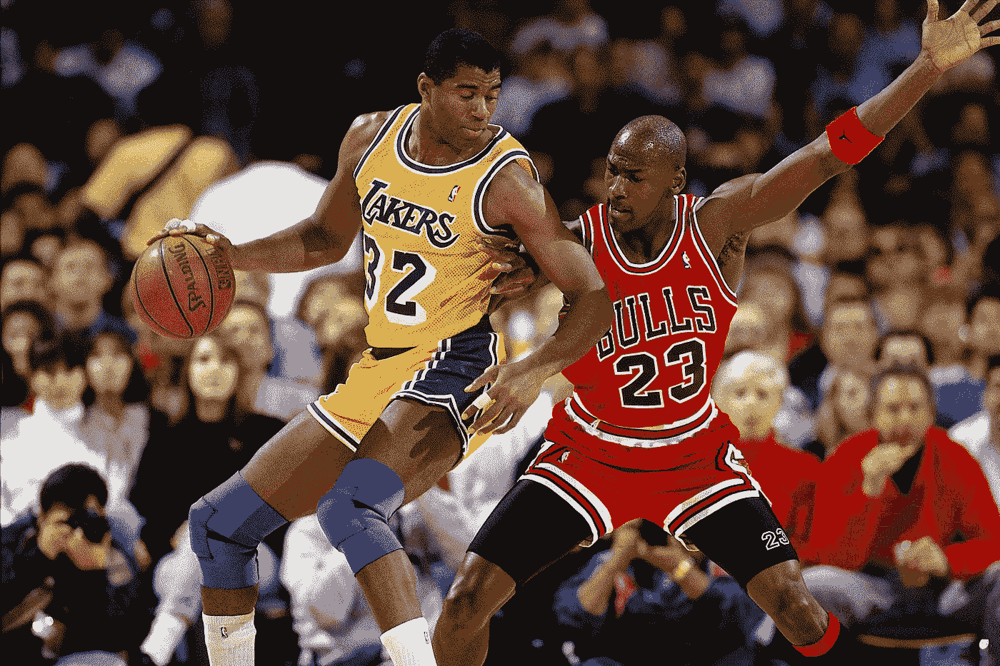

# 乔丹变得不可阻挡的那一年

> 原文：<https://medium.com/coinmonks/the-year-jordan-became-unstoppable-21d6d0530eca?source=collection_archive---------17----------------------->

## 1989-1990 赛季如何催生了一个体育传奇

1989 年 11 月 3 日，尽管面对魔术师约翰逊和拉里·伯德这样的传奇人物，以及帕特里克·尤因和查尔斯·巴克利这样强大的对手，迈克尔·乔丹还是以 NBA 最佳球员的身份踏上了赛季揭幕战的赛场。但是成为联盟中最好的球员是不够的。乔丹想证明他是 NBA 历史上最好的球队，而要做到这一点，他知道他必须证明芝加哥公牛队是 NBA 最好的球队。乔丹已经连续三年在得分上领先联盟，五次被评为全明星，同年被评为 NBA 最有价值球员和年度最佳防守球员，并在没有真正的控球后卫的情况下带领球队度过了整个赛季。就天赋而言，他没什么可证明的了。但是他赢得总冠军的努力已经被底特律活塞队连续两年打断，他们侵略性的身体打法。

1989 年，像他之前的大多数伟人一样，乔丹将注意力转向赢得冠军，而不是获得个人荣誉。在前三个赛季的每一个赛季都提高了球队的成绩，乔丹现在准备带领芝加哥公牛队走得比他在任期间更远。公牛队已经显示出他们已经准备好建立一支成功所需的球队。在 1989-1990 赛季，公牛队解雇了广受欢迎的主教练道格·柯林斯，并提拔了助理教练菲尔杰克逊。尽管有争议，但有一点是清楚的:迈克尔·乔丹帮助菲尔·杰克逊成为芝加哥公牛队历史上最成功的教练。然而，起初，乔丹对杰克逊并不确定

> “当菲尔·杰克逊刚来的时候，我并不是他的粉丝。他走过来，从我手里把球拿走，”

乔丹谈到这个转变时说。虽然道格·柯林斯实际上只是把球和全权委托给了乔丹，但菲尔杰克逊从一开始就采取了更具战略性的方法。他知道，只要球队依赖迈克尔做每件事，他们就不可能赢，他决心创造一个系统，减轻乔丹的负担，并把它放在球场上其他地方的角色球员身上。作为泰克斯·温特和他的“三角进攻”的信徒，杰克逊知道如果公牛队要最终超过他们的西部对手底特律活塞队，他必须找到一种方法来击败所谓的“乔丹规则”。

那么什么是“乔丹规则”呢？乔丹规则是活塞为了阻止联盟中最有统治力的球员而设计的一种策略，而且效果非常好。在底特律活塞队的伊塞亚·托马斯的建议下，这种策略包括每次乔丹触球时对他进行身体上的挑战，迫使他到他不太喜欢的左侧，并且不允许乔丹进行任何轻松的投篮，即使这意味着双人甚至三人包夹他。没有轻松的投篮意味着乔丹不仅得分困难，而且每次面对活塞都要挨打。

底特律的乔丹规则采用了各种各样的防守方式，在让公牛队的明星失去平衡方面非常有效。虽然他们已经成为季后赛的有力竞争者，并且连续两年进入季后赛第一轮，但公牛队不是活塞队的对手，1988 年以 4 比 1 输给了活塞队，1989 年以 4 比 2 输给了活塞队。对阵对手的季后赛 3 胜 8 负的战绩让乔丹没有什么可乐观的，活塞对他的身体伤害增加了士气。但是如果他想成为 NBA 冠军，乔丹必须找到一种方法来对抗底特律的防守。

但是像所有伟大的运动员一样，迈克尔·乔丹适应并进化了。1989-1990 赛季标志着乔丹实现伟大的新方法，他在比赛中加入了新的元素，最终将他带到了一个新的水平。长期以来，迈克尔一直是一个伟大的中距离投手，并且总是一个充满活力的威胁，他开始不知疲倦地练习远距离投篮。工作得到了回报。虽然在场上保持了同样的准确性，但乔丹的三分球命中率比前一年提高了前所未有的 10%。之前，乔丹在 1989-1990 年的远投命中率为 28%，三分线外命中率为 38%。在整个赛季中，他投中了 92 次远投，远远超过了他前五个赛季总共投中的 68 次。1990 年 3 月 28 日，他在对阵克利夫兰骑士队的比赛中拿下 69 分，这也是他职业生涯中得分最高的比赛。乔丹再次入选全明星队，并入选 NBA 最佳阵容和最佳防守阵容，结束了一个真正具有历史意义的个人赛季。

更重要的是，迈克尔的改变也让球队变得更好，让他们更接近那个难以捉摸的 NBA 总冠军。现在，他可以帮助分散对方的防守，因为他的对手必须在他半场时防守他。移动防守是杰克逊新三角进攻的关键。那一年公牛队取得了 55 胜 27 负的战绩，这是他们自 1971-1972 年以来的最好成绩，他们的胜率提高了近 100 个百分点，从. 573 提高到. 671。

当季后赛到来时，乔丹和新面貌的公牛队在第一轮迅速击败了密尔沃基雄鹿队，并在半决赛中迎战费城 76 人队。在主场赢得前两场比赛后，公牛队以强势的姿态前往费城，他们知道他们只需要赢得两场客场比赛中的一场，就可以锁定系列赛的结果。在输掉费城的第一场比赛后，公牛队穿着他们标志性的红色球衣参加了第二场客场比赛，决心要发表声明，并取得了决定性的 10 分胜利。回到芝加哥，公牛队在主场以 18 分的优势结束了系列赛。他们曾强烈声明不会轻易退出。虽然公牛队最终在那一年的西部决赛系列赛中输给了活塞队，但他们在西部决赛中迫使对手打了第七场比赛，然后输给了最终的 NBA 冠军，后者正在走向第二个冠军头衔。

1989-1990 赛季也是乔丹最后一次被活塞(或其他球队)摆布。随着这个变革性的赛季接近尾声，乔丹形成了他最终击败活塞的作战计划。“我被残忍地殴打，”乔丹说。“我想控制疼痛。我想开始反击。”乔丹决定，他需要增强体质来应对他所受到的身体虐待。因此，他联系了私人教练蒂姆·格罗弗(Tim Grover)，并在那个夏天以他改造远射时的同样强度去了举重房。

结果是明白无误的。在接下来的赛季，乔丹的肌肉比 1989-1990 赛季初增加了 15 磅，并带领公牛队获得了六个 NBA 冠军中的第一个。虽然他的球衣再也不会像以前那样合身了，但他肩上的担子却越来越重，因为他不仅成为了 NBA 最大的明星，也是他的球队最终成为世界冠军所需的球员。1989-1990 赛季代表了一种转变，这种转变使迈克尔·乔丹不仅成为篮球史上最优秀的个人球员之一，而且成为 NBA 冠军和球队领袖。1989-1990 年是一个传奇的开始，这个传奇将以两个“三个顶峰”为标志，并披上历史上最伟大的篮球运动员的衣钵。

从那时起，无论是主场白人还是客场红人，每当迈克尔·乔丹穿上他标志性的公牛队球衣，他都被认为是最有希望获胜的。他的每一件球衣现在都是体育界最珍贵的财产之一。我们很荣幸通过 Lenny Oakes 获得了一件 1989-1990 赛季的迈克尔·乔丹红色球衣，Lenny oak es 是费城 76 人队的著名设备经理和狂热的体育纪念品交易商，他的乔丹公牛队在半决赛中获胜。球衣不仅承载了乔丹在球场上辛勤工作的汗水，还带有独特的缝制标记，表明年份(89)，甚至是乔丹要求的定制剪裁规格(2 英寸磅)，使其完全适合他的身材。这件球衣附有一封确认信，以及 76 人队设备经理莱尼·奥克斯本人的另一封信。

为了纪念非凡的 1989-1990 赛季和迈克尔·乔丹成为历史上最伟大的篮球运动员的史诗般转变，RareMint 发行了以这件球衣为基础的高度限量的 NFT 首款系列。将发行一张 12k 拍摄的“极其罕见”的 NFT 照片，以 3D 形式描绘每一个细节，将这件独一无二的球衣的所有权授予其持有者。还铸造了“限量版”纪念 NFT 的基础上，这个开创性的季节和收藏品。你有机会拥有自己的篮球历史，拥有迈克尔·乔丹作为篮球史上最优秀球员的遗产。

## 保持联系✨

在 [twitter](https://twitter.com/RareMint_nft) 和 [Discord](http://discord.gg/raremint) 上关注我们最新的稀有更新。

请务必在[稀有金属](http://raremint.com/)查看我们最新的市场列表！

*加入 Coinmonks* [*电报频道*](https://t.me/coincodecap) *和* [*Youtube 频道*](https://www.youtube.com/c/coinmonks/videos) *了解加密交易和投资*

# 另外，阅读

*   [3 商业评论](/coinmonks/3commas-review-an-excellent-crypto-trading-bot-2020-1313a58bec92) | [Pionex 评论](https://coincodecap.com/pionex-review-exchange-with-crypto-trading-bot) | [Coinrule 评论](/coinmonks/coinrule-review-2021-a-beginner-friendly-crypto-trading-bot-daf0504848ba)
*   [莱杰 vs Ngrave](/coinmonks/ledger-vs-ngrave-zero-7e40f0c1d694) | [莱杰 nano s vs x](/coinmonks/ledger-nano-s-vs-x-battery-hardware-price-storage-59a6663fe3b0) | [币安评论](/coinmonks/binance-review-ee10d3bf3b6e)
*   [Bybit Exchange 评论](/coinmonks/bybit-exchange-review-dbd570019b71) | [Bityard 评论](https://coincodecap.com/bityard-reivew) | [Jet-Bot 评论](https://coincodecap.com/jet-bot-review)
*   [3 commas vs crypto hopper](/coinmonks/3commas-vs-pionex-vs-cryptohopper-best-crypto-bot-6a98d2baa203)|[赚取加密利息](/coinmonks/earn-crypto-interest-b10b810fdda3)
*   最好的比特币[硬件钱包](/coinmonks/hardware-wallets-dfa1211730c6) | [BitBox02 回顾](/coinmonks/bitbox02-review-your-swiss-bitcoin-hardware-wallet-c36c88fff29)
*   [BlockFi vs 摄氏](/coinmonks/blockfi-vs-celsius-vs-hodlnaut-8a1cc8c26630) | [Hodlnaut 点评](/coinmonks/hodlnaut-review-best-way-to-hodl-is-to-earn-interest-on-your-bitcoin-6658a8c19edf) | [KuCoin 点评](https://coincodecap.com/kucoin-review)
*   [Bitsgap 审查](/coinmonks/bitsgap-review-a-crypto-trading-bot-that-makes-easy-money-a5d88a336df2) | [Quadency 审查](/coinmonks/quadency-review-a-crypto-trading-automation-platform-3068eaa374e1) | [Bitbns 审查](/coinmonks/bitbns-review-38256a07e161)
*   [加密复制交易平台](/coinmonks/top-10-crypto-copy-trading-platforms-for-beginners-d0c37c7d698c) | [Coinmama 审核](/coinmonks/coinmama-review-ace5641bde6e)
*   [印度的加密交易所](/coinmonks/bitcoin-exchange-in-india-7f1fe79715c9) | [比特币储蓄账户](/coinmonks/bitcoin-savings-account-e65b13f92451)