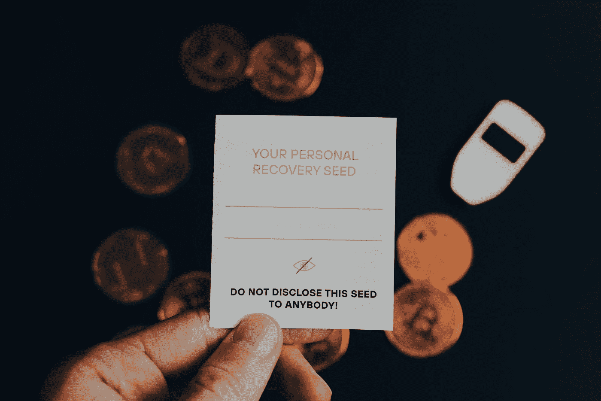

# 以下是当你在 Twitter 上与 NFT 骗子交谈时会发生的事情

> 原文：<https://medium.com/coinmonks/there-are-hundreds-of-nft-scammers-on-twitter-2a35b7a3ae70?source=collection_archive---------13----------------------->

## 他们试图从最近的公海袭击中获利

Photo by [olieman.eth](https://unsplash.com/@moneyphotos?utm_source=medium&utm_medium=referral) on [Unsplash](https://unsplash.com?utm_source=medium&utm_medium=referral)

上周末，OpenSea 用户[损失了价值数百万的 NFTs 】,这似乎是一次网络钓鱼攻击。这家市值 130 亿美元的科技公司通过其官方 Twitter 账户向用户提供最新情况，但冒名顶替者不断出现在回复中，利用了…](/@rlmorris/opensea-users-hit-in-phishing-attack-962da13156ac)