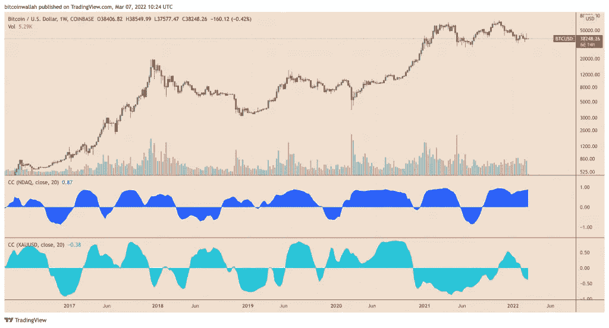
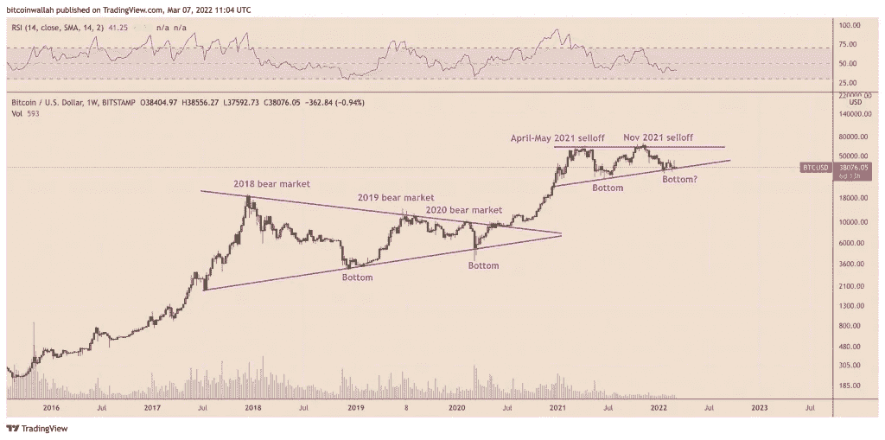
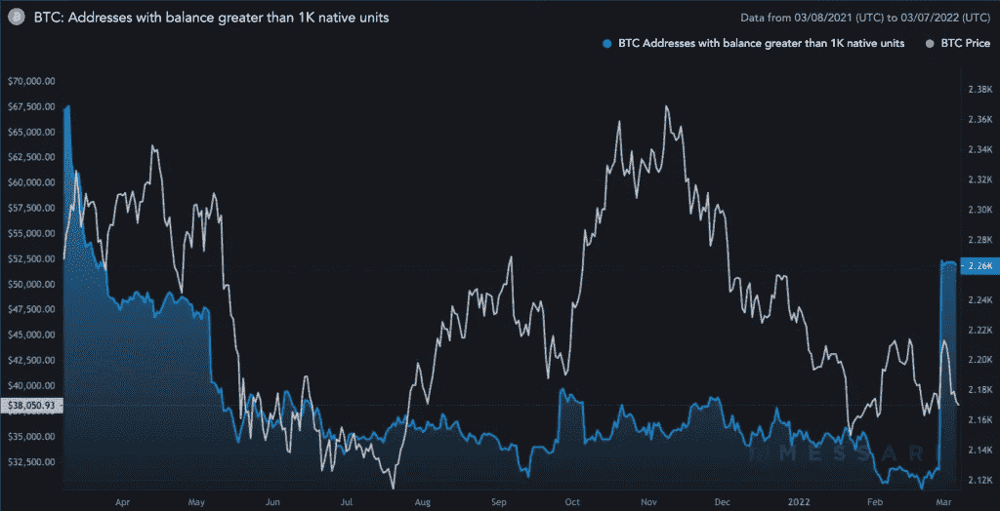
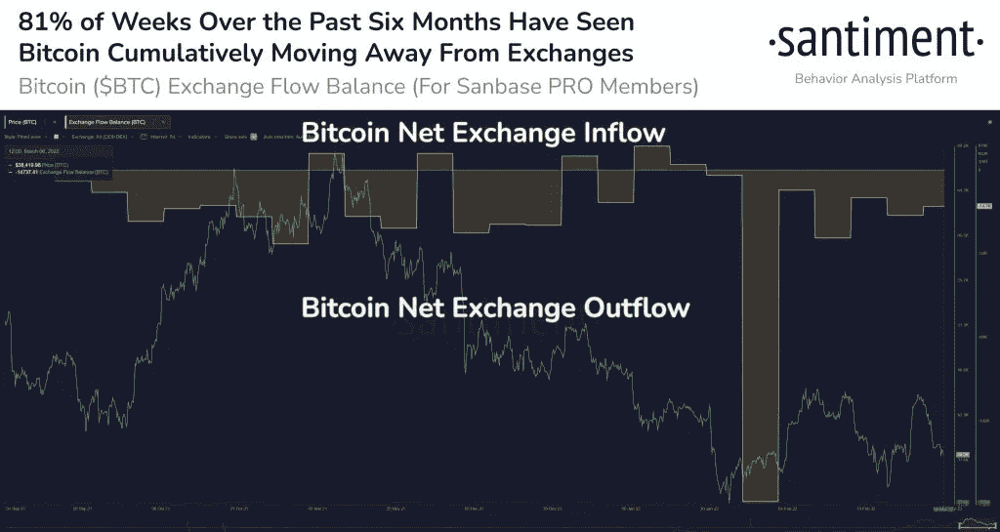

# 比特币能够收复部分失地并升至 6 万美元有三个原因

> 原文：<https://medium.com/coinmonks/there-are-three-reasons-why-bitcoin-can-recoup-some-of-its-losses-and-rise-to-60-000-48b4a4e06c12?source=collection_archive---------70----------------------->

**Visit our website:-** [**https://bitcoinsupports.com/**](https://bitcoinsupports.com/)

尽管最近 BTC 价格跌至 40，000 美元以下，但许多技术和连锁指标都显示出积极的趋势。比特币(BTC)周一跌破 38000 美元，抹去了上周的所有涨幅，上周 BTC/美元超过 45000 美元。

**随着油价攀升，BTC 重返 40000 美元以下的水平。这些损失看起来主要是风险市场抛售的结果，主要是国际石油基准布伦特原油周一早间上涨 18%，至每桶 139 美元，为 2008 年以来的最高水平。尽管如此，比特币无法对冲持续的市场波动，这给它的“避风港”标签带来了质疑，因为周一它与纳斯达克综合指数的相关系数达到了 0.87。**

**Visit our website:-** [**https://bitcoinsupports.com/**](https://bitcoinsupports.com/)

相比之下，比特币与其主要竞争对手黄金的相关性为负 0.38，这表明在当前的市场动荡中，两者大多朝着不同的方向发展。

[https://Twitter . com/lloydblankfein/status/1500645134597345280](https://twitter.com/lloydblankfein/status/1500645134597345280)

一方面，鉴于俄罗斯和乌克兰之间不断恶化的地缘政治局势以及 3 月份再次加息的可能性，比特币进一步下跌的潜力仍然很大。然而，在较短的时间框架内，几个技术和连锁信号正在积极闪烁，表明未来几个月价格可能反弹至 60，000 美元。

**多年上升趋势线的支撑**

如果历史有任何指导意义，比特币最近滑向其多年上升趋势线支撑可能为其向 60，000 美元阻力位的反弹铺平道路。

**Visit our website:-** [**https://bitcoinsupports.com/**](https://bitcoinsupports.com/)

值得注意的是，当 BTC 的趋势线支撑和上方的水平阻力位结合时，形成一个上升三角形。自 2020 年 12 月以来，这种配置一直很活跃，低层作为聚集区运行，高层作为交易者的分布区。

**BTC 鲸鱼的数量正在增加**

此外，CoinMetrics 的连锁数据表明，富裕的投资者一直在以类似的水平购买比特币。

例如，最低余额 1000 BTC 的比特币地址数量从 2 月 27 日的 2127 个增加到 2 月 28 日的 2266 个。

**Visit our website:-** [**https://bitcoinsupports.com/**](https://bitcoinsupports.com/)

在同一时期，BTC 的价格从近 38，000 美元上涨到近 45，000 美元。截至 3 月 6 日，尽管 BTC 已经跌破 38000 美元，但比特币地址的数量已经减少到只有 2263 个，这意味着尽管市场情绪暂时处于熊市，但富裕的投资者仍继续持有比特币。独立市场专家乔哈尔·迈尔斯(Johal Miles)补充说，33，000 美元至 38，000 美元之间的区间一直是比特币多头的“高成交量积累区”，空头发现很难突破。

[https://twitter.com/JohalMiles/status/1500462222287552519](https://twitter.com/JohalMiles/status/1500462222287552519)

**比特币的流出趋势仍未中断**

根据加密分析公司 Santiment 的数据，自 2021 年 10 月以来，比特币从交易所的每周流出量有 81%是正的，尽管 BTC 的交易量接近六个月低点。“有趣的是，在过去 26 周的 21 周中，BTC 远离交易所的程度超过了它对交易所的程度，”桑蒂默周一在推特上引用了下面所附的 BTC 交易所流量平衡图。

**Visit our website:-** [**https://bitcoinsupports.com/**](https://bitcoinsupports.com/)

从交易所流出的比特币越来越多，表明投资者打算长期持有比特币。另一方面，流入交易所的比特币增加，表明人们有意用 BTC 交易其他数字资产或法定货币。

**访问我们的网站:-**[**https://bitcoinsupports.com/**](https://bitcoinsupports.com/)

**免责声明:以上为作者观点，不应视为投资建议。读者应该自己做研究。**