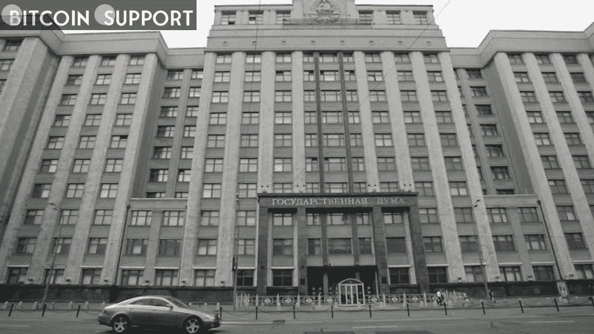

# 应该有办法控制加密交易:俄罗斯议会工作组

> 原文：<https://medium.com/coinmonks/there-should-be-ways-to-control-crypto-transactions-russian-parliament-working-group-de09b79a4cce?source=collection_archive---------93----------------------->

**Visit our website:-** [**https://bitcoinsupports.com/**](https://bitcoinsupports.com/)

工作组出来支持财政部监管而非禁止加密货币的要求。当俄罗斯中央银行(CBR)和该国财政部继续就加密货币的未来进行辩论时，国家杜马(议会下院)的一个工作小组表示支持监管而不是禁止数字资产。

工作组建议“明确监管数字资产业务”是降低该国采用加密货币相关风险的最有效策略。

据当地媒体报道，50 多名专家参加了杜马工作委员会召集的“关于加密货币监管问题”的小组讨论小组成员得出结论，对俄罗斯数字资产业务的“成功和透明”监管需要建立“监管加密货币交易”的工具。正如专家们所指出的，其他国家已经存在这种程序，但是没有关于他们所指的司法管辖区的公开信息。会议传达的主要信息是，该集团似乎支持财政部的监管措施，尽管存在一些技术性的反对意见。专家要求该部加强该法案在非机构采矿、传统机构的作用、了解你的客户(KYC)流程以及加密货币的犯罪用途方面的语言。

如果下议院遵循自己工作组的建议，它将在与 CBR 的争议性讨论中支持财政部的立场，CBR 主张对加密货币采取更受监管的方法。

这场冲突在 2022 年达到高潮。1 月 20 日，CBR 公布了一项禁止私人数字货币开采和流通的计划。财政部很快做出回应，发布了自己的“监管数字货币流通机制的框架”，该框架将数字资产描述为在许多方面类似于法定货币。2 月 18 日，参众两院都提出了各自相互矛盾的法案。中央银行重申其禁止加密货币发行和流通的决心，而该部建议为允许通过特殊注册程序运营的交易所平台确定立法条件。随着议会支持的早期迹象和副总理 Dmitriy Chernyshenko 提出的新监管框架，央行在加密问题上的地位似乎正在恶化。监管机构的广泛禁止计划在政府的行政或立法部门都没有机构支持者。

**访问我们的网站:-**[**https://bitcoinsupports.com/**](https://bitcoinsupports.com/)

**免责声明:以上为作者观点，不应视为投资建议。读者应该自己做研究。**