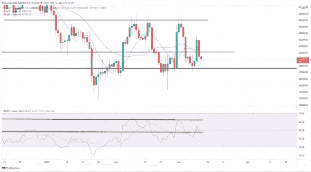
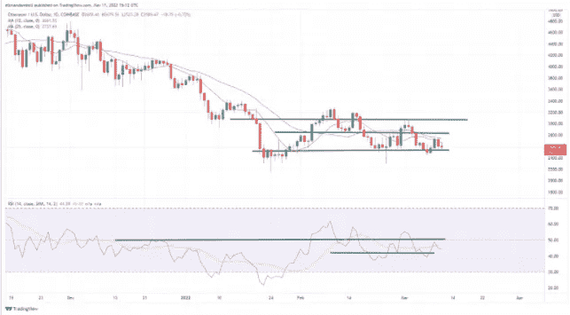

# 周末，比特币和以太坊的价格将会有更多的不确定性

> 原文：<https://medium.com/coinmonks/there-will-be-more-uncertainty-in-the-prices-of-bitcoin-and-ethereum-over-the-weekend-bc79f2b29dd8?source=collection_archive---------76----------------------->

**Visit our website:-** [**https://bitcoinsupports.com/**](https://bitcoinsupports.com/)

比特币周五保持稳定，价格接近 40，000 美元大关。此前，BTC 股市经历了非常动荡的一天，跌至周三以来的最低点，当时创下新低。以太坊也停留在最近的支撑位之上。

**比特币**

在经历了几天的动荡后，作为世界上最大的加密货币，比特币周五继续在高度不确定的水平上交易。这发生在比特币经历了几天动荡之后。

BTC/美元今日低点为 38，347.43 美元，随后高点为 40，081.68 美元。在撰写本文时，比特币的价格比当天开始时高了一点。现在是 39，447.64 美元。

**Visit our website:-** [**https://bitcoinsupports.com/**](https://bitcoinsupports.com/)

在乔·拜登总统签署行政命令的消息传出后，市场出现了许多不确定性。这是因为俄罗斯入侵乌克兰也给交易商造成了困难。

看均线的时候，10 日和 25 日均线都保持着相互缠绕的状态，但是没有明确的方向。随着价格接近 37，600 美元的支撑，空头可能会在此点后继续前进。

**以太坊**

即使周五 ETH 价格下跌，但周末开始时仍接近 2550 美元的支撑点。

ETH 一度跌破该支撑位，早盘跌至 2534.69 美元的日内低点。然而，与前几个交易日一样，这一底部保持稳固，ETH 反弹至 2664.56 美元的高点，一如既往。

**Visit our website:-** [**https://bitcoinsupports.com/**](https://bitcoinsupports.com/)

正如我们昨天谈到的，ETH 价格似乎没有离开支撑区域，这可能导致突破。

想做空全球市值第二大的加密货币的看空者，可能要在 2350 美元找个地方停下来。

**访问我们的网站:-**[**https://bitcoinsupports.com/**](https://bitcoinsupports.com/)

**免责声明:以上为作者观点，不应视为投资建议。读者应该自己做研究。**