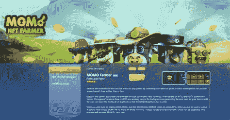
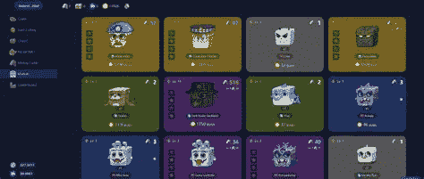

# NFT 游戏界正在酝酿一场平台战争。意思是这样的。

> 原文：<https://medium.com/coinmonks/theres-a-platform-war-brewing-in-nft-gaming-here-s-what-it-means-4d35ac430063?source=collection_archive---------28----------------------->

加密和视频游戏的世界正在快速碰撞。这种组合被称为“游戏赚钱”，更广泛地说，是被称为“web3”的去中心化运动的一部分，它可能会带来全新一代的游戏体验，带来真实世界的经济和新的玩家激励。这反过来会彻底颠覆游戏行业的传统商业模式。

当然，前提是传统游戏平台的看门人决定开门营业。现在，它们中的许多都被关闭了，把这些游戏留在了国际互联网[的角落里，不清楚如何才能让业内最强大的公司张开双臂迎接这些新技术。与此同时，区块链游戏市场已经成为游戏行业增长最快的领域之一，而且没有停止的迹象。](https://www.mobox.io/home/#/cmcairdrop?source=13804556)

**最初，游戏是付费玩的，**考虑到四分之一角的老虎机和街机。几十年后，通过实验和开拓性的商业模式，我们现在也有了免费游戏，它通过由开发者严格控制的数字产品的游戏内经济来赚钱——例如堡垒之夜舞蹈和 Genshin 冲击皮肤。

*   但“玩赚”是一种全新的范式，它基于使用不可替代的代币、加密货币和其他区块链技术，从游戏中的物品和其他形式的数字商品中创造现实世界的价值。
*   如果这种发展趋势继续下去，可能会有助于形成受欢迎的元宇宙的基础，这是许多社交媒体和游戏公司现在似乎有意创造的。马克扎克伯格认为，在我们元宇宙的未来，甚至虚拟服装市场也可能成为一个价值十亿美元的想法。

**Crypto 即将进入游戏市场。随着加密爱好者、初创公司和投资者将不可替代令牌的概念框架应用于各种各样的数字商品，这些游戏赚钱的游戏乍一看只是最新流行的 NFT 骗局。**

*   这个想法很简单:不是直接购买一款游戏，也不是把钱投入到一个免费游戏中，游戏实际上会付钱给你来玩它，有内在的激励机制来奖励你的时间，通常还会在制作它的公司中持有一小部分股份。
*   通过玩这种游戏，玩家可以获得可验证所有权的独特物品，然后可以交易、购买或出售。这就是区块链 n 和 NFT 组件的用武之地，因为这些项目有唯一的标识符，赋予它们可变的价值，就像供应受限的商品或艺术品
*   通常情况下，交易所是由游戏本身运营的加密货币，就像类似神奇宝贝的游戏赚取平台 Axie Infinity 一样，其母公司在本月早些时候由安德里森·霍洛维茨(Andreesen Horowitz)领导的 B 轮融资后估值为 30 亿美元。
*   从这个角度来看，这些游戏 NFT 与那些在今年的加密淘金热中席卷而来的数字艺术品、交易卡或其他形式的在线收藏品没有什么不同。[但游戏 NFT 确实干扰了现有的游戏经济，其中一些已经允许游戏内商品的真实世界交易(尽管许多游戏制造商禁止)。](https://www.mobox.io/home/#/cmcairdrop?source=13804556)

**Valve 本月早些时候进入了这个圈子，**事情变得一团糟。该公司运营着占主导地位的个人电脑游戏市场，悄悄发布了一项禁令，禁止“基于区块链技术开发的发行或允许交换加密货币或 NFT 的应用程序”通常守口如瓶的公司对此事没有更多的话要说。

*   对区块链技术的 Steam 禁令几乎确保了玩赚游戏不会成为主流，至少短期内不会。
*   因为还没有一家公司开发出通过苹果或谷歌的应用商店分发这类软件的机制，所以除了在安卓或传统桌面应用上下载之外，几乎没有其他途径来接触新玩家，这两者都需要玩家自己寻找游戏。
*   苹果和谷歌有可能允许这样的游戏；两者都没有明确禁止它们。但是现在，即使是 Axie Infinity 也不能在手机应用商店上买到，尽管这款游戏的开发者打算在接下来的几个月里尝试在手机上发布这款游戏。

**Valve 的决定在游戏行业造成了裂痕。尽管首席执行官蒂姆·斯维尼几周前坚持认为 NFTs 和类似的想法是骗局和欺诈的温床，但总是渴望削弱其竞争对手的 Epic 介入并表示将支持区块链博彩。**

*   Sweeney 表示，Epic 欢迎“技术和金融领域的创新”，并欢迎区块链游戏，只要它们“遵守相关法律，披露其条款，并由适当的团体进行年龄分级”
*   一个由区块链和 NFT 博彩公司组成的财团现在已经向 Valve 发出了一封公开信，呼吁该公司撤销其决定。Valve 尚未就此事发表任何官方评论，尽管多年来存在许多争议，但它很少就政策或温和问题发表意见。
*   信中写道:“利用区块链技术和基于 web3 令牌的技术(如 DAOs 和 NFTs)的游戏可以积极提升游戏的用户体验，并为用户和创作者创造新的经济机会。”。

**无论如何，NFT 博彩业的繁荣即将到来。**现在的问题是，如果没有苹果、谷歌或 Valve 等公司的传统平台支持，这个市场能有多大？如果连声称支持区块链游戏的 Epic 都没有将 NFTs 整合到自己的产品中，这个游戏环境会是什么样子？

*   Axie Infinity 是一个很好的例子，说明了这种趋势在近期可能会如何发展。这款游戏由越南初创公司 Sky Mavis 运营，它有一个复杂的经济，涉及两种货币，用于培育新的“轴心”，或实际上是虚构的生物，与储存在区块链的神奇宝贝没有什么不同。这些货币可以通过对抗轴心国或出售你拥有的货币来获得。
*   Axie Infinity 通过一个独特的游戏系统有效地支撑起了一种全新的加密货币，它现在正在快速增长，并为投资其经济的人赚取了数千甚至数百万美元。
*   投资者感兴趣的原因显而易见。根据投资公司 Drake Star Partners 的数据，在 2021 年前九个月筹集的创纪录的 90 亿美元私人融资中，有 18 亿美元用于 NFT 相关的游戏项目。似乎每天都有新公司涌现，投资大量涌入，更多的传统公司加入到 NFT 和区块链的游戏潮流中。
*   本月早些时候，安德森·霍洛维茨基金的普通合伙人 Arianna Simpson 解释说:“ [Axie 体现了新一代游戏，游戏创作者不再害怕，而是作为一个开放的自由市场经济，允许玩家自由进出](https://www.mobox.io/home/#/cmcairdrop?source=13804556)。“随着游戏越来越成功、越来越受欢迎，新模式允许游戏玩家实际拥有游戏的各个方面，并从他们的贡献中受益。”

不可避免的是，区块链技术，尤其是 NFTs，将在未来成为游戏产业不可或缺的一部分。但如今有很多合理的担忧，即这些想法是否应该在几乎没有监管审查或监督的情况下，完全释放到一个已经充斥着剥削性货币化和令人上瘾的游戏机制的行业中。更不用说在处理不稳定的加密货币时出现的骗局、欺诈和其他金融问题，这些加密货币可以在几个小时内创造或摧毁可观的财富。

Valve 认为这还为时过早，这是一个大型传统市场可以预见的举动，因为 Valve 的做法可能会为苹果、谷歌和其他公司设定标准。这无论如何都不会扼杀区块链博彩运动。像 Axie Infinity 这样的游戏已经证明，这种趋势比以前想象的要大得多，也更加有机，完全不需要依赖于任何一个平台。但这种阻碍可能会减缓这些游戏的采用，并为它们的主流接受度设置实质性的障碍，同时也给 Epic 提供了一个难得的、急需的杠杆点，来对抗 Steam 及其在移动市场的同行。

SpacePirate Games 首席执行官克里斯·洛夫姆(Chris LoVerme)在一份声明中解释道:“这些围墙花园中关于区块链技术的叙述是相似的——要么不符合他们的核心模式，要么该技术只是被贴上了更大风险的标签，”,他的公司首先广泛宣传了 Steam 禁令。“游戏的未来是分散的玩家所有资产，玩家在游戏中花费的时间和精力是有价值的。无论是 NFT 还是其他资产类别，变化正在发生。”

[了解更多](https://www.mobox.io/home/#/cmcairdrop?source=13804556)

[MOBOX 是一个游戏平台，结合了产量农业和农业非产量农业，创造了一个免费游戏和游戏赚取生态系统。](http://MOBOX is a gaming platform that combines yield farming and farming NFTs to create a free-to-play and play-to-earn ecosystem.)

> 加入 Coinmonks [电报频道](https://t.me/coincodecap)和 [Youtube 频道](https://www.youtube.com/c/coinmonks/videos)了解加密交易和投资

# 另外，阅读

*   [加密货币储蓄账户](/coinmonks/cryptocurrency-savings-accounts-be3bc0feffbf) | [YoBit 审核](/coinmonks/yobit-review-175464162c62)
*   [Botsfolio vs nap bots vs Mudrex](/coinmonks/botsfolio-vs-napbots-vs-mudrex-c81344970c02)|[gate . io 交流回顾](/coinmonks/gate-io-exchange-review-61bf87b7078f)
*   [CoinFLEX 评论](https://coincodecap.com/coinflex-review) | [AEX 交易所评论](https://coincodecap.com/aex-exchange-review) | [UPbit 评论](https://coincodecap.com/upbit-review)
*   [AscendEx 保证金交易](https://coincodecap.com/ascendex-margin-trading) | [Bitfinex 赌注](https://coincodecap.com/bitfinex-staking) | [bitFlyer 审核](https://coincodecap.com/bitflyer-review)
*   [Bitget 回顾](https://coincodecap.com/bitget-review)|[Gemini vs block fi](https://coincodecap.com/gemini-vs-blockfi)cmd |[OKEx 期货交易](https://coincodecap.com/okex-futures-trading)