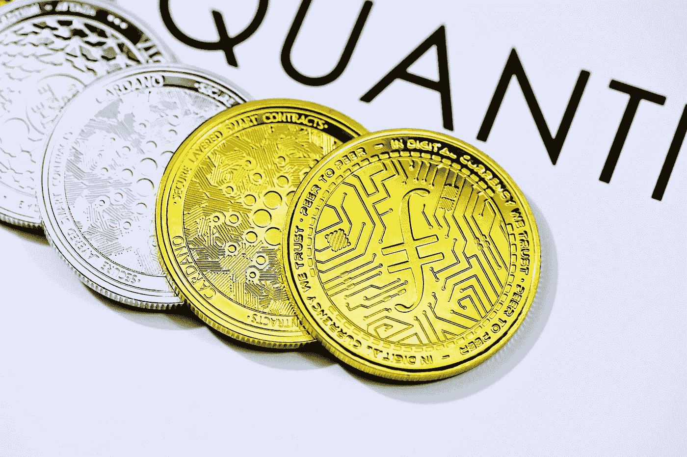
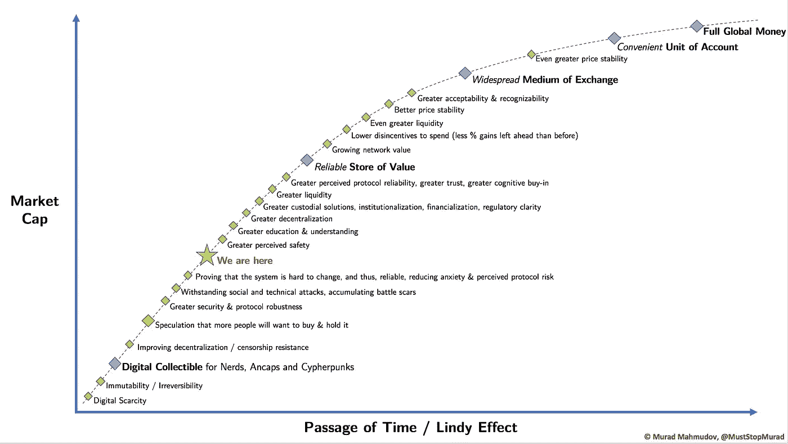
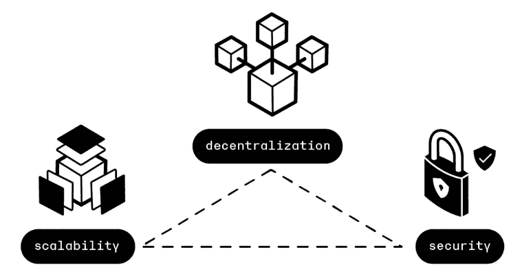
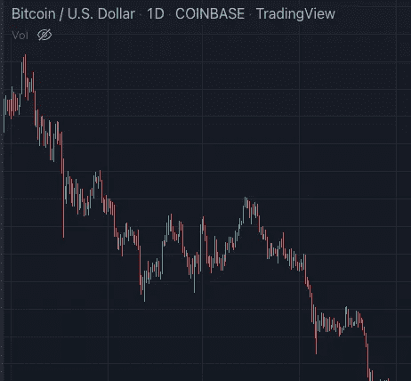

# 比特币归零只有一种情况

> 原文：<https://medium.com/coinmonks/theres-only-one-scenario-where-bitcoin-goes-to-zero-cf9e6136f49d?source=collection_archive---------17----------------------->

## 那是区块链下去的话。其他情况都不行。

Photo by [Marvin Rozendal](https://unsplash.com/@muffinrozendal?utm_source=medium&utm_medium=referral) on [Unsplash](https://unsplash.com?utm_source=medium&utm_medium=referral)

> **比特币归零的唯一情况是其区块链崩溃**

很直白的说法，对吧？

道理其实很简单…

**不太可能出现其他情况。**

让我们来看看比特币可能归零的所有情况:

*   比特币可能会被禁止
*   比特币可能会被更好的硬币取代
*   比特币的价格可能会继续降至零
*   或者……区块链可能会崩溃

让我们一个一个地钻研。

# 比特币可能会被禁止

Photo by [Dim Hou](https://unsplash.com/@dimhou?utm_source=medium&utm_medium=referral) on [Unsplash](https://unsplash.com?utm_source=medium&utm_medium=referral)

我们听到这句话已经有一段时间了

> 主权国家可以宣布比特币为非法。

多年来，这种威胁是真实的，甚至在主要经济体中也是如此。

政府、当局、银行游说团体、机构，他们都看到一些特别的事情正在发生。

他们很快明白他们必须失去什么:对金融交易的控制、高额费用和佣金、监管过度、战略影响力……

但 BTC 链现在已经连续运营了超过 12 年，到目前为止，比特币仍然不受审查。

**演员和政府都曾试图关闭或关掉它，但他们都失败了。**

中国禁止采矿，它只是搬到了别处。最近，不知何故，他们开始回到矿业世界地图上。

**印度**数次威胁禁止比特币。这不是一个彻底的禁令，只是到目前为止，印度储备银行还没有发布任何形式或承认。

**尼日利亚**尝试失败。

在美国，我们已经过了那个阶段。拜登行政命令澄清了一些事情，并命令政府引导数字资产的负责任的发展。比特币现在在美国是安全的。我们只需要 CFTC、证券交易委员会和联邦存款保险公司的最后一次推动，就能打开闸门。

因此，即使一个权威国家禁止比特币，也不会改变任何事情。资本会流动，比特币是完全去中心化的。在全球主要经济体中，BTC 正处于受到官方监管的边缘。它应该很快就会开始其作为储备资产的漫长生涯。

> 交易新手？尝试[加密交易机器人](/coinmonks/crypto-trading-bot-c2ffce8acb2a)或[复制交易](/coinmonks/top-10-crypto-copy-trading-platforms-for-beginners-d0c37c7d698c)

# 一种更好的硬币可能会取代比特币

Photo by [Quantitatives](https://unsplash.com/@quantitatives?utm_source=medium&utm_medium=referral) on [Unsplash](https://unsplash.com?utm_source=medium&utm_medium=referral)

是的，比特币很慢。它不能像其他区块链那样快速处理交易。

当然，可能会有更好的硬币。

但是记住两件事:林迪效应和区块链三难。

## 林迪效应

林迪效应规定，一件不易腐烂的物品存在的时间越长，它的预期寿命就越长。

比特币是所有加密技术的始祖(它创建于 2009 年)。与大多数其他替代硬币相比，它有一个优势。为什么有人想要复制已经有如此规模的东西？

Murad Mahmudov 的下图说明了我们在比特币的货币演变中所处的位置。那是在 2018 年，我们现在显然更进一步。

Source: Murad Mahmudov, @MuststopMurad

## 区块链三难困境

以太坊(Ethereum)创始人维塔利克·布特林(Vitalik Buterin)推广的区块链三元悖论(Blockchain Trilemma)指出，去中心化的数据库(如比特币)只能同时实现其三个承诺中的两个:去中心化、安全性或可扩展性。

在支付系统中，市场最看重的两个品质——去中心化和 T2 安全性——将会失败，任何硬币都无法成功扩大比特币的规模。

Source: [Ledger.com](https://www.ledger.com/academy/what-is-the-blockchain-trilemma)

这两个概念都清楚地证明了比特币相对于大多数其他竞争对手的代际领先优势。

# 比特币的价格可能会继续降至零

Source: [Tradingview](https://www.tradingview.com/?offer_id=10&aff_id=8928)

我对此的态度很明确。

**在没有任何技术事故的情况下，对比特币的需求绝不会枯竭到在大多数投资者眼中变得一文不值的地步。**

只要区块链继续发展，变得更加强大，每个主要心理层面都会有巨大的需求。

对于许多相当富有的投资者和无数机构来说，每 BTC 10，000 美元的价格存在很多障碍。他们会毫不犹豫地买下它。没有提到所有的长期霍德尔，只是专注于拿他们的包。比特币上一次达到 1 万美元是在 2020 年 9 月。

现在想象一辆价值 1000 美元的 BTC。在这个水平上，许多人会愿意在 BTC 身上冒 1000 美元的风险。围绕 ris，apetite 有明确的心理层次。想想那些错过了第一回合并为此不停踢自己的人。我满足于 BTC 永远不会长时间停留在这样的水平。比特币上一次价值 1000 美元是在 2017 年 4 月。

**现在想象一枚 100 美元的比特币。**你会看到整个数字原生代，即 X、Y、Z 一代……他们会毫不犹豫地下载有史以来最强大的数字资产。人们会购买它，因为这种上涨的合理机会很少会这么便宜。我可以告诉你，拿我来说，我会买很多船。

同样，这些价格方案排除了任何其他形式的崩溃或彻底禁止。

# 所以…区块链往下走怎么办？

自 2009 年创建以来，BTC 从未被黑客攻击或破坏过，整个网络都在不断审查代码。

记住。

**比特币完全去中心化**；它不依赖于任何一个组织。该网络既不归单一实体所有，也不受其控制，而是由开源软件驱动。

随着持有人的分布、活跃钱包的数量以及矿池的竞争力和碎片化的增加，它继续显示出日益增长的**去中心化**。

黑掉区块链的主要方法是 **51%攻击。**

在这种攻击中，任何试图改变比特币网络政策的人都必须获得足够数量用户的同意，否则他们将被禁止。超过一半(51%)的参与计算机和节点需要受到危害。鉴于比特币区块链目前的规模，这实际上已变得不可能。

操纵一个加密网络是非常困难的。由于比特币区块链的去中心化、按时间顺序和电力密集型的特点，擦除或覆盖一块已经用完的比特币(即所谓的“双重消费”)是不可能的。

# 结论

比特币有很多对手。许多人仍然希望它消失，被禁止，或者以某种方式失败。

目前的逆风确实相当强劲。但我认为，它们大多与当前的宏观环境有关，也与比特币需要克服的障碍有关。

关于这一点，看看迈克尔·塞勒列出的他目前的 10 大痛苦。

 [## 迈克尔·塞勒刚刚列出了阻碍比特币发展的十大因素

### 记下它们，并在它们展开时把它们勾掉

medium.com](/coinmonks/michael-saylor-just-listed-the-top-10-things-holding-bitcoin-back-91fb1cedf49d) 

但是比特币是不可阻挡的。除了技术故障，没有什么能把它搞垮。

我只是看不到任何其他令人信服的用例枯竭的场景…

时间会证明一切。

*如果你喜欢这个故事，并且愿意支持我(和其他成千上万的作家)，那么考虑一个* [*中型*](/subscribe/@John_treadle) [*订阅*](/subscribe/@John_treadle) *每月只需 5 美元或每年 50 美元。*

*或者你也可以决定给我买一台*[*Ko-Fi*](https://ko-fi.com/johntreadle)*。*

> *加入 Coinmonks* [*电报频道*](https://t.me/coincodecap) *和* [*Youtube 频道*](https://www.youtube.com/c/coinmonks/videos) *了解加密交易和投资*

# 另外，阅读

*   [Bookmap 评论](https://coincodecap.com/bookmap-review-2021-best-trading-software) | [美国 5 大最佳加密交易所](https://coincodecap.com/crypto-exchange-usa)
*   [加密交易机器人](/coinmonks/crypto-trading-bot-c2ffce8acb2a) | [造币评论](https://coincodecap.com/coingate-review)
*   最佳加密[硬件钱包](/coinmonks/hardware-wallets-dfa1211730c6) | [Bitbns 评论](/coinmonks/bitbns-review-38256a07e161)
*   [新加坡十大最佳加密交易所](https://coincodecap.com/crypto-exchange-in-singapore) | [购买 AXS](https://coincodecap.com/buy-axs-token)
*   [红狗赌场评论](https://coincodecap.com/red-dog-casino-review) | [Swyftx 评论](https://coincodecap.com/swyftx-review)