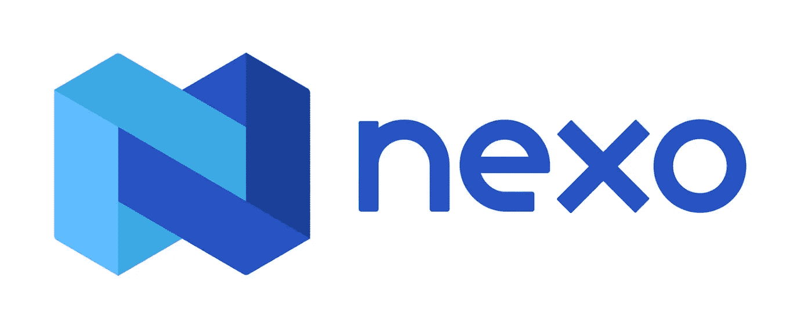
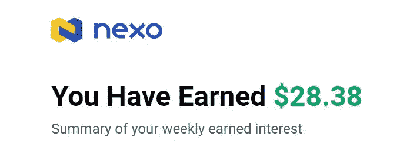
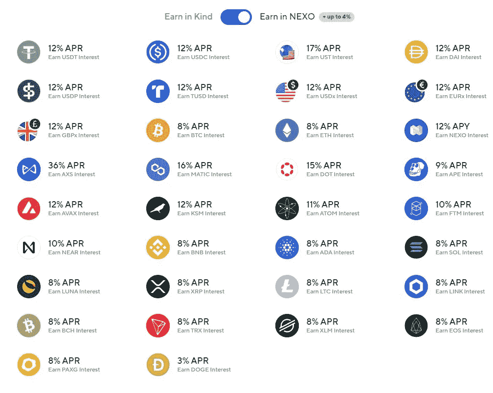
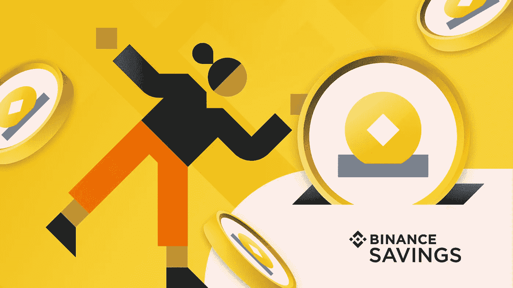
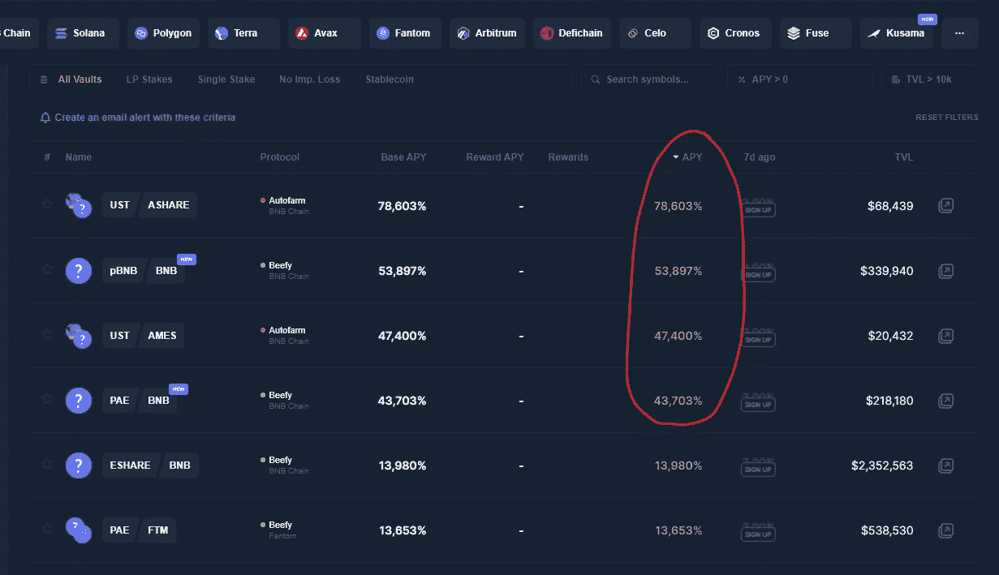

# 这些加密的被动收入策略让我在没有任何交易的情况下每月赚 6800 美元！

> 原文：<https://medium.com/coinmonks/these-5-crypto-passive-income-strategies-make-me-about-6800-monthly-without-any-trading-c6e5d810335?source=collection_archive---------0----------------------->

[Dmitry Demidko](https://unsplash.com/@wildbook) on [Unsplash](https://unsplash.com/)

从风险最小到风险最大，在熊市和牛市中最有效的策略。

你可以通过遵循有利可图的投资策略和在特定平台投资加密资产来获得加密被动收入。如果你有正确的方法和策略，你可以找到一些很好的方法让你的加密资产为你所用。

我们将讨论六种策略，从风险最小到风险最大，它们可以帮助你平衡投资，甚至在熊市中也能让你获利。**最成功的投资者是那些很好地分散投资以保持安全，同时从少数投资中获利的人。这就是你想要赢的全部！**

伙计们，首先，这些是我自己的个人策略。我个人投资了所有这些平台，它们对我非常有用，给了我一笔被动收入。然而，你应该**进行自己的研究，找出最适合你的方法**。**这不是理财建议！**

你已经知道投资加密毕竟不是儿戏！你有失去投资在加密上的钱的风险。话虽如此，以下是我在 2022 年用我的加密资产赚取被动收入的五种方法。

# **-集中放款**

加密贷款的工作原理是从一个用户那里获取加密数据，然后有偿提供给另一个用户。管理贷款的具体方法因平台而异。您可以在集中式和分散式平台上找到加密贷款服务，但核心原则是相同的。

基本上，银行和集中交易所的主要区别在于回归社区的价值数量。所有加密贷款平台都需要 KYC。这是我在当今流行的加密贷款平台中的首选。

nexo Lending platform

N **exo** 是最受欢迎的 CeFi(集中式金融)借贷平台之一。他们对所有托管资产投了 3 . 75 亿美元的保险。该平台拥有 130 亿美元的资产和 300 多万用户。

我太爱这个平台了！它非常容易使用，我相信 CeFi，特别是 Nexo 是最安全的地方之一，你可以在持有你的加密资产的同时赚取被动收入。这不会变得更安全

# **我的投资和收益**💰

My earning summary email

凭借 Nexo 独特的每日支付方式，您可以立即获得您已经获得的利息。您的收益会自动支付到您的 Nexo 帐户。以下是各种硬币的 APY 汇率，如果你选择用 Nexo 硬币赚(用 Nexo 赚)，你的收益会增加，如下图:

**Nexo APR:**

> ***使用我下面的邀请链接赚取 25 美元免费比特币*** *💰*[https://nexo.io/ref/xihveraqpn?src=web-link](https://nexo.io/ref/xihveraqpn?src=web-link)

# -币安·欧文

[https://www.binance.com](https://www.binance.com/en)

谁没听说过币安？主要问题是如何从中获取最大利润。我在币安持有股票多年，但没有获得免费加密。这可能会让我在稳定的硬币上每年获得约 5%至 20%的 APY，在其他硬币上要高得多，所以不要犯同样的错误，试着让你的头脑了解币安，开始学习并利用你的资产赚钱。

我不会详细介绍你可以从币安赚到的所有方法，因为它本身就是一篇文章，但是我真的鼓励你阅读币安学院的完整指南，了解你可以赚取利润的许多方法。我最喜欢的方式是**固定/灵活救球、锁定赌注、定义赌注和 BNB 跳马。**

这是你在币安学院获得的 **币安旅游指南的链接。**

# -为 DeFi 提供流动性

流动性池是锁定在智能合约中的加密货币或令牌的众包池，用于在分散式交易所的资产之间进行交易。现在，许多 DeFi 平台使用自动做市商，而不是传统的买方和卖方市场，这允许您的数字资产通过使用流动性池以自动方式进行交易。这是一个**非常冒险的**程序，因为 APY 不是固定的，波动很大。此外，您选择投资的本机令牌可能会损失很多价值。但这也是一个高回报的程序。

[https://coindix.com/](https://coindix.com/?sort=-apy)

你可以看到大约 53000% 的巨大的 **APY 在与 BNB 和 pBNB 的资金池中**

# 雄厚的财力

Beefy Finance 是一个分散的多链收益优化器，它允许用户从他们的加密资产中获得复利。牛肉为你赢得最高的 APYs 与安全和效率的想法。通过一套由智能合约保护和执行的投资策略，Beefy Finance 自动从各种流动性池(DeFi 生态系统中的 LPs),‌ ‌automated 做市商(AMM)projects,‌‌and‌‌otheryield‌农场‌opportunities)中最大化用户回报。

我确实加入了许多金融平台的流动资金池，并获得了一些不错的收益，但同样，这是高风险的！确保你选择的池有一个高的总价值锁定(TVL)，这意味着波动的风险较小。

加入资金池的程序有点复杂，所以我鼓励你观看这个视频，这是一个关于如何使用强健金融的很好的教程

我感谢你的时间，如果你喜欢这篇文章，请不要忘记分享很多掌声👏🤩保持安全，明智投资！

## U **连续链接和文件:**

*   Nexo:使用以下邀请链接赢取 25 美元免费比特币*💰*[https://nexo.io/ref/xihveraqpn?src=web-link](https://nexo.io/ref/xihveraqpn?src=web-link)
*   [币安赚了](https://www.binance.com/en/earn)
*   [强健的财务](https://beefy.finance/)

D isclaimer:关于本文的声明不代表除我之外任何人的观点或政策。本文提供的信息仅供讨论，并非投资建议。在任何情况下，这些信息都不代表购买或出售该项目的建议。在做出任何投资决定之前，请务必进行尽职调查。

> 加入 Coinmonks [电报频道](https://t.me/coincodecap)和 [Youtube 频道](https://www.youtube.com/c/coinmonks/videos)了解加密交易和投资

# 另外，阅读

 [## celsius Network Vs block fi Vs Hodlnaut |利率、费用和风险

### 本文回顾了三个集中金融(CeFi)加密贷款平台:block fi vs Celsius Network vs Hodlnaut…

coincodecap.com](https://coincodecap.com/blockfi-vs-celsius-vs-hodlnaut) 

*   [5 款最佳加密交易终端](https://coincodecap.com/crypto-trading-terminals) | [最佳 DeFi 应用](https://coincodecap.com/best-defi-apps)
*   [最佳网上赌场](https://coincodecap.com/best-online-casinos) | [币安评论](/coinmonks/binance-review-ee10d3bf3b6e) | [BitMEX 评论](https://coincodecap.com/bitmex-review)
*   [麻雀交换评论](https://coincodecap.com/sparrow-exchange-review) | [纳什交换评论](https://coincodecap.com/nash-exchange-review)
*   [美国最佳加密交易机器人](https://coincodecap.com/crypto-trading-bots-in-the-us) | [经常性回顾](https://coincodecap.com/changelly-review)
*   [在印度利用加密套利赚取被动收入](https://coincodecap.com/crypto-arbitrage-in-india)
*   [Godex.io 审核](/coinmonks/godex-io-review-7366086519fb) | [邀请审核](/coinmonks/invity-review-70f3030c0502) | [BitForex 审核](https://coincodecap.com/bitforex-review)