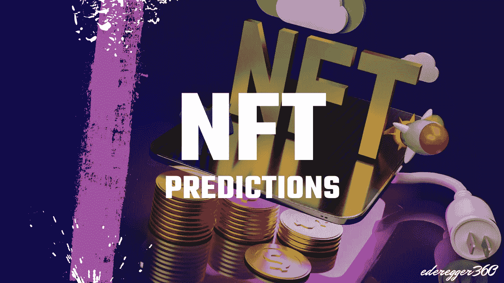

# 这是 NFT 对 2022 年的三大预测

> 原文：<https://medium.com/coinmonks/these-are-the-three-biggest-nft-predictions-for-2022-d0478785f0d6?source=collection_archive---------6----------------------->

## 这些预测描述了 NFT 的大规模扩散

Thumbnail made by [Günter Ederegger](https://medium.com/u/4f0c50d16421?source=post_page-----d0478785f0d6--------------------------------)

2020 年和 2021 年将非功能性思维带入了主流意识。这造就了一大群创造性的问题解决者。NFT 空间之前被区块链空间中以金融和技术为导向的人所接管。取而代之的是艺术家的涌入…