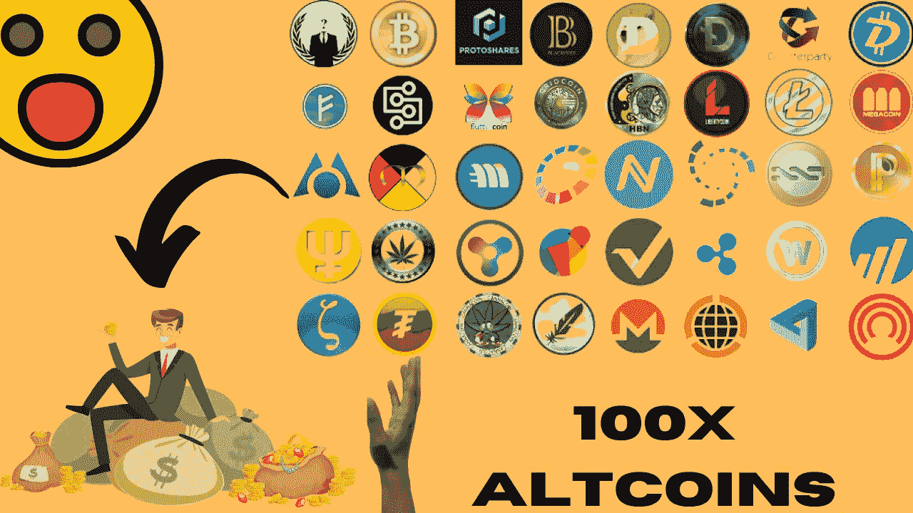

# 这些密码可能是下一个 100 倍 Alt 硬币

> 原文：<https://medium.com/coinmonks/these-cryptos-could-be-the-next-100x-alt-coin-7e9687ec2122?source=collection_archive---------6----------------------->

随着比特币 SV 和比特币 Cash 等 Altcoin 爆炸的历史，交易员和投资者开始投资 alt coin，以实现回报最大化。

**什么是山寨币？**

简单来说，比特币第一，Altcoins 第二。通常，他们将自己定位为优于比特币。目前，比特币在数字货币市场占据着至高无上的地位，但替代硬币也在以类似的速度上涨。

一些数字货币的创造仅仅是为了解决比特币的局限性。你可能听说过以太币，它是继比特币之后市值最大的数字货币之一。不过，投资以太坊等替代币有利有弊。

同时，替代币的根本目标是解决比特币难以解决的安全性、去中心化和可扩展性问题。除了比特币，还有超过 5000 种加密货币可供投资；然而，每种股票的市值各不相同。

让我们来看看一些选项，你可能想进一步研究一个可能的投资。

**卡丹诺 **

Cardano 是第三代加密货币。它的属性提供了第一代和第二代密码的最佳性能，如比特币和以太坊。它采用利益证明(PoS)机制而不是工作证明(PoW)机制，与其他密码系统相比，这增加了它的可持续性。卡尔达诺对许多加密货币投资者颇具吸引力。目前的价格约为 65 美分，这是一个伟大的选择达到 50 美元大关。

***XRP***

XRP 的共识协议让它可以在几秒钟内廉价、低能耗地处理交易。因此，它是更环保的加密货币之一。这是最出色的替代硬币之一，将于 2022 年 3 月起飞，前提是美国证券交易委员会的案件得到迅速解决。但目前，在这一切结束之前，XRP 可能会徘徊在 1 美元关口附近。

***分散***

分散之地作为一个主要的元宇宙游戏的流行可能会推动 MANA 的采用。就市值而言，分散货币是顶级替代货币之一。这是去年表现最好的股票之一，涨幅高达 5，300%。分散土地公司的发行引起了大投资者的兴趣，导致价格大幅波动。元宇宙硬币是巨大的，有巨大的增长潜力。

***θ***

一个创新的平台为流媒体行业的问题提供了技术和经济的解决方案。Thetas creation 提供了一个分散的视频网络。结果，西塔区块链开始鼓励网络带宽共享。特别是，用户将能够贡献他们多余的带宽和计算资源来换取代币奖励。Theta 在 2021 年 4 月触及约 14 美元，目前约为 2 美元。这个项目实现它的潜力只是时间问题——毫无疑问，这是一个值得关注的未来。

***索拉纳***

由阿纳托利·亚科文科开发，在基于区块链分类账的分散式计算机网络上运行。这个区块链数据库管理和跟踪货币，有效地记录了货币中发生的每一笔交易，如果你愿意，类似于长期运行的收据。计算机网络记录货币交易，然后验证数据的完整性。

Solana 和低得多的交易成本比以太坊每秒处理更多的交易。除了股权证明(PoS)之外，这种区块链还采用了一种称为历史证明(PoH)的新技术。Solana 在 2021 年爆发，证明它可以从大约 1 美元到超过 100 美元增长 100 倍。水箱里还有东西吗？时间会证明一切，但这是一个令人兴奋的项目，看起来它将存在一段时间。

投资另类硬币可能会带来新的想法，让它成为你在 2022 年的一个不错的投资选择。因为 altcoins 像 Solana，Theta，比特币现金，Ripple 已经获得了牵引力。同时，这些替代币的特性和市值也优于其他数字货币。