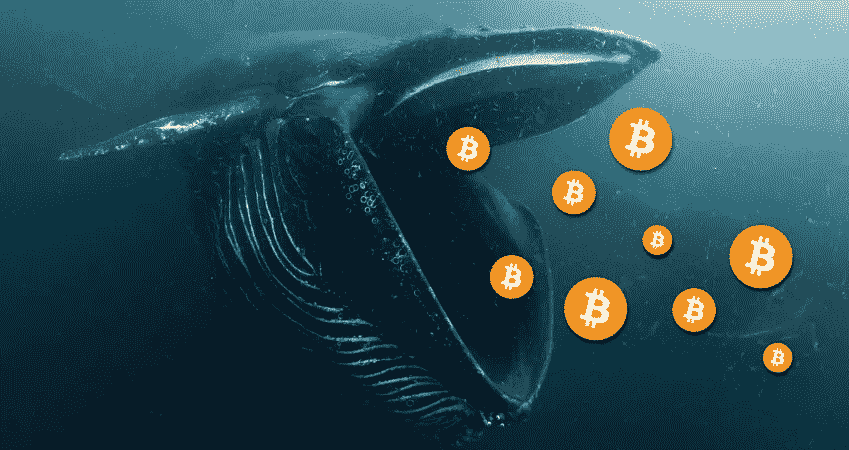
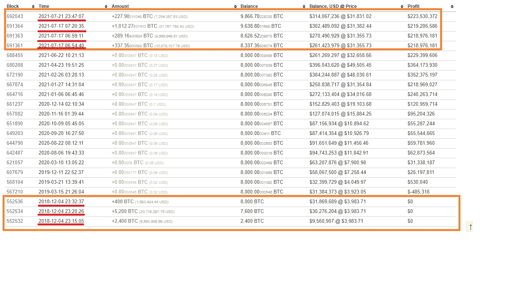
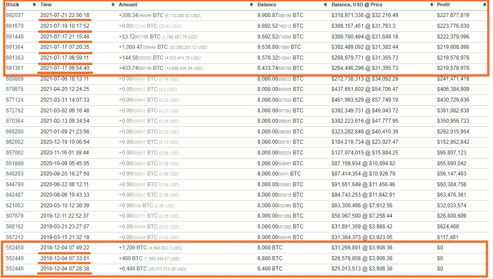
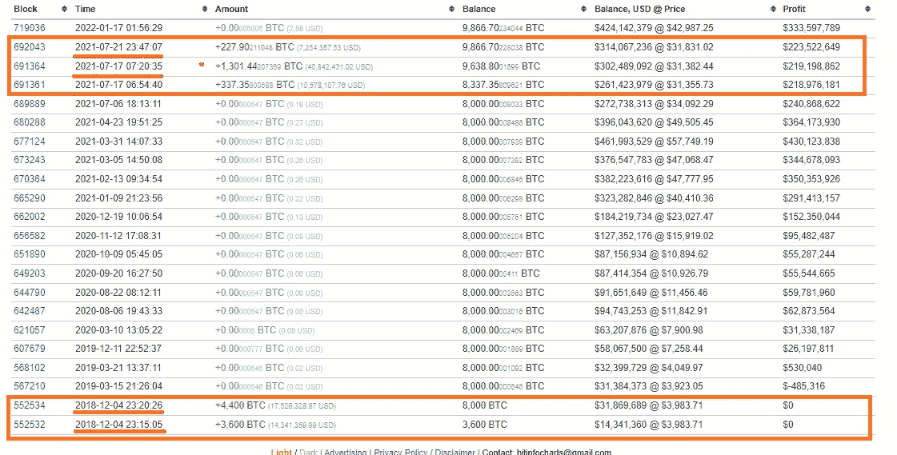

# 这些巨鲸钱包只买了 BTC 市场周期的底部

> 原文：<https://medium.com/coinmonks/these-whale-wallets-only-buy-the-bottom-of-the-btc-market-cycle-b4fcd3a20779?source=collection_archive---------23----------------------->

链上数据显示，一些钱包历史上只有在比特币处于“底部”时才会购买比特币。

Image Credits: [https://coincentral.com/over-150k-bitcoins-accumulated-by-bitcoin-whales-in-60-days/](https://coincentral.com/over-150k-bitcoins-accumulated-by-bitcoin-whales-in-60-days/)

**注意:**这些不是从特定数据集中选择的钱包。相反，当我一个接一个地浏览鲸鱼钱包的大名单时，数据收集的方法更加“随机”。这样做让我找到了一些钱包，比如这里列出的那些，它们在积累方法上表现出惊人的相关性。

**如果任何人想查看完整的列表，他们可以跳到文章的结尾，那里有完整的列表。**

我将尝试利用这个空间来更详细地分析这些鲸鱼钱包的购买活动。

**观察一:**这些钱包几乎都是 2018 年和 2021 年买的 BTC。在 2018 年的第一轮积累之后，这些鲸鱼只是在 2021 年夏天比特币接近 31-32k 美元的底部时浮出水面。

这条鲸鱼在 2021 年几乎是在底部买下了 BTC(31，000 美元),之后就再也没有买过。在此之前的买入是在 2018 年的 3k 美元(也是底部)。

**Wallet 1:** [https://bitinfocharts.com/bitcoin/address/16BBBjvAArL3zdb1Fh1isr2w2hX7K1K4Gm](https://bitinfocharts.com/bitcoin/address/16BBBjvAArL3zdb1Fh1isr2w2hX7K1K4Gm)

另一个钱包遵循同样的模式。在 2018 年以 3k 美元买入底部，然后在 2021 年以 31-32k 美元再次买入底部(目前是本地的)。我在这里列出一些钱包的原因是，这些是通过在抽水前购买底部而获胜的鲸鱼。有趣的是，他们在 2018 年购买，直到 2021 年 BTC 在 31-32k 美元左右时才再次购买。

**Wallet 2:** [https://bitinfocharts.com/bitcoin/address/16BBBjvAArL3zdb1Fh1isr2w2hX7K1K4Gm](https://bitinfocharts.com/bitcoin/address/16BBBjvAArL3zdb1Fh1isr2w2hX7K1K4Gm)

**Wallet 3:** [https://bitinfocharts.com/bitcoin/address/134ooU6EQmCFFzEPN7yga3S1XikcBtynco](https://bitinfocharts.com/bitcoin/address/134ooU6EQmCFFzEPN7yga3S1XikcBtynco)

**观察 2:** 每当这些钱包以这些价格买入时，比特币就再也看不到这些低点了。(当然，买底就是这个意思。但是你可以想象跟踪这些特定的鲸鱼意味着什么！).

# **完整列表(当我发现更多内容时，我会尝试更新列表):**

1.  [https://bitinfocharts . com/bit coin/address/16 bbbjvaarl 3 zdb 1 FH 1 ISR 2 w 2 hx 7 k1 k 4 GM](https://bitinfocharts.com/bitcoin/address/16BBBjvAArL3zdb1Fh1isr2w2hX7K1K4Gm)
2.  [https://bitinfocharts . com/bit coin/address/1 cus 9 pzdkkcz 23 bdaskmy 6 alsq 7 cmuhyw](https://bitinfocharts.com/bitcoin/address/1Cus9pZdkckCz23bDAsKMY6aLSQ7CmuHyw)
3.  [https://bitinfocharts . com/bit coin/address/134 ou 6 eqmcffzepn 7 yga 3s 1 kickcbtynco](https://bitinfocharts.com/bitcoin/address/134ooU6EQmCFFzEPN7yga3S1XikcBtynco)
4.  [https://bitinfocharts . com/bit coin/address/1 JC 7 vyqhcnmdyhbpcv 5 o 3 pytubh 6 sk 139 z](https://bitinfocharts.com/bitcoin/address/1Jc7vYQHCnmdyhbpcv5o3pYtUbH6Sk139z)
5.  [https://bitinfocharts.com/bitcoin/address/17rVQwoL5v18KfoQJNMMoMBm3rDjodxw1m](https://bitinfocharts.com/bitcoin/address/17rVQwoL5v18KfoQJNMMoMBm3rDjodxw1m)
6.  [https://bitinfocharts.com/bitcoin/address/1MYv4C4hZ7hC5sbHrPkzvmNoozQgnHKeAU](https://bitinfocharts.com/bitcoin/address/1MYv4C4hZ7hC5sbHrPkzvmNoozQgnHKeAU)
7.  [https://bitinfocharts.com/bitcoin/address/18Ayw3caz2xGDhTfz1nJxLw1NURPtBNJnn](https://bitinfocharts.com/bitcoin/address/18Ayw3caz2xGDhTfz1nJxLw1NURPtBNJnn)