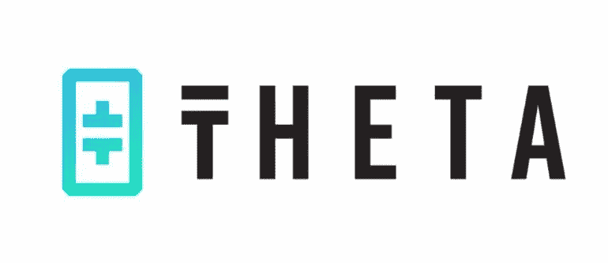
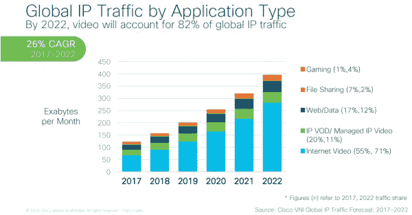
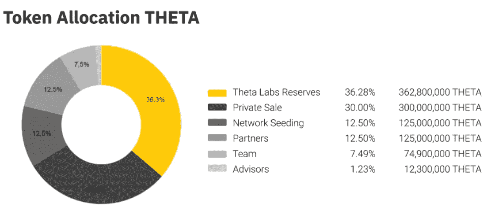
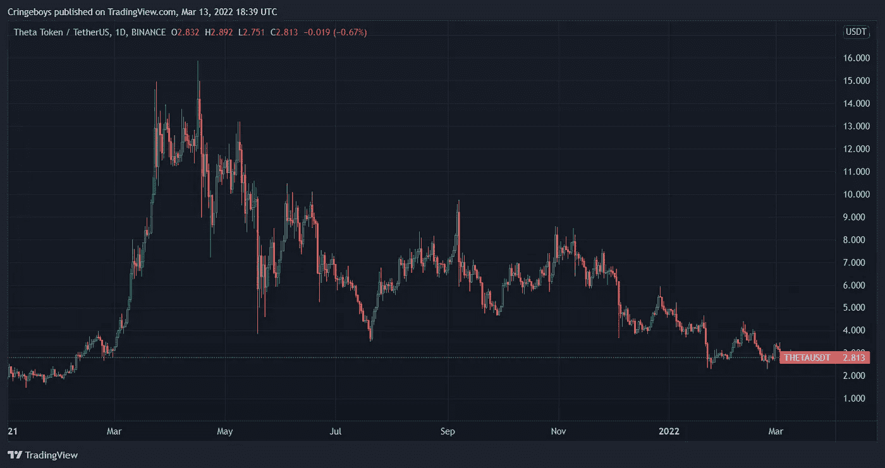
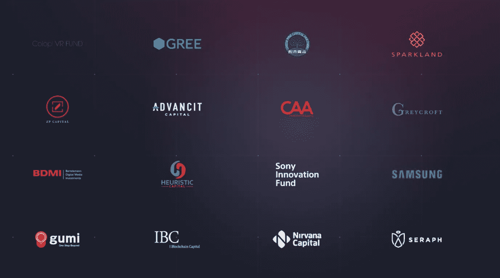

# Theta 网络(THETA)解释

> 原文：<https://medium.com/coinmonks/theta-network-theta-explained-6f0fbb0248db?source=collection_archive---------18----------------------->

这个代币自 4 月份创下历史新高(ATH)以来一直在下跌，现在似乎终于找到了底部，所以今天我将研究这个代币，并决定它是否值得你的钱。

# 这是什么？

把 Theta 想象成 Web 3.0 的 Youtube，Theta 是一个建立在 blockhain 上的视频流平台。它的目标是改善加载时间，并防止视频审查。

Theta 通过要求用户在不使用电脑时放弃宽带来实现这一目标。这些未使用的 pc 将有助于在那个时候使用该平台的其他人加快网络速度。显然，大多数人不会放弃 THETA 的宽带，即使它不会花他们太多钱(或任何东西，就此而言)，所以它会以 Theta 或 TFUEL 代币的形式奖励他们。

他们通过有效地剔除所谓的“中间人”来避免审查，从而让内容创作者将他们的内容/视频直接交付给消费者。

流媒体服务是互联网的一个重要组成部分，想想你或你的亲戚花在网飞、Youtube、Disney Plus、Twitch 等平台上的时间吧

正如你所看到的，这个行业每年增长 26%，其中最大的一部分是视频流，所以很明显，Theta 拥有一个庞大的潜在客户群。

# 令牌组学

Theta 网络就像金恩一样，使用双令牌系统。

首先，我们有θ令牌，这是今天的审查主题，其次，我们有θ燃料(t 燃料)。

THETA 用于治理和赌注，总共有 10 亿的供应量。通货膨胀率正好为 0%，因为没有新的代币可以发行，也没有烧钱机制。这是一个巨大的加分点，因为高通胀确实给代币带来了巨大的抛售压力。

乍一看，这看起来相当不错，只有 7.5%归团队所有，12.5%归合伙人所有，这就导致了 20%的内部份额。

但是那些 Theta Labs 储备&私人出售代币导致代币转储的风险非常高。考虑到这些因素，内幕人士的份额下降到 87.5%，实际上只有 12.5%的代币掌握在公众手中。

我们实际上已经在 2021 年的图表上看到了这种抛售压力，只要看看下面的图表就知道了。

它先是从不到 2 美元涨到 15 美元，为投资者提供了 7 倍的回报。然而，它几乎完成了反转模式，自 4 月以来一直处于熊市，10 月和 11 月没有太多牛市迹象。这是另一个教训，这些指数波动可以双向发生，时机是关键，一些把握好时机的人获得了 6-7 倍的投资回报，他们会对自己的回报非常满意。但毫无疑问，也有其他人在 14-15 美元水平买入，现在下跌了 80-85%。

我对这种价格行为的猜测是，当他们不再能够以指数级增长他们的平台时，令牌分发和销售压力开始出现。

tokenomics 的另一个问题是，要成为企业验证器，Theta 令牌的数量限制为 1000 万个(总供应量的 1%)，这导致项目变得相当集中。然而，他们刚刚宣布，他们将把这一限额减少到 20 万(总供应量的 0.02%)，这是一个好得多的数额。

另一方面，我们有 Theta 燃料代币，这个只是用来支付交易费用。它从最初的 50 亿代币开始，每年将以 5%的速度增长，这还不算太糟糕。

# 团队+投资人

创始人 Mitchell Liu 和 Jieyi Long 在游戏、虚拟现实和视频流方面都非常有经验。

明智的投资者，这是一个非常强大的项目。三星、索尼和 IBC 等公司正在投资，谷歌、三星、索尼和币安甚至成为了验证者。

## 投资者

# 结论

这是一个他们试图扰乱的巨大市场，平心而论，这确实是 Youtube 和网飞等集中式流媒体服务的更好替代方案。目前，Theta 价值 28 亿英镑，而网飞和 Youtube 等平台分别价值 1510 亿英镑和 3300 亿英镑。所以它有很大的成长空间，这是毫无疑问的。

现在的问题是，他们是否能够说服人们离开集中式平台，来到 Theta 上，这是这种采用的一大部分，同时依赖于整个 crypto & Web 3.0 的采用。

此外，代币经济学，我主要指的是代币分配，抑制了代币行为，创造了一个抛售压力的环境。

除了这两个痛点/挑战，这个项目还有很多优点，例如:实际使用案例、巨大的破坏、0%的通货膨胀、知名投资者、有能力的团队和整体行业增长。

就我个人而言，我不会投资这个项目，因为 Tokenomics &以前的价格行动使我远离。我目前还在其他领域看到了更大的机会，如第 1 层和稳定圈。我对 2022-2023 年的保守预测是，价格将回到历史最高水平(15-16 美元)，除非我们看到替代硬币反弹，否则价格可能会更高。

请记住，这绝不是投资建议，我只是一些随机的家伙分享他对一个加密项目的想法。

> 加入 Coinmonks [电报频道](https://t.me/coincodecap)和 [Youtube 频道](https://www.youtube.com/c/coinmonks/videos)了解加密交易和投资

# 另外，阅读

*   [加拿大最好的加密交易机器人](https://coincodecap.com/5-best-crypto-trading-bots-in-canada) | [库币评论](https://coincodecap.com/kucoin-review)
*   [用于 Huobi 的加密交易信号](https://coincodecap.com/huobi-crypto-trading-signals) | [HitBTC 审核](/coinmonks/hitbtc-review-c5143c5d53c2)
*   [如何在 FTX 交易所交易期货](https://coincodecap.com/ftx-futures-trading) | [OKEx vs 币安](https://coincodecap.com/okex-vs-binance)
*   [OKEx vs KuCoin](https://coincodecap.com/okex-kucoin) | [摄氏替代品](https://coincodecap.com/celsius-alternatives) | [如何购买 VeChain](https://coincodecap.com/buy-vechain)
*   [ProfitFarmers 点评](https://coincodecap.com/profitfarmers-review) | [如何使用 Cornix 交易机器人](https://coincodecap.com/cornix-trading-bot)