# Thetan Arena，BSC 上最受欢迎的 MOBA 游戏

> 原文：<https://medium.com/coinmonks/thetan-arena-the-most-popular-moba-game-on-bsc-cb8bd335c5dd?source=collection_archive---------37----------------------->

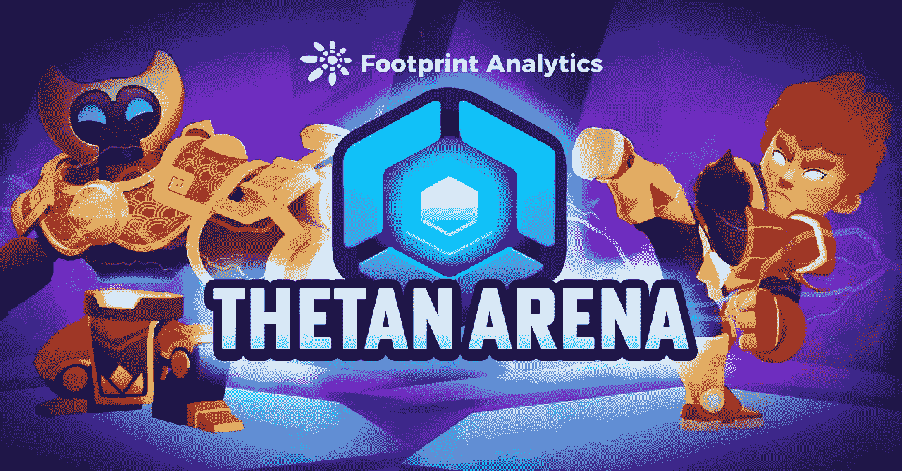

碾压连锁游戏之王的游戏在单日用户活跃度方面如何？

2022 年 4 月

数据来源:足迹分析 [Thetan Arena 仪表盘](https://www.footprint.network/guest/dashboard/GameFi-%7C-Thetan-Arena-Dashboard-fp-6d6bb96e-2e57-4eb0-8f60-cac1d868c7f2?channel=ENG-235#secret=1037BE6C37180A06FE28CD7EB235C87F)

*   Thetan Arena 是一款区块链游戏，包含角色扮演、MOBA(多人在线战斗竞技场)和幻想元素
*   玩家通过参与战斗或完成其他任务来获得 THC 或 THG
*   自 Thetan Arena 上线以来，吸引了众多玩家。它曾经是 BSC 上最大的 [MOBA 游戏](https://www.footprint.network/guest/chart/Game-Ranking-by-popularity-%7C-BSC-fp-81522bda-a035-4e1a-ad5f-f54b224b3dd5?channel=ENG-235#secret=1037BE6C37180A06FE28CD7EB235C87F&key=eyJwYXJhbWV0ZXJzIjpbXSwicGFyYW1ldGVyVmFsdWVzIjp7fSwicGFyYW1ldGVyX21hcHBpbmdzIjpbXSwiZGFzaGJvYXJkVXVpZCI6IjZkNmJiOTZlLTJlNTctNGViMC04ZjYwLWNhYzFkODY4YzdmMiJ9)，现在拥有超过 14 万用户。

# 什么是 Thetan 竞技场？

Thetan Arena 由越南领先的游戏公司 Wolffun 于 2021 年 12 月推出。愿景是创建一个可持续的 [GameFi](https://www.footprint.network/dashboard/Top5-Game-Dashboard-fp-4150?channel=ENG-235) 生态系统，整合加密货币、玩家和媒体。它已经获得了 Animoca Brands 等风投的投资，并得到了游戏公会 YGG 的支持。

Thetan 竞技场有两种类型的代币，Thetan 硬币(THC)和宝石(THG)。游戏玩法多样，玩家可以单人游戏，也可以在战斗中组队。游戏玩法类似于传统的 MOBA 游戏，如《英雄联盟》或《王者荣耀》。

# Thetan 竞技场的游戏是如何进行的？

《泰坦竞技场》不同于《夹板大陆》和许多区块链游戏，它不是基于网络的。玩家需要下载 PC / iOS / Android 版本才能玩，然后以访客身份登录，或者用你的 MetaMask 账号注册为正式玩家。

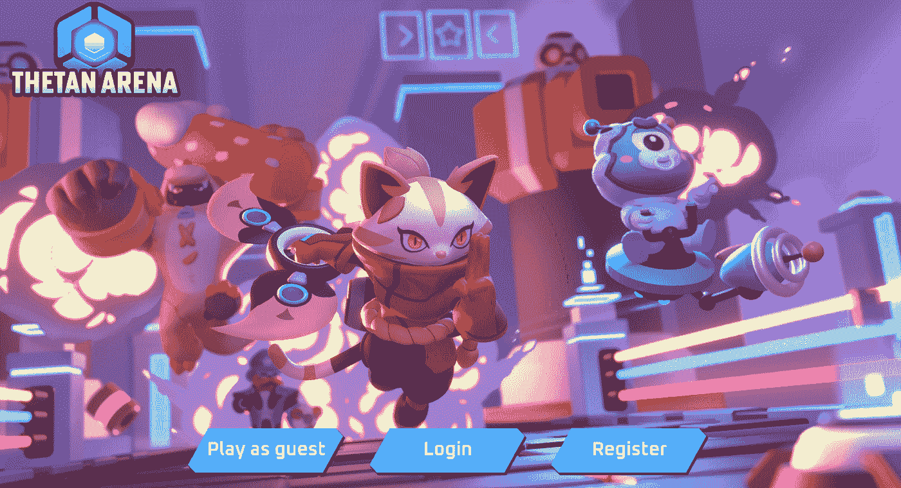

*Sources: Thetan Arena — Sign up*

**获得英雄**

在 Thetan 竞技场有四种主要的获得英雄的方法:系统礼物，购买，租借，或者盲盒召唤。

**1)系统赠送**

登录游戏界面，可以免费获得三个英雄，类型质量随机。自由英雄不能在市场上交易。

在 Thetan 竞技场有三种主要类型的英雄，坦克，射手和刺客，每种都有三种品质，普通，史诗和传奇。

不同的英雄有不同的皮肤，不同的战斗能力。玩家可以购买皮肤(用于装备英雄)来增强英雄的战斗能力。皮肤按照稀有程度分为三类:普通、稀有和神秘。

**2)购买**

玩家可以使用 THC 直接从市场购买英雄。截至 4 月 10 日，最贵的 hero 售价为 99,999.999 THC，约合 1077.71 美元。最便宜的 hero 售价 670 THC，约合 7.22 美元。

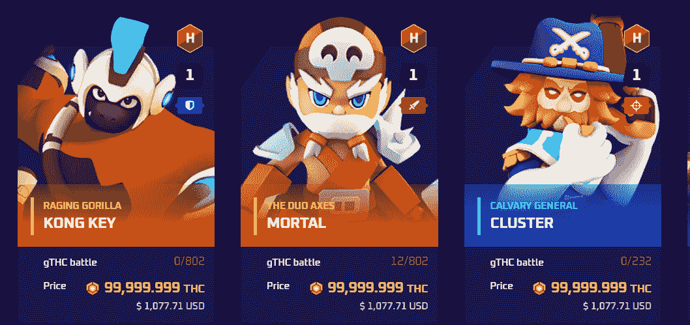

[*Sources: Thetan Arena — Most Experienced Heroes*](https://marketplace.thetanarena.com/?batPercentMin=60&heroRole=1%2C0%2C2&page=1&sort=PriceAsc)

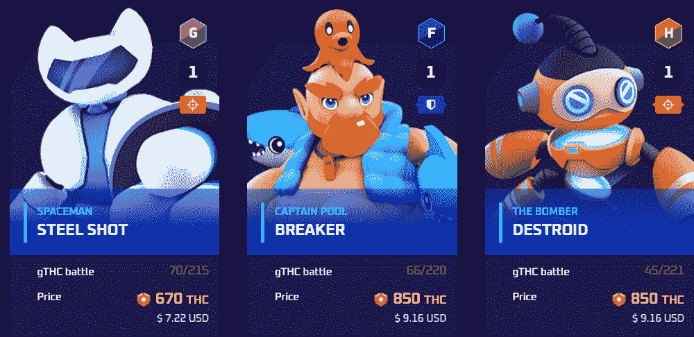

[*Sources: Thetan Arena — Cheapest Heroes*](https://marketplace.thetanarena.com/?batPercentMin=60&heroRole=1%2C0%2C2&page=1&sort=PriceAsc)

**3)租房**

与 Axie Infinity 类似，Thetan Arena 允许玩家租借英雄进行游戏并获得奖励。截至 4 月 10 日，租赁市场上最贵的 hero 为 5 万 THC，约合 547.8 美元。最便宜的是 50 THC，约合 0.54 美元。

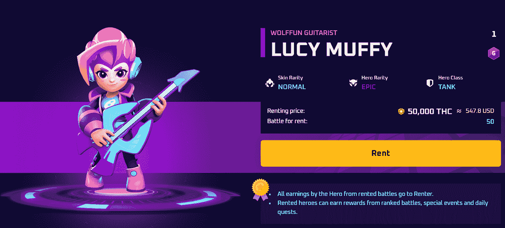

[*Sources: Thetan Arena — LUCY MUFFY*](https://marketplace.thetanarena.com/item/61aaea1716c58d2342e24322)

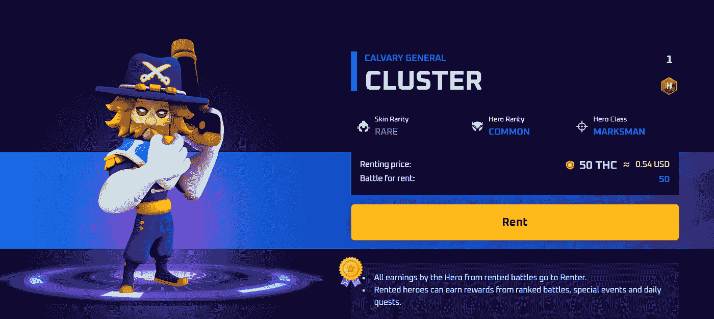

[*Sources: Thetan Arena — CLUSTER*](https://marketplace.thetanarena.com/item/61aa35e9ebb09795aeeeb4a5)

**4)盲盒召唤**

Thetan Arena 有一个盲盒抽取方法，可以增强游戏的刺激性和冒险性。玩家可以使用泰坦竞技场的两种令牌组合来购买盲盒，不同的盲盒会抽取不同稀有度的英雄。

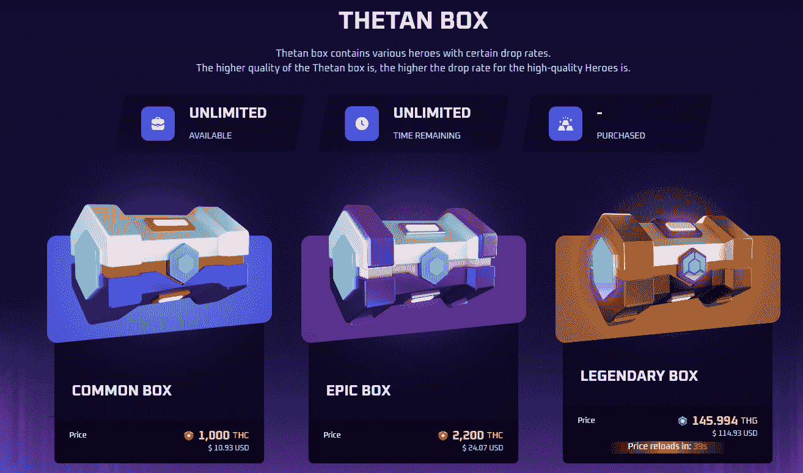

[*Sources: Thetan Arena — Thetan Box*](https://marketplace.thetanarena.com/dashboard)

# 游戏部分

得到英雄后，玩家就可以正式开启游戏了。主要有四种玩法:皇家战、塔、巨星、死亡赛。

*   **皇家战役**

皇家战役模式更类似于 Playerunknown 的战场模式。它可以由一个或两个玩家一起战斗。最主要的区别是，如果有两个球员作为一个团队，一个被杀，另一个可以救他。

玩家找到并摧毁补给箱，并在 4 分钟内杀死敌人确保生存，成为战场上唯一的赢家。

需要注意的是，在这 4 分钟内，四个安全区会收缩，所以如果英雄没能留在安全区，他会直接死亡。

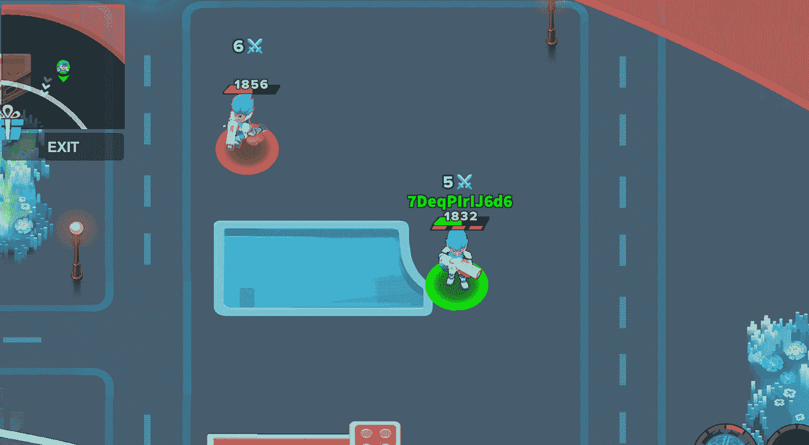

*Sources: Thetan Arena — Battle Royale*

*   **塔**

塔防的模式和英雄联盟类似，只不过英雄联盟有 10 名玩家，每场比赛时间都超过 30 分钟。在 Thetan 竞技场的一场塔牌游戏不到 5 分钟。

玩法:每四个玩家随机组队，一共两个。两队都有 5 分钟的时间杀死对方的英雄并摧毁塔才能获胜。如果两队的塔都没有在 5 分钟内被摧毁，则塔生命值较高的队获胜。

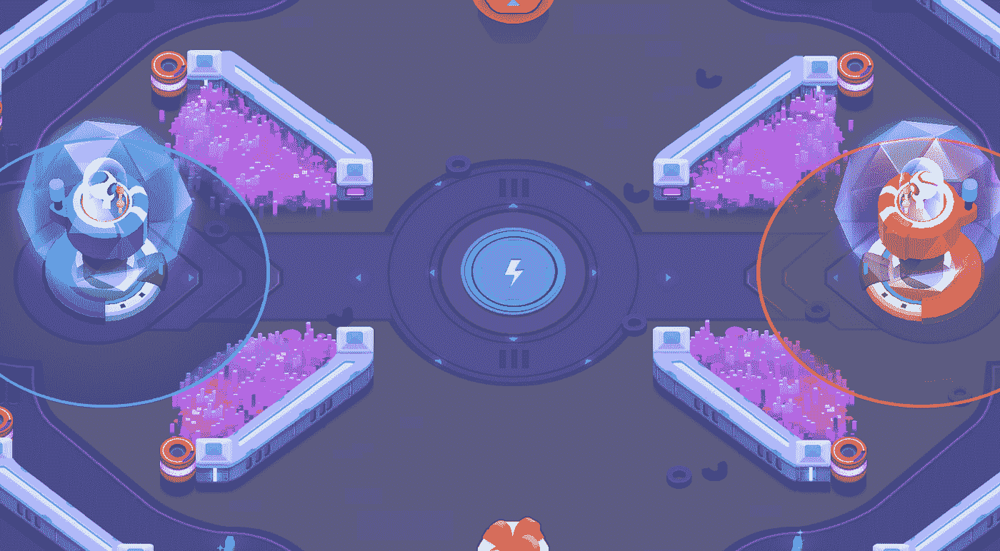

*Sources: Thetan Arena — Tower*

*   **超级巨星**

巨星模式类似于王者五军模式的荣誉，主要区别是长度。Thetan 竞技场 4 分钟 4v4，王者荣耀 8 分钟 5v5。

每四个玩家随机组队，一共两个。两个队都在 4 分钟内争夺尽可能多的星星，星星最多的队获胜。如果一个队比另一个队多 50 颗星 4 分钟，他们就完胜。没有必要等待 4 分钟结束。

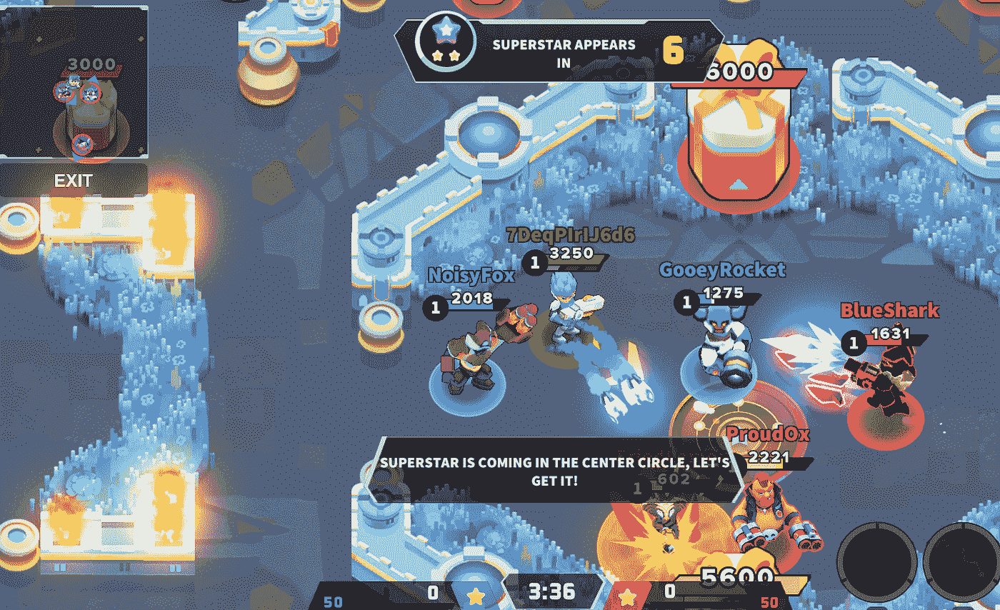

*Sources: Thetan Arena — SuperStar*

*   **死亡竞赛**

死亡竞赛类似于王者荣耀的火焰山模式，但不同的是王者荣耀玩家通过杀死 30 名玩家获胜，而 Thetan 竞技场对杀死人数没有具体要求。

每四个玩家随机组队，一共两个。目标是在 3 分钟内杀死更多玩家，杀死多的一方获胜。

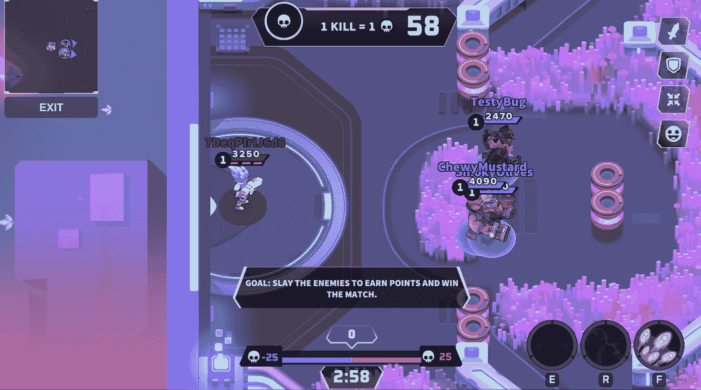

*Sources: Thetan Arena — DeathMatch*

除了上面提到的四种主要游戏类型，Thetan Arena 偶尔会开启限时游戏模式。其中包括活动、排行榜比赛等等。

# Thetan 竞技场的主要特色是什么？

Thetan 竞技场的主要特征如下:

*   **自由发挥**。很多从传统游戏转到连锁游戏的玩家，通常会被要求支付一定的钱来开始游戏。例如加密你。
*   **降低门槛难度。**Thetan Arena 的许多模式类似于传统的 MOBA 游戏模式，更适合玩家入门。
*   **创新与媒体相结合。**通过直播游戏来扩大竞技场影响力的主播可以从竞技场社区获得奖励。
*   **每场比赛最长 5 分钟。**快随便玩。

# 象征经济学:西坦宝石(THG)和西坦硬币(THC)

坦竞技场有两种类型的令牌，一种是坦宝石，治理令牌简称为 THG，另一种是坦硬币，一种游戏内令牌，简称为 THC。

*   **THG**

THG 是一个标准的 BEP-20 令牌。其最大供应量为 4.2 亿代币，目前已发售不到 35%，将于 2024 年 9 月 16 日全面发售。THG 的 26%分配给团队和顾问，10%分配给最初的战略发行，剩下的 64%用于支持游戏和生态系统的开发。

THG 主要用于购买盲盒，参与 Thetan 竞技场的社区治理，消耗交易费。玩家可以直接在交易所购买，通过参加锦标赛、市场或其他活动来赚钱，或抵押他们的英雄财产来完成并获得奖励。

截至 4 月 10 日，[THG](https://www.footprint.network/guest/chart/Price-of-THG-fp-6a955208-1b62-4276-b23f-167465a134e4?channel=ENG-235#secret=1037BE6C37180A06FE28CD7EB235C87F&key=eyJwYXJhbWV0ZXJzIjpbXSwicGFyYW1ldGVyVmFsdWVzIjp7fSwicGFyYW1ldGVyX21hcHBpbmdzIjpbXSwiZGFzaGJvYXJkVXVpZCI6IjZkNmJiOTZlLTJlNTctNGViMC04ZjYwLWNhYzFkODY4YzdmMiJ9)价格为 0.97 美元，2021 年 12 月 1 日达到 16.57 美元的历史峰值。

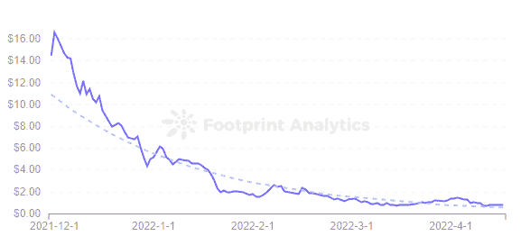

[*Footprint Analytics — Price of THG*](https://www.footprint.network/guest/chart/Price-of-THG-fp-6a955208-1b62-4276-b23f-167465a134e4#secret=1037BE6C37180A06FE28CD7EB235C87F&key=eyJwYXJhbWV0ZXJzIjpbXSwicGFyYW1ldGVyVmFsdWVzIjp7fSwicGFyYW1ldGVyX21hcHBpbmdzIjpbXSwiZGFzaGJvYXJkVXVpZCI6IjZkNmJiOTZlLTJlNTctNGViMC04ZjYwLWNhYzFkODY4YzdmMiJ9)

为了防止挖掘和出售，Thetan Arena 设置了一个令牌撤回阈值，即玩家帐户创建至少 12 天后才能被撤回 THG(每 48 小时一次)。)

*   **THC**

THC 也是 BEP-20 的标准令牌，但在 Thetan Arena 游戏中，它的总供应量没有上限。它可以与 THG 结合使用来购买盲盒，在现场游戏中奖励主播，或在市场上出售。

玩家每赢得一场战斗都会获得 gTHC 奖励，奖励的大小取决于胜利的次数和英雄的稀有度，稀有度越高，奖励越高。他们也可以通过完成任务来获得。

gTHC 可以每 48 小时兑换一次 THC 提款，当且仅当玩家的帐户中有超过 750 gTHC，他们的帐户已经创建了至少 12 天，并且他们的等级在青铜 I 级以上。

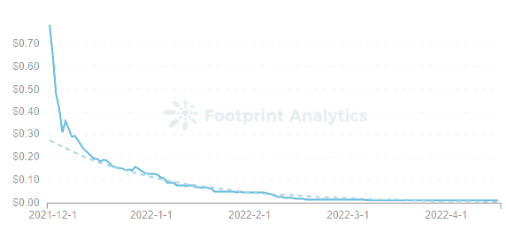

[*Footprint Analytics — Price of THC*](https://www.footprint.network/guest/chart/Price-of-THC-fp-4f440b15-bf40-4cf1-8695-553636cdfaf9?channel=u-DnmMUY#secret=38A68B0687ECBD1102ACA7E38D232A88)

截至 4 月 10 日，货柜码头处理费的价格趋势大致与 THG 的价格趋势一致。自 2021 年 12 月以来，二者一直呈下降趋势。[THC 目前价格](https://www.footprint.network/guest/chart/Price-of-THC-fp-4f440b15-bf40-4cf1-8695-553636cdfaf9?channel=ENG-235#secret=38A68B0687ECBD1102ACA7E38D232A88)为 0.012 美元，2021 年 11 月 30 日创下 0.78 美元的历史新高。

# Thetan 竞技场的性能和统计数据

虽然 Thetan Arena 是 BSC 链中最受欢迎的多人游戏，但 Thetan Arena 的用户性能很差。[活跃用户](https://www.footprint.network/guest/chart/Daily-Gamers-Trend-%7C-Thetan-Arena-fp-3b353097-b7b7-4065-ac96-2c6d0e168597?channel=ENG-235#secret=376AA6004C278CA349045FA956A0A84A)适中，但新用户增长和留存率较弱。

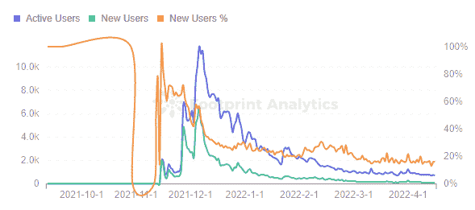

[*Footprint Analytics — Daily Gamers Trend | Thetan Arena*](https://footprint.cool/jhRz)

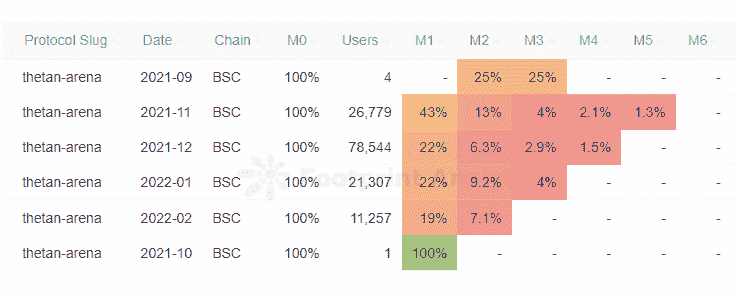

[*Footprint Analytics — Thetan Arena’s User’s Monthly Retention*](https://footprint.cool/1hTv)

此外，Thetan Arena 的一个更大的优势在于它与传统游戏的契合度，对于链游戏的新手来说没有很高的门槛。这使得 Thetan 竞技场成为 BSC 链上 MOBA 游戏之王，但它也限制了 Thetan 竞技场，并且需要在未来进行一些创新。

***这一块是由*** [***足迹分析***](https://www.footprint.network/?channel=ENG-209) ***社区贡献的。***

*Footprint 社区是一个世界各地的数据和加密爱好者相互帮助了解和获得关于 Web3、元宇宙、DeFi、GameFi 或区块链新兴世界任何其他领域的见解的地方。在这里，你会发现活跃的、不同的声音相互支持，推动着社区向前发展。*