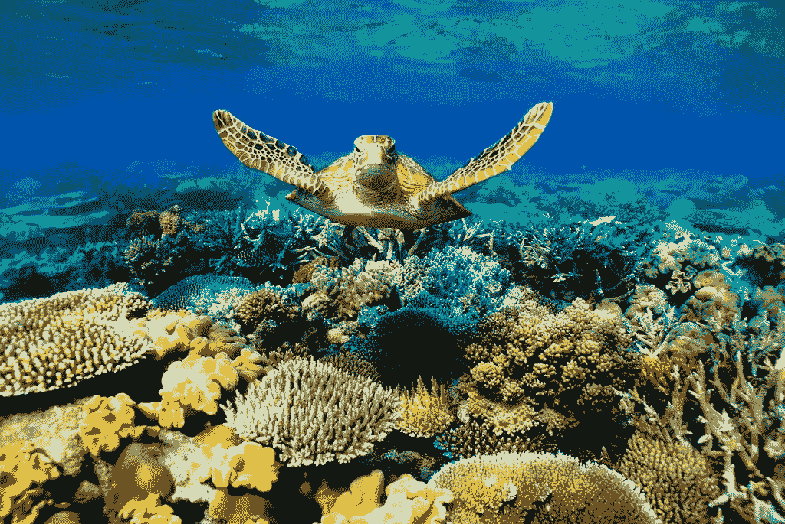
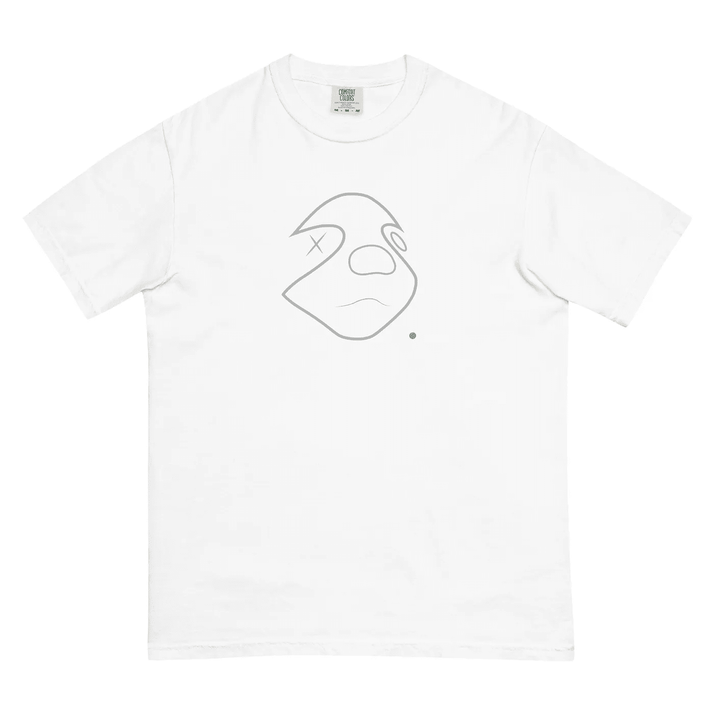
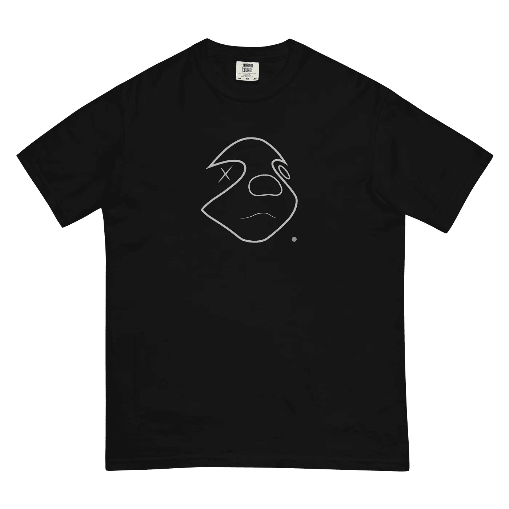
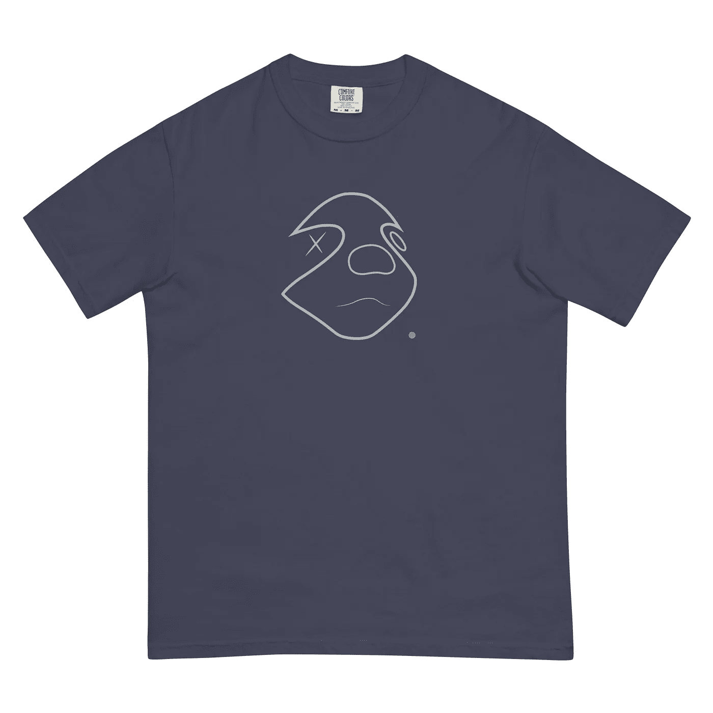

# 我希望在开始一个 NFT 项目之前就知道的事情

> 原文：<https://medium.com/coinmonks/things-i-wish-i-knew-before-starting-a-nft-project-a52638f4c00e?source=collection_archive---------44----------------------->

大多数 Web 3 领域的新手低估了启动 NFT 项目所需的工作量。从艺术创作到不和谐社区管理，再到人脉+先令。作为一个业余爱好者创作者，或者你甚至可以把我称为埃尔登环中可怜的初学者。如果你即将开始你的 NFT 项目，这里是我为你开始你的新游戏学到的一些经验。

# 永远将你的作品存档。

> 你已经完成了你的第一件艺术品，你认为它很棒，我们可能也会这么认为，你很兴奋地把它放到公海上，看看你能卖多少钱。然后你有了第二个疑问，你是否应该做更多，把它变成一个系列。你只剩下一个问题，我是应该等着出版我的作品，还是直接投入进去？

这里要强调的一个教训是，这是对艺术品本身 100%是 NFT 的误解，也是人们购买它的原因。像 Pak 这样的人能够用一个单独的 PNG 文件获得一生的财富，你没有错。但是你可能低估了这些艺术家为了发展他们的网络影响力和艺术作品所经历的多年磨练和坚持。也看看[皮普尔](https://twitter.com/beeple)对他过去 20 多年的生活说了些什么，你会惊讶于这些艺术家是多么的耐心和慷慨:

*JF:“你对想进入这一行的人有什么建议吗？”*

*皮普尔:“现在有大量的教程和免费软件，我制作数字艺术已经有 20 年了，所以这不会是一蹴而就的事情，但你会看到很多人在做这件事，艺术家也在采用这种方法，因为这是另一种赚钱和谋生的方式。”*

在完整的一集里，它显示了艺术家+艺术品都随着时间的推移而演变，他 20 年前所做的事情最终出现在一个受欢迎的脱口秀节目中。但这是一个对 NFT 项目有价值的故事，或者说是给数字艺术空间注入生命的故事。即使买家对艺术品不感兴趣，他们肯定会对故事感兴趣，这就是“Beeple”这个名字背后的整个品牌。

现在让我们回到你身上，作为一个站在起跑线上的可怜的数字艺术家，是时候让你像所有这些人一样流血了。准备好与你的艺术作品一起发展，并不断怀疑你是否在正确的道路上。但最重要的是，记录下你今天的工作。不要担心做一系列同样的事情。

# 选择一个较小的区块链。

在更小的区块链上，并不一定意味着你不会做得很好。你将接触到一个更小的用户群，但几乎没有竞争，你可以很容易地抢走聚光灯，享受先发优势。另一个值得注意的优势是，你不会有任何天然气战争或高昂的天然气费用，就像目前以太坊 NFT 项目一样。如果你不急着清算你所有的加密货币(你不应该这样)，那么任何一个拥有 NFT 市场的较小的区块链都适合你。不要成为另一条试图在拥挤的池塘中寻找空间的鱼，顺流而下，获得更多的生长空间。

Or be this turtle. Much space. Wow.

# 放弃而不是放弃。

不是所有的 NFT 项目都能成功，让我们面对现实吧。那些现在看起来表现不错的公司，到年底也可能表现不佳(咳咳， [$LUNA](https://coinmarketcap.com/currencies/terra-luna/) )。因此，对这个领域的几乎任何事情都保持开放的心态总是好的，如果你的 NFT 项目进展不顺利，后退一步(或者享受一个愉快的长假)，然后回来用新工具和新想法再次尝试。问问你的朋友&家人，他们对你的工作有什么看法，不要只是孤立地工作，接受批评，在工作过程中调整你的工作，即使你已经列出了你以前的工作。继续走。

# 投资他人。

网上的每个人都是现实生活中的另一个人。你永远不知道谁潜伏在你的不和谐社区中，如果你发现他们在现实生活中很出名，你也不应该区别对待他们。也就是说，像投资自己的工作一样投资别人的工作总是很重要的(当你有一些闲钱的时候)。找到一个你相信的项目/人可能很难，但是试着避开烟幕，在不和谐频道中与真实的人交谈，问他们为什么在这里，并与他们真实地交流。不要最终成为被一群机器人和骗子引诱的人，并被奉承相信一个快速攫取现金的项目。花时间了解一个项目，并决定它们是否值得你花钱。

# 加厚你的皮肤。

像所有的生意一样，你既是艺术家又是出售的产品。有些人会喜欢你的工作，有些人不太喜欢，有些人根本不喜欢。脸皮厚一点，能经受住各种批评，和谦虚接受所有的赞美和爱一样重要。我并不是说让人们对你颐指气使，而是避免个人化和防御性，而是感谢他们花时间提供建设性的反馈，从中学习，然后继续前进。然而，如果你认为他们的提议不符合你的目标，试着说服他们。

# 最重要的是，保持冷静，玩得开心。

很多人现在在这个领域是为了快速致富，这并不意味着你必须像其他人一样。事实上，我会鼓励你不要像其他人一样追逐短期收益。身处新网络的有趣之处在于，越来越多像你一样的人彼此联系越来越紧密。更多地了解他们在做什么，了解他们的爱好，尝试一些新的东西，你可能每天都会在这里或那里获得一些见解，如果不是见解，那就是娱乐。比如看看这些我们随机开始制作的 t 恤:

*   它们也超级舒服！(如果你想制作自己的 t 恤印花，强烈推荐舒适色空白！随时问我为什么！).

> 加入 Coinmonks [电报频道](https://t.me/coincodecap)和 [Youtube 频道](https://www.youtube.com/c/coinmonks/videos)了解加密交易和投资

# 另外，阅读

*   [3 商业评论](/coinmonks/3commas-review-an-excellent-crypto-trading-bot-2020-1313a58bec92) | [Pionex 评论](https://coincodecap.com/pionex-review-exchange-with-crypto-trading-bot) | [Coinrule 评论](/coinmonks/coinrule-review-2021-a-beginner-friendly-crypto-trading-bot-daf0504848ba)
*   [莱杰 vs n rave](/coinmonks/ledger-vs-ngrave-zero-7e40f0c1d694)|[莱杰 nano s vs x](/coinmonks/ledger-nano-s-vs-x-battery-hardware-price-storage-59a6663fe3b0) | [币安评论](/coinmonks/binance-review-ee10d3bf3b6e)
*   [Bybit Exchange 审查](/coinmonks/bybit-exchange-review-dbd570019b71) | [Bityard 审查](https://coincodecap.com/bityard-reivew) | [Jet-Bot 审查](https://coincodecap.com/jet-bot-review)
*   [3 commas vs crypto hopper](/coinmonks/3commas-vs-pionex-vs-cryptohopper-best-crypto-bot-6a98d2baa203)|[赚取加密利息](/coinmonks/earn-crypto-interest-b10b810fdda3)
*   最好的比特币[硬件钱包](/coinmonks/hardware-wallets-dfa1211730c6) | [BitBox02 回顾](/coinmonks/bitbox02-review-your-swiss-bitcoin-hardware-wallet-c36c88fff29)
*   [BlockFi vs Celsius](/coinmonks/blockfi-vs-celsius-vs-hodlnaut-8a1cc8c26630)|[Hodlnaut 点评](/coinmonks/hodlnaut-review-best-way-to-hodl-is-to-earn-interest-on-your-bitcoin-6658a8c19edf) | [KuCoin 点评](https://coincodecap.com/kucoin-review)