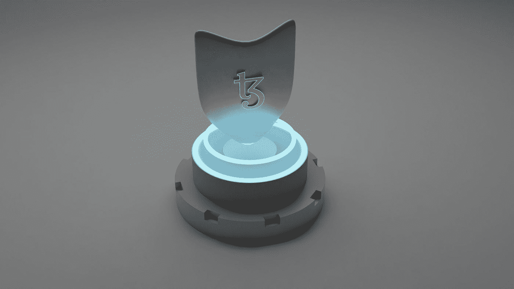

# 购买 NFT 域名时需要注意的事项

> 原文：<https://medium.com/coinmonks/things-to-look-out-for-when-purchasing-a-nft-domain-a75b78077ce2?source=collection_archive---------9----------------------->

开始使用 Web3 就像购买一个 NFT 域名一样简单。在开始之前，有几件事需要考虑。

Photo by [Shubham Dhage](https://unsplash.com/@theshubhamdhage?utm_source=medium&utm_medium=referral) on [Unsplash](https://unsplash.com?utm_source=medium&utm_medium=referral)

## 1.购买与租赁

价格，就像任何购买决策的其他方面一样，有着重要的作用。人们很容易被诱惑以低价购买一个名字，但不要被愚弄；并非所有域名购买都是平等的。一些注册商(监管互联网域名保留的企业)打出难以置信的低价广告，但你必须在有生之年支付年度续费，从而迫使你每年支付更高的费用来保留你的域名。

Photo by [Andrey Metelev](https://unsplash.com/@metelevan?utm_source=medium&utm_medium=referral) on [Unsplash](https://unsplash.com?utm_source=medium&utm_medium=referral)

**留意:**

你将拥有你的域名，还是将在你的余生中租用它？
年度续费:续费需要付费吗？它们会随着时间变好吗？登记员有没有保证将来价格不会上涨？如果你不付款会怎么样？这些都是要问的关键问题，这样你才能确切地了解你要进入的领域。
燃气费:大多数区块链交易都需要支付燃气费。了解您的域名注册商是否计划在未来涵盖天然气价格，或者这是否是您应该预计在未来支付的成本，这一点至关重要。

## 2.可用性

购买域名时，考虑你选择的名称(无论是字母、数字还是表情符号)是否容易记忆、阅读和识别。如果有人给你寄钱或寻找你的网站，你会希望确保你的域名不会与另一个混淆。

例如，您可能希望避免在一行中使用太多相同的字母，以避免个人意外键入错误的组合(iii.crypto 看起来非常类似于 iiii.crypto)。

## 3.客户服务

一些注册服务商不提供 24/7 支持，甚至不提供真人支持，这可能会让您在需要帮助时陷入困境。一些公司不再提供独立的支持团队，而是依靠他们的销售团队。购买域名时，请仔细阅读关于注册服务商支持团队的评论，或者在购买前直接联系他们。你需要一个服务和帮助令人愉快且专业的注册商，而不是一个像收银机一样对待你的人。

Photo by [LumenSoft Technologies](https://unsplash.com/@candelarms?utm_source=medium&utm_medium=referral) on [Unsplash](https://unsplash.com?utm_source=medium&utm_medium=referral)

## 4.支持本机浏览器

如果你想利用你的域名来托管一个网站或者一个 NFT 画廊，你需要确保它能兼容尽可能多的本地浏览器或者提供浏览器扩展。

检查他们是否与 Opera、Brave 兼容，以及他们是否有 Chrome 或 Firefox 扩展，等等。我们预计随着时间的推移，会有更多的浏览器支持 NFT 域名，但与此同时，最好还是坚持使用目前支持最多的浏览器。

## 5.钱包兼容性

如果你的钱包不支持 NFT 域名，那么它作为钱包用户名有什么用呢？查看您正在使用的域名注册机构是否支持一些最流行的钱包，如比特币基地、Metamask 和 Trust Wallet 等。当你选择用你的域名改变你的钱包地址时，相信我们，当我们说这将使你的生活变得容易得多。

## 你还在等什么？

立即在[不可阻挡的域名搜索您的域名！](https://unstoppabledomains.com/?ref=a09cc25964d04ef)

> 加入 Coinmonks [电报频道](https://t.me/coincodecap)和 [Youtube 频道](https://www.youtube.com/c/coinmonks/videos)了解加密交易和投资

# 另外，阅读

*   [3 商业评论](/coinmonks/3commas-review-an-excellent-crypto-trading-bot-2020-1313a58bec92) | [Pionex 评论](https://coincodecap.com/pionex-review-exchange-with-crypto-trading-bot) | [Coinrule 评论](/coinmonks/coinrule-review-2021-a-beginner-friendly-crypto-trading-bot-daf0504848ba)
*   [莱杰 vs n rave](/coinmonks/ledger-vs-ngrave-zero-7e40f0c1d694)|[莱杰 nano s vs x](/coinmonks/ledger-nano-s-vs-x-battery-hardware-price-storage-59a6663fe3b0) | [币安评论](/coinmonks/binance-review-ee10d3bf3b6e)
*   [Bybit Exchange 审查](/coinmonks/bybit-exchange-review-dbd570019b71) | [Bityard 审查](https://coincodecap.com/bityard-reivew) | [Jet-Bot 审查](https://coincodecap.com/jet-bot-review)
*   [3 commas vs crypto hopper](/coinmonks/3commas-vs-pionex-vs-cryptohopper-best-crypto-bot-6a98d2baa203)|[赚取秘密利息](/coinmonks/earn-crypto-interest-b10b810fdda3)
*   最好的比特币[硬件钱包](/coinmonks/hardware-wallets-dfa1211730c6) | [BitBox02 回顾](/coinmonks/bitbox02-review-your-swiss-bitcoin-hardware-wallet-c36c88fff29)