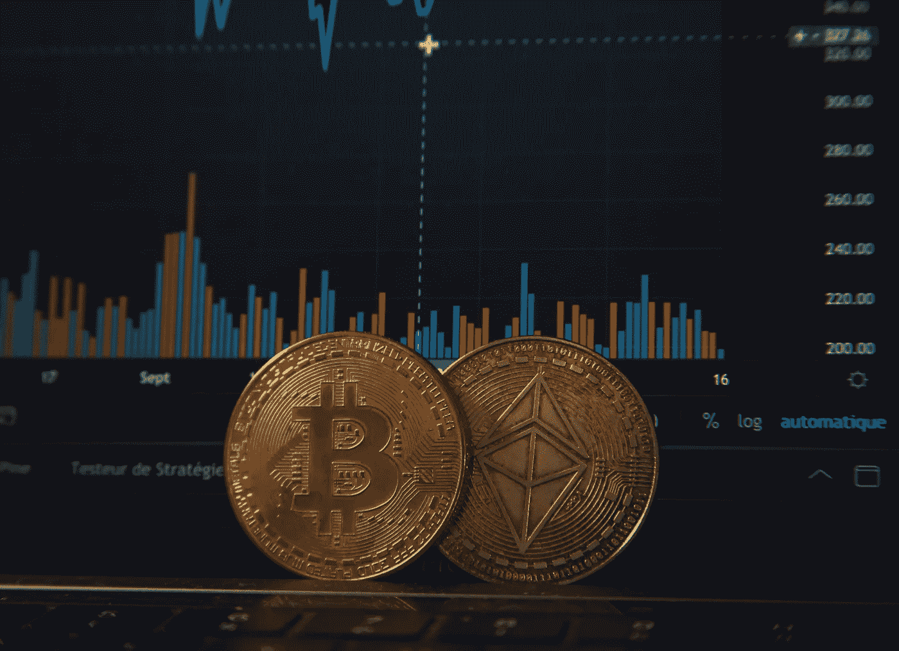

# 从最近的密码市场崩溃中需要注意的事情

> 原文：<https://medium.com/coinmonks/things-to-note-from-the-latest-crypto-market-crash-a1d5c729fb55?source=collection_archive---------45----------------------->

上周，加密市场市值从 3.1 万亿美元的历史高点暴跌至 1.3 万亿美元。结果，价值最大的硬币比特币下跌超过 50%，而其他许多硬币也变得一文不值。这一不幸事件使许多投资者损失了大量投资组合，并加大了交易者自杀未遂的风险。

虽然跌势已经停止，有明显的复苏迹象，但这一事件将在一段时间内给市场和投资者的头脑留下印记。在这篇文章中，我将讨论一些非常重要的从崩溃，以及它将如何影响人们对区块链的看法。

*source: Online*

**加密和股票市场已经同步**

政府、金融机构和大公司已经准备好接受加密货币作为法定货币和支付选择。例如，中非共和国最近加入了接受比特币为法定货币的国家联盟。此外，特斯拉已经接受硬币作为购买其汽车的支付选项。这些和更多的已制定了更多的政府法规，以确保通过加密进行的金融交易不被用于资助恐怖主义和其他形式的犯罪。难怪当股市下跌时，加密市场也受到了冲击。

这意味着加密货币变得越来越受欢迎，尽管它们具有波动性，但投资者正在探索它们作为通胀的安全地带。

**比特币崩盘不会影响主流经济**

虽然加密市场确实与股票市场同步下跌，但它对经济的影响不会很大。银行不会押注于加密技术，因为它是新的、不稳定的。此外，crypto 的市值为 3.1 万亿美元，但与美国经济的其他部门相比，这一数字低得离谱，更不用说全球经济了。

**稳定的歌曲并不总是稳定的**

这次崩溃也暴露了一些令人担忧的事情——稳定的硬币可能并不总是稳定的。

稳定币是一种由法定货币支持的硬币，比如说，美元。其价值与法定货币挂钩，使其成为交易者和投资者在波动期间的避风港。

有两种主要类型的稳定圈；储备支持和算法支持。前者意味着有真金白银做后盾，而后者意味着它模仿了真金白银的算法。

无论如何，一个算法支持的稳定硬币，卢娜和 UST 都倒下了，这引起了人们对稳定硬币可能脆弱的担忧。卢娜实际上一文不值，而 UST 没有任何迹象表明恢复很快。这一事件影响了这种稳定硬币的发展，而且可能会持续一段时间。

source: online

**俄罗斯乌克兰战争加剧波动**

这场战争已经持续了一段时间，它所做的不仅仅是战争本身。这场战争使股票价格暴跌，通货膨胀和利率上升，燃料价格上涨。这使得欧洲股市下跌，同时他们的货币也贬值了。这也提高了小麦和金属等商品的价格。

这可能是垮台蔓延到股票市场之前开始的地方，然后加密。

**加密下降影响了区块链的其他服务**

DeFi(分散融资)和 NFTs 致力于区块链技术，也未能幸免于此次危机。由于加密货币是这些服务的货币，投资者已经失去了他们的钱，并且没有任何迹象表明会很快投资。

提供 DeFi 服务的公司有类似硬币的代币。这次崩溃使得 token 下跌了 24%，减缓了数字世界中最热门的服务之一。DeFi 服务行业的巨头之一比特币基地的股票暴跌，币安也受到了冲击。DeFi 的表现一直不佳，而且很不幸的是，它现在可能还会如此。

NFT 股市去年触及历史高点后开始反弹，而且没有停止的迹象。然而，该领域的进入和活动急剧下降，加密受到打击意味着 NFT 在一段时间内也不会复苏。

**比特币可能只是在下跌前的休整，而不是零**

虽然比特币目前正在获得势头，但它可能是另一次下跌前的一次吞咽。这枚硬币已经突破了它的许多支持区域，最近的是 30，000 美元的水平，目前正在巩固。如果它进一步下跌，这意味着又一系列的损失，市场可能会陷入更大的麻烦。

然而，这并不意味着比特币会崩溃为零。目前它可能在较低的价格范围内，但不是零。这不是比特币第一次下跌，也绝对不是最后一次。所以，坐稳了，因为这个硬币还是会涨的。

> 加入 Coinmonks [电报频道](https://t.me/coincodecap)和 [Youtube 频道](https://www.youtube.com/c/coinmonks/videos)了解加密交易和投资

# 另外，阅读

*   [Bookmap 评论](https://coincodecap.com/bookmap-review-2021-best-trading-software) | [美国 5 大最佳加密交易所](https://coincodecap.com/crypto-exchange-usa)
*   最佳加密[硬件钱包](/coinmonks/hardware-wallets-dfa1211730c6) | [Bitbns 评论](/coinmonks/bitbns-review-38256a07e161)
*   [新加坡十大最佳加密交易所](https://coincodecap.com/crypto-exchange-in-singapore) | [收购 AXS](https://coincodecap.com/buy-axs-token)
*   [红狗赌场评论](https://coincodecap.com/red-dog-casino-review) | [Swyftx 评论](https://coincodecap.com/swyftx-review) | [CoinGate 评论](https://coincodecap.com/coingate-review)
*   [投资印度的最佳加密软件](https://coincodecap.com/best-crypto-to-invest-in-india-in-2021)|[WazirX P2P](https://coincodecap.com/wazirx-p2p)|[Hi Dollar Review](https://coincodecap.com/hi-dollar-review)
*   [加拿大最佳加密交易机器人](https://coincodecap.com/5-best-crypto-trading-bots-in-canada) | [库币评论](https://coincodecap.com/kucoin-review)
*   [火币的加密交易信号](https://coincodecap.com/huobi-crypto-trading-signals) | [HitBTC 审查](/coinmonks/hitbtc-review-c5143c5d53c2)