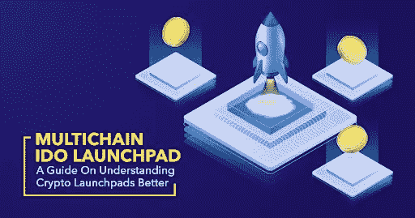
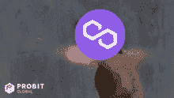

# 关于多链 IDO Launchpad 你需要知道的事情

> 原文：<https://medium.com/coinmonks/things-you-need-to-know-about-multi-chain-ido-launchpad-64697f3c6939?source=collection_archive---------13----------------------->

IDO launchpad

筹资一直是任何加密项目的重要组成部分。无论是来自风险投资家的资金还是通过众筹获得的资金，一次成功的筹资都会带来一个成功的项目。加密世界不再仅仅是分散金融、交易和交换加密货币。普通加密用户通过参与最初的 DEX 发行开始投资有前途的加密项目。这为投资者提供了被动收入，为 IDO 代币提供了巨大的流动性，增加了为项目开发筹集更多资金的机会，从而带来了巨大的好处。在本文中，您将了解到 [**多链 IDO launchpad**](https://www.appdupe.com/ido-launchpad-development-on-multi-chain?utm_source=google&utm_medium=blog&utm_campaign=monika) 以及为什么它们是加密世界的新趋势。

# 🔓**多链 IDO 发射台**

最近，加密世界不再围绕比特币和以太坊运转。区块链技术的开源特性带来了许多新的区块链，如 Solana、Cardano、Polkadot、Avalanche 等等。其中一些甚至慢慢成为以太坊杀手，在可伸缩性、汽油费、流量和交易费方面比以太坊表现更好。

支持各种业务的新的基于密码的项目开始在这些区块链出现。由于筹款是一个重要的方面，这些项目需要更广泛的受众来寻找他们的资金。在一个专注于特定区块链的项目和用户的发射台推出 IDO，无法触及更广泛意义上的潜在投资者。这就是引入多链 IDO launchpads 的原因。这为用户提供了一个平台，让他们在同一个屋檐下寻找各种区块链有前途的项目。另一方面，它有助于项目接触到更广泛的受众。

几乎每一个正在崛起并主持许多新项目的区块链都是 EVM 兼容的。以太坊虚拟机兼容性只不过是区块链在以太坊环境中执行代码的能力。任何兼容 EVM 的区块链都可以与其他兼容 EVM 的区块链网络交互。

业内一些主要的 EVM 兼容链是，多边形链，币安智能链，雪崩合同链或 C 链，Polkadot 等。这些区块链可以与不同区块链的令牌互操作。

freepik

## 🔓**多链对单链的动力**

如前所述，多链发射台和单链发射台的主要区别在于，后者为更多参与者提供了更多区块链和包容性。

为多链加分的另一个主要因素是多链 launchpad 包括对多个令牌或硬币的支持，以及令牌桥接功能。

## 🔓**多链 IDO launchpad 的优势**

💡**整合-** 随着行业的发展，通过实现简单安全的跨链访问来成功统一市场的创新解决方案将变得至关重要。多链发射台代表了这种发展的潜力。

💡**可扩展性-** 多链发射台也有助于实现发射台的可扩展性愿景。这意味着有能力在不中断的情况下容纳越来越多的用户。正如卡尔达诺的查尔斯·霍斯金森所说。区块链技术适用于任何可能不一定相互信任的人不得不一起工作的情况。

tenor.com

💡**扩大市场准入-** 除了他们的主要区块链，加密项目将需要接触更多的用户，找到更多的投资者，并提高他们的令牌效用。多链发射台有助于实现这三个目标。在多链 launchpad 上启动项目令牌时，保证了显著的跨链可见性。

 [## 开始开发 IDO Token Launchpad 的全面指南-伦敦时间

### 虽然加密货币现在做得很好，但在过去，它们曾一度难以满足资金需求…

www.londontime.co](https://www.londontime.co/a-comprehensive-guide-to-start-your-ido-token-launchpad-development/) 

## 🔓**寻求多链 IDO 发射台的项目**

自 DEX 出现以来，它为成千上万的加密企业家和初创公司提供了一个获得他们应得的资金的绝佳机会。尽管由于项目要求，人们仍然更喜欢最初的硬币发行，但 IDO 仍然是交易者最喜欢的流动性和即时交易选项。其中一些是

✔️ **DeFi-** 许多基于分散融资的项目使用 IDO 来筹集资金。如上所述，通过在分散平台中提供代币的即时交易，它们积极地为 defi 代币提供更好的流动性。

✔️ **区块链游戏-** 在区块链上开发的“玩赚”游戏是目前业内最受关注的游戏。这些通过 IDO 的游戏代币可以让玩家提前获得游戏中的配件和角色。这证明了玩家在玩游戏时以较少的投资获得收益是有益的。

> 金融的去中心化对人类真的有好处，最终对我们每个人都是一个胜利

✔️ **基于体育的应用-** 人们开始使用区块链做任何事情，因为它很快将成为未来。有许多基于运动的应用程序开始在区块链出现，最近推出了锻炼赚钱。一些例子包括 Jumpn、Bikearn 等

✔️ **元宇宙-** 因为元宇宙是一种新兴技术，积极吸收区块链技术。这是元宇宙项目慢慢出现的初始阶段，它正在利用首次发行 Dex 积极筹集资金。

## 🔓**外卖**

由于在各种区块链网络上寻求 IDO 的项目存在多样性，因此需要一个[多链 IDO 发射台](https://www.appdupe.com/ido-launchpad-development-on-multi-chain?utm_source=google&utm_medium=blog&utm_campaign=monika)。这个平台是同一屋檐下不同区块链的投资者和项目持有人之间的桥梁。这也是兼容 EVM 教的区块链人相互交流的媒介。因此，这为创业者开发多链 IDO 平台打开了大门。

> 加入 Coinmonks [电报频道](https://t.me/coincodecap)和 [Youtube 频道](https://www.youtube.com/c/coinmonks/videos)了解加密交易和投资

# 另外，阅读

*   [如何购买 Monero](https://coincodecap.com/buy-monero) | [IDEX 评论](https://coincodecap.com/idex-review) | [BitKan 交易机器人](https://coincodecap.com/bitkan-trading-bot)
*   [CoinDCX 评论](/coinmonks/coindcx-review-8444db3621a2) | [加密保证金交易交易所](https://coincodecap.com/crypto-margin-trading-exchanges)
*   [红狗赌场评论](https://coincodecap.com/red-dog-casino-review) | [Swyftx 评论](https://coincodecap.com/swyftx-review) | [CoinGate 评论](https://coincodecap.com/coingate-review)
*   [Bookmap 评论](https://coincodecap.com/bookmap-review-2021-best-trading-software) | [美国 5 大最佳加密交易所](https://coincodecap.com/crypto-exchange-usa)
*   [如何在 FTX 交易所交易期货](https://coincodecap.com/ftx-futures-trading) | [OKEx vs 币安](https://coincodecap.com/okex-vs-binance)
*   [CoinLoan 评论](https://coincodecap.com/coinloan-review) | [YouHodler 评论](/coinmonks/youhodler-4-easy-ways-to-make-money-98969b9689f2) | [BlockFi 评论](https://coincodecap.com/blockfi-review)
*   [XT.COM 评论](https://coincodecap.com/profittradingapp-for-binance) | [币安评论](https://coincodecap.com/xt-com-review)