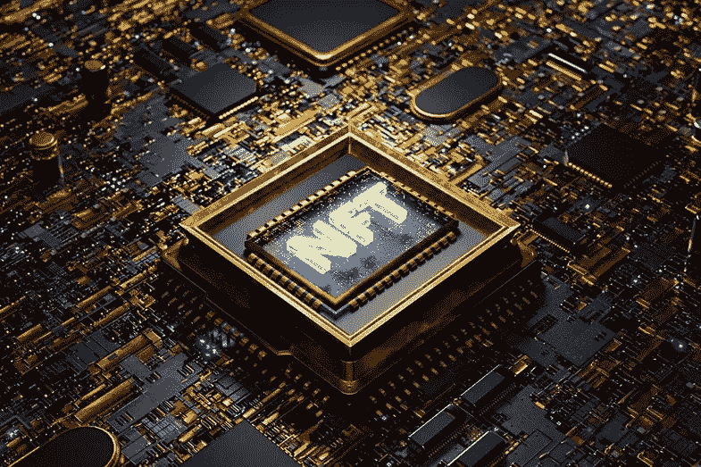

# 关于 NFT 你需要知道的事情

> 原文：<https://medium.com/coinmonks/things-you-need-to-know-about-nft-95dada69a142?source=collection_archive---------37----------------------->

[](https://cyberscrilla.com/the-future-of-nfts-explained/)

2021 年 3 月，佳士得拍卖行以 6900 万美元的价格卖出了一件名为《每一天》(Everydays)的艺术品《最初的 5000 天》(The First 5000 Days)。重要的是，这件作品是作为不可替代的象征出售的(NFT)。

从那时起，NFT 开始以各种方式渗透文化。通过像 OpenSea 和 Foundation 这样的公共市场，以及像 NBA Top Shot 这样的定制应用程序，现在每周都有数亿美元的 NFT 销售额。

那么，NFTs 究竟是如何在如此短的时间内变得如此流行的呢？在这篇文章中，我们将从以下五个方面帮助你揭示 NFT 成功的秘密:“NFT 的概念”、“NFT 的价值”、“NFT 的来源”、“NFT 的作用”和“NFT 的未来”。

# 什么是 NFT？(NFT 的构想)

“NFT 是一种社交媒体:它不仅仅是挂在墙上的东西。更像是某个俱乐部或者邪教的成员。作为一种机制，NFT 让赋予数字艺术价值成为可能，这为一种不受物理限制的媒介打开了一扇可能性之海的大门。”佳士得拍卖行的艺术专家诺亚·戴维斯说。

也许我们可以更容易地解释它。NFT 是一种存在于区块链上的加密资产，其中可收集的项目通过赋予其唯一的代码而变得唯一。由于代码的存在，人们可以成为数字资产的所有者，因为每个 NFT 都是独一无二的，无法复制。

# **为什么 NFT 如此受欢迎？**(NFT 的价值)

下面是这个问题的几个答案。

## **1。NFT 改变了数字资产市场的历史。**

在历史上，没有办法将数字艺术品的“所有者”与只是将副本保存到桌面上的人区分开来。在有人可以购买一件物品之前，必须明确谁有权出售它，一旦有人购买，所有权将从卖方转移到买方。NFT 解决这个问题的方法是给当事人一些他们同意代表所有权的东西，他们还实现了一种新型交易的形成，如购买和出售以前从未出售过的物品，或使交易以创新的方式发生。

## **2。非正规金融交易可以用来创造各种不同项目的市场，因为非正规金融交易的所有权很容易证明和转让。**

基于“不可替代”的特性，每个 NFT 都是独一无二的数字物品。它们存储在面向公众的数字账本上，名为区块链，这意味着，可以证明谁在任何时候拥有某个 NFT，并追溯之前的所有权历史。此外，从一个人到另一个人转移 NFT 很容易，就像银行可以跨账户转移资金一样。

## **3。NFT 可以在数字空间和物理世界中给予利益或允许其所有者获得利益。**

因为区块链是可编程的，所以有可能赋予 NFT 一些特性，使它们能够随着时间的推移扩展它们的用途，甚至为它们的所有者提供直接的效用。例如，NFT 可以作为在线空间的数字钥匙，持有者可以在其中相互交流，就像会员卡或门票一样，提供对活动、独家商品和特殊折扣的访问。NFT 纽约会议是创作者为其 NFT 持有者组织的面对面聚会。此外，NFTs 可以帮助所有者进入在线游戏、聊天室、商店等等。由于区块链是公开的，创作者团队有时会以扩展产品生态系统的方式向其 NFT 持有者授予额外的令牌或项目。特定山羊 NFT 的主人可以申请一只免费的小山羊 NFT。NFT 熊的主人可以收到蜂蜜。这些为 NFTs 所有者提供了简单所有权和原始令牌之外的好处。

总之，NFTs 的价值体现在它让你同时成为投资者、俱乐部成员、品牌股东和忠诚度计划的参与者。同时，NFTs 的可编程性也拓展了新的商业和盈利模式。例如，NFTs 可以帮助实现一种新型的版税合同，当作品每次转售时，交易的一部分回到原创作者手中，这也是创作者新的有效的创收方式。

# 如何才能获得 NFT？(NFTs 的来源)

一般来说，有三种方法可以获得 NFTs。

## **1。你可以从许多市场中的任何一个购买 NFT，比如 Opensea、Nifty Gateway 或 NBA Top Shot。**

直到 2022 年 6 月，有几个 NFT 市场购买 NFT 作为参考。

1.开阔海域。OpenSea 是目前最大的、最通用的 NFT 市场之一。它在艺术、音乐、体育、游戏、时尚和收藏品等多个领域提供了广泛的非物质文化遗产。Opensea 的大量学习资源使其易于访问和使用。

2.NBA 顶级投篮。NBA Top Shot 是一个 NFT 市场，提供来自游戏和个人球员的重大 NBA 视频集锦的数字 NFT。

3.漂亮的网关。Nifty Gateway 提供各种各样的 NFT 艺术品，吸引那些旨在收藏或交易具有长期价值的艺术品的买家。

**请注意！在你通过 NFT 市场购买 NFT 之前，你必须:**

1.开立 exchange 帐户和加密钱包。

2.购买以太坊，最广泛用于购买 NFT 的代币。

3.将以太坊转入加密钱包。

4.将您的加密钱包连接到 NFT 市场。

然后你就可以做 NFTs 的交易了。对于每一笔 NFT 交易，这些平台都会收取一点费用。

## **2。加入游戏公会获得 NFT。**

你也可以加入游戏公会来获得 NFT。许多游戏公会为新玩家设立了奖学金制度。他们可以为新玩家提供免费的 NFT、其他资源和信息，让他们更轻松地玩 P2E 游戏。我们建议玩家加入 X-Ra Gameverse。

## **3。设计并生成您自己的 NFT。**

您可以使用自己的视频、音频和图像在区块链上设计和生成独特的 NFT，用于销售或其他目的。这也是一种获得 NFTs 的方法，尽管它需要你擅长这个。

# **NFT 有什么用途？**(NFTs 的功能)

在你得到 NFT 之后，你会发现它们可以有多种用途。以下是几个例子。

## **1。在您家中展示**

有多种数字显示器和相框可供展示您的 NFTs。

## **2。出于投资目的**

随着时间的推移，许多 NFT 可能会增值，特别是那些来自知名艺术家或收藏的 NFT。

## **3。进行交易**

NFT 有一个快速增长的二级市场。交易者的目标是使用各种交易策略从他们的初始投资中获得回报，例如购买下限(以最低价格购买)或购买上限(购买稀有或有价值的 NFT)。

## **4。在互联网上使用**

很多人用他们的 NFT 作为个人资料图片或者头像。此外，国家艺术博物馆可以在元宇宙展出，可以在虚拟画廊、会议室或你自己的私人空间。

## **5。作为创作者赚取收入**

创作者可以通过铸造过程将他们的作品转化为非艺术作品。你必须首先铸造你的艺术品，以便在市场上出售。根据区块链使用的市场，这一过程可能非常昂贵。许多市场都是一站式商店，并为创作者提供赚取佣金的铸造选择。这一比率变化很大。艺术家还可以从每笔二次销售中获得版税。高端市场是排他性的，需要艺术家申请或邀请。

## **6。作为投资者赚取收入**

有些人利用非金融交易进行交易和投资，非金融交易也可以成为被动收入的来源。以这种方式使用 NFTs 需要付出大量努力来了解加密货币行业和 NFTs 市场。

# **NFTs 的前景如何？(NFTs 的未来)**

最后，让我们简单看看 NFTs 的未来是什么样子的。随着我们继续向更加数字化的经济发展，非技术产业可能在以下 5 个方面发挥不同的作用。

## **1。数字和物理所有权**

NFT 不仅代表数字资产，也可以代表实物商品。是的，NFT 现在和将来都会被用来证明物理资产的所有权，但是现在，NFT 证明数字资产的所有权。

## **2。艺术的未来**

NFT 根除了互联网带来的剽窃和肆意复制的祸根。艺术家对他们创作的作品有更多的控制权，甚至可以直接将作品卖给他们的客户，而不必依赖公司力量或中介。

## **3。智能合约**

对于 NFTs 所有者，智能合同可能会声明您是物理世界中资产的所有者，或者它可以让您访问真实世界的事件。无论是贷款还是其他类型的法律合同，交易都可以通过智能合同来执行，NFTs 可以作为该合同的证明。

## **4。门票和活动**

如前所述，NFT 已经被用作参观现场活动的门票。将来，有可能所有的活动都将使用 NFTs，而不是物理票根。

## **5。数字商务**

未来，电子商务的重点是分散商务，而非功能性交易可以更好地实现这一点。NTF 可以导致电子商务中介的淘汰。在 NTF 的干预下，交易将是点对点的，客户可以直接交易，最终重新获得交易的控制权。

就是这样。这些是你需要知道的关于 NFTs 的一切。我们欢迎您关注我们，获取更多的区块链知识。感谢您的阅读。

```
**Join us:**About X-Ra Gameverse:
X-Ra Gameverse(XRG) is a gaming guild providing the best P2E gaming experience for gamers from different alliances to utilize the functionality of guilds and maximize profits.[**Discord**](https://t.co/QVeGJm4eoo) **|** [**Twitter**](https://twitter.com/XRaGameverse)
```

> 加入 Coinmonks [Telegram group](https://t.me/joinchat/Trz8jaxd6xEsBI4p) 学习加密交易和投资