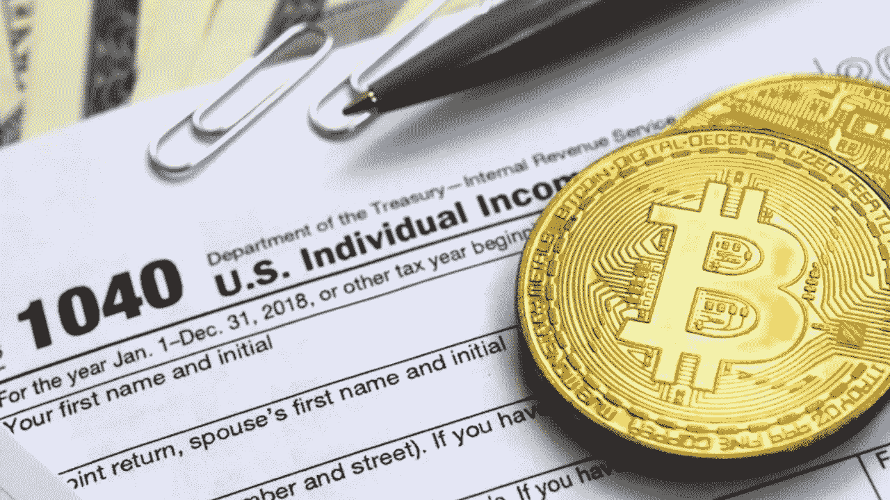
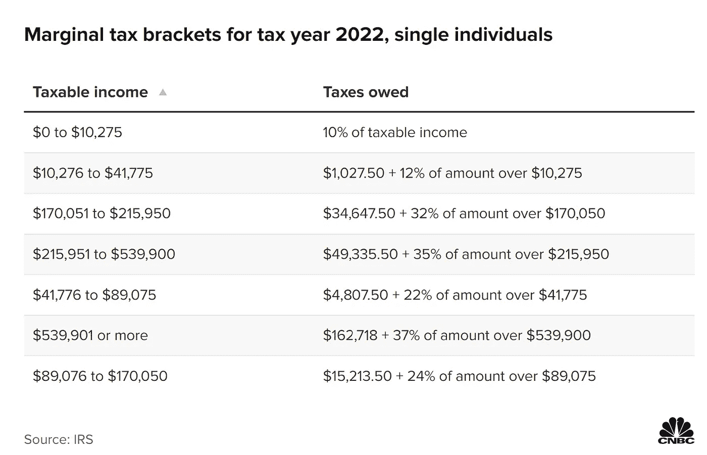

# 关于 2022 年的加密货币税，你应该知道的事情

> 原文：<https://medium.com/coinmonks/things-you-should-know-about-cryptocurrency-taxes-for-2022-bca96797685d?source=collection_archive---------34----------------------->

# 2022 年加密货币税:你需要知道的

他的博客将讨论影响你在美国的加密货币交易的不同变量。

注意，我不是注册会计师顾问，所以我强烈建议在本帖中探讨税收时，就任何可能出现的税务相关问题咨询注册顾问。

当决定在比特币基地、北海巨妖、Gemini、Defi 或使用 Unisswap、ava 和类似工具的相关活动进行分散融资交易时，会发生大量应税活动。让我们回顾一下不同加密交易的几种情况，以及用现金交易加密的潜在税务影响。首先，请记住，将美元等法定货币或现金交易为比特币、以太坊或任何其他加密货币等加密货币，该交易不是应税事件。也就是说，用现金购买价值 XX 美元的加密货币并不意味着支付该交易的任何税款，因为它不被视为应税事件，所以你可以随时用菲亚特或现金购买任何加密货币。你在税务方面做得很好。

当一个密码被换成另一个密码，或者当你选择卖掉那个密码换成另一个密码或现金时，事情就变得不同和复杂了。这些交易场景都是不同的。

# **用密码换现金**

当交易任何密码为现金或另一个密码，这是一个应税事件。三个变量影响交易加密到现金的税务影响。一个是购买和出售现金密码或另一个密码的时间长度。其次是密码买卖的价格差异。换句话说，您是否从交易中获利或亏损(即盈利还是亏损)？最后，第三种是估价方法，用于评估你在出售密码时的成本，如[后进先出](https://www.investopedia.com/terms/l/lifo.asp)或[先进先出](https://www.investopedia.com/terms/f/fifo.asp)、[先进先出](https://www.investopedia.com/terms/h/hifo.asp)(即多单交易)。

## 1-短期与长期资本收益

用现金购买加密货币的日期和用现金或另一个加密货币出售加密货币的日期决定了如何对交易征税。如果在出售交易之前，密码的保存时间少于 12 个月，则该交易需要缴纳短期资本利得税，即您的常规所得税。例如，假设你的年收入在 41，000 美元到 89，000 美元之间，你的所得税税率为 22%，这意味着你的任何收入都要缴纳 22%的所得税。如果你购买了价值 1000 美元的比特币，其价值翻了一倍，达到 2000 美元，而你在购买之日起不到 12 个月内卖出了它。根据你的所得税等级，你将欠爱尔兰共和军 1000 美元的资本利得税。

在美国，根据你每年挣多少钱，你可以处于 10%、12%或 37%的应税收入等级。然而，大多数美国人支付 22%以上的税级，这在考虑短期和长期资本利得时是很重要的，因为如果你在不到 12 个月的时间里出售密码以获得现金，你就支付你的所得税税率。如果你在购买密码超过 12 个月后出售密码以获得现金，你只需支付长期资本利得税，通常为 15%。然而，它也可能是零或 20%，这取决于你的应税收入和申报状态；无论如何，15%的长期资本利得税往往低于短期资本利得税，这是你的所得税率。

## 2-应税收益与损失

当你以高于买入价的价格出售加密货币时，你就欠了税。如果你在持有密码不到一年的时间里实现了收益，那么无论你的所得税率是多少，你都欠 IRS。如果你在持有密码一年多的时间里实现了收益，你就欠 IRS 长期资本收益，通常是 15%。这也比你的所得税税率低很多。因此，虽然加密收益是要纳税的，但当你以低于购买价格的价格出售加密时，你会遭受损失。幸运的是，美国国税局允许投资者利用亏损来减少他们的纳税义务，或者在某些情况下，导致退税。无论哪种方式，如果你是一个活跃的加密交易者，收益和损失在每个纳税年度都会发生。

## 3-估价方法

在出售像后进先出法、先进先出法或 HIFO 法这样的密码时，选择用来评估成本基础的估价方法是决定你每年纳税义务和避免忽视本博客目的的另一个复杂方面。我将把这个概念的分解留到另一篇文章中。

到目前为止，我们所知道的是，税收是一项挑战，也是一件必要的事情，而加密交易让税收变得更具挑战性:

a-交易加密到加密:许多应纳税事件发生，无论交易是否导致损失或收益，也无论是短期还是长期交易。所有的损失和收益都应该在你报税时申报。

b-赌注奖励和利息收入:从赌注空投中获得的任何奖励，从贷款或向流动性池采矿提供流动性中获得的利息，从参与和与 D5 协议互动中获得的任何额外加密，或从定期集中交易中获得的所有应纳税收入。因此，你必须为上述活动的任何收入支付所得税百分比，当你赚到这些加密货币来交易所有加密货币或出售它们来换取现金时，所有这些加密货币不断变化的价格也在税收方面发挥作用。

你可以自己报税，也可以查看 [Tokentax 平台](https://tokentax.co/)，它连接到集中和分散的交换和应用程序，使过程自动化、简单且相对无痛。

> *加入 Coinmonks* [*电报频道*](https://t.me/coincodecap) *和* [*Youtube 频道*](https://www.youtube.com/c/coinmonks/videos) *了解加密交易和投资*

# 另外，阅读

*   [比特币基地评论](/coinmonks/coinbase-review-6ef4e0f56064) | [德里比特评论](/coinmonks/deribit-review-options-fees-apis-and-testnet-2ca16c4bbdb2) | [FTX 评论](/coinmonks/ftx-crypto-exchange-review-53664ac1198f)
*   [n ave 零点回顾](/coinmonks/ngrave-zero-review-c465cf8307fc) | [Phemex 回顾](/coinmonks/phemex-review-4cfba0b49e28) | [PrimeXBT 回顾](/coinmonks/primexbt-review-88e0815be858)
*   最佳[区块链分析](https://bitquery.io/blog/best-blockchain-analysis-tools-and-software)工具| [赚比特币](/coinmonks/earn-bitcoin-6e8bd3c592d9)
*   [Cloudbet 赌场评论](https://coincodecap.com/cloudbet-casino-review) | [点火赌场评论](https://coincodecap.com/ignition-casino-review)
*   [加密套利](/coinmonks/crypto-arbitrage-guide-how-to-make-money-as-a-beginner-62bfe5c868f6)指南| [如何做空比特币](/coinmonks/how-to-short-bitcoin-568a2d0b4ae5)
*   [比特币基地 vs 瓦济克斯](https://coincodecap.com/coinbase-vs-wazirx) | [比特鲁点评](https://coincodecap.com/bitrue-review) | [波洛涅克斯 vs 比特克斯](https://coincodecap.com/poloniex-vs-bittrex)
*   [德国最佳加密交易所](https://coincodecap.com/crypto-exchanges-in-germany) | [Arbitrum:第二层解决方案](https://coincodecap.com/arbitrum)
*   [币安交易机器人](/coinmonks/binance-trading-bots-d0d57bb62c4c) | [OKEx 评论](/coinmonks/okex-review-6b369304110f) | [Atani 评论](https://coincodecap.com/atani-review)
*   [最佳加密交易信号电报](/coinmonks/best-crypto-signals-telegram-5785cdbc4b2b) | [MoonXBT 评论](/coinmonks/moonxbt-review-6e4ab26d037)