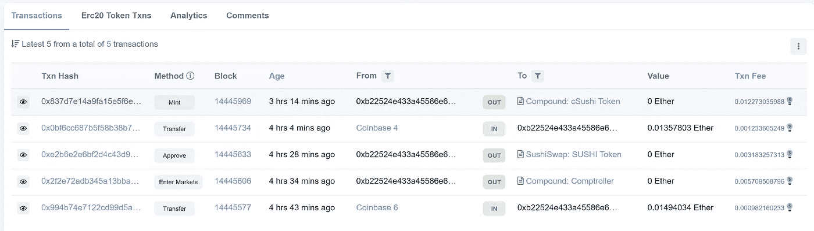

# 赚取复合被动收入。

> 原文：<https://medium.com/coinmonks/thinking-of-lending-on-compound-beware-of-gas-fee-9a0814ee34c3?source=collection_archive---------54----------------------->

但是要小心高额的油费！

Photo by [Cookie the Pom](https://unsplash.com/@cookiethepom?utm_source=medium&utm_medium=referral) on [Unsplash](https://unsplash.com?utm_source=medium&utm_medium=referral)

被复利的高利率所吸引？我是。复利是一种领先的 DeFi 贷款/借款协议，在高收益率的诱惑下，我最终决定一头扎进去...更像是蘸我的脚趾)并通过下注一些寿司来试水，这是目前可用代币中利率最高的。

我的意思是，6+%这与你从支票账户甚至网上银行的储蓄账户中获得的收益相差甚远。现在通货膨胀，我怎么能抗拒呢！(补充说明——还有其他平台提供更高的速率，但复合协议是最值得信赖的协议之一，所以我想继续使用它。看，我不是故意要赔钱。)

看，这张截图时的 6.44%利率…

Source: [Compound | Markets](https://compound.finance/markets)

## 那么，你是怎么做的呢？

它不是没有一些不尽如人意的跳跃和跳跃。我主要使用比特币基地账户进行加密交易，但也拥有一个 Meta Mask (MM)钱包来做这种有趣的实验。

首先，我需要买一些 SushiToken 并把它转移到我的 MM 钱包里。此外，我的 MM 钱包里也需要一些乙醚来支付汽油费，所以我每样买了 100 美元，从我的比特币基地账户转到 MM 钱包里。(补充说明——MM 钱包有时会出现故障，不会显示所有转移的硬币，在这种情况下，您必须手动导入它们的合同。一旦最初丢失密码的恐慌平息下来，这是很容易的一步。)

接下来，我上了 Compound 的[网站](https://app.compound.finance/)，把我 MM 的钱包连上了。我可以在 Compound 的页面上看到我 MM 钱包里的代币，都设置为*提供。我对自己说，现在我所需要的只是按一下按钮，我就进去了！要是我能找到那个按钮就好了。*

## 接下来是不尽如人意的部分…

事实证明，向协议提供代币并开始赚取该利率，需要的不仅仅是简单的按一下按钮。准确地说，它需要 **3 个不同的协议事务**:

1.  **进入市场:**首先你要进入你想参与的市场。

> "为了提供抵押品或在市场上借款，必须首先输入它."—复合[单据](https://compound.finance/docs/comptroller#enter-markets)

2.**批准:**那你得批准。

> “……调用钱包或契约需要首先调用**底层令牌的契约**上的**批准**函数……该批准需要指示相应的 cToken 契约被允许从发送者地址获取*达到指定的金额*。”—亚当·巴沃萨的[中帖](/compound-finance/supplying-assets-to-the-compound-protocol-ec2cf5df5aa)

3.**薄荷**:终于可以薄荷了！也就是说，将您的令牌提供给协议，并作为回报铸造相应的 cToken。

**3 transactions are needed with the protocol — Enter Markets, Approve and Mint.** Source: [Etherscan](https://etherscan.io/address/0xb22524e433a45586e6c8821d0de9af3f0737548b)

在我的例子中，我将 SushiToken 转移到协议中，并铸造了 cSushi 令牌，它返回到我的钱包中，代表我在流动性池中的股份。

**Minting cSushi Token from SushiToken.** Source: [Etherscan](https://etherscan.io/address/0xb22524e433a45586e6c8821d0de9af3f0737548b#tokentxns)

## 现在，对于“当心汽油费！”这篇文章的一部分

一旦你解决了这个问题，这个协议就很容易使用了。我真的相信这就是未来！

但是，请记住我之前提到的那 3 个事务。所有这些交易都发生在区块链，需要支付汽油费。由于费用的原因，我最终为这 3 笔交易支付了大约 65 美元。这还不包括我从比特币基地转移代币到我 MM 钱包的费用。

哎哟！供应价值 100 美元的寿司需要 65 美元的汽油费，并获得 6%的利息。照这样下去，十年后我可能会收支平衡。

哦！差点忘了我兑换时要付的油费。哦！x2 和之前的短暂膨胀。

## 这值得吗——我的 0.02 美元:

我喜欢直接与协议互动，并弄清楚让它工作的细微差别。这就是未来。

然而，根据目前的工作协议证明和相应的汽油费，这种交易只有在大规模进行时才有意义，因此汽油费在整个交易中所占的比例较小。

或者，如果有办法让 CeFi 机构将多个客户的小额资金集中起来，进行一笔交易。比特币基地和它的用户[还没有被允许在美国](https://www.theverge.com/2021/12/9/22826888/coinbase-defi-interest-non-us-compound-lending-program#:~:text=Coinbase%20says%20that%20customers%20in,on%20that%20money%20from%20borrowers.)这么做。

或者，一旦 ETH 2.0 推出，汽油费大幅降低。

在那之前，我会努力划分并忘记汽油费，这样我就可以享受 6%的利率了！

你有类似的经历可以分享吗？或者问题或者评论？给我留个便条。

## 对于好奇的人，请参考:

*   [复合|仪表板](https://app.compound.finance/)
*   [复合|文档—主计长](https://compound.finance/docs/comptroller#enter-markets)
*   比特币基地将允许用户赚取加密利息，但在美国不会——The Verge
*   [向复合协议提供资产| Adam bav OSA |复合| Medium](/compound-finance/supplying-assets-to-the-compound-protocol-ec2cf5df5aa)

> 加入 Coinmonks [电报频道](https://t.me/coincodecap)和 [Youtube 频道](https://www.youtube.com/c/coinmonks/videos)了解加密交易和投资

# 另外，阅读

*   [如何匿名购买比特币](https://coincodecap.com/buy-bitcoin-anonymously) | [比特币现金钱包](https://coincodecap.com/bitcoin-cash-wallets)
*   [币安 vs FTX](https://coincodecap.com/binance-vs-ftx) | [最佳(SOL)索拉纳钱包](https://coincodecap.com/solana-wallets)
*   [比诺莫评论](https://coincodecap.com/binomo-review) | [斯多葛派 vs 3Commas vs TradeSanta](https://coincodecap.com/stoic-vs-3commas-vs-tradesanta)
*   [Capital.com 评论](https://coincodecap.com/capital-com-review) | [香港的加密借贷平台](https://coincodecap.com/crypto-lending-hong-kong)
*   [如何在 Uniswap 上交换加密？](https://coincodecap.com/swap-crypto-on-uniswap) | [A-Ads 评论](https://coincodecap.com/a-ads-review)
*   [WazirX vs CoinDCX vs bit bns](/coinmonks/wazirx-vs-coindcx-vs-bitbns-149f4f19a2f1)|[block fi vs coin loan vs Nexo](/coinmonks/blockfi-vs-coinloan-vs-nexo-cb624635230d)