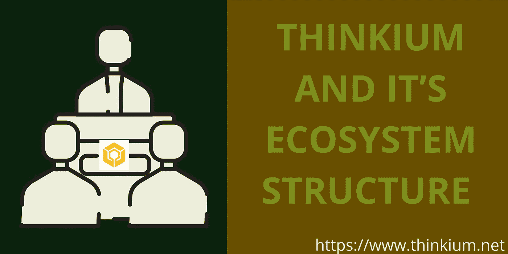

# 思维及其生态系统结构

> 原文：<https://medium.com/coinmonks/thinkium-and-its-ecosystem-structure-f5d988a6d04e?source=collection_archive---------27----------------------->

# 什么是思维:

Thinkium 是一个全方位的公共区块链网络，通过运行多层多链结构，集成 Layer1 + Layer2 技术(分层和并行子链、同构和异构交叉链、分片、EVM 和资产桥等)，以线性成本实现无限的可扩展性。)

Thinkium 的愿景和使命是创建一个公共的区块链基础设施，旨在促进互联网级的大规模应用，并在物理世界和数字世界之间架起一座桥梁，以开启 Web 3.0 时代。

## 思维的生态系统结构

Thinkium 生态系统是开放的，激励和吸引越来越多的成员参与进来，主要包括下面提到的组件。

## 基础系统:

它是整个 Thinkium 生态系统的支持系统。它以分布式方式运行各种不可变的规则和过程，并负责数据存储、信息交互和验证。它提供了一个安全、方便、高效的部署环境来支持大量的应用程序和用户开发。

## 行业公链:

它是基于 Thinkium 核心引擎构建的工业区块链基础设施的集合。通过建立各种行业基础规则和代币发行，组织，人，程序等。基于这些规则公平合作，降低成本，高效创造和重构产业生态。

## 联合体链:

它是为分布式业务而构建的。分布式商业实体可以自己构建，也可以通过 bass 平台租赁。通过指定多个预选节点作为记账方，每个区块的生成归所有预选节点共同决定与 Thinkium 核心引擎底层进行信息交互，任何第三方都可以通过授权进行访问和查询。

## 通用工具:

它是各种各样的智能合约、跨链协议、行业协议、节点软件、钱包、D-store、DAO 工具，是开发者基于用户的需求或者想要提供的服务而开发的。、交易软件等。，为个人应用或上层场景应用提供工作框架或相关支持。

DAO 应用是通过 Thinkium 核心引擎或行业公链的开放接口，对原住民通用工具的大规模移植和新物种的生成。通过开发迭代的海量 APP、Web、小程序、PC 产品等。，为用户提供个性化服务。帐户、数据和资产都在链上，由用户控制，他们可以通过私钥自由选择数据迁移的应用程序。

## 数据中心:

它是分布式业务和 DAO 应用程序的核心枢纽。它存储、分析、计算、分发生态用户在使用过程中产生的数据。它由独立的数据链控制，允许用户使用区块链规则。数据权益得到有效保护。任何主体调用数据都需要得到其所有者的授权，并支付相应的报酬

## 令牌:

指可在 Thinkium 生态系统内流通的数字权益凭证，包括底层资产 TKM、行业公链发行、分布式商业实体发行的代币，可通过跨链技术在 Thinkium 生态系统内直接转让和交易。

## 连锁开发商:

指参与区块链底层系统开发、迭代、维护或提供相关技术服务的 R & D 人员或科研机构。

## 节点:

指运行区块链系统程序的网络计算机。通过购买服务器、安装操作系统、连接系统网络，可分为三种类型:数据节点、共识节点、普通节点。数据节点负责其所在链中的所有数据、存储以及链之间的信息交互。共识节点负责其链的计算、打包和共识。普通节点只承载服务，不参与共识。来自数据存储、打包事务、生成块或其他过程的节点可以获得 TKM 奖励。

## 应用程序开发者:

指基于合同或运营平台进行开发的组织或个人。它提供开发工具，完成包括行业公链、通用工具、DAO 应用、分布式业务应用等软件或工具的开发。

## 社区:

它是思维生态的入口和重要推动者。每个企业或个人都可以组建自己的社区，开展或提供节点部署、公链开发、应用开发、用户推广、生态咨询、财务投资等生态建设工作。或者与开发者合作推广应用，通过参与性、激励性的市场解决方案，让更多人参与到应用的共建中来。

## 用户:

包括生态资产令牌的持有者和各种应用的用户。每个用户可以根据自己的能力和喜好加入不同的社区，为生态提供服务，协作创造或参与生态建设，基于贡献的公平回报是公平的。

# 结论

上面提到的所有组件是使 Thinkium 生态系统有趣和有吸引力的原因。我相信 Thinkium 是为每一个区块链爱好者打造的，因此不应该被忽视。我们期待已久的时代已经到来，并将持续终生。

# 与我们联系；

## [网站](https://thinkium.net) | [推特](https://twitter.com/thinkium_chain?s=21) | [媒体](http://thinkiumfoundation.medium.com) | [电报](https://t.me/Thinkiumofficial)

> 加入 Coinmonks [电报频道](https://t.me/coincodecap)和 [Youtube 频道](https://www.youtube.com/c/coinmonks/videos)了解加密交易和投资

# 另外，阅读

*   [CryptoHopper 替代品](/coinmonks/cryptohopper-alternatives-d67287b16d27) | [HitBTC 审查](/coinmonks/hitbtc-review-c5143c5d53c2)
*   [CBET 评论](https://coincodecap.com/cbet-casino-review) | [库科恩 vs 比特币基地](https://coincodecap.com/kucoin-vs-coinbase)
*   [折叠 App 审核](https://coincodecap.com/fold-app-review) | [Kucoin 交易机器人](/coinmonks/kucoin-trading-bot-automate-your-trades-8cf0ca2138e0) | [Probit 审核](https://coincodecap.com/probit-review)
*   [如何匿名购买比特币](https://coincodecap.com/buy-bitcoin-anonymously) | [比特币现金钱包](https://coincodecap.com/bitcoin-cash-wallets)
*   [币安 vs FTX](https://coincodecap.com/binance-vs-ftx) | [最佳(SOL)索拉纳钱包](https://coincodecap.com/solana-wallets)