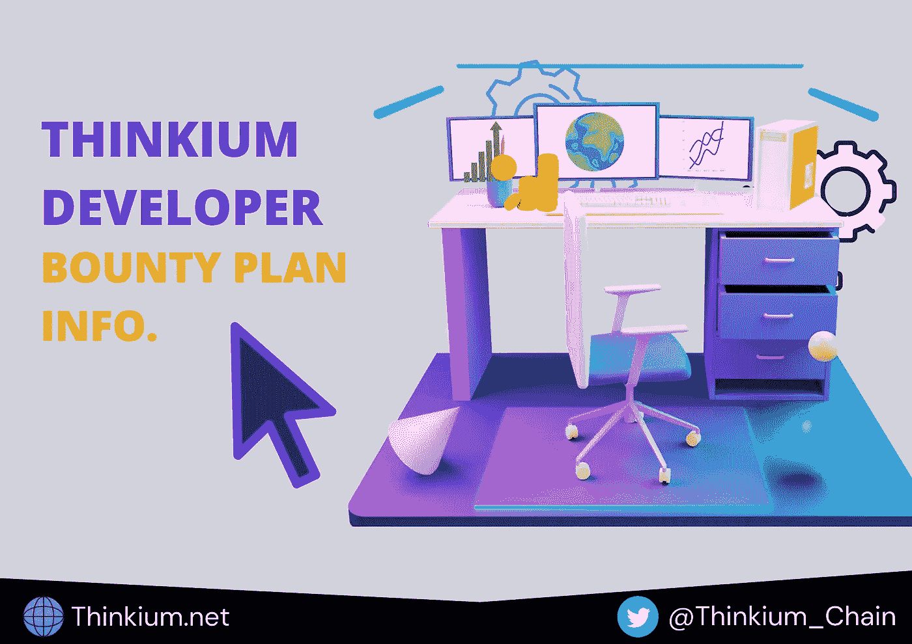

# THINKIUM 开发者奖励计划新闻

> 原文：<https://medium.com/coinmonks/thinkium-developer-bounty-plan-news-41f118841862?source=collection_archive---------27----------------------->

# 开发者奖励计划

Thinkium foundation 非常高兴地正式宣布启动其开发人员奖励计划，以帮助和鼓励社区开发人员在其设计和开发领域参与该项目。Thinkium 相信在帮助开发人员学习和赚钱的同时进行扩展，在成功完成奖金任务后，将奖励那些致力于 Thinkium 项目服务和发展的人。

## 第一阶段:赏金细节

赏金规范:技术教程内容创作。

## 任务说明:

该项目主要致力于创建与 Thinkium 技术相关的教程，包括但不限于节点安装和开发教程、合同开发指南、Dapp 开发示例、SDK 使用说明、wallet 使用说明等。

注意:提交格式将是文本和视频。

## 任务要求:

申请人对区块链技术和 Thinkium 的产品和项目有清晰的了解。有能力写文章和编辑视频。

## 赏金规则和准则

*   这个项目将支持 25 个文件或视频教程。
*   所有开发者都要上传完整教程到 Github:(https://Github . com/thinkium group/wiki/tree/master/Tutorial/Collection % 20 of % 20 works)。奖励将在教程成功通过审核后发放。
*   作品上传成功后，请将您的作品链接、官方不和谐团昵称、TKM 钱包地址发送至官方邮箱(bounty@thinkium.net)，请确保以上信息准确无误，作为我们奖励您的凭证。
*   根据教程的内容和质量，创作者的报酬在 50-200 USDT 之间不等。
*   这个项目只支持和欢迎原创内容。如果上传的文件涉及抄袭，您将不会获得任何奖励。

## 开发者奖励计划详情和奖励

1.项目名称:Thinkium 节点安装部署教程

奖励:100U

奖励数量:3

备注:视频或文本

2.项目名称:Thinkium 网络上的 Solidity 智能合约开发与开发教程。

奖励:200U

奖励数量:3

备注:用于代币、记忆存储、交易、安全帽、块菌

3.项目名称:在 Thinkium 上开发 DeFi/Dapp

奖励:200U

奖励数量:3

备注:环境工具准备、开发流程、案例分析教程。

4.项目名称:基于 Thinkium 的 Dapp 应用教程

奖励:200U

奖励数量:3

备注:投票、NFT、游戏、市场、众筹、DEX 等。

5.项目名称:如何将 Dapp 从 ETH 迁移到 ETH 网络

奖励:100U

奖励数量:3

6.项目名称:Thinkium 技术及核心概念解释

奖励:50U

奖励数量:10

注释:包括但不限于技术结构、经济机制、共识机制、开发者工具介绍。

## 请注意:

*   所有奖励以 TKM 发行，相当于发行时市场价格的 USDT 兑换。
*   奖励的数量是固定的。我们将采用先来先服务的原则来审核按时间顺序提交的作品。

## 关于思维

Thinkium 是由 Thinkium 基金会发起并推动的一个全面的公共链网络，是一个分层的多链结构。它集成了 lay1+layer2(分层并行子链，同构异构资产桥)的各种技术，以线性成本无限扩容，海量基础设施建设，所有社区开发者的共同参与。

Thinkium 是唯一的全球公共区块链基础设施，旨在促进互联网级别的大规模应用，并在物理世界和数字世界之间架起桥梁，以开启 Web 3.0 时代。

## 相关链接

官方网站:[https://www.thinkium.net/](https://www.thinkium.net/)

github:【https://github.com/ThinkiumGroup/wiki 

不和谐开发者邀请链接:【https://discord.gg/tVZQBfHgXu 

您也可以通过以下方式联系 THINKIUM:

# [Twitter](http://twitter.com/Thinkium_Chain)| |[Reddit](http://reddit.com/r/Thinkium/)| |[Medium](http://thinkiumfoundation.medium.com)

> 加入 Coinmonks [电报频道](https://t.me/coincodecap)和 [Youtube 频道](https://www.youtube.com/c/coinmonks/videos)了解加密交易和投资

# 另外，阅读

*   [Capital.com 评论](https://coincodecap.com/capital-com-review) | [香港的加密借贷平台](https://coincodecap.com/crypto-lending-hong-kong)
*   如何在 Uniswap 上交换加密？ | [A-Ads 评论](https://coincodecap.com/a-ads-review)
*   [WazirX vs CoinDCX vs bit bns](/coinmonks/wazirx-vs-coindcx-vs-bitbns-149f4f19a2f1)|[block fi vs coin loan vs Nexo](/coinmonks/blockfi-vs-coinloan-vs-nexo-cb624635230d)
*   [本地比特币审核](/coinmonks/localbitcoins-review-6cc001c6ed56) | [加密货币储蓄账户](https://coincodecap.com/cryptocurrency-savings-accounts)
*   [什么是保证金交易](https://coincodecap.com/margin-trading) | [美元成本平均法](https://coincodecap.com/dca)