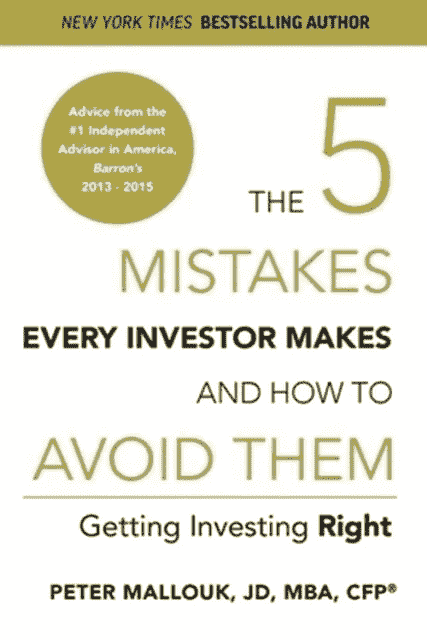

# 这本书将帮助你正确投资

> 原文：<https://medium.com/coinmonks/this-book-will-help-you-get-investing-right-8b6d59467d1e?source=collection_archive---------63----------------------->

Source photo [The 5 Mistakes Every Investor Makes and How to Avoid Them book — Bing images](https://www.bing.com/images/search?view=detailV2&ccid=1qLmOpKN&id=FB4D716C9DDC00D36E14CB3AD8679D84E04E5B49&thid=OIP.1qLmOpKNCDLmXqL4G9Sz_AAAAA&mediaurl=https%3a%2f%2fi.ebayimg.com%2fimages%2fg%2fFokAAOSwnwpfQJPW%2fs-l640.jpg&cdnurl=https%3a%2f%2fth.bing.com%2fth%2fid%2fR.d6a2e63a928d0832e65ea2f81bd4b3fc%3frik%3dSVtO4ISdZ9g6yw%26pid%3dImgRaw%26r%3d0&exph=640&expw=427&q=The+5+Mistakes+Every+Investor+Makes+and+How+to+Avoid+Them+book&simid=608022293975162953&FORM=IRPRST&ck=E710EE661033D042D129A318D2184E53&selectedIndex=0&ajaxhist=0&ajaxserp=0)

投资很简单，除非我们把它复杂化。

这是彼得·马洛克新书《5 个常见投资错误及如何避免》的中心主题。作者强调了在投资领域什么不该做的重要性。

我们在交易教育认为，无论读者是一个刚刚开始投资行业的新手，还是一个…