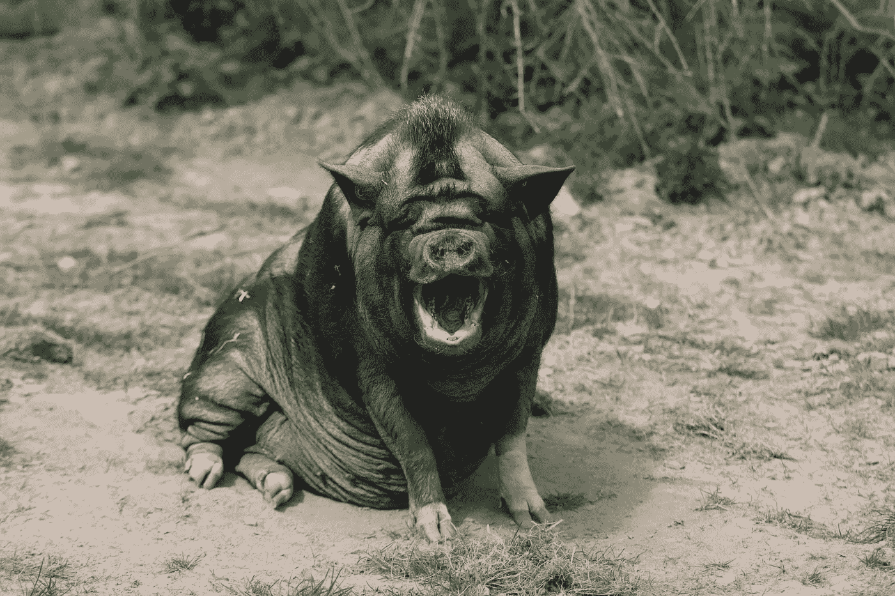

# 这就是今天的比特币

> 原文：<https://medium.com/coinmonks/this-is-bitcoin-today-edcf8780fefa?source=collection_archive---------12----------------------->

Photo by David Selbert via Pexels

***我可以补充一下，这也是以太坊，因为他们两个是堂兄弟*** 。年长的那个(BTC)是胖胖的那个。他是一个友好、善意的家伙，脸上永远带着微笑。但是有一天，每个人都开始注意到他肥胖了。他日以继夜地喂自己，一天 24 小时多餐。他成了一个贪吃的人。可怜的家伙过了一会儿，他几乎不能动了，因为他的四肢沉重，让人想起大象的。无论如何…