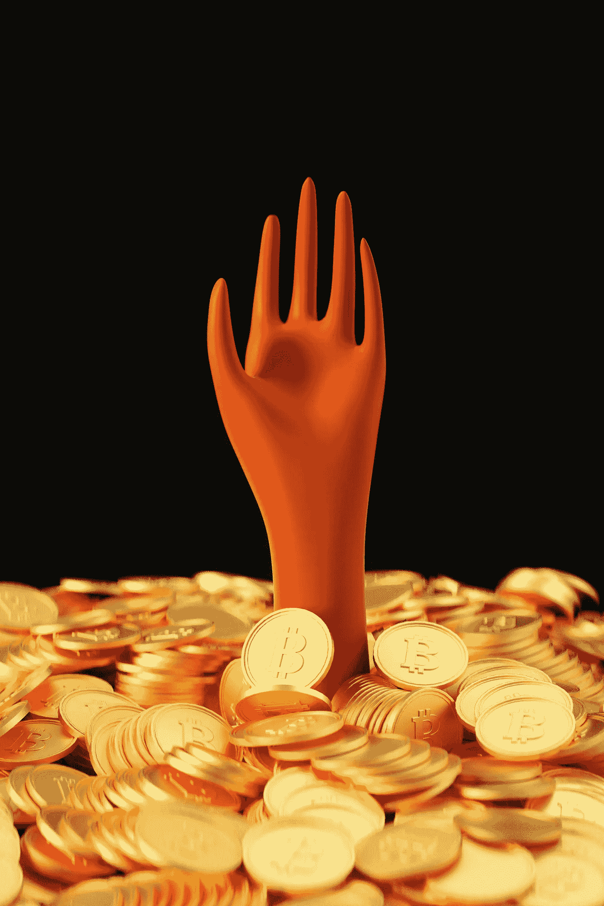

# 这就是我如何在加密中获得 2000%的回报！

> 原文：<https://medium.com/coinmonks/this-is-how-i-made-2000-return-in-crypto-b378bb2c73aa?source=collection_archive---------10----------------------->

五条戒律，以最高的回报创造多重财富。

Photo by [愚木混株 cdd20](https://unsplash.com/@cdd20?utm_source=unsplash&utm_medium=referral&utm_content=creditCopyText) on [Unsplash](https://unsplash.com/s/photos/wealth?utm_source=unsplash&utm_medium=referral&utm_content=creditCopyText)

创造财富似乎是一项艰巨的任务。毕竟，如果这很容易，每个人都会这么做。

我们大多数人都梦想通过拥有足够的财富来实现财务独立，但只有少数人能够实现。我们的资源在资金、能量和时间方面是有限的。实现所有这些资源部署的最大效率并非易事。我们经常低估最简单而有效的策略。

这些策略不是隐藏的秘密，而是一个直接而强大的工具，如果虔诚地应用的话。通过这样一个工具，我们可以用一点安全网将我们有限的资源分配给更有意义的潜力。

这就是我做的 2000%的回报。

1.  **寻找最有潜力的叙述**

也许，没有人能够用比 Naval Ravikant 所引用的更好的方式来表达:

> **“追求财富，而不是金钱或地位**。财富就是在你睡觉的时候拥有可以赚钱的资产。”

如果你在睡觉的时候赚钱，你就不会被市场的噪音和失败吓倒。这就是为什么找到最有潜力的故事很重要，而且确实是走向财富的第一步。

潜在的叙事是那些在最高回报赌注中相对安全的项目。这些项目可以带来多重回报，你需要谨慎选择。优秀叙事的几个特征是:

*   **项目的整体开发活动:**开发活动可以通过[CryptoMiso](https://www.cryptomiso.com/months_3.html)网站进行追踪，这将帮助您通过该功能找到顶级硬币。Santiment 也是另一个网站，但是是付费版本。在早期阶段了解此类项目将在价格方面对你有利，因为价格上涨通常发生在叙事开始得到更多人的注意之后。开发活动至关重要，因为它反映了团队正在做的工作。
*   **团队:**叙事中领导者的侧面给投资者带来信任，因此，其成功的可能性增加。因此，访问该团队的个人资料是必不可少的。个人网站、LinkedIn、Twitter 等。，是您可以浏览以收集更多信息的空间。
*   **趋势活动:**你还需要查看他们在市场上做的事情类型是否是趋势？因为加密空间是非常进步的，任何不适应这种趋势和发展的团队都可能落后。

> 如果你想深入了解这些故事，那么我以前的文章应该能帮到你:([第一篇](https://blog.cryptostars.is/finding-the-next-solana-1f8a1a314355)，[第二篇](https://blog.cryptostars.is/part-ii-finding-the-next-solana-621e1fe1581c))

2.**设定叙事的固定目标**

正如我在之前的[文章](/illumination/portfolio-revealed-for-2022-8be9fba57b9c)中所讨论的，从财务角度来看，设定投资目标至关重要。当你设定目标时，必须记住项目的行业。这是因为特定行业的目标易于分析。你可以用这个简单的方法来设定目标。

首先，你看同行业的既定项目(市值最高)。然后，你应该找出你为目标设定选择的前(X)项目和项目(Y)的当前市值。

假设 y 的未来市场份额百分比。现在将这个百分比乘以 x 的当前市值。你将得到 y 的目标市值。

现在将目标市值除以 y 的当前市值。将你得到的值乘以 y 的当前价格。

这个价格将是你潜在项目的目标价格(Y)

> 让我们举一个简单的例子:
> 
> 比如我的潜在项目是[靠近协议](https://blog.cryptostars.is/near-a-10x-from-here-d9f1ab03fca6)。Near 目前的市值是 69 亿美元，而以太坊(同行业顶级项目)的市值是 3110 亿美元。基于目前的市场份额，我假设 Near 因其发展将实现以太坊 20%的市场份额。3110 亿美元的 20%约为 630 亿美元。这 630 亿美元将是 Near protocol 的目标市值。现在用目标市值(630 亿美元)除以当前市值(70 亿美元)，我们将得到 9 倍。将这个系数乘以 Near 的当前价格(11 美元)，我们将得到 99 美元。这个价格是 Near 协议的目标价格。

3.**去掉 80%的目标回报**

当你达到你的目标价格时，多种多样的想法开始起作用，它们是对更多升值的贪婪、对错过机会的恐惧以及与项目相关的情绪。在这种情况下，我们经常会被持续的价格上涨所淹没，因此可能会失去我们的观点。

所以，我们需要从你的头脑中排除这些想法。当我达到目标时，我取出投资价值的 80%。

我们不能把握市场时机，所以我们必须在财务方面有所约束。我一般把这 80%的投资转换成稳定的币。

资产不应该闲置，所以我期待 Defi 或者其他平台，你可以在没有太大风险的情况下进行投资。这些平台允许以固定的年利率(10-12%左右)进行稳定的硬币投资存款。我用的一些例子是摄氏、华尔德和币安。

4.**将投资放入更安全的赌注**

没有一种资产是无风险的，只是不同投资的风险程度不同。市场有其纠正投资者投机行为的方式。因此，把握市场时机具有挑战性。这就是将你的利润转化为更安全的途径发挥作用的地方。

人们经常求助于资产的美元成本平均法；然而，我们真的无法知道市场的底部。因此，作为一名投资者，我仍然对回调后进入市场的正确时机保持警惕，因为回调是周期性的，取决于宏观和微观因素。

当市场回调至少 40%-50%时，我开始将这些存款转移到一种安全的资产中，这种资产市值高，基本面坚实。

> 目前，我认为只有 BTC 和瑞士联邦理工学院是安全的资产，所以我把我的利润长期投资到这些资产中。

5.**重复该过程**

作为一名投资者，我们坚持金融哲学和原则是很重要的。不同的投资者可能有不同的投资风格。但归根结底，重要的是长期财富的创造。

因此，每次我达到潜在项目的目标回报时，我都会重复上述过程。重复这个过程意味着我们再次找出下一个最佳叙事，然后按照概述的程序。

这样，我以较低的价格逐步增持了 BTC 和联邦理工学院的股票。

> 这就是我去年获得 2000%回报的原因。(供参考，该项目是 Terra (Luna))

**关闭思路**

财务自由需要自律和一点努力。如果别人做到了，那么你也能做到。坚持自己的核心信念，跟着大脑走但不跟着心走，每天都在学习。

你很快就会到达那里。！

*免责声明:此处阐述的部分或全部内容都不是任何财务建议。这篇文章是关于个人投资哲学和在金融旅程中产生意识的媒介。在做出任何财务决定之前，请咨询您的财务顾问。*

**对以上免责声明深表歉意！**

那么，你喜欢它的内容吗？如果您没有，请留言分享您的反馈。我希望你喜欢这些内容，并在你的清单上增加了另一片知识。如果你喜欢这些内容，请通过任何方便的方式让我知道，因为这将帮助我并激励我为你写更多有价值的内容。更多文章和更新，请关注我的页面。

> 加入 Coinmonks [电报频道](https://t.me/coincodecap)和 [Youtube 频道](https://www.youtube.com/c/coinmonks/videos)了解加密交易和投资

# 另外，阅读

*   [Bookmap 点评](https://coincodecap.com/bookmap-review-2021-best-trading-software) | [美国 5 大最佳加密交易所](https://coincodecap.com/crypto-exchange-usa)
*   最佳加密[硬件钱包](/coinmonks/hardware-wallets-dfa1211730c6) | [Bitbns 评论](/coinmonks/bitbns-review-38256a07e161)
*   [新加坡十大最佳加密交易所](https://coincodecap.com/crypto-exchange-in-singapore) | [购买 AXS](https://coincodecap.com/buy-axs-token)
*   [红狗赌场评论](https://coincodecap.com/red-dog-casino-review) | [Swyftx 评论](https://coincodecap.com/swyftx-review) | [CoinGate 评论](https://coincodecap.com/coingate-review)
*   [投资印度的最佳密码](https://coincodecap.com/best-crypto-to-invest-in-india-in-2021)|[WazirX P2P](https://coincodecap.com/wazirx-p2p)|[Hi Dollar Review](https://coincodecap.com/hi-dollar-review)