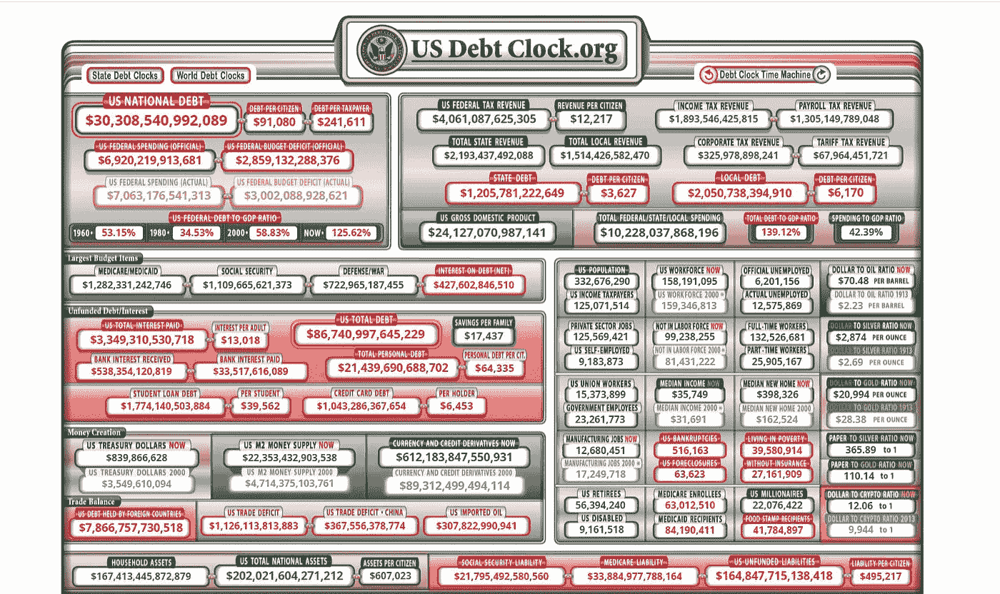

# 这就是美国债务的真实面貌

> 原文：<https://medium.com/coinmonks/this-is-what-american-debt-actually-looks-like-e463302bc67f?source=collection_archive---------64----------------------->

## 十年前我查过这个数字，它是 3 万亿美元…

Courtesy of [US Debt Clock](https://www.usdebtclock.org/).

## 这就是我们今天所处的位置

 [## 美国国债时钟:实时

### 美国国债时钟:实时美国国债时钟

www.usdebtclock.org](https://www.usdebtclock.org/) 

## 最重要的数字在底部

尤其是右下角的那个。

**As of today, this is the number we owe. Not mentioning personal debt. This is just what we owe to the Fed.**

我只是想提醒美国人民，你把你收入的 50%给了一个政府，这个政府为你提供从一家私有化公司那里借来的钱，然后政府会偿还利息。

美国公民只能买单。

## 感觉像是最后一次通话

美联储从人性中吸取生命。

 [## 美国正在“印刷”钞票，以帮助从新冠肺炎危机中拯救经济，但有些人想知道还有多远…

### 在拯救美国经济的疯狂争夺战中，美国中央银行似乎拥有终极…

www.usatoday.com](https://www.usatoday.com/in-depth/money/2020/05/12/coronavirushow-u-s-printing-dollars-save-economy-during-crisis-fed/3038117001/) 

## 对加密技术的投资让中央银行置身事外

凭借 1T 的市值，它现在是现金的可行替代品。

 [## 现金已死——为加密让路

### 这叫量化宽松，也不管用。

medium.com](/coinmonks/cash-is-dead-make-way-for-crypto-8fa2452aa8fe) 

## 如果继续印钞票，情况不会好转

你的生活是用来享受的。不被把人当商品的央行抢。

*想得好。感觉很好。好好活着。*

*-W.V .卡尔顿*