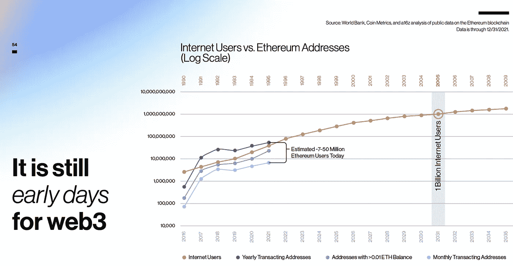
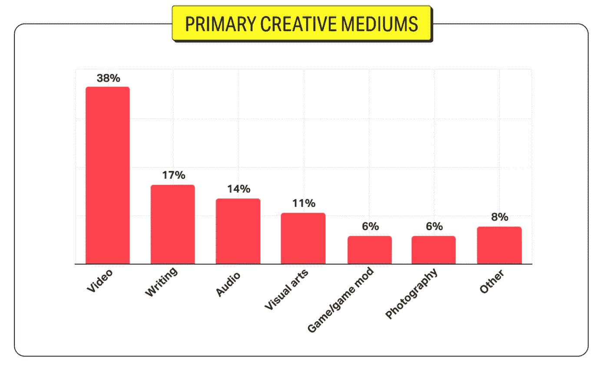
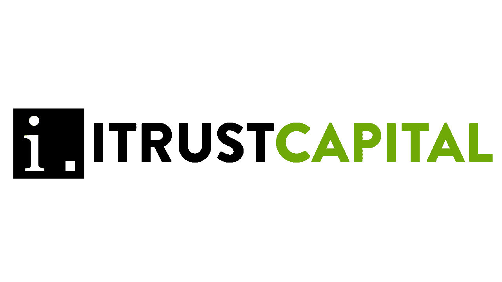

# 📚这是我们在 web3 教学中学到的

> 原文：<https://medium.com/coinmonks/this-is-what-we-learned-teaching-web3-e63644e70c9e?source=collection_archive---------64----------------------->

# 内容(3 分钟阅读):

*   📚**我在教学网站上学到了什么 3**
*   web3 离大规模采用还有多远？
*   如何用 web3 赚钱？
*   真正的价值是什么？
*   这是如何改变科技格局的？
*   🏖️个人退休帐户，避税帐户
*   📰基督教青年会
*   🙏🏻感激…
*   💸优惠券

# 📚这是我在 Web3 教学中学到的。

**我的大多数学生(~70%)认为，web3 距离拥有被大众采用的真实用例还有大约 10 年的时间。**

关于时间表，他们可能是对的，也许我们离 web3 被完全采用还有几年时间。正如来自 [A16z](https://a16z.com/) 的下图所示，互联网用户达到 10 亿用了 15 年。

我们甚至没有 1 亿个加密交易地址，我们生活在一个互联网接入无处不在的时代，设备随时都在连接，大多数用户能够随心所欲地消费和创建内容。采用率将呈指数级增长。

# 大多数学生想找到一种方法来赚钱，并帮助他们的孩子了解它，并从中赚钱

截至目前，视频内容似乎是创作者最赚钱的。

**YouTube 和 Meta 等平台在财务上占据上风，与这些公司相比，创作者的收入微薄。看起来我们可能离一个可以与这些巨头竞争的稳固的区块链、分散的平台还很远，但是我们应该做好准备，能够在这些即将到来的 web3 平台可用时采用它们。**

**目前的一些替代品有:**

*   YouTube→[D . Tube](http://d.tube/)—[Bitchute](http://bitchute.com/)—[Theta](http://thetatoken.org/)
*   Patreon(协议创建)→ [LBRY](http://lbry.com/)
*   NFT 创作— [远海](http://opensea.io/) — [稀有](http://rarible.com/) — [可造](http://mintable.app/) — [超稀有](http://superrare.com/)
*   中等→ [镜子](http://mirror.xyz/)
*   不和谐→ [社会堆栈](http://socialstack.io/)
*   社会代币铸造→ [掷骰子](http://tryroll.com/)
*   你自己的数字经济→ [反弹](http://rally.io/)

> *我们相信，那些越来越熟悉加密钱包、代币、铸造、桥梁、集中式与分散式交换、DeFi、stablecoins 以及 web3 术语和定义的人将更容易利用 web3。*

# Web3 的真正价值在哪里？

Web2 是一场前端革命， [Web3 是一场后端革命](https://mexicobusiness.news/finance/news/web3-internet-value-3rd-digital-revolution):它有可能彻底改变互联网上的协议和价值交换。简单地说，价值互联网是指一个在线空间，在这个空间中，个人可以在彼此之间即时转移价值，消除所有第三方成本，并提供更快、更个性化的用户体验。理论上，任何持有货币或社会价值的东西都可以在政党之间转移，包括货币、财产股份，甚至选举中的一张选票。

> ***由于这场革命是在后台进行的，因此很难看到真正的潜力，以及它如何重新定义价值、转移权力，同时彻底改变我们与技术互动的方式。***

web3 的一些承诺是:

*   消费者将重新控制他们的数据。
*   转移资金和资产会更快更容易。
*   让任何拥有联网设备的人都能更好地访问银行和金融工具。
*   服务可以不中断，任何人都可以使用链上智能合同在后台运行业务和/或服务。
*   数据透明度有可能被规范化。
*   权力下放将有能力打破腐败的中央集权机构。

这个清单还在继续，并将根据我们的需求和技术进步而扩大和缩小。

[分享 Yaro 的技术、区块链和网络 3](https://yarocelis.substack.com/?utm_source=substack&utm_medium=email&utm_content=share&action=share)

# 他们认为我们今天与 web3 互动的方式不会是我们未来与它互动的方式。

这是一个非常有趣的现象，因为我们今天与这项技术互动的方式，与我们过去的方式非常不同。

比特币市场，**2010 年，第一家官方比特币交易所在 Bitcointalk 上宣布成立，同年推出，为比特币提供浮动汇率。**买家可以通过 PayPal 向另一个用户发送美元来购买比特币，而比特币市场将保管卖家的比特币，直到卖家收到他们的钱。

三年后的 2013 年，Mt. Gox 处理了全球 70%的比特币交易。用户主要通过两种支付服务将资金存入 Mt. Gox 数字货币服务 Liberty Reserve 和[支付提供商 Dwolla](https://www.gemini.com/cryptopedia/crypto-exchanges-early-mt-gox-hack#section-more-bitcoin-exchanges-hit-the-scene) 。

今天，全世界有数百个交易所，用户可以在那里开立账户，链接他们的银行账户，随意交易数千枚硬币。在不久的将来，铸造数字资产、参与 DeFi 协议以及其他 web3 使用案例都可以变成非常简单的一键式流程。

不用说，有许多开发者和企业家正在开发改变我们与互联网和网络互动方式的技术。**我们今天使用 web3 应用的方式将不会是我们明天使用的方式。**

[现在就订阅](https://yarocelis.substack.com/subscribe?utm_medium=web&utm_source=subscribe-widget&utm_content=58753874)

## [连同 iCapital](https://itrustcapital.com/referral100?utm_source=partner&utm_medium=youtube&utm_campaign=partner637&oid=10&affid=637)

加密货币是这些天每个人都在谈论的东西之一。有各种不同的交易所进行加密交易……但是许多人没有意识到他们在税费上损失了多少。

iTrustCapital 允许其客户通过个人退休账户或个人退休帐户投资 crypto，而不必担心税收或费用。

IRA 是避税账户，这意味着**你所有的加密交易都是免税的，甚至可以随着时间的推移免税。**

没有隐藏的费用。[要了解更多信息，请点击此处并开通免费账户。](https://itrustcapital.com/referral100?utm_source=partner&utm_medium=youtube&utm_campaign=partner637&oid=10&affid=637)

[分享 Yaro 的技术& WebX 简讯](https://yarocelis.substack.com/?utm_source=substack&utm_medium=email&utm_content=share&action=share)

# 📰基督教青年会

*   [随着 SEC 调查 Terra 的潜在证券违规行为，LUNA2 走下坡路](https://zycrypto.com/luna2-going-downhill-as-sec-investigates-potential-securities-violations-by-terra/)
*   [德克萨斯州的比特币矿工在热浪和创纪录的电力需求中断电](https://www.theblockcrypto.com/post/151084/bitcoin-miners-in-texas-have-been-powering-down-amid-heatwave-and-record-electricity-demand?utm_source=cryptopanic&utm_medium=rss)
*   [采访:Bitfinex/Tether 首席技术官 Paolo Ardoino Weighs 谈到 Tether 在拉丁美洲的扩张计划](https://beincrypto.com/paolo-ardoino-speaks-on-tether-expansion-into-latin-america/)
*   [Blockware 预计到 2030 年全球比特币使用率将达到 10%:报告](https://bitcoinmagazine.com/business/blockware-releases-bitcoin-user-adoption-report)
*   顶级密码分析师表示，历史表明比特币仍未见底——这是他的目标
*   [维塔利科的钱包从乐观开发者那里获得 100 万 OP 代币](https://cryptopotato.com/vitaliks-wallet-receives-1-million-op-tokens-from-optimism-exploiter/)

> 加入 Coinmonks [电报频道](https://t.me/coincodecap)和 [Youtube 频道](https://www.youtube.com/c/coinmonks/videos)了解加密交易和投资

# 另外，阅读

*   [加拿大最佳加密交易机器人](https://coincodecap.com/5-best-crypto-trading-bots-in-canada) | [库币评论](https://coincodecap.com/kucoin-review)
*   [火币加密交易信号](https://coincodecap.com/huobi-crypto-trading-signals) | [HitBTC 审查](/coinmonks/hitbtc-review-c5143c5d53c2)
*   [TraderWagon 回顾](https://coincodecap.com/traderwagon-review) | [北海巨妖 vs 双子座 vs BitYard](https://coincodecap.com/kraken-vs-gemini-vs-bityard)
*   [如何在 FTX 交易所交易期货](https://coincodecap.com/ftx-futures-trading) | [OKEx vs 币安](https://coincodecap.com/okex-vs-binance)
*   [OKEx vs KuCoin](https://coincodecap.com/okex-kucoin) | [摄氏替代度](https://coincodecap.com/celsius-alternatives) | [如何购买 VeChain](https://coincodecap.com/buy-vechain)