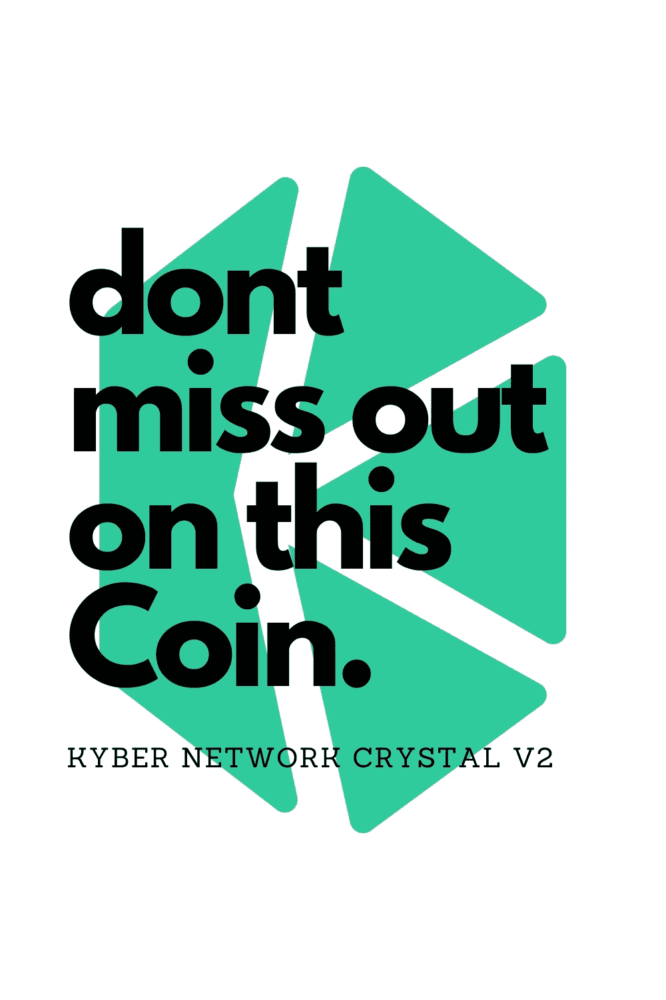

# 这就是为什么我相信凯博网络水晶 v2 (KNC)

> 原文：<https://medium.com/coinmonks/this-is-why-i-believe-in-kyber-network-crystal-v2-knc-f1160fe1b09f?source=collection_archive---------23----------------------->

# 介绍

Kyber Network 是一个去中心化的加密货币交易所。它允许用户直接从他们的数字钱包中买卖加密货币。该公司由 Loi Luu、Yaron Velner 和 Victor Tran 于 2017 年创立。Kyber 有一个名为 Kyber Network Crystal (KNC)的本地令牌。KNC 充当 Kyber Network 的合作伙伴和用户之间的中介令牌。

# 自 2017 年 9 月以来改革金融市场

Kyber Network Crystal v2 (KNC)是一种加密货币令牌，在以太坊平台上运行。Kyber Network Crystal v2 的当前 Coinmarketcap 为 361.059.074 美元，总供应量为 221，561，437 KNC。

就整个行业的总市值而言，Kyber Network Crystal v2 目前排名第 126 位。它还被列为 coinmarketcap.com 过去 24 小时交易量排名前 100 的货币之一

# 第一个也是最具流动性的平台，用于即时交换和交易加密令牌

Kyber Network 是第一个完全分散的交易所，允许即时交换和转换数字资产。该平台使用智能合约，允许用户即时交易任何代币，无需注册或存款。与其他交易所不同，它没有中央运营商或银行，其目标是为参与加密交易的各方创建一个更有效的交易系统。

KNC 还充当链上流动性协议，从分散的交易所、支付平台和其他金融机构等广泛来源聚集储备流动性。它使用一个独特的系统，通过为其他人的交易提供流动性，储备从网络上的每笔交易中赚取利润；这有助于保持低费用，同时也鼓励大型储备加入，以便参与这种利润分享模式(从而增加整体流动性)。

# 超安全的分散网络、即时转账、24/7 流动性和完全透明。

Kyber Network Crystal (KNC)是一个用于即时 ERC20 令牌交换的无信任、分散式网络。Kyber 已经能够提供大量的令牌对，而且非常容易使用。

Kyber 按需提供流动性，并允许用户以低费用实现近即时转账。这个交易所可以被任何有以太坊地址的人使用，这意味着它是高度流动的。它还拥有 24/7 的支持和透明度，因此当你的资金被转移到 Kyber Network Crystal (KNC)时，你可以准确地知道它们的用途。

# 凯伯网络易于使用和安全

凯博网络是一个用户友好，简单，安全的平台。它也是不可信的和私有的。Kyber Network 背后的团队采取了一切可能的措施来确保该平台完全透明，并接受用户的审查。

世界各地的每个人都可以访问该平台，无需任何 KYC 要求，这意味着您将能够自由地进行交易，而不必担心任何官僚程序或繁文缛节，这些程序或繁文缛节可能会减缓您在网络上的活动。

在凯博网络上交易也是免费的；这意味着，如果你想用它作为钱包服务提供商或资金托管人，那么也不涉及任何费用——这使它成为最方便的平台之一！

# 低滑动

滑点是你进场和出场价格之间的差异。换句话说，就是交易的成本。低滑点意味着你将以接近进场时的价格出场。它有助于交易者避免由于错误的定价或市场波动而损失头寸。由于高滑点率，交易者可以来回交易几个小时，而不必从他们的账户中取出任何钱，这节省了他们的时间和精力，因为他们不必每五分钟调整一次价格，因为发生了一些事情，他们不会损失太多的钱，同时仍然能够获得一些利润——这取决于他们在进行另一次交易之前等待了多长时间！

Kyber Network Crystal v2 通过创建一个激励系统来实现这一目标，在该系统中，良好行为比不良行为获得更高的回报(即，比其他人保持订单开放时间更长的人将获得更多报酬)。

# 矿工和用户的低费用

Kyber Network Crystal v2 是一种加密货币，允许用户和矿工支付低费用。关于 KNC 首先要注意的是，它没有最低费用，这意味着用户可以在进行任何交易时设置自己的费用。例如，如果你想以 0.05 美元的价格购买一个 KNC，你可以将费用设置为 0.04 美元，而不是像币安或比特币基地 Pro 等其他平台那样支付 0.01%(甚至更低)。

这种固定费用的缺乏不仅仅局限于购买和出售加密货币；交易所还受益于灵活的定价结构，因为这使它们能够通过提供比竞争对手更低的价格来相互竞争——我相信大多数人都会同意这是有益的！

除此之外，也没有佣金。因此，尽管使用 KYC 支票(了解你的客户)等特定服务可能会产生一些成本，但它们不一定会对在线提供的产品或服务产生影响，因为公司需要收入流才能维持秩序

保持成功运行而不收取过多的前期费用(这会导致客户根本不想要任何东西)。

# 安全性

在分散式交换中，安全性非常重要。如果你没有安全保障，那么你将被黑客攻击，失去你所有的钱。这就是为什么我们需要确保在 Kyber Network Crystal v2 (KNC)上交易的风险尽可能小。

Kyber Network 是一个基于以太坊的分散式交易所，有助于加密货币之间的即时转换和支付服务。该网络使用储备来交易加密令牌，而无需将资金存入账户，也不要求用户将资金存入他们的平台，以便他们可以进行交易。

# 透明度和开放性

网络的透明和开放是其核心价值之一。由于是开源的，你可以在区块链上看到所有的交易，这意味着没有隐藏的费用或成本。该协议也开放给任何想要建立分散交换或使用它的其他应用程序的人使用。这意味着，如果你想成为 Kyber Network Crystal v2 (KNC)的一部分，那么你可以使用这个网络，因为它是无权限的！

# 不需要 KYC

第一个也是最明显的优势是，你不需要提供 KYC(了解你的客户)信息就可以在交易所交易。这看起来似乎是一件小事，但是为了参加 ICO 而提供您的个人信息可能会成为许多人的主要障碍。如果你担心隐私或匿名，那么凯博网络水晶 v2 可能是目前最好的选择。

第二个优势是 KNC 代币相对于其他加密货币的交易费用极低，所以在这个平台上作为支付使用时非常划算。交易费用从 0.1%到 1%不等，这使得它们比其他平台便宜得多，如币安或 Kucoin，一些硬币的收费高达 5%。此外，由于所有交易都是通过使用智能合约在用户之间直接进行的，因此没有中间人参与这些交易，这意味着除了买卖双方已经达成的协议之外，永远不会收取任何费用。

# 结论

我希望这篇文章能帮助您理解我为什么相信 KNC，以及它将如何被用作治理令牌。我个人把它列在我的文件夹里。

> 加入 Coinmonks [电报频道](https://t.me/coincodecap)和 [Youtube 频道](https://www.youtube.com/c/coinmonks/videos)了解加密交易和投资

# 另外，阅读

*   [如何在印度购买比特币？](/coinmonks/buy-bitcoin-in-india-feb50ddfef94) | [WazirX 审核](/coinmonks/wazirx-review-5c811b074f5b)
*   [CryptoHopper 替代品](/coinmonks/cryptohopper-alternatives-d67287b16d27) | [HitBTC 审查](/coinmonks/hitbtc-review-c5143c5d53c2)
*   [CBET 评论](https://coincodecap.com/cbet-casino-review) | [库科恩 vs 比特币基地](https://coincodecap.com/kucoin-vs-coinbase)
*   [折叠 App 审核](https://coincodecap.com/fold-app-review) | [Kucoin 交易机器人](/coinmonks/kucoin-trading-bot-automate-your-trades-8cf0ca2138e0) | [Probit 审核](https://coincodecap.com/probit-review)
*   [如何匿名购买比特币](https://coincodecap.com/buy-bitcoin-anonymously) | [比特币现金钱包](https://coincodecap.com/bitcoin-cash-wallets)
*   [币安 vs FTX](https://coincodecap.com/binance-vs-ftx) | [最佳(SOL)索拉纳钱包](https://coincodecap.com/solana-wallets)