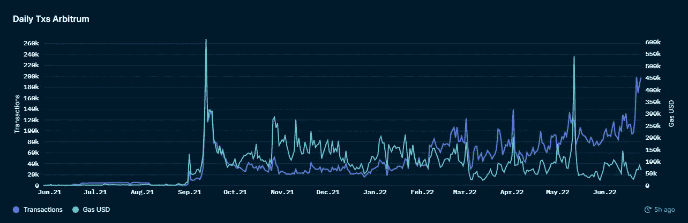
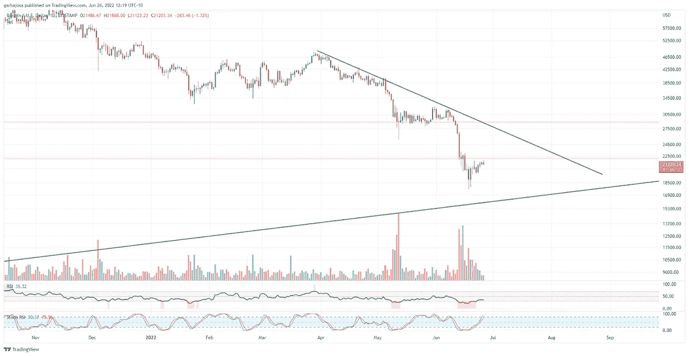
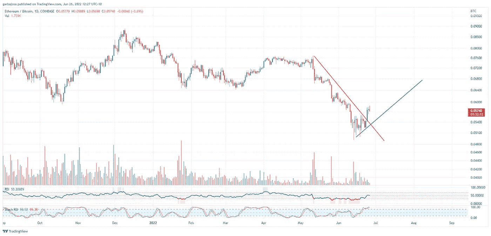
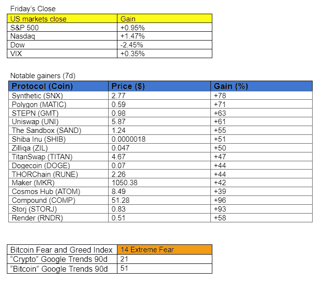

# 这个二层的用户指标继续暴涨！

> 原文：<https://medium.com/coinmonks/this-layer-twos-user-metrics-continue-to-skyrocket-d613732c5877?source=collection_archive---------18----------------------->

## 加密每日混合器#026 6.26.22

加密市场、新闻、指标和协议更新的每日摘要。

**概述**

*   Arbitrum 奥德赛成功。
*   平静的周末市场遭遇阻力。
*   各大银行买摄氏？
*   以太坊下一个 testnet 合并更新。

**Arbitrum Odyssey 成功**

自从我们在周五的[时事通讯](https://www.getrevue.co/profile/CryptoBanter/issues/the-banter-arbitrum-odyssey-guide-how-to-qualify-for-nft-rewards-and-airdrops-1237398)中报道的 Arbitrum Odyssey 计划开始以来，Arbitrum 交易[暴涨](https://pro.nansen.ai/multichain/arbitrum?network=arbitrum)。自从上周该项目启动以来，以太坊二层(L2)区块链已经见证了超过 120，000 笔每日交易，价值超过 30，000 以太坊。该计划显示出对 Arbitrum 兴趣上升的良好迹象，其中包括以太坊用户和流动性熟悉的 Dapps，如 Uniswap (UNI)和 Aave (AAVE)。

*来源:* [*纳森*](https://pro.nansen.ai/multichain/arbitrum?network=arbitrum)

**Celsius CEO 试图逃离该国(未经证实)。**

给摄氏温度的崩溃增添一些趣味:据迈克·阿尔弗雷德说，亚历克斯·马辛斯基在机场被当局拦住之前试图离开这个国家。这个故事尚未得到证实。

# 市场更新🌍

**BTC/美元**

整个周末，加密市场都很平静，加密资产继续缓慢复苏。日线图显示，比特币(BTC)将可能在本周初达到 22.2 美元的强阻力。不幸的是，交易量继续下降，显示了当前反弹背后的力量不足。除非成交量增加，否则价格突破阻力的机会仍然较低。BTC 在周日的美国市场交易中收于 21，208 美元，下跌 2.13%。

*高清* [*图表*](https://www.tradingview.com/x/7qVCTowG/)

**瑞士联邦理工学院/BTC**

以太坊(ETH)价格自 5 月初以来首次显示出对比特币的相对实力，在周末期间突破了下跌趋势(红色)。然而，这种上升趋势能否在未来几周内保持下去仍有待观察(绿色)。ETH/BTC 比较了 ETH 价格和 BTC 价格，并帮助形象化交易者在替代硬币中承担更高风险的意愿。

*高分辨率* [*图表*](https://www.tradingview.com/x/asxo3iPc/)

***在***[***Substack***](https://tradergabi.substack.com/subscribe?)***订阅，抢先获得这份免费的每日简讯。***

如果你喜欢这份报告，并且认为它值 20 分(0.01 美分)，请点击下面的按钮来支持我的写作。(最多 50 次！)谢谢！

**明日主要经济事件:**

*   (欧洲)德国 G7 峰会—全天
*   (美国)耐用品订单—美国东部时间上午 8:30

# 新闻观察📰

高盛(可能)会收购摄氏。银行业巨头高盛集团打算从投资者那里筹集 20 亿美元来收购加密贷款公司 Celsius。据报道，该公司似乎正在从几家 web3 加密基金和传统金融(Tradfi)机构寻求资金。这是参与加密贷款的一种打折扣的方法，尽管 Celsius 团队称之为假新闻。

**新花絮:**

*   bit 和 CriptoNoticias 的加密交换业务正在向阿根廷扩展。
*   比特币网络电力需求[下降](https://cointelegraph.com/news/bitcoin-network-power-demand-falls-to-10-65gw-as-hash-rate-sees-14-drop)至 2022 年低点。

# **在协议级⛓**

**以太坊正在进行合并。以太坊开发者暂定在 7 月 4 日之后的一周合并第二次主要的以太坊测试网。在 Sepolia 合并之后是另一个 testnet 的合并，然后这个团队将重点放在 Mainnet 合并上。**

和谐一号提供了一笔赏金。和谐一号团队[向](https://twitter.com/harmonyprotocol/status/1540904433525088256?s=20&t=ixSf1foI86UOP8Vl2tOUwA)提供 100 万美元的赏金，奖励任何导致归还上周从其以太坊跨链地平线桥窃取的 1 亿美元替代硬币的信息。此外，该团队已经[与联邦调查局和网络安全公司合作](https://twitter.com/stse/status/1540765589416714241?s=20&t=rxtG293Z2KsLsENC6uhWeg)找回被盗资金。

**协议花絮:**

*   圈发布 USDC 每周储备和流动性[报告](https://twitter.com/circlepay/status/1540394322125852674?s=20&t=hBfp7N7wRZ62hyrqEmguMw)
*   由于需求，BTC、瑞士联邦理工学院、USDC、GUSD 和 USDT 的 BlockFi to [增加](https://blockfi.com/interest-rates-update-july-2022?$web_only=true&$3p=e_braze_sp&_branch_match_id=909126140080034036&utm_medium=Email%20Braze%20%2B%20SparkPost&_branch_referrer=H4sIAAAAAAAAAzWMwQrCMBBEvybe0kpSL0IRQfobIamrjV2TZbNB6tebHoSBYR68WUSonPs%2BYJ7XR%2Bw8UYcxrb2lizKDpRFcYP8FV%2BjQQOb4jMmjq4zjssvKXpWZWv4Xc363FZMAQxHNXqDoSvfW%2BlVx0%2BZozK7YZp3M8IHgcsJN2ZtwhR9tGih6kgAAAA%3D%3D)费率。

# **NFT &元宇宙更新🐵**

**NFT 花絮:**

*   宇迦实验室起诉艺术家赖德诽谤。

**我的五分钱……**

市场是前瞻性的。因此，尽管宏观环境没有多少改善的空间，但市场往往会在重大变化发生之前做出反应。考虑到这一点，现在是为最终的底部做准备的好时机。它可能在下周、几个月后到来，也可能已经发生了。没有人真正知道。我正在创建一个项目列表，这些项目被严重低估，计划在可能是一个漫长的加密冬天期间降低平均成本(DCA)。此外，本周我计划在投资前介绍我在一个加密项目中寻求的东西，所以请保持警惕！

感谢阅读！

***在***[***Substack***](https://tradergabi.substack.com/subscribe?)***订阅，率先获得这份免费的每日简讯。***

如果你喜欢这份报告，并且认为它值 20 分(0.01 美分)，请点击下面的按钮来支持我的写作。(最多 50 次！)谢谢！

# **盖布 **

*关注我的*[*Twitter*](https://twitter.com/web3_gabri)*和*[*Medium*](/@TraderGabi)*或在*[*Substack*](https://tradergabi.substack.com/subscribe?)*订阅此免费每日快讯。*

> 放弃
> 
> 加密每日更新是一个仅供娱乐的时事通讯。
> 
> 出版商、作家和图表制作者表达的所有观点不应被解释为财务建议，也不一定反映秘密玩笑的观点。出版商、作家和图表制作者可能持有所讨论的代币和资产的头寸。鼓励读者自己做研究。

> 加入 Coinmonks [电报频道](https://t.me/coincodecap)和 [Youtube 频道](https://www.youtube.com/c/coinmonks/videos)了解加密交易和投资

# 另外，阅读

*   [维护卡审核](https://coincodecap.com/uphold-card-review) | [信任钱包 vs 元掩码](https://coincodecap.com/trust-wallet-vs-metamask)
*   [Exness 评测](https://coincodecap.com/exness-review)|[moon xbt Vs bit get Vs Bingbon](https://coincodecap.com/bingbon-vs-bitget-vs-moonxbt)
*   [如何开始用加密贷款赚取被动收入](https://coincodecap.com/passive-income-crypto-lending)
*   [BigONE 交易所评论](/coinmonks/bigone-exchange-review-64705d85a1d4) | [电网交易机器人](https://coincodecap.com/grid-trading)
*   [氹欞侊贸易评论](https://coincodecap.com/anny-trade-review) | [硬币现货评论](https://coincodecap.com/coinspot-review)