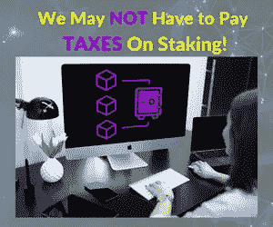

# 这可能是一个迹象，表明你不必为你的赌注回报缴税

> 原文：<https://medium.com/coinmonks/this-may-be-a-sign-that-you-dont-have-to-pay-taxes-on-your-staking-rewards-70b4ace17ea5?source=collection_archive---------35----------------------->

*我们先来看看什么是加密赌注？*这是锁定加密资产以赚取利息或奖励的过程。持有加密股票的投资者正在参与这些网络的协商过程。作为回报，这些网络会回报投资者。

美国国税局(IRS)在加密赌注税系统方面开创了一个先例，此前该机构决定将向纳什维尔的一对夫妇退还他们通过赌注获得的 8，876 枚 Tezos 代币(XTZ)。这对纳什维尔的夫妇在 2021 年 5 月提起了一项[民事诉讼](https://www.scribd.com/document/509435727/Jarrett-Compl?secret_password=LFIAqtDNw9i5loKXdjB4)，主张通过股权证明(PoS)系统获得的任何代币都应该被归类为“新财产”，而不是收入。这一论点指出，通过赌注奖励产生的代币必须首先转化为“容易获得的财富形式”，然后才能征税。

请记住，美国国税局还没有关于加密赌注的官方声明。可以理解的是，美国国税局希望对他们的加密收益率相关规则保持极度谨慎，因为通过加密资产投资可以产生多种版本的收益率。在这种情况下，正在设置的潜在先例是通过在 PoS 网络中锁定/锁定自己的加密资产而获得的收益，PoS 网络间接参与了相关的协议网络安全。各种协议之间的锁定机制也可能不同。

也就是说，这是朝着正确方向迈出的一大步，可以帮助投资者提高投资组合的回报，并帮助加密作为一种资产类别更好地与其他全球资产竞争。如果这一先例成为官方规则，这意味着与当年需要纳税的股票股息不同，加密赌注奖励将被视为财产，在被出售为现金之前，它们可能不会被征收任何税。

# 利益证明和环境问题

或许不足为奇的是，机构投资者将比特币视为投资的首要担忧之一是其对环境的影响。简单地说，挖掘比特币需要大量的能量，因为它使用了一种工作证明共识机制，这是一种依靠计算能力来确保比特币区块链安全性和不变性的算法。随着时间的推移，随着比特币变得流行，分配给这种采矿活动的能量变得巨大，以至于比特币使用的能量相当于一个小国。对上述段落有一些反驳意见，例如，就比特币网络每天结算的资金量而言，它可能不会比传统银行支付零售和金融科技网络等现有网络消耗更多的电力。

关键是，区块链领域的建设者和创新者已经[被](https://content.ftserussell.com/sites/default/files/education_proof_of_stake_paper_v6_0.pdf)利害关系证明所吸引，以寻求一种新的共识机制来保持区块链的透明度、安全性和不变性；同时还减少了维护网络所需的能量。按市值计算，以太坊是第二大加密资产，[计划今年将](https://ethereum.org/en/upgrades/)过渡到股权证明。此外，股权证明还为持有/锁定其资产的网络参与者提供了收益，为新区块链项目采用股权证明而非工作证明的趋势提供了另一个理由。

visit RobertVentures.com

[*乔罗伯特*](https://joerobert.com/) *现任罗伯特风险投资公司首席执行官，拥有超过 20 年的资产管理经验。自从乔开始创业以来，他已经为投资者创造了可预见的两位数回报。Joe 已经投资了股权和代币的种子轮，以及比特币、以太坊和其他顶级加密货币的投资组合。*

*如果您是合格投资者，并想了解更多关于我们产品的信息，请* [*联系我们。*](https://robertventures.com/)

> 加入 Coinmonks [电报频道](https://t.me/coincodecap)和 [Youtube 频道](https://www.youtube.com/c/coinmonks/videos)了解加密交易和投资

# 另外，阅读

*   [本地比特币评论](/coinmonks/localbitcoins-review-6cc001c6ed56) | [加密货币储蓄账户](https://coincodecap.com/cryptocurrency-savings-accounts)
*   什么是融资融券交易
*   [支持卡审核](https://coincodecap.com/uphold-card-review) | [信任钱包 vs MetaMask](https://coincodecap.com/trust-wallet-vs-metamask)
*   [Exness 回顾](https://coincodecap.com/exness-review)|[moon xbt Vs bit get Vs Bingbon](https://coincodecap.com/bingbon-vs-bitget-vs-moonxbt)
*   [如何开始用加密贷款赚取被动收入](https://coincodecap.com/passive-income-crypto-lending)