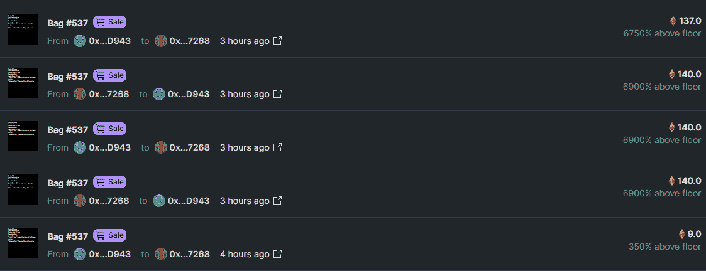

# 这只 NFT 熊比一栋房子还贵

> 原文：<https://medium.com/coinmonks/this-nft-bear-costs-more-than-a-house-footprint-analytics-917550926ac4?source=collection_archive---------68----------------------->

另一个最近热门的 NFT 项目，值得买吗？

数据来源:足迹分析[幻影仪表板](https://www.footprint.network/guest/dashboard/phanta-bear-dashboard-fp-a588bdb7-641c-45b5-bf9f-9246d2010800?channel=u-DnmMUY#secret=3C61823F8A28DD6B5A9BC0B7BA6CC360)

12 月 31 日，歌手周杰伦在 Instagram 上发布了他的 PhantaBear [NFTs](https://www.footprint.network/guest/dashboard/nft-dashboard-fp-b374b358-6e2f-4587-a52b-a69ebbb91bfa?channel=u-DBc983#secret=DA601985B1CD8DCF912829C1188A05AA) 后不久，这个系列就成为了世界上交易量最大的系列。

作为一个杰伊·樊稠和 NFT 的怀疑论者，我决定这是一个完美的机会，让我最终搁置我的怀疑，潜入这些昂贵、令人困惑的数字资产的世界。

*Footprint Analytics — PhantaBear NFT owned by celebrities include Jay Chou*

# 购买名人效应

PhantaBear 是 T4 两家服装公司 PHANTACi 和 Ezek 在 NFT 的合作成果。该系列包括 10，000 张通过算法生成的 NFT，持有者可以提前获得元宇宙 Ezek 娱乐中心和其他 Ezek 俱乐部福利。

PhantaBear 的底价为 3.88 ETH，较发售首日上涨 1253.85%。挂牌的最低价格(非拍卖)为 3.075 ETH，售出的最高价格为 148 ETH。

随着价格的上涨和巨大的潜在上升空间，我决定要一个。

[*OpenSea — The Highest Priced PhantaBear #9999*](https://opensea.io/assets/0x67d9417c9c3c250f61a83c7e8658dac487b56b09/9999/)

然而，在看了 OpenSea 之后，我发现它的买家数量和交易量一直在下降，而且不稳定。

其他 NFT 系列，如 BAYC(无聊猿游艇俱乐部)，则更加稳定。

[*Footprint Analytics — Trade & Buyers Status of PhantaBear*](https://www.footprint.network/guest/chart/trading-buyers-statust-of-phanta-bear-fp-2f514d21-c55f-498a-a2ae-01f6316248ce?channel=u-DnmMUY#secret=62DFA41F37E0A0B3985F71066FF2205C)

[*Footprint Analytics — Trade & Buyers Status of BAYC*](https://www.footprint.network/guest/chart/trade-buyers-status-of-bayc-fp-d4fa9821-d61b-43d5-b2cc-626b4fe5f0af?channel=u-DnmMUY#secret=DF27D5BF94C5DE5A6FC5301CF2BBBAFE)

我试图找出原因。

根据官方[路线图，](https://ezek.io/)phanta bear 项目将包括一个举办音乐会的虚拟娱乐元宇宙。尽管这显然是为了展示该项目以及 NFT 的所有权将带来长期好处，但缺乏细节看起来难以令人信服。

显然，一旦名人项目的新鲜感减弱，PhantaBear 的交易量就会下滑。

并不是所有的 NFT 项目都是这样。[比如 BAYC NFTs](https://cryptodaily.co.uk/2022/01/what-nft-projects-learn-from-bayc-s-success) ，玩法多样，版权明确，还有很多类似T 恤的周边商品。这创造了一个不断发展的社区和一些持续的新奇事物。

由于产品价格不合理，我寻找更实惠的系列，并发现了 Meebits 和 Loot。

[*Footprint Analytics — Top 10 NFTs Trading Volume Last 30 Days*](https://www.footprint.network/guest/chart/top-10-nft-trading-volume-last-30-days-fp-5b5229fe-9341-45fd-afe8-9b3f77c95d37?channel=u-DnmMUY#secret=55CDD14DD6899336D9D70EB8E0363631)

# 两个不寻常的项目:Meebits 和 Loot

自 1 月 11 日以来，Meebtis 和 Loot 的价值都开始增长，与此同时，NFT 市场 LooksRare 的推出，其交易量最近超过了 OpenSea。

Meebits 是3D 体素字符。他们的主要吸引力是他们的使用，拥有独特的可验证的所有权，他们在密码朋克用户中很受欢迎..

战利品是随机生成的写在卡片上的冒险游戏物品的集合。如果你认为这个想法很抽象，那你就对了。目前还没有游戏可以让你使用纯 lexemic 战锤、精金戒指或龙皮盔甲——尽管(截至 1 月 25 日)它们至少要花费你 2.1 ETH。

[*Footprint Analytics — Trade & Buyers Status of Loot & Meebits*](https://www.footprint.network/guest/dashboard/phanta-bear-dashboard-fp-a588bdb7-641c-45b5-bf9f-9246d2010800?defaultEdit=true&channel=u-DnmMUY#secret=3C61823F8A28DD6B5A9BC0B7BA6CC360)

然而，除了它们的价格，我注意到这些项目的另一个问题。根据 LooksRare 的交易数据，有相同编号的 NFT 在两个相同的地址之间来回交易。

LooksRare 每天向所有交易用户奖励 2，866，500 次浏览。如果你交易的越多，你得到的就越多。所以为了获得挖矿奖励，用户创建虚假交易。创造了一个看起来很酷的泡泡。

[*LooksRare — Meebits #10137 Activity*](https://looksrare.org/collections/0x7Bd29408f11D2bFC23c34f18275bBf23bB716Bc7#activity)

[*LooksRare — Bag #537 Activity*](https://looksrare.org/collections/0xFF9C1b15B16263C61d017ee9F65C50e4AE0113D7#activity)

在了解了这三个系列之后，我意识到我仍然不喜欢 NFTs，尽管我喜欢周杰伦、冒险游戏或乐高玩具。

# 关于非功能测试的几点思考

我注意到最近流行的 NFT 可能受到名人宣传和 FOMO 的影响，像 PhantaBear 和 NBA Top Shot。不可否认，名人宣传是让 NFT 迅速升值的好方法，但如果 NFT 本身没有价值——这是一个抽象的概念——价值就会迅速下降。

**什么是足迹分析**

足迹分析是一个一体化的分析平台，用于可视化区块链数据和发现见解。它清理和整合链上数据，因此任何经验水平的用户都可以快速开始研究令牌，项目和协议。凭借一千多个仪表板模板和一个拖放界面，任何人都可以在几分钟内构建自己的定制图表。发掘区块链数据，利用足迹进行更明智的投资。

*足迹网址:*[*https://www . Footprint . network*](https://www.footprint.network/)

*不和:*[*https://discord.gg/3HYaR6USM7*](https://discord.gg/3HYaR6USM7)

*推特:*[【https://twitter.com/Footprint_DeFi】T21](https://twitter.com/Footprint_DeFi)

*电报:*[*https://t.me/joinchat/4-ocuURAr2thODFh*](https://t.me/joinchat/4-ocuURAr2thODFh)

*Youtube:*[*https://www.youtube.com/channel/UCKwZbKyuhWveetGhZcNtSTg*](https://www.youtube.com/channel/UCKwZbKyuhWveetGhZcNtSTg)

> *加入 Coinmonks* [*电报频道*](https://t.me/coincodecap) *和* [*Youtube 频道*](https://www.youtube.com/c/coinmonks/videos) *了解加密交易和投资*

# 另外，阅读

*   [用信用卡购买密码的 10 个最佳地点](https://coincodecap.com/buy-crypto-with-credit-card)
*   [加拿大最佳加密交易机器人](https://coincodecap.com/5-best-crypto-trading-bots-in-canada) | [Bybit vs 币安](https://coincodecap.com/bybit-binance-moonxbt)
*   [阿联酋五大最佳加密交易所](https://coincodecap.com/best-crypto-exchanges-in-uae) | [SimpleSwap 评论](https://coincodecap.com/simpleswap-review)
*   购买 Dogecoin 的 7 种最佳方式
*   [最佳期货交易信号](https://coincodecap.com/futures-trading-signals) | [流动性交易所评论](https://coincodecap.com/liquid-exchange-review)
*   [用于 Huobi 的加密交易信号](https://coincodecap.com/huobi-crypto-trading-signals) | [Swapzone 审查](/coinmonks/swapzone-review-crypto-exchange-data-aggregator-e0ad78e55ed7)
*   最佳[密码交易机器人](https://coincodecap.com/best-crypto-trading-bots) | [购买索拉纳](https://coincodecap.com/buy-solana) | [矩阵导出评论](https://coincodecap.com/matrixport-review)