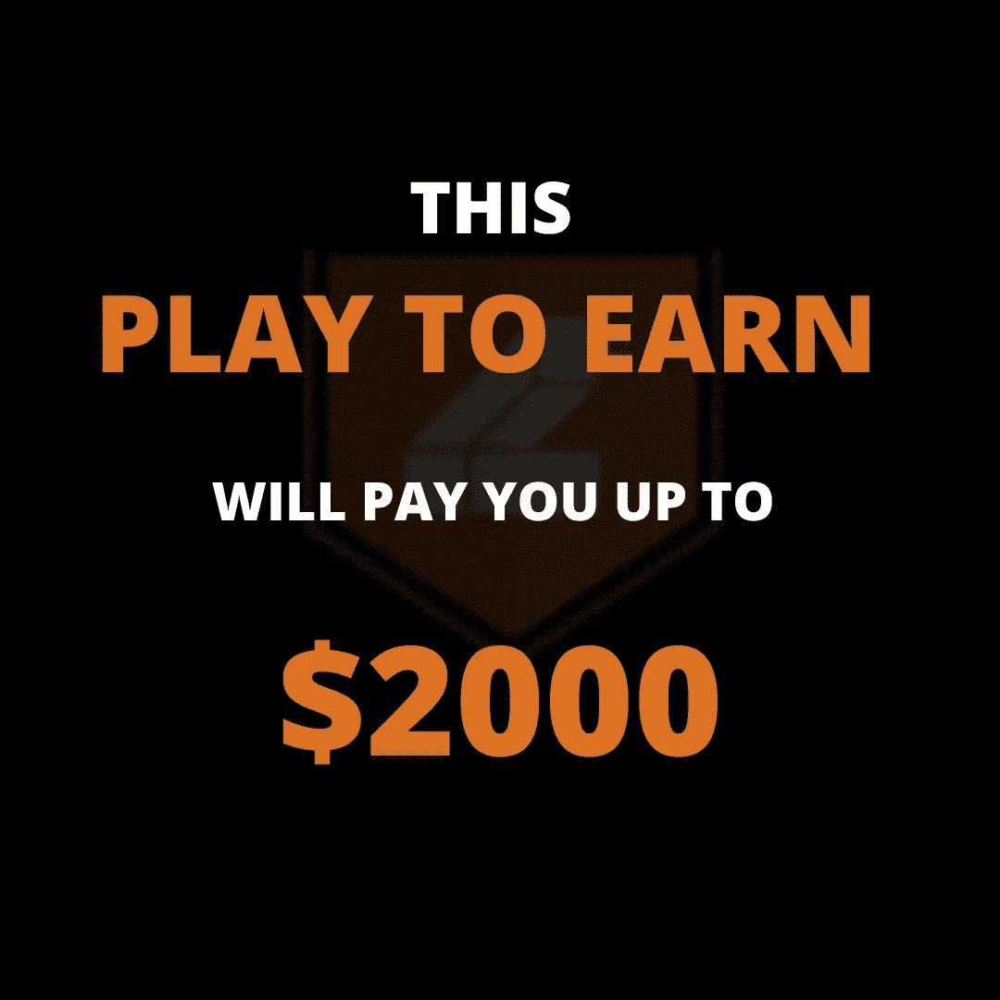
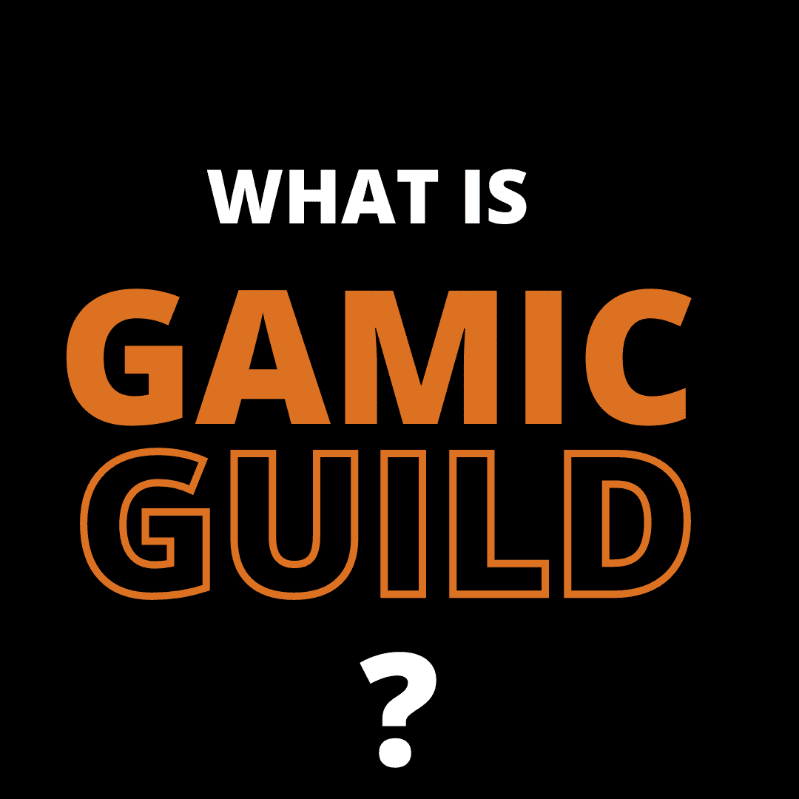
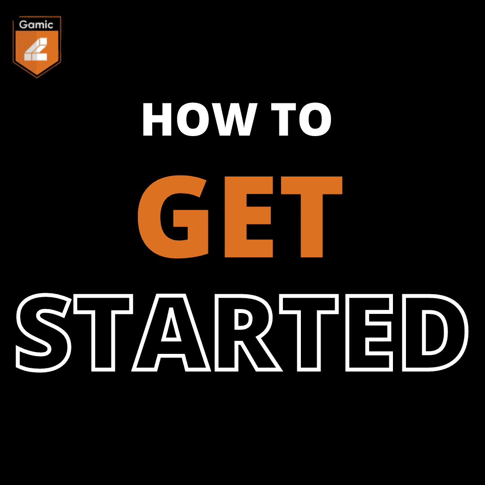
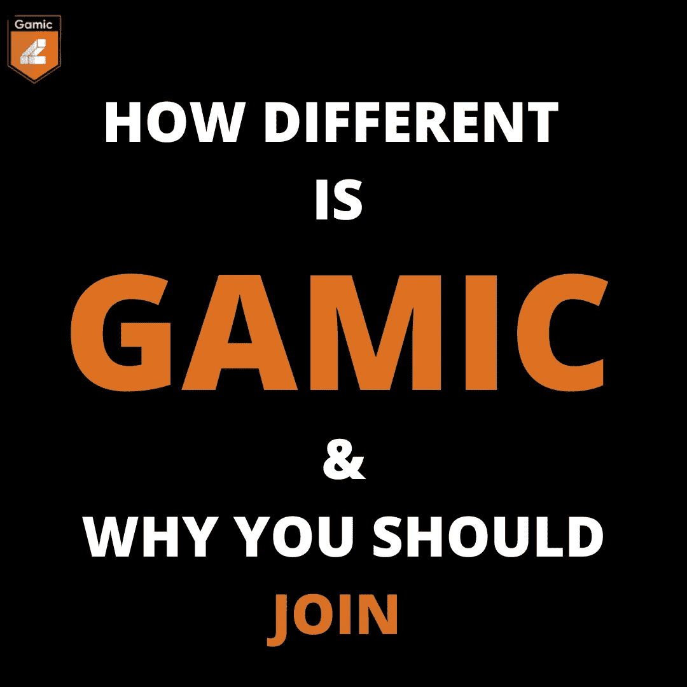

# 这场游戏将为你赢得高达$2000 的奖金

> 原文：<https://medium.com/coinmonks/this-play-to-earn-will-pay-you-up-to-2000-7246cd3a9dc4?source=collection_archive---------1----------------------->

# 介绍

因此，本周我决定更加本土化，研究非洲顶级 Gamefi 项目以及非洲如何通过游戏产业扩大规模，我了解到非洲游戏产业发展得非常好。事实上，这是一个竞争最激烈的游戏领域，你有不同的公会，如元宇宙大联盟，游戏公会，智能公会等。然而，游戏公会削减了我的兴趣。因此，我将分享更多关于它的信息，如何开始，它与其他项目的区别，以及为什么你应该加入游戏公会。因此，当我们深入其中时，请不要犹豫，在这里查看我在 Gamefi [上的其他文章](/coinmonks/gamefi-earn-money-through-blockchain-3d911ad4fcce)，以及另一篇获得项目的 [top play 和如何开始](/coinmonks/top-gamefi-projects-and-how-to-get-started-c8e08d07d2b6)。那么，Gamic Guild 到底是什么？

## 什么是游戏公会？

Gamic Guild 是一家非洲游戏初创公司，旨在将游戏玩家和投资者聚集在一起，向他们介绍一系列区块链游戏，同时从中获利。这是一个多合一的游戏中心，在这里您可以访问不同形式的游戏，与其他玩家竞争，并获得。

Gamic guild 有一个名为 Thetan Arena 的本地游戏，目前是一个边玩边赚的游戏。这款游戏是基于区块链技术的电子竞技游戏。可以个人玩，可以邀请好友，可以组队，可以赚酷钱。那么，如何在 gamic guild 上入门呢？

## 如何开始

要开始使用 gamic，这是一个关于您应该做什么的分步指南:

1.  加入不和谐频道。点击[链接](https://discord.gg/ESbHvGH9)加入
2.  一旦你加入了，通过点击雪表情符号来验证你自己。当你这样做的时候，采访频道将会打开，这样你就可以和社区里的其他玩家聊天了。
3.  点击如何申请频道，并选择一个游戏开始玩。
4.  寻找官方渠道，使用链接为你的 pc、android、ios 等下载游戏，或者你可以在 google playstore 上寻找 thetan arena 并下载
5.  下载后，创建一个帐户。要做到这一点，你只需要输入你的电子邮件地址，然后点击发送代码。验证码将会发送到您的邮箱。你只需在游戏中复制和粘贴，等待它加载，瞧，你就可以走了。
6.  开始玩，开始赚钱。此外，请注意，你的收入随着排名的上升而增加

那么，gamic 和其他公会有什么不同，为什么需要加入 Gamic？

## GAMIC 有什么不同，为什么你需要加入 GAMIC 公会

我知道你一定尝试过很多公会，也有你不积极玩游戏的原因，但是相信我，这是不同的，我会告诉你怎么做。：

1.  语言结构:gamic 是一个全球性的协会，它拥有非洲语言的灵活性，允许任何非洲人轻松互动。此外，作为一个全球性项目，它强化了通用语言的使用，以创造良好的沟通和尽量减少语言障碍。
2.  容易上手:此外，我对 Gamic guild 感兴趣的一点是它容易上手。在这里，没有必要购买 NFT 开始。这意味着你可以决定快速浏览一下，玩一玩，看看这是不是你喜欢的游戏，然后决定是退出还是继续玩下去。就这么简单。
3.  活跃社区:这也是决定一个好项目的特征之一。为了显示社区正在积极参与，一旦你加入 discord 频道，并提出一个问题，你会看到许多人可以给你一系列他们的建议，这也使新手容易。
4.  支付方式:所以，不像其他很多用加密货币、NFT 等支付你的公会，Gamic Guild 也创造了直接向他们的用户支付银行账户的方式，这意味着，你不需要开始任何形式的转换，甚至不需要使用 p2p。是不是很神奇？是的，我知道。

所以，考虑所有这些因素和更多的原因，你应该选择游戏公会，并开始今天的游戏。

# 结论:

区块链技术为金融自由铺平了道路，游戏行业正在为此伸张正义。你不再需要成为一个密码交易员或投资任何 defi 项目。Gamic guild 为我们打开了一个平台，让我们玩这些游戏和赚钱变得更加容易。你所需要做的就是跟随[链接](https://discord.gg/ESbHvGH9)并开始。那么，你还在等什么？

享受你的游戏，同时从中赚钱。

**今日问题:你认为还有哪个中心可以和 gamic 竞争？**

# 关于作者

Igwe Ihuoma Patience 是一名自学成才的创意和特定行业内容作家，也是一名加密货币爱好者，拥有 2 年多的经验和不断发展的区块链空间的知识。

我擅长内容创作、文案撰写、字幕管理、视频编辑和手机图形设计，我教其他人如何在加密货币和区块链领域起步，我的目标是让区块链的学习和更新易于任何人理解。

> 加入 Coinmonks [电报频道](https://t.me/coincodecap)和 [Youtube 频道](https://www.youtube.com/c/coinmonks/videos)了解加密交易和投资

# 另外，阅读

*   [WazirX vs coin dcx vs bit bns](/coinmonks/wazirx-vs-coindcx-vs-bitbns-149f4f19a2f1)|[block fi vs coin loan vs Nexo](/coinmonks/blockfi-vs-coinloan-vs-nexo-cb624635230d)
*   [BlockFi 信用卡](https://coincodecap.com/blockfi-credit-card) | [如何在币安购买比特币](https://coincodecap.com/buy-bitcoin-binance)
*   [火币交易机器人](https://coincodecap.com/huobi-trading-bot) | [如何购买 ADA](https://coincodecap.com/buy-ada-cardano) | [Geco。一次审查](https://coincodecap.com/geco-one-review)
*   [加密副本交易平台](/coinmonks/top-10-crypto-copy-trading-platforms-for-beginners-d0c37c7d698c) | [五大 BlockFi 替代方案](https://coincodecap.com/blockfi-alternatives)
*   [CoinLoan 点评](https://coincodecap.com/coinloan-review)|[Crypto.com 点评](/coinmonks/crypto-com-review-f143dca1f74c) | [火币保证金交易](/coinmonks/huobi-margin-trading-b3b06cdc1519)
*   [Bybit vs 币安](https://coincodecap.com/bybit-binance-moonxbt)|[stealth x 回顾](/coinmonks/stealthex-review-396c67309988) | [Probit 回顾](https://coincodecap.com/probit-review)